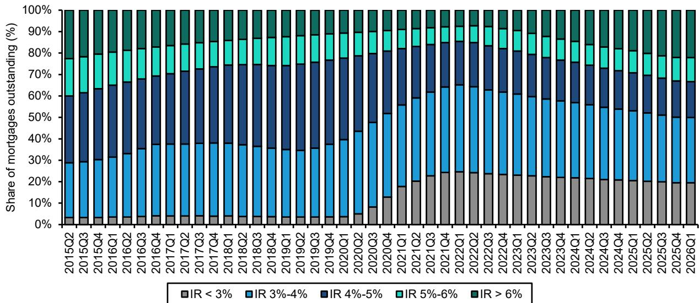
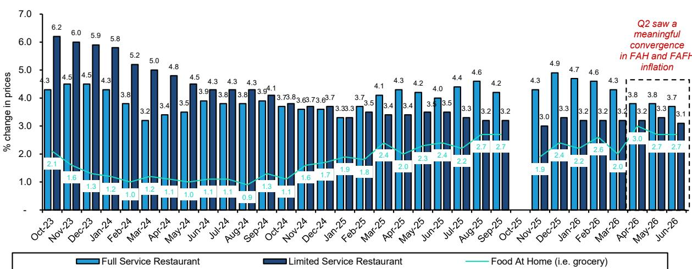
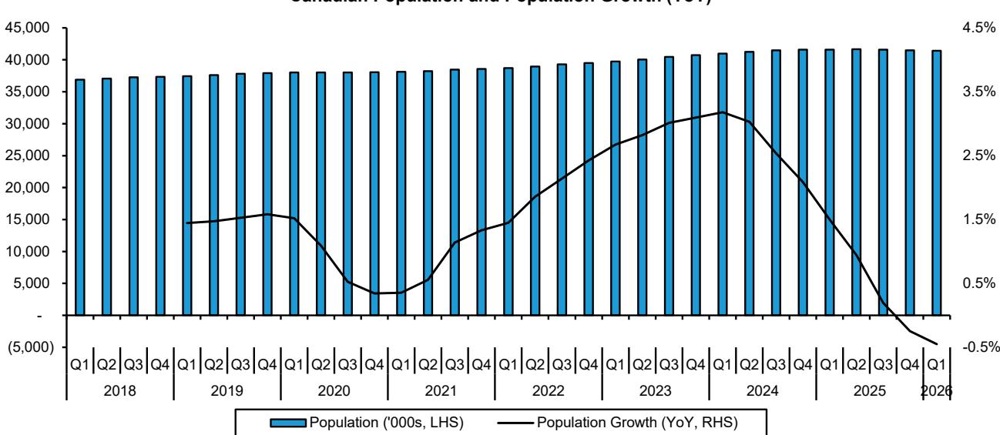

# 持续的通胀正在重塑美国消费格局：价值导向行为已成为结构性而非周期性策略

2026年第二季度的美国消费者并未出现明显问题，但消费模式已经发生了转变，这要求我们对哪些商业模式能够持续发展进行根本性的重新评估。消费者价格通胀仍高于3.5%，尽管有所缓和但油价仍处高位，消费者信心进一步下降，低收入家庭承受了最大压力。然而，失业率仍处于低位，总体消费支出保持稳定。这种紧张关系——在总体支出具有韧性的同时，价值导向行为日益强化——是任何面向美国家庭销售的企业都需要关注的核心战略事实。

关键洞察不在于消费者正在降级消费，而在于他们正在以更复杂的方式进行横向选择，这迫使钱包份额重新分配，某些特定业态、品类和价格层级受益，而其他则受损。消费者并非简单地变得更便宜，而是更加审慎。这份来自领先机构研究公司的报告提供了数据，可以精确描绘这种审慎行为流向何处、又从何处流失。

以下论述围绕五个战略结论展开。第一，价值零售是这一环境的主要受益者，但收益集中在具有规模优势和低收入客群覆盖的运营商。第二，餐饮业正面临双重速度的复苏，将拥有富裕客户基础的品牌与依赖受压大众市场的品牌区分开来。第三，外出就餐和在家就餐的通胀率趋同，正在创造杂货店和餐饮之间的新竞争动态。第四，在包装食品领域，品类增长率正在显著分化，功能性饮料表现优于传统主食。第五，酒精消费正受到油价和可负担性限制的重新塑造，按品类而非仅按公司划分赢家和输家。

战略含义很明确：那些围绕价格领导力、分销规模优势或高收入人群客群建立商业模式的公司，有望获得市场份额。而那些依赖中低收入群体可自由支配支出，或缺乏规模来消化投入成本通胀的公司，将面临更艰难的路径。

## 价值零售商正在获胜，但价值的性质已经改变：仓储会员店、一元店和折扣业态正从不同的消费者压力中受益

第二季度最明显的趋势是向价值导向零售业态的转变。沃尔玛、好市多和一元店都被视为受益者，但各自的机制不同。对于好市多而言，吸引力在于会员模式本身，它锁定的是高收入购物者，他们选择合并购物次数并批量购买以管理整体购物篮成本。对于达乐公司和沃尔玛，其客群更直接地涉及低收入消费者，这些消费者正感受到高通胀带来的最大压力，并正在削减非必需品的可自由支配支出。

这种战略区别很重要。好市多的同店销售韧性源于那些仍具购买力但变得更加自律的家庭对钱包份额的整合。达乐公司的相对优势则源于必要性：低收入家庭选择更少，只能转向最低相对价格点。沃尔玛处于中间位置，受益于这两种动态——它既吸引了以前在传统超市购物的高收入消费者的降级消费，也作为低收入家庭预算紧张时的首选目的地。

这不是一个统一的价值交易。TJX，这家折扣服装零售商，被视为专业零售领域的优选，它正在获得市场份额，同时盈利预期也在上调。折扣模式在这种环境中有效，因为它以折扣价提供品牌商品，吸引那些想要品质但拒绝支付全价的消费者。Tapestry，这家奢侈品配饰公司，也受到青睐，但原因相反：它瞄准的是消费光谱的高端，那里的支出弹性较小。K型复苏依然存在，正确的策略完全取决于一家公司处于K型的哪个位置。

相比之下，家装行业仍面临挑战。高通胀和进一步加息的潜在可能正在影响消费者信心，消费者正在推迟大型可自由支配项目。这提醒我们，并非所有价值导向的定位都能平等受益。家装既需要信心也需要融资，而在通胀侵蚀实际收入、信贷成本高昂的情况下，这两者都供应不足。

## 餐饮业正分裂为两个截然不同的市场：面向富裕群体的品牌表现优于大众市场运营商，后者面临投入成本压力

第二季度的餐饮环境最好被描述为两种客户群体的故事。拥有富裕消费者客群的品牌——星巴克、Chipotle和Cava——被看好。这些品牌受益于公司自身的驱动因素以及对其可支配收入受通胀累积影响较不敏感的客户群。它们还拥有大众市场运营商所缺乏的定价权。

压力在低端最为严重。低收入消费者正在减少外出就餐，而特定的成本逆风加剧了这种情况。牛肉成本高企正在挤压任何牛排业务占比较高的运营商的利润空间，环孢子虫病疫情则增加了难以建模的需求侧冲击。在这种背景下，达登餐饮受到青睐，具体原因是其橄榄园和LongHorn Steakhouse品牌受益于替代效应：随着杂货店牛肉价格飙升，想要享用牛排的消费者可能会发现外出就餐实际上比在家烹饪更经济。这是一种反直觉的动态，但它反映了通胀并非跨渠道均匀分布的现实。

食品分销行业强化了这一图景。疲软的餐厅客流量对配送量构成了温和的逆风，但高昂的运费和食品通胀实际上强化了大型分销商如US Foods、Performance Food Group和Sysco的竞争优势。小型运营商无法承受同等水平的投入成本波动，大型分销商通过提供独立运营商无法匹敌的稳定性和规模来获得市场份额。这是一种结构性而非周期性的优势，它表明无论宏观环境如何，食品分销行业正变得更加集中。

对餐饮运营商的战略启示是，广泛需求增长的日子已经结束。现在的成功取决于要么拥有一个能使其业务免受价格敏感度影响的优质定位，要么拥有一个极具吸引力的价值主张，使其即使在预算紧张时也成为理性选择。中间地带——普通的食物、普通的价格、普通的体验——是最危险的位置。

## 外出就餐与在家就餐通胀率的趋同正在重塑杂货店动态，并为拥有国际多元化布局的包装食品公司创造窗口期

第二季度，外出就餐和在家就餐的通胀率出现了有意义的趋同。这是一个关键的发展。在后疫情时期的大部分时间里，外出就餐的通胀速度一直快于杂货店，这给了超市相对的价格优势。随着这一差距缩小，竞争格局发生了变化。

直接的影响是，杂货店的客流量可能在边际上面临压力。如果外出就餐相对于在家烹饪不再以同样的速度变得更贵，一些消费者可能会转向餐馆。这不是一个戏剧性的逆转，但对于受益于在家烹饪趋势的食品零售商来说，这是一个逆风。

加剧这一压力的是SNAP（补充营养援助计划）支出削减的影响。随着补充营养援助计划福利的减少，最低收入家庭在杂货店通胀仍然高企时失去了购买力。这些家庭在家就餐的边际消费倾向最高，他们的支出减少将对依赖大众市场的公司产生不成比例的影响。

该报告将亿滋国际和JM Smucker列为美国食品领域的优选公司，其理由具有启发性。亿滋国际拥有有利的海外业务，这为应对美国本土消费者疲软提供了对冲。Smucker受益于对收入压力弹性较小的品类——宠物食品和咖啡即使在低迷时期需求也相对稳定。战略启示是，面向国内、客群为对价格最敏感的消费者的食品公司面临困难的环境。在消费者价格敏感度仍然很高的情况下，这些公司可能难以消化另一轮通胀。那些在地理上实现多元化或在需求更可预测的品类中运营的公司，则处于更有利的位置。

更广泛的观点是，包装食品行业正进入一个在美国市场难以实现销量增长的时期。收入增长的相对少见途径是提价（这正变得越来越困难）或获得市场份额（这需要卓越的品牌资产或允许更激进定价的成本结构）。缺乏其中任何一项的公司都将看到利润率压缩和销量下降。

## 饮料类增速超过大多数其他品类，但增长正在放缓，功能性和高端细分市场的集中度正在提高

饮料以及家庭和个人护理品类鲜明地展示了必需消费品中增长率的分化。饮料品类增长率从第一季度的同比增长约6%放缓至第二季度的约4%。这仍然领先于大多数其他品类，但减速是显著的。相比之下，家庭和个人护理从约3.5%放缓至约2.5%，表现出更多必需品的特征。

饮料中的战略机会集中在功能性饮料上，其增速超过了整个品类。Celsius和Keurig Dr Pepper因其在该细分市场的产品组合实力而被视为优选公司。Celsius受益于能量饮料品类的持续增长及其作为更健康替代品的定位。Keurig Dr Pepper受益于多元化的产品组合，包括咖啡和碳酸软饮料，功能性属性在这两者中都变得越来越重要。

家庭和个人护理的放缓更令人担忧，因为它来自一个较低的基数。这是一个消费者更容易降级消费的品类，可以从高端品牌转向自有品牌或低价替代品。该品类的必需品特征意味着需求相对稳定，但定价权有限。该领域的公司需要依赖销量增长，而在消费者削减开支时，这很难实现。

对观察者和策略师而言，饮料品类仍然是必需消费品中最具吸引力的子板块，但窗口期正在收窄。增长率正在放缓，竞争正在加剧。能够抓住功能性趋势并保持定价权的公司将继续表现良好。那些依赖传统碳酸软饮料或缺乏功能差异化的高端定位的公司将面临逆风。

## 酒精消费正受油价和可负担性重塑，啤酒尤其脆弱，烈酒提供更微妙的机遇

酒精品类提供了一个案例研究，说明看似远离消费者行为的宏观变量如何产生直接且可衡量的影响。报告指出，美国啤酒在第二季度受到了油价上涨的显著影响。机制很简单：当燃料成本上升时，消费者用于可自由支配购买的可支配收入减少，而啤酒往往是首先被削减的品类。对于低收入消费者尤其如此，他们在啤酒品类中的比例高于葡萄酒或烈酒。

在啤酒领域，Constellation Brands因其加速获得市场份额而被看好。这是一个公司层面的故事，反映了其在墨西哥啤酒细分市场的成功执行，该细分市场持续从国产淡啤中夺取份额。百威英博也受到青睐，尽管是基于更长期的视角。战略启示是，即使在一个面临挑战的品类中，也有公司可以通过品牌实力和分销优势获得市场份额。

Molson Coors和Boston Beer则不那么被看好。Molson Coors的品类增长暴露较弱，意味着它集中在正在失去份额的啤酒细分市场。Boston Beer面临营收不确定性，反映了在硬苏打水品类经历快速扩张和随后的收缩后，维持增长的难度。

在烈酒领域，报告对Brown-Forman持谨慎态度，原因是毛利率压缩，但对帝亚吉欧中期前景看好。对帝亚吉欧的判断基于其8月的资本市场日，预计该公司将公布可负担性举措。这是一个关键的战略点：即使在像烈酒这样的高端品类中，可负担性也正成为焦点。消费者并未放弃烈酒，但他们变得更加注重价格，公司需要直接解决这个问题，而不是假设高端化会无限期持续下去。

整个酒精品类提醒我们，消费者行为并非仅由收入或就业驱动。油价——通常被视为对运输类股重要的宏观变量——对看似无关的品类中的消费者可自由支配支出有直接影响。忽视这些跨品类动态的公司将会措手不及。

## 决策框架：当通胀持续且价值导向成为结构性特征时，如何配置消费类组合

上述分析可以综合成一个适用于观察者和企业策略师的决策框架。该框架包含三个维度：消费者收入暴露、品类增长轨迹和公司特定的竞争优势。

首先，评估消费者收入暴露。服务于收入分配高端人群的公司比服务于中低端人群的公司处于更有利的位置。这不是关于衰退的判断；而是关于通胀影响分布的陈述。低收入家庭的缓冲较少，削减开支更为积极。高收入家庭正在整合支出，但并未减少。K型是真实的，它是决定哪些公司能够表现良好的最重要单一因素。

其次，评估品类增长轨迹。饮料，尤其是功能性饮料，增长速度超过大多数其他必需消费品品类。食品增长缓慢，面临利润率压力。酒精表现不一，啤酒下滑，烈酒稳定但面临可负担性限制。家庭和个人护理增长缓慢，定价权有限。餐饮业在增长中的高端品牌和挣扎中的大众市场品牌之间分裂。品类与公司同等重要。

第三，分析公司特定的竞争优势。在每个品类中，赢家是那些拥有规模优势、品牌实力或地理多元化的公司。规模很重要，因为它使公司能够消化投入成本通胀并提供有竞争力的定价。品牌实力很重要，因为它提供了定价权。地理多元化很重要，因为它减少了对面临最大压力的美国消费者的依赖。

该框架得出了具体的结论。在零售领域，看好仓储会员店和折扣业态，而非传统百货商店和家装。在餐饮领域，看好拥有富裕客户群和公司自身驱动因素的品牌，而非大众市场运营商。在包装食品领域，看好拥有国际业务或品类防御性的公司。在饮料领域，看好拥有功能性产品组合的公司。在酒精领域，看好正在获得市场份额或拥有可信的可负担性策略的公司。

共同的主线是，美国消费者并未崩溃，但他们正变得更具辨别力。能够获胜的公司是那些确切了解自己服务于消费光谱的哪一部分，并据此建立商业模式的公司。会失败的公司是那些依赖广泛需求增长，且缺乏在更具挑战性的环境中导航所需竞争优势的公司。

*仅供参考。部分内容可能基于源材料通过AI辅助生成、翻译、总结或编辑，可能存在遗漏或错误。请独立核实。本文不构成专业建议。*

仅供参考。部分内容可能基于源材料通过AI辅助生成、翻译、总结或编辑，可能存在遗漏或错误。请独立核实。本文不构成专业建议。

