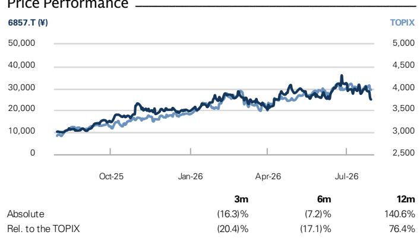

# Advantest (6857.T)

业绩回顾：超出预期；展望积极，包括进一步加速产能扩张；维持中性评级但上调目标价，预计报价将回升

6857.T

12个月目标价：¥40,000

当前报价：¥24,915

潜在空间：60.5%

第一财季业绩及全年指引均强于预期。第一财季营业利润为1900亿日元，于7月29日收盘后公布，高于我们预估的1520亿日元以及彭博一致预期略低于1600亿日元的水平。Advantest将2027财年营业利润指引从初值的6275亿日元上调至8460亿日元，远高于我们此前预估的7514亿日元以及彭博一致预期略低于7100亿日元的水平。尽管多国贸易统计数据可能已让市场意识到第一财季进展可能略好于管理层假设，但由于近期GPU测试时间并未发生实质性变化，市场对大幅超预期的期待可能并不高。因此，我们认为这整体上是一个积极的意外。

## 业绩发布会要点

(1) 整体可寻址市场展望：Advantest上调了其对2026日历年的整体可寻址市场展望，相较于4月预测，SoC测试机上调19亿美元，存储器测试机上调3亿美元（均基于区间中值）。调整的主要驱动力是芯片出货量，主要来自面向推理AI的ASIC、CPU和DRAM，其表现高于预期。公司指出，虽然在晶圆测试中CPU的测试时间与GPU/ASIC相当或略长，但在封装测试中则略短。

(2) 市场份额：在SoC测试机领域，Advantest的份额从2025日历年的66%呈上升趋势。与其他公司的差距正在扩大，尤其是在Advantest占据高份额的AI/HPC领域，公司力求在中长期内将SoC测试机的整体市场份额提升至至少70%。在存储器测试机领域，由于公司在NAND领域的存在感相对较弱，该领域的复苏可能导致2026日历年的市场份额略有下降（从2025日历年的61%），但管理层计划通过推出新产品来扩大未来的份额。

## 中性评级

Shuhei Nakamura
+81(3)4587-9932 | shuhei.nakamura@gs.com
GS Japan Co., Ltd.

Kaho Otake
+81(3)4587-7498 | kaho.otake@gs.com
GS Japan Co., Ltd.

关键数据

市值：¥18.3万亿 / $1116亿
企业价值：¥17.8万亿 / $1087亿
三个月平均日交易量：¥2531亿 / $16亿
日本
日本半导体、设备与精密
并购排名：3
租赁是否计入净债务及企业价值？：否

GS预测

<table><tr><td colspan="5">GS预测</td></tr><tr><td></td><td>3/26</td><td>3/27E</td><td>3/28E</td><td>3/29E</td></tr><tr><td>营收（十亿日元）</td><td>1,128.6</td><td>1,788.5</td><td>2,116.1</td><td>2,281.9</td></tr><tr><td>营业利润（十亿日元）新</td><td>499.1</td><td>904.0</td><td>1,076.5</td><td>1,124.0</td></tr><tr><td>营业利润（十亿日元）旧</td><td>499.1</td><td>751.4</td><td>943.5</td><td>985.2</td></tr><tr><td>营业利润公司指引（十亿日元）</td><td>-</td><td>846.0</td><td>-</td><td>-</td></tr><tr><td>每股收益（日元）新</td><td>517.4</td><td>962.0</td><td>1,112.7</td><td>1,162.3</td></tr><tr><td>每股收益（日元）旧</td><td>517.4</td><td>757.9</td><td>967.6</td><td>1,010.8</td></tr><tr><td>市盈率（倍）</td><td>29.9</td><td>25.9</td><td>22.4</td><td>21.4</td></tr><tr><td>市净率（倍）</td><td>14.1</td><td>15.6</td><td>11.4</td><td>9.0</td></tr><tr><td>现金回报率（%）</td><td>82.9</td><td>101.2</td><td>95.5</td><td>88.5</td></tr><tr><td></td><td>6/26</td><td>9/26E</td><td>12/26E</td><td>3/27E</td></tr><tr><td>每股收益（日元）</td><td>236.7</td><td>229.0</td><td>237.0</td><td>259.3</td></tr></table>

GS因子画像

  
来源：公司数据，GS估计。详情请参阅披露。

Advantest (6857.T)
评级自2025年10月8日起

比率与估值

<table><tr><td colspan="5">比率与估值</td></tr><tr><td></td><td>3/26</td><td>3/27E</td><td>3/28E</td><td>3/29E</td></tr><tr><td>市盈率（倍）</td><td>29.9</td><td>25.9</td><td>22.4</td><td>21.4</td></tr><tr><td>市净率（倍）</td><td>14.1</td><td>15.6</td><td>11.4</td><td>9.0</td></tr><tr><td>自由现金流回报表现（%）</td><td>2.7</td><td>2.8</td><td>3.8</td><td>4.3</td></tr><tr><td>企业价值/息税折旧摊销前利润及租金（倍）</td><td>20.8</td><td>18.5</td><td>15.0</td><td>14.0</td></tr><tr><td>企业价值/息税折旧摊销前利润（不含租赁）（倍）</td><td>20.8</td><td>18.5</td><td>15.0</td><td>14.0</td></tr><tr><td>现金回报率（%）</td><td>82.9</td><td>101.2</td><td>95.5</td><td>88.5</td></tr><tr><td>净资产回报表现（%）</td><td>57.6</td><td>70.8</td><td>58.3</td><td>46.9</td></tr><tr><td>净债务/权益（%）</td><td>(40.2)</td><td>(41.1)</td><td>(49.0)</td><td>(56.0)</td></tr><tr><td>净债务/权益（不含租赁）（%）</td><td>(40.2)</td><td>(41.1)</td><td>(49.0)</td><td>(56.0)</td></tr><tr><td>利息覆盖倍数（倍）</td><td>181.2</td><td>1,291.4</td><td>1,537.9</td><td>1,605.7</td></tr><tr><td>库存周转天数</td><td>71.4</td><td>58.6</td><td>64.5</td><td>68.7</td></tr><tr><td>应收账款周转天数</td><td>55.3</td><td>60.3</td><td>68.2</td><td>71.3</td></tr><tr><td>应付账款周转天数</td><td>113.0</td><td>108.0</td><td>118.7</td><td>122.1</td></tr><tr><td>杜邦净资产回报表现（%）</td><td>47.2</td><td>60.2</td><td>50.9</td><td>42.0</td></tr><tr><td>资产周转率（倍）</td><td>1.0</td><td>1.1</td><td>1.1</td><td>0.9</td></tr><tr><td>杠杆倍数（倍）</td><td>1.5</td><td>1.4</td><td>1.3</td><td>1.3</td></tr><tr><td>总现金投入（不含现金）（日元）</td><td>575.3</td><td>785.9</td><td>914.9</td><td>1,008.7</td></tr><tr><td>平均使用资本（日元）</td><td>406.7</td><td>573.2</td><td>724.9</td><td>814.5</td></tr><tr><td>每股账面价值（日元）</td><td>1,096.8</td><td>1,598.9</td><td>2,186.3</td><td>2,767.8</td></tr></table>

增长率与利润率（%）

<table><tr><td></td><td>3/26</td><td>3/27E</td><td>3/28E</td><td>3/29E</td></tr><tr><td>总营收增长率</td><td>44.7</td><td>58.5</td><td>18.3</td><td>7.8</td></tr><tr><td>息税折旧摊销前利润增长率</td><td>105.6</td><td>78.4</td><td>19.0</td><td>4.7</td></tr><tr><td>每股收益增长率</td><td>135.5</td><td>85.9</td><td>15.7</td><td>4.5</td></tr><tr><td>每股股息增长率</td><td>51.3</td><td>144.1</td><td>16.0</td><td>4.2</td></tr><tr><td>息税前利润率</td><td>44.2</td><td>50.5</td><td>50.9</td><td>49.3</td></tr><tr><td>息税折旧摊销前利润率</td><td>46.5</td><td>52.3</td><td>52.6</td><td>51.1</td></tr><tr><td>净利润率</td><td>33.3</td><td>38.3</td><td>36.7</td><td>35.6</td></tr></table>

利润表（十亿日元）

报价表现  
  
来源：FactSet。报价截至2026年7月29日收盘。

<table><tr><td colspan="5">利润表（财年）</td></tr><tr><td></td><td>3/26</td><td>3/27E</td><td>3/28E</td><td>3/29E</td></tr><tr><td>总营收</td><td>1,128.6</td><td>1,788.5</td><td>2,116.1</td><td>2,281.9</td></tr><tr><td>销售成本</td><td>(402.5)</td><td>(594.2)</td><td>(704.4)</td><td>(787.1)</td></tr><tr><td>销售、一般及管理费用</td><td>(148.9)</td><td>(180.3)</td><td>(215.2)</td><td>(240.8)</td></tr><tr><td>研发费用</td><td>(78.1)</td><td>(110.0)</td><td>(120.0)</td><td>(130.0)</td></tr><tr><td>其他营业收益/（费用）</td><td>-</td><td>-</td><td>-</td><td>-</td></tr><tr><td>息税折旧摊销前利润</td><td>524.7</td><td>936.0</td><td>1,113.4</td><td>1,165.8</td></tr><tr><td>折旧与摊销</td><td>(25.6)</td><td>(32.0)</td><td>(36.9)</td><td>(41.8)</td></tr><tr><td>息税前利润</td><td>499.1</td><td>904.0</td><td>1,076.5</td><td>1,124.0</td></tr><tr><td>净利息收益/（费用）</td><td>17.6</td><td>47.3</td><td>2.8</td><td>3.3</td></tr><tr><td>来自联营公司的收益/（亏损）</td><td>-</td><td>-</td><td>-</td><td>-</td></tr><tr><td>税前利润</td><td>516.7</td><td>951.3</td><td>1,079.3</td><td>1,127.3</td></tr><tr><td>所得税拨备</td><td>(141.4)</td><td>(266.4)</td><td>(302.2)</td><td>(315.6)</td></tr><tr><td>少数股东权益</td><td>-</td><td>-</td><td>-</td><td>-</td></tr><tr><td>优先股股息</td><td>-</td><td>-</td><td>-</td><td>-</td></tr><tr><td>净利润（扣除特殊项目前）</td><td>375.4</td><td>684.9</td><td>777.1</td><td>811.7</td></tr><tr><td>税后特殊项目</td><td>-</td><td>-</td><td>-</td><td>-</td></tr><tr><td>净利润（扣除特殊项目后）</td><td>375.4</td><td>684.9</td><td>777.1</td><td>811.7</td></tr><tr><td>每股收益（基本，扣除特殊项目前）（日元）</td><td>517.4</td><td>962.0</td><td>1,112.7</td><td>1,162.3</td></tr><tr><td>每股收益（摊薄，扣除特殊项目前）（日元）</td><td>517.4</td><td>962.0</td><td>1,112.7</td><td>1,162.3</td></tr><tr><td>每股收益（基本，扣除特殊项目后）（日元）</td><td>517.4</td><td>962.0</td><td>1,112.7</td><td>1,162.3</td></tr><tr><td>每股收益（摊薄，扣除特殊项目后）（日元）</td><td>517.4</td><td>962.0</td><td>1,112.7</td><td>1,162.3</td></tr><tr><td>每股股息（日元）</td><td>59.0</td><td>144.0</td><td>167.0</td><td>174.0</td></tr><tr><td>股息支付率（%）</td><td>11.4</td><td>15.0</td><td>15.0</td><td>15.0</td></tr></table>

资产负债表（十亿日元）

<table><tr><td colspan="5">资产负债表（十亿日元）</td></tr><tr><td></td><td>3/26</td><td>3/27E</td><td>3/28E</td><td>3/29E</td></tr><tr><td>现金及现金等价物</td><td>340.0</td><td>483.2</td><td>762.7</td><td>1,098.5</td></tr><tr><td>应收账款</td><td>228.7</td><td>362.5</td><td>428.9</td><td>462.5</td></tr><tr><td>库存</td><td>231.7</td><td>342.1</td><td>405.5</td><td>453.1</td></tr><tr><td>其他流动资产</td><td>36.0</td><td>36.0</td><td>36.0</td><td>36.0</td></tr><tr><td>流动资产合计</td><td>836.4</td><td>1,223.8</td><td>1,633.0</td><td>2,050.1</td></tr><tr><td>不动产、厂房及设备净额</td><td>101.6</td><td>128.1</td><td>154.7</td><td>181.4</td></tr><tr><td>无形资产净额</td><td>104.2</td><td>95.7</td><td>87.2</td><td>78.7</td></tr><tr><td>总投资</td><td>74.1</td><td>74.1</td><td>74.1</td><td>74.1</td></tr><tr><td>其他长期资产</td><td>55.4</td><td>55.4</td><td>55.4</td><td>55.4</td></tr><tr><td>总资产</td><td>1,171.8</td><td>1,577.2</td><td>2,004.5</td><td>2,439.8</td></tr><tr><td>应付账款</td><td>142.1</td><td>209.7</td><td>248.6</td><td>277.8</td></tr><tr><td>短期债务</td><td>5.0</td><td>-</td><td>-</td><td>-</td></tr><tr><td>短期租赁负债</td><td>-</td><td>-</td><td>-</td><td>-</td></tr><tr><td>其他流动负债</td><td>183.3</td><td>183.3</td><td>183.3</td><td>183.3</td></tr><tr><td>流动负债合计</td><td>330.3</td><td>393.0</td><td>431.9</td><td>461.1</td></tr><tr><td>长期债务</td><td>15.2</td><td>15.2</td><td>15.2</td><td>15.2</td></tr><tr><td>长期租赁负债</td><td>-</td><td>-</td><td>-</td><td>-</td></tr><tr><td>其他长期负债</td><td>30.6</td><td>30.6</td><td>30.6</td><td>30.6</td></tr><tr><td>长期负债合计</td><td>45.8</td><td>45.8</td><td>45.8</td><td>45.8</td></tr><tr><td>总负债</td><td>376.1</td><td>438.8</td><td>477.7</td><td>506.9</td></tr><tr><td>优先股</td><td>-</td><td>-</td><td>-</td><td>-</td></tr><tr><td>普通股权益合计</td><td>795.7</td><td>1,138.4</td><td>1,526.9</td><td>1,933.0</td></tr><tr><td>少数股东权益</td><td>--</td><td>--</td><td>--</td><td>--</td></tr><tr><td>负债及权益合计</td><td>1,171.8</td><td>1,577.2</td><td>2,004.5</td><td>2,439.8</td></tr><tr><td>净债务（调整后）</td><td>(319.8)</td><td>(468.0)</td><td>(747.4)</td><td>(1,083.3)</td></tr></table>

<table><tr><td colspan="5">现金流量表（十亿日元）</td></tr><tr><td></td><td>3/26</td><td>3/27E</td><td>3/28E</td><td>3/29E</td></tr><tr><td>净利润</td><td>375.4</td><td>684.9</td><td>777.1</td><td>811.7</td></tr><tr><td>加回折旧与摊销</td><td>25.6</td><td>32.0</td><td>36.9</td><td>41.8</td></tr><tr><td>加回少数股东权益</td><td>–</td><td>–</td><td>–</td><td>–</td></tr><tr><td>营运资本净变动</td><td>(92.4)</td><td>(176.4)</td><td>(90.9)</td><td>(52.0)</td></tr><tr><td>其他经营活动现金流</td><td>26.7</td><td>–</td><td>–</td><td>–</td></tr><tr><td>经营活动现金流</td><td>335.2</td><td>540.5</td><td>723.1</td><td>801.5</td></tr><tr><td>资本支出</td><td>(34.3)</td><td>(50.0)</td><td>(55.0)</td><td>(60.0)</td></tr><tr><td>收购</td><td>–</td><td>–</td><td>–</td><td>–</td></tr><tr><td>资产剥离</td><td>–</td><td>–</td><td>–</td><td>–</td></tr><tr><td>其他</td><td>(0.3)</td><td>–</td><td>–</td><td>–</td></tr><tr><td>投资活动现金流</td><td>(34.6)</td><td>(50.0)</td><td>(55.0)</td><td>(60.0)</td></tr><tr><td>偿还租赁负债</td><td>–</td><td>–</td><td>–</td><td>–</td></tr><tr><td>已支付股息（普通股及优先股）</td><td>(42.8)</td><td>(102.5)</td><td>(116.6)</td><td>(121.5)</td></tr><tr><td>债务增加/（减少）</td><td>(75.4)</td><td>(5.0)</td><td>–</td><td>–</td></tr><tr><td>其他融资活动现金流</td><td>(105.1)</td><td>(239.7)</td><td>(272.0)</td><td>(284.1)</td></tr><tr><td>融资活动现金流</td><td>(223.2)</td><td>(347.2)</td><td>(388.6)</td><td>(405.6)</td></tr><tr><td>总现金流</td><td>77.4</td><td>143.3</td><td>279.4</td><td>335.9</td></tr><tr><td>自由现金流</td><td>300.9</td><td>490.5</td><td>668.1</td><td>741.5</td></tr></table>

来源：公司数据，GS估计。

(3) 产能：鉴于强劲需求可能持续（客户需求可见性约为18个月），Advantest预计将比原计划更早实现2027财年末SoC测试机产能5000台的目标，并正在按照4月计划提前推进产能扩张，目标是在2028年底或2029年初将产能扩大至10000台。公司也在按照与SoC测试机类似的计划扩大存储器测试机的产能。

(4) 利润率：第一财季毛利率达到创纪录的69.5%，部分得益于产品组合和库存估值损益。尽管产品组合的有利因素可能持续，因为SoC测试机的强劲需求预计将继续，但管理层预计下半年利润率将有所下降，部分原因是DRAM等项目的采购成本上升（公司表示，预计存储器价格将持续上涨至2028财年）。

## 维持中性评级，但预计近期报价有上行空间；关注2028财年起盈利变化率

鉴于第一财季业绩，我们将2027-2029财年的营业利润预估分别上调20%/14%/14%，并将12个月目标价从¥35,000上调至¥40,000。在确认盈利扩张幅度显著强于此前预期后，我们认为Advantest的报价（此前因AI相关标的整体报价调整而出现明显回落）可能在短期内出现明显回升。然而，尽管我们预计基于出货量的AI半导体需求增长和测试内容的上升趋势将持续，但我们认为GPU/ASIC测试时间的预期进一步上升的可能性不大。因此，我们目前认为，从2028财年起，该公司的盈利增长率在我们覆盖范围内不太可能显得特别突出。我们维持相对于覆盖范围的中性评级。

图表1：Advantest：业绩摘要

<table><tr><td colspan="7">Advantest (6857.T)</td></tr><tr><td>(百万日元)</td><td></td><td>GSE</td><td>GSE</td><td>GSE</td><td>旧：公司指引</td><td>新：公司指引</td></tr><tr><td>合并利润表</td><td>3/2026</td><td>3/2027</td><td>3/2028</td><td>3/2029</td><td>3/2027</td><td>3/2027</td></tr><tr><td>销售额</td><td>1,128,610</td><td>1,788,500</td><td>2,116,100</td><td>2,281,900</td><td>1,420,000</td><td>1,714,000</td></tr><tr><td>营业利润</td><td>499,120</td><td>904,000</td><td>1,076,500</td><td>1,124,000</td><td>627,500</td><td>846,000</td></tr><tr><td>净利润</td><td>375,353</td><td>684,900</td><td>777,100</td><td>811,700</td><td>465,500</td><td>660,000</td></tr><tr><td></td><td></td><td></td><td></td><td></td><td></td><td></td></tr><tr><td>息税折旧摊销前利润</td><td>524,720</td><td>936,000</td><td>1,113,400</td><td>1,165,800</td><td>657,000</td><td>877,000</td></tr><tr><td colspan="7">利润率</td></tr><tr><td>毛利润</td><td>64.3%</td><td>66.8%</td><td>66.7%</td><td>65.5%</td><td>63.0%</td><td>66.5%</td></tr><tr><td>息税折旧摊销前利润</td><td>46.5%</td><td>52.3%</td><td>52.6%</td><td>51.1%</td><td>46.3%</td><td>51.2%</td></tr><tr><td>营业利润</td><td>44.2%</td><td>50.5%</td><td>50.9%</td><td>49.3%</td><td>44.2%</td><td>49.4%</td></tr><tr><td>净利润</td><td>33.3%</td><td>38.3%</td><td>36.7%</td><td>35.6%</td><td>32.8%</td><td>38.5%</td></tr><tr><td></td><td></td><td></td><td></td><td></td><td></td><td></td></tr><tr><td>研发费用</td><td>78,100</td><td>110,000</td><td>120,000</td><td>130,000</td><td>100,000</td><td>110,000</td></tr><tr><td>折旧与摊销</td><td>25,600</td><td>32,000</td><td>36,900</td><td>41,800</td><td>29,500</td><td>31,000</td></tr><tr><td>资本支出</td><td>34,300</td><td>50,000</td><td>55,000</td><td>60,000</td><td>45,000</td><td>50,000</td></tr><tr><td></td><td></td><td></td><td></td><td></td><td></td><td></td></tr><tr><td>每股收益（日元）</td><td>515.2</td><td>962.0</td><td>1,112.7</td><td>1,162.3</td><td>641.6</td><td>911.6</td></tr><tr><td>每股股息（日元）</td><td>59.0</td><td>144.0</td><td>167.0</td><td>174.0</td><td></td><td></td></tr><tr><td>每股账面价值（日元）</td><td>1,096.8</td><td>1,598.9</td><td>2,186.3</td><td>2,767.8</td><td></td><td></td></tr><tr><td colspan="7">假设</td></tr><tr><td>美元/日元</td><td>150</td><td>160</td><td>160</td><td>160</td><td>150</td><td>152</td></tr><tr><td>欧元/日元</td><td>173</td><td>181</td><td>180</td><td>180</td><td>170</td><td>174</td></tr><tr><td colspan="7">按业务板块划分的营收</td></tr><tr><td>测试系统业务</td><td>1,019,390</td><td>1,645,300</td><td>1,954,500</td><td>2,099,500</td><td>1,297,000</td><td>1,575,000</td></tr><tr><td>SoC测试机</td><td>787,400</td><td>1,306,900</td><td>1,568,300</td><td>1,657,700</td><td>999,500</td><td>1,243,500</td></tr><tr><td>存储器测试机</td><td>171,500</td><td>231,400</td><td>262,100</td><td>297,500</td><td>201,000</td><td>227,000</td></tr><tr><td>其他系统</td><td>80,500</td><td>107,000</td><td>124,100</td><td>144,300</td><td>96,500</td><td>104,500</td></tr><tr><td>服务及其他</td><td>109,230</td><td>143,200</td><td>161,600</td><td>182,400</td><td>123,000</td><td>139,000</td></tr><tr><td>支持服务</td><td>65,000</td><td>81,300</td><td>93,500</td><td>107,500</td><td>70,500</td><td>80,000</td></tr><tr><td>其他</td><td>44,200</td><td>61,900</td><td>68,100</td><td>74,900</td><td>52,500</td><td>59,000</td></tr><tr><td>合计</td><td>1,128,610</td><td>1,788,500</td><td>2,116,100</td><td>2,281,900</td><td>1,420,000</td><td>1,714,000</td></tr><tr><td colspan="7">按业务板块划分的营业利润</td></tr><tr><td>测试系统业务</td><td>518,760</td><td>925,800</td><td>1,098,800</td><td>1,142,300</td><td></td><td></td></tr><tr><td>服务及其他</td><td>8,758</td><td>18,200</td><td>23,000</td><td>29,300</td><td></td><td></td></tr><tr><td>抵销/公司费用</td><td>(23,948)</td><td>(35,000)</td><td>(40,000)</td><td>(42,000)</td><td></td><td></td></tr><tr><td>股票期权费用</td><td>(4,450)</td><td>(5,000)</td><td>(5,300)</td><td>(5,600)</td><td></td><td></td></tr><tr><td>合计</td><td>499,120</td><td>904,000</td><td>1,076,500</td><td>1,124,000</td><td>627,500</td><td>846,000</td></tr><tr><td colspan="7">按业务板块划分的营业利润率</td></tr><tr><td
