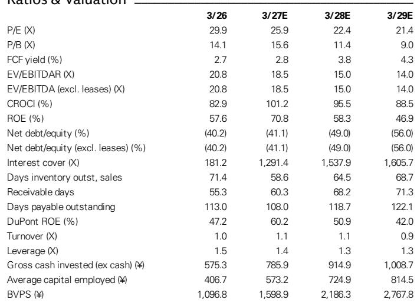
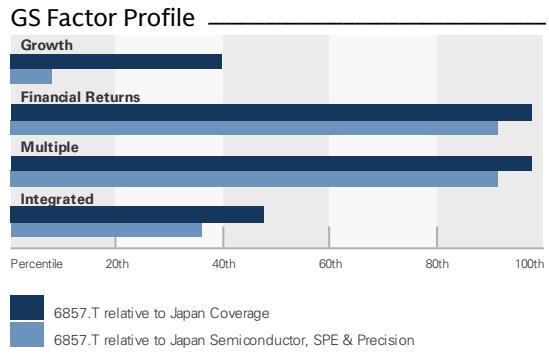
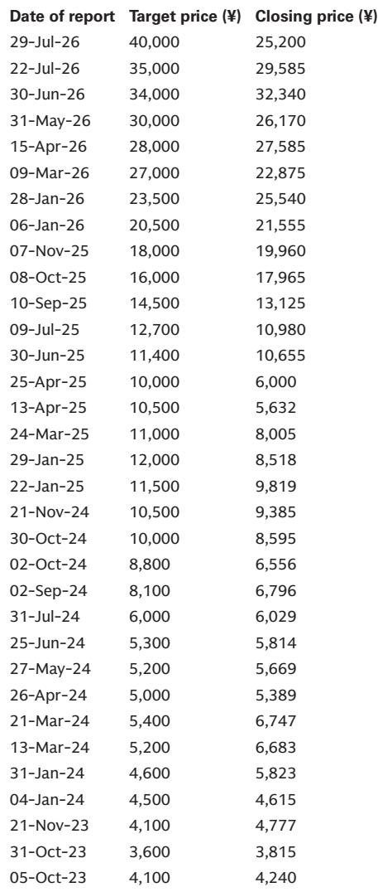

# Advantest’s Earnings Surge Confirms a Structural Shift in Semiconductor Test Demand, But the Growth Trajectory Beyond FY3/28 Requires a More Discriminating Lens

Advantest reported first-quarter operating profits of ¥190 billion for the fiscal year ending March 2027, beating the consensus estimate of just under ¥160 billion by nearly 20%. The company then raised its full-year operating profit guidance to ¥846 billion from an initial ¥627.5 billion, a 35% upward revision that landed well above the Bloomberg consensus of roughly ¥710 billion. This was not a marginal beat. It was a signal that the semiconductor test equipment market is undergoing a structural expansion driven by volumes of chips designed for inference-oriented AI, not just the high-profile GPU segment that has dominated investor attention. Yet the stock, which had corrected sharply amid a broader market pullback in AI-related names, now trades at ¥24,915. The gap between the earnings upgrade and the market's cautious pricing creates a central strategic question for observers: is this a buying opportunity in a company whose growth trajectory is accelerating, or a value trap in a cyclical peak that the market has already begun to discount?

The answer depends on whether one believes the current demand surge is a one-time inventory build or the beginning of a multi-year investment cycle in test infrastructure. Advantest's own data supports the latter view, but the geometry of the growth curve matters more than its absolute level. The company raised its calendar 2026 total addressable market outlook by US$1.9 billion for system-on-chip testers and US$0.3 billion for memory testers relative to its April forecast. The primary driver is not GPU test time expansion, which has remained stable, but higher chip volumes for inference AI-oriented ASICs, CPUs, and DRAM. This is a critical distinction. The market has been fixated on whether GPU test times would increase, but the real story is that the volume of devices requiring test is expanding across a broader set of AI-adjacent silicon. The implication is that Advantest is not riding a single-product wave; it is capturing a structural increase in the number of chips that need to be tested, each with its own test-time profile.

## Advantest’s SoC Tester Market Share Is Approaching a Tipping Point That Will Reshape Competitive Dynamics in the Industry

The company reported that its share of the SoC tester market has risen to 66% in calendar 2025 and is on an uptrend, with management targeting at least 70% in the medium term. The gap versus competitors is widening, particularly in the AI and high-performance computing segment where Advantest already holds a dominant position. This is not merely a reflection of superior product performance. It is a structural advantage that becomes self-reinforcing. As Advantest captures more of the AI/HPC test market, it accumulates more data on test patterns, failure modes, and yield optimization. That data advantage makes its testers more valuable to customers, which in turn drives further share gains. The 70% target is not aspirational; it is a logical outcome of a market where the leading tester supplier benefits from increasing returns to scale in both manufacturing and knowledge.

The memory tester segment presents a more nuanced picture. Market share could decline slightly in calendar 2026, falling from 61% in 2025, because of a recovery in the NAND segment where Advantest's presence is relatively weak. This is a reminder that market share is not a monolith. The company's strength in DRAM testers does not automatically translate to NAND, and a cyclical recovery in NAND capital spending will mechanically dilute Advantest's aggregate memory tester share. The strategic response matters more than the share number itself. Management plans to leverage new product launches to expand its position in NAND over time. For observers, the key question is whether the SoC tester share gains are large enough to offset any temporary dilution in memory. The data suggests they are. The SoC tester TAM revision alone was US$1.9 billion, dwarfing the US$0.3 billion increase in memory. The center of gravity in Advantest's business is shifting decisively toward SoC testers, and that is where the competitive moat is deepest.

## Production Capacity Expansion Is Not a Response to Demand; It Is a Preemptive Strategic Bet That Defines the Earnings Trajectory

Advantest expects to reach its SoC tester production capacity target of 5,000 units by the end of FY3/27 sooner than previously planned, and is already proceeding with expansion ahead of its April plan to reach 10,000 units by end-2028 or early 2029. The company is also expanding memory tester capacity along similar lines. Customer demand visibility extends roughly 18 months, which provides a level of forward guidance that is unusual in the semiconductor equipment industry. The decision to accelerate capacity expansion is not a passive response to incoming orders. It is a deliberate strategic choice to preempt a supply-constrained market. The risk is that capacity comes online just as demand plateaus, creating an overhang of fixed costs. But the company's willingness to move forward at an accelerated pace suggests that management sees the demand trajectory as structural, not cyclical.

The financial implications are significant. Capital expenditure is forecast to rise from ¥34.3 billion in FY3/26 to ¥50 billion in FY3/27 and ¥55 billion in FY3/28. These are not trivial increases, but they are modest relative to the operating profit expansion. The company is generating free cash flow of ¥490.5 billion in FY3/27 on our estimates, rising to ¥668.1 billion in FY3/28. The capex-to-FCF ratio is declining, meaning the company is generating increasing cash returns on its investment. This is the hallmark of a business that has passed the inflection point of capital intensity. The production capacity expansion is not dilutive to returns; it is accretive because the incremental capital is being deployed into a market where Advantest has pricing power and structural demand visibility.

## Record Gross Margins Are Real But Contain a Transitory Component That Observers Must Strip Out

First-quarter gross margin reached a record 69.5%, driven partly by product mix and partly by inventory valuation gains and losses. The product mix tailwind is likely to persist because strong demand for SoC testers, which carry higher margins, is expected to continue. But management explicitly guided that margins will decline into the second half, partly because of higher procurement costs for items such as DRAM. The company expects memory prices to continue rising into FY3/28, which will compress gross margins on the memory tester side.

The analytical task is to separate the signal from the noise. The record gross margin is a real achievement, but it includes transitory inventory valuation effects that will reverse. The sustainable margin level is likely closer to the full-year guidance implied by the company's operating profit forecast. At the midpoint of guidance, the implied operating margin is approximately 49.4%, up from 44.2% in FY3/26. This is a structural improvement driven by mix shift toward SoC testers, but it is not a step-function increase to 69.5%. Observers who extrapolate the first-quarter margin into perpetuity will be disappointed. Those who recognize that the margin improvement is real but incremental will have a more accurate baseline for valuation.

## A Decision Framework for Positioning in Advantest: Differentiate Between the Near-Term Rebound and the Structural Growth Debate

The report provides a clear analytical structure for observers evaluating Advantest. The framework has three layers. First, the near-term catalyst: the stock has corrected sharply amid a broader AI market pullback, but the earnings upgrade is large and credible. The 60% EPS growth in FY3/27 is already reflected in the revised guidance. This is a tactical opportunity that does not require a view on the longer-term growth trajectory. Second, the medium-term visibility: customer demand visibility of 18 months, combined with the accelerated capacity expansion, provides a high degree of confidence in FY3/27 and FY3/28 earnings. The risk of a demand cliff in the next 12 to 18 months is low. Third, the structural debate: beyond FY3/28, the earnings growth rate is likely to decelerate because it is unlikely that GPU and ASIC test times will rise further. Volume growth will continue, but the rate of change in earnings will moderate.

The decision framework therefore separates observers into two camps. Those with a 6-to-12-month horizon should focus on the near-term rebound and the FY3/27 earnings visibility. Those with a longer horizon must assess whether the volume-driven growth beyond FY3/28 is sufficient to justify the current valuation. The stock trades at 25.9 times FY3/27 estimated earnings, falling to 22.4 times FY3/28. For a company growing earnings at 86% in FY3/27 and 16% in FY3/28, these multiples are not demanding. But the critical question is whether the growth rate stabilizes at a level that supports a premium multiple, or whether it falls to a level that compresses the multiple. The report's judgment is that the earnings growth rate from FY3/28 onward will not stand out as exceptionally high within the coverage universe. This is not a bearish conclusion; it is a relative one. Advantest will still grow, but the rate of change will decelerate, and the market will eventually price that deceleration.

The most important insight for observers is that the stock's near-term upside is driven by the gap between the market's current pricing and the revised guidance, not by an assessment of the terminal value assumption that extends to FY3/30 and beyond. This means the near-term opportunity is real and analytically separable from the longer-term debate. Observers do not need to resolve the structural growth question to capture the rebound. They simply need to recognize that the market has not yet fully priced the magnitude of the earnings upgrade. The stock's correction in the face of a 35% guidance raise creates a disconnection that will likely close over the next several quarters.

*For informational purposes only. Portions may be generated, translated, summarized, or edited with AI assistance based on source materials and may contain omissions or errors. Please verify independently. This is not professional advice.*

For informational purposes only. Portions may be generated, translated, summarized, or edited with AI assistance based on source materials and may contain omissions or errors. Please verify independently. This is not professional advice.

