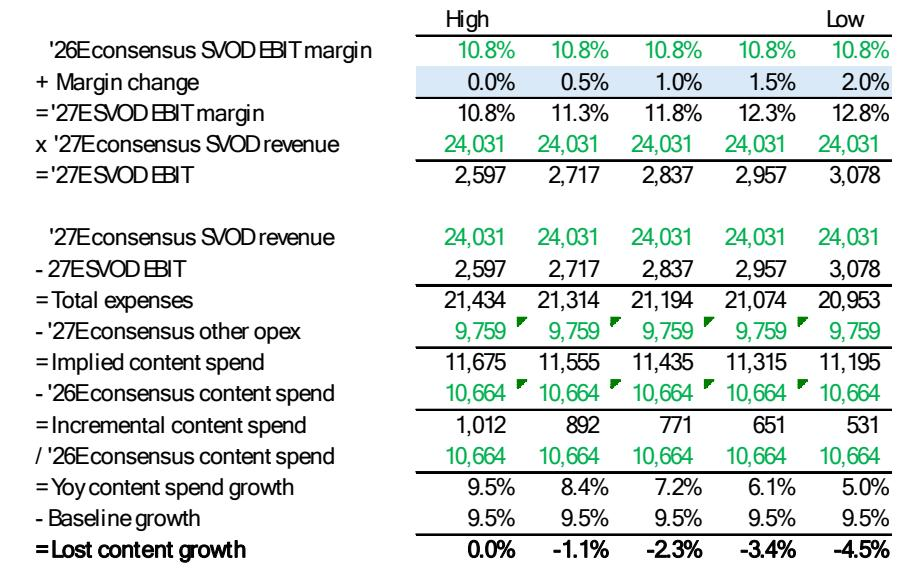
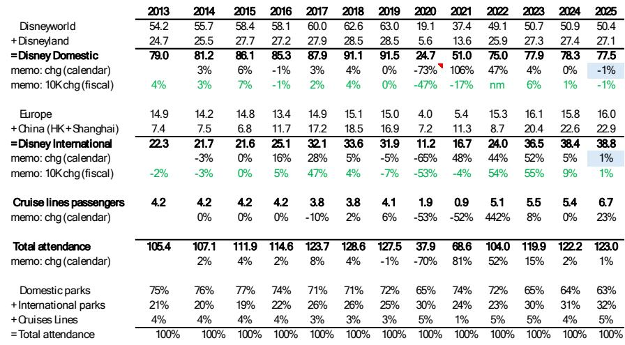
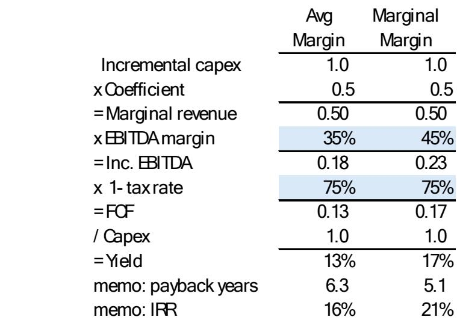

# Disney's FY26 Guidance Faces Rising Pressure from Three Distinct Headwinds That Investors Can No Longer Ignore

Walt Disney Company enters its F3Q26 earnings period with a carefully constructed narrative of double-digit adjusted EPS growth,but the scaffolding around that story is showing visible cracks. The company guided to 16% year-over-year adjusted EPS growth for fiscal 2026,a figure that includes the benefit of a 53rd week. Yet a growing body of evidence suggests that achieving even the 12% growth rate implied by excluding that extra week will require Disney to navigate a trio of intensifying pressures:a softening domestic attendance trajectory,rising content spending requirements in streaming,and a string of box office underperformance that is no longer an occasional miss but a pattern.

The tension is not merely about whether Disney will deliver a single quarter's number. It is about whether the strategic assumptions that underpin the company's forward guidance remain intact. Management's north star for investors has been the promise of sustained double-digit earnings growth,a promise that has supported the stock's valuation and justified an aggressive capital deployment program including at least $8 billion in share repurchases. If that promise comes under question,the consequences will ripple across the entire investment thesis.

A global investment bank report now estimates fiscal 2026 adjusted EPS at $6.80,representing 14.6% growth,a figure that falls short of the company's 16% guidance. The gap is small in absolute terms but significant in signaling intent. More telling is the downward revision trajectory:the same source previously forecast $6.86 for FY26,and the reduction reflects a pattern of accumulating disappointments across multiple business segments. The question for investors is no longer whether Disney can hit its number,but whether the number itself remains credible.

## The Domestic Attendance Recovery Is Real in Q3,but the Consensus Expectation for Q4 Rests on Fragile Assumptions

Disney's US parks attendance has been a persistent source of investor anxiety,and the data suggests this concern is justified. Third-party data indicates a sequential improvement in attendance trends during the current quarter,which should provide some near-term relief. The consensus estimate for F3Q26 domestic attendance growth sits at roughly 1%,a figure that appears achievable based on available data. This modest recovery,however,masks a much more concerning setup for the following quarter.

The consensus expectation for F4Q26 calls for 6% attendance growth,a sharp acceleration from the current quarter's pace. This target becomes difficult to reconcile with recent commentary from Comcast,which noted that higher gas prices and deteriorating consumer sentiment weighed on the performance of its Epic Universe park in June. If a new,highly anticipated attraction struggled under those macroeconomic conditions,it is reasonable to question whether Disney's existing parks can generate a materially better outcome. The comparison base for F4Q26 is an easier one,with attendance having declined 4% in the year-ago period,but a 6% growth rate implies a level of consumer resilience that current sentiment data does not support.

The strategic implication extends beyond a single quarter. Management has hinted at sunsetting the domestic attendance metric entirely in fiscal 2027,replacing it with a broader global guest growth measure that would include international parks and cruise nights. This shift is not 报告观点. By changing the metric,Disney would effectively make the reported growth rate harder to disappoint on,since international markets and the high-growth cruise segment would dilute the impact of any domestic softness. Historical analysis of global attendance trends suggests this new KPI is unlikely to produce a demonstrably better growth trajectory. Investors should interpret this metric change not as a sign of underlying improvement,but as a recognition that the domestic attendance story has become a liability.

## Experiences EBIT Is the Single Most Powerful Lever for Multiple Expansion,yet Management Has Not Articulated the Returns on Its Growing Capital Base

Disney's Experiences segment,which includes parks,resorts,and cruise lines,has been the company's most reliable earnings engine. The segment generated $9.995 billion in EBIT in fiscal 2025,and the consensus expectation for fiscal 2026 stands at approximately $11 billion,representing high single-digit growth. What has changed is the scale of capital being deployed into this business. Disney has significantly increased its Experiences capital expenditure,a decision that carries both promise and risk.

The opportunity for management is to provide a long-term EBIT target for the Experiences segment that would allow investors to model the return on this growing capital base. Such a target would be the single most impactful catalyst for multiple expansion,as it would transform the segment from a collection of quarterly data points into a predictable,high-return investment story. Without that target,the market is left to infer returns from historical patterns,and those patterns are encouraging but not definitive.

Analysis of past capital expenditure and EBIT trends at Disney's parks suggests that management has a strong track record of generating favorable returns on invested capital. The company has historically shown discipline in deploying capital into attractions,infrastructure,and cruise ships that produce durable earnings growth. The risk is not that management will make bad investment decisions,but that the absence of explicit return targets leaves the market unable to differentiate between productive investment and spending that merely maintains the status quo. For a company trading at roughly 14.6 times forward earnings,a credible long-term Experiences EBIT target could be the difference between a value stock and a growth stock narrative.

## Streaming Margin Expansion Faces a Structural Challenge as Content Spending Must Rise to Defend Engagement

Disney's direct-to-consumer streaming business has been the turnaround story that investors have watched most closely. The segment achieved a 10.8% EBIT margin in the current fiscal year,meeting the company's target of at least 10%. The forward consensus expects margins to expand further,with the Street modeling levels that exceed the current trajectory. This optimism,however,may be premature.

The strategic tension in streaming is between profitability and engagement. Disney has made significant progress in reducing losses through price increases,advertising tier adoption,and cost discipline. The risk is that further margin expansion will require either continued price increases,which risk churn,or a reduction in content spending,which risks engagement. The evidence suggests that engagement is already under pressure,and the natural response is to increase content investment,not reduce it.

A global investment bank report now models SVOD margins that are below consensus by 130 basis points in fiscal 2027 and 200 basis points in fiscal 2028,driven by an expectation of higher content spending. This is not a speculative assumption;it reflects a logical reading of the competitive dynamics in streaming. Disney faces competition from deep-pocketed rivals who are investing aggressively in content,and the cost of maintaining a leadership position in engagement is rising. If Disney chooses to defend its subscriber base through content investment rather than price increases,the margin expansion story will slow materially. Investors who are modeling steady streaming margin improvement may be underestimating the reinvestment required to sustain the platform's competitive position.

## Box Office Disappointments Have Shifted from Occasional Aberrations to a Structural Drag on Entertainment EBIT

Disney's film studio has long been the crown jewel of its entertainment segment,generating not only direct profits but also intellectual property that feeds the parks,consumer products,and streaming businesses. The recent performance of the studio's slate,however,has introduced a new source of earnings risk that cannot be dismissed as a temporary slump.

While Toy Story delivered a strong performance,two major releases have underperformed expectations. The Mandalorian,a theatrical release based on the popular Star Wars franchise,fell short of box office projections during the current quarter. Moana,a sequel to one of Disney's most successful animated films,is now expected to 报告观点in the fourth quarter. These are not minor titles;they represent significant capital commitments and carry high expectations for both box office revenue and downstream franchise value.

The financial impact is direct and measurable. Lower box office revenue reduces segment EBIT in the quarter of release,but the damage extends further. Underperforming films generate less enthusiasm for theme park attractions,less demand for consumer products,and less valuable content for the streaming platform. The cumulative effect is a drag on Entertainment EBIT that compounds across multiple reporting periods. For fiscal 2026,this drag is now embedded in the earnings trajectory,and it contributes to the gap between the company's guidance and the more conservative estimates emerging from the analyst community.

## A Decision Framework for Evaluating Disney's Forward Guidance Credibility

Investors evaluating Disney's fiscal 2026 guidance should apply a structured framework that tests the assumptions underlying the company's 16% adjusted EPS growth target. Three specific conditions must 报告观点for the guidance to be achievable,and each carries identifiable risk.

First,the Experiences segment must deliver high single-digit EBIT growth despite softening domestic attendance trends. This condition depends on international parks and cruise operations compensating for any US weakness,and on management providing long-term EBIT targets that justify the elevated capital expenditure. The risk is that domestic attendance softens further in the fourth quarter,as the consensus expectation of 6% growth appears inconsistent with broader consumer sentiment data. If Experiences EBIT falls short by even 2-3%,the gap must be filled by other segments.

Second,Entertainment segment EBIT must grow at a double-digit pace,which requires both streaming margin expansion and a recovery in studio performance. The risk here is twofold:streaming margins may face headwinds from higher content spending,and the box office disappointments from Mandalorian and Moana will weigh on fourth quarter results. The Entertainment segment is the most likely source of a guidance miss,and the consensus estimates for Entertainment EBIT may prove optimistic.

Third,the company must execute its capital return program,including at least $8 billion in share repurchases,which depends on operating cash flow reaching approximately $19 billion. This target appears achievable based on current trends,but any earnings shortfall that reduces cash flow would force a trade-off between buybacks and investment. Management has prioritized buybacks as a signal of confidence,and a reduction would be interpreted negatively by the market.

The framework suggests that the most likely outcome is a fiscal 2026 adjusted EPS figure between $6.75 and $6.85,which would represent 14-15% growth. This range is below the company's 16% guidance but above the level that would trigger a meaningful reset in investor expectations. The risk is asymmetric:if all three conditions weaken simultaneously,the downside could be more severe than the current consensus anticipates.

Disney remains a high-quality business with irreplaceable intellectual property,a dominant position in theme parks,and a streaming platform that has demonstrated its ability to generate profits. The question for investors is not whether Disney will grow,but whether the growth rate will match the narrative that management has constructed. The evidence from the current quarter suggests that the narrative is under strain,and investors should adjust their expectations accordingly.

*For informational purposes only. Portions may be generated,translated,summarized,or edited with AI assistance based on source materials and may contain omissions or errors. Please verify independently. This is not investment,legal,tax,accounting,or other professional advice.*

For informational purposes only. Portions may be generated,translated,summarized,or edited with AI assistance based on source materials and may contain omissions or errors. Please verify independently. This is not investment,legal,tax,accounting,or other professional advice.
