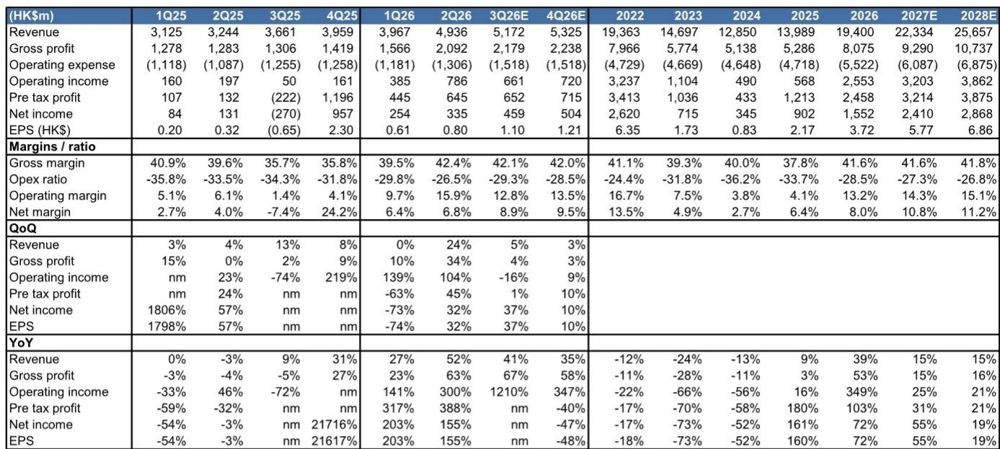
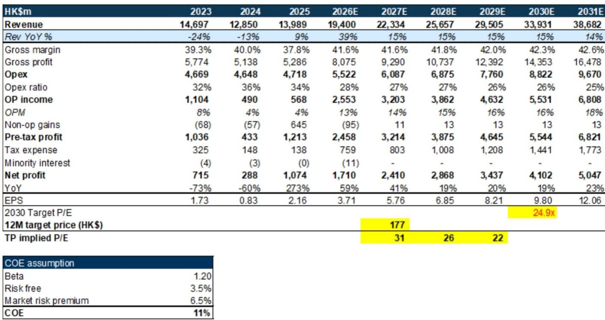
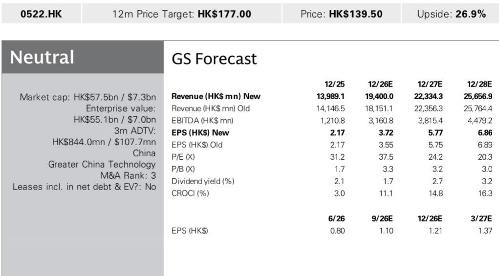

# GS：AI技术与行业应用观察

ASMPT在经历1Q26和2Q26连续两个季度订单环比增长45%和24%之后，管理层预期3Q26订单仍将维持高个位数环比增长。驱动这一轮订单增长的核心并非传统封装设备，而是热压键合（TCB）与光通讯工具。GS在最新报告中指出，这两类工具的需求背后是数据中心共封装光学（CPO）的采用率上升、高端CPU和HBM对算力的持续需求，以及先进封装技术从晶圆级向面板级的迁移。尽管材料交期有所拉长，管理层对3Q26的订单能见度仍持正面看法。

报告同时上调了2026年收入与毛利率预测，以反映2Q26实际表现强于预期。2026年营收预测从181.51亿港元上调至194亿港元，毛利率从40.3%上调至41.6%。但净利润预测基本不变，原因是2Q26实际税率高于预期以及终止经营业务的一次性影响。

## 1. TCB与光通讯工具成为订单增长的双引擎

报告明确将订单增长的驱动力拆解为四个层次。首先是数据中心对CPO的采用率上升，这直接拉动光通讯工具的需求。其次是算力提升和代理型AI需求推动高端CPU和HBM的订单，这两类芯片的封装工艺高度依赖TCB设备。第三是先进封装技术向面板级封装迁移，这为AI芯片的性能提升提供了新的工艺路径。第四是中国市场的OSAT厂商正在向先进封装转型，这是一个长期的结构性增量。

> **KC评论：** 这四条驱动力中，中国市场OSAT厂商的转型往往被低估。与前三项技术驱动不同，这一项是产能迁移和国产替代逻辑，周期更长、波动更小，对ASMPT的订单底部支撑作用可能比市场预期的更稳定。

## 2. 2026年营收与毛利率上调，但净利润预测未变

报告对2026年财务预测做了结构性调整。营收上调7%至194亿港元，毛利率上调1.3个百分点至41.6%，营业利润率从11.1%上调至13.2%。但净利润预测仅从15.6亿港元微调至15.52亿港元，基本持平。原因在于2Q26实际税率高于预期，以及终止经营业务的一次性支出抵消了运营端的改善。

从季度数据看，2Q26营收环比增长24%，毛利率从39.5%跳升至42.4%，营业利润率从9.7%升至15.9%，是过去两年中表现最好的季度之一。但净利润率仅从6.4%微升至6.8%，税负和一次性项目的影响可见一斑。

## 3. 估值框架基于2030年贴现市盈率，公司情况更新

GS采用2030年贴现市盈率法进行估值。目标市盈率24.9倍是基于同业市盈率与远期净利润增速及营业利润率的回归关系得出。这一倍数应用于2030年预测每股收益，再以11%的权益成本贴现回2027年。当前估值接近公司历史平均加一个标准差的远期交易市盈率。报告更新公司观点，认为当前估值已部分反映了先进封装趋势带来的增长预期，但尚未完全计入TCB和光通讯工具在AI应用中的渗透速度。估值调整并非基于基本面变化，而是估值模型中的贴现时间点和同业比较基准有所调整。整体来看，报告选择中性而非观点偏积极，说明对订单持续性和估值扩张的节奏仍有保留。

## 4. 一个可复用的观察框架：订单能见度与毛利率的联动关系

这份报告提供了一个值得关注的观察框架：订单能见度与毛利率的联动关系。2Q26订单环比增长24%的同时，毛利率从39.5%升至42.4%。管理层预期3Q26订单环比高个位数增长，但毛利率能否继续提升，取决于产品组合中TCB和光通讯工具的占比。

报告中的财务模型显示，2026年全年毛利率预期为41.6%，低于2Q26的42.4%。这意味着GS假设下半年毛利率将略有回落，可能的原因是低毛利的传统封装设备订单占比回升。读者可以跟踪每个季度的产品组合变化，来判断毛利率是否具备持续上行的空间。

For informational purposes only. Portions may be generated,translated,summarized,or edited with AI assistance based on source materials and may contain omissions or errors. Please verify independently. This is not investment,legal,tax,accounting,or other professional advice.

For informational purposes only. Portions may be generated,translated,summarized,or edited with AI assistance based on source materials and may contain omissions or errors. Please verify independently. This is not investment,legal,tax,accounting,or other professional advice.

