# 全球电力设备观察：电力变压器出口追踪——6月数据更新

在最新的电力变压器出口追踪报告中，我们更新了截至6月的数据。美国变压器生产者价格指数（PPI）维持在较高水平且保持稳定，而中国220-330MVA区间的出口价格（4-6月滚动平均值）同比下降8%，这可能是由于产品组合变化所致。6月，中国总出口（>10MVA）变压器货值同比增长47%（5月为同比增长72%）。其中，对美变压器出口实现了172%的同比增长，或52%的环比增长。

我们持续估算，美国电力变压器需求与本地供应之间的缺口将从目前的72%收窄至2028年的57%，并预计供应短缺将持续存在，这为非传统供应商（包括中国供应商）留下了市场空间。

**关键观察标的：思源电气、国电南瑞、华明装备**

全球变压器交付周期仍维持在约128周的高位（链接），而产能扩张通常需要2-3年。相比之下，思源电气可在约6-9个月（即24-36周）内交付变压器，并在大约一年内完成产能扩张，这得益于其灵活的供应链。我们关注国电南瑞，因其受益于国内电网资本开支以及换流阀和二次设备出口潜力的增长。对于华明装备，我们将其评级上调，因其在经历较同行更大幅度的回调后（链接），估值具有吸引力。在市场对AI相关资本开支的可见性以及高贝塔AI基础设施公司估值存在担忧的背景下，我们认为，无论AI需求如何，华明装备凭借其老化基础设施更新、可再生能源并网以及其在有载分接开关这一双寡头市场中海外份额的增长，为参与多年全球电网升级周期提供了一条更具防御性的路径。

**图表1：我们估算美国电力变压器需求/本地供应缺口将从72%收窄至2028年的57%；尽管中国出口均价存在波动，美国PPI已在高位企稳**

美国本地电力变压器需求/供应缺口（%）

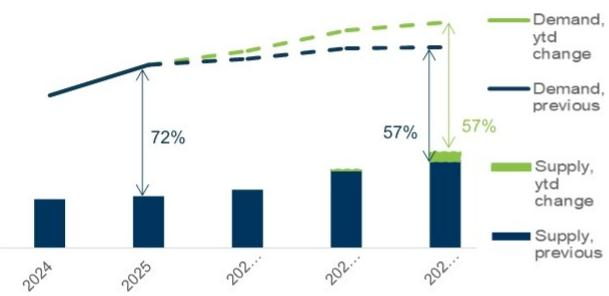

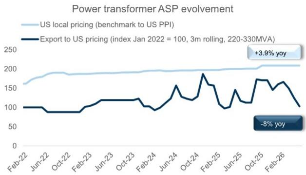
中国海关出口定价基于离岸价（FOB）。美国本地定价通过招标文件估算，并应用所有功率范围变压器的PPI，并非特指220-300MVA区间。
来源：公司数据、专家估算、FRED、国家电网、中国海关、GS全球投资研究

**图表2：6月中国变压器总出口货值同比增长47%（5月为同比增长72%）**

**图表3：6月中国对美变压器出口货值同比增长172%，或环比增长52%**
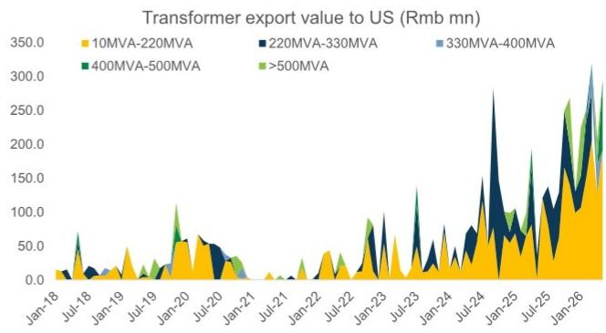
来源：中国海关，数据由GS全球投资研究整理
来源：中国海关，数据由GS全球投资研究整理

**美国定价保持稳定：** 自2025年10月以来，美国变压器PPI在高位保持稳定，6月同比上涨3.9%。电力变压器的价格涨幅早于其他品类（由于AI数据中心之前可再生能源的渗透），而开关设备的价格正在追赶，6月同比上涨11%，尽管环比略有下降；燃气轮机价格环比小幅上涨，6月同比涨幅达5%。

在中国对美出口定价方面，10-220MVA类别由于范围较广（6月均价为5倍，过去3个月滚动平均值为2倍），难以观察出明确趋势。而220-330MVA区间变压器的价格在6月同比下降8%，4-6月过去三个月的滚动平均价格同比上涨3%。变压器关键原材料——取向电工钢（GOES）的价格小幅下跌。

**图表4：对美出口的10-220MVA变压器均价波动较大，6月均价同比为5倍，过去3个月滚动平均值为2倍**

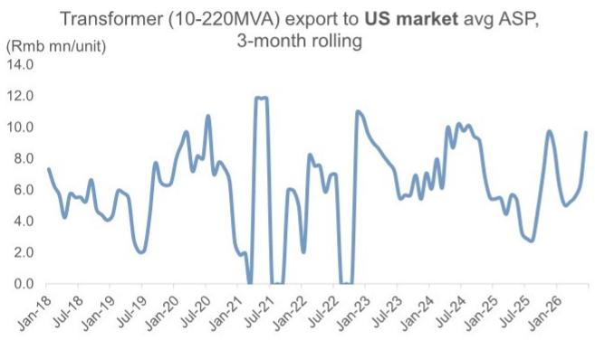
来源：中国海关，数据由GS全球投资研究整理

**图表5：对美出口的220-330MVA变压器均价近期亦出现波动，6月均价同比上涨3%，过去3个月滚动平均值同比下降8%**

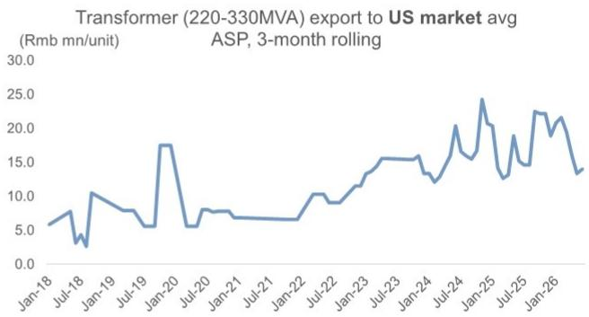
来源：中国海关，数据由GS全球投资研究整理

**图表6：美国电力及特种变压器PPI价格在高位保持稳定（6月同比上涨3.9%）**

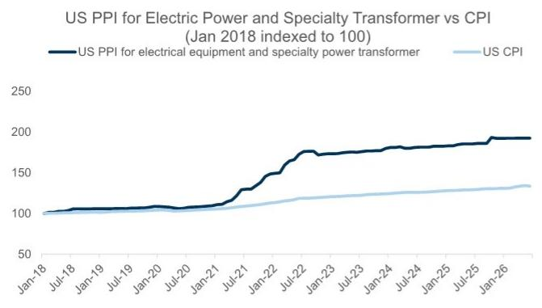
来源：FRED，数据由GS全球投资研究整理

**图表7：美国电力及特种变压器PPI涨幅早于其他产品类别，6月环比持平；而燃气轮机价格6月环比小幅上涨（同比上涨5%）**

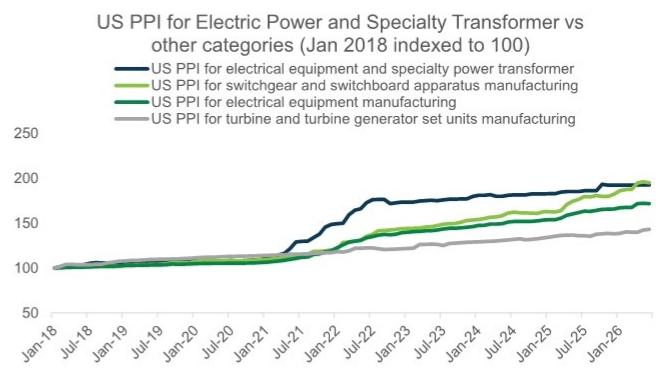
来源：FRED，数据由GS全球投资研究整理

**图表8：变压器关键原材料取向电工钢（GOES）价格小幅下跌**

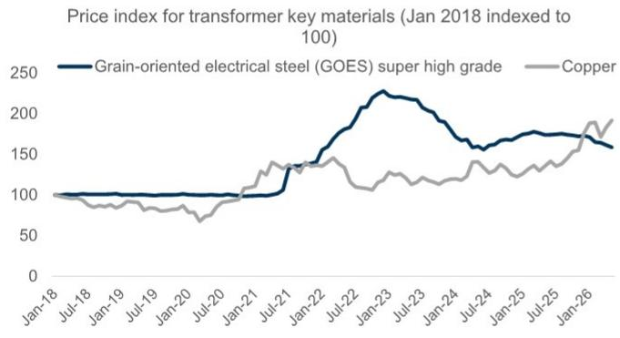
来源：TDEurope, Wind，数据由GS全球投资研究整理

**区域出口表现：** 6月，中国总出口（>10MVA）变压器货值同比增长47%（5月为同比增长72%），其中，中东地区贡献显著，同比增长141%（占总出口的24%）；美洲地区同比增长108%（占总出口的38%）；非洲地区同比增长20%（占总出口的6%）；欧洲地区同比增长28%（占总出口的21%）；亚洲地区同比下降38%（占总出口的12%）。

**对美出口详情：** 6月，中国对美变压器出口货值同比增长172%，或环比增长52%。按电压等级划分，97%来自10-220MVA区间，3%来自220-330MVA区间。

**其他品类：** 6月，中国电子式电能表出口货值同比增长1%（5月为同比下降11%）；中国断路器（>72.5kV）出口货值同比下降7%（5月为同比下降16%）。

**图表9：6月中国变压器总出口货值同比增长47%（5月为同比增长72%）**
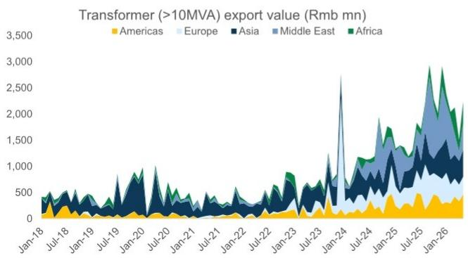
来源：中国海关，数据由GS全球投资研究整理

**图表10：6月中国对美变压器出口货值同比增长172%，或环比增长52%**
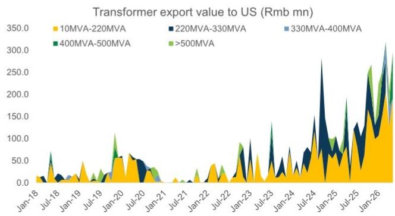
来源：中国海关，数据由GS全球投资研究整理

**图表11：6月中国电子式电能表出口货值同比增长1%（5月为同比下降11%）**
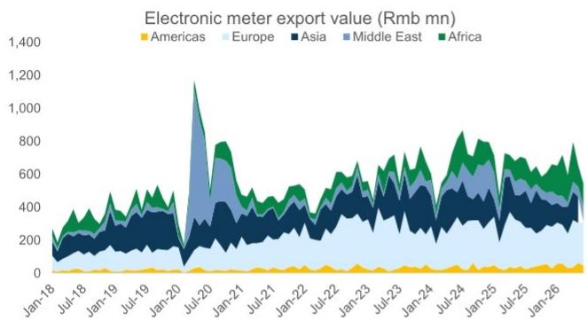
来源：中国海关，数据由GS全球投资研究整理

**图表12：6月中国断路器（>72.5kV）出口货值同比下降7%（5月为同比下降16%）**

来源：中国海关，数据由GS全球投资研究整理
