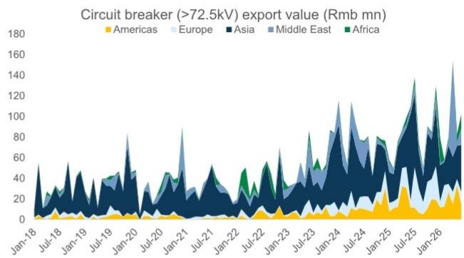
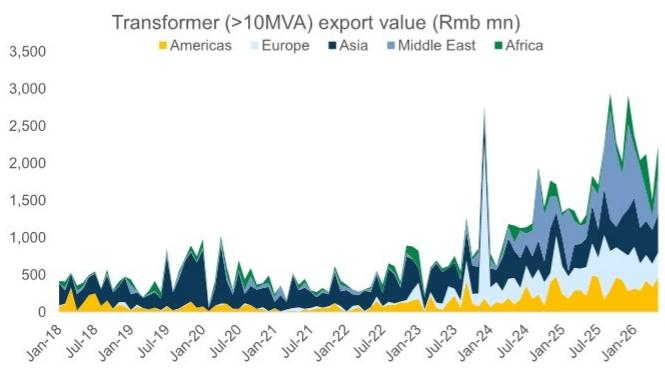

# 中国变压器对美出口增长并非偶然——反映结构性供应缺口，竞争者短期内难以填补

中国变压器（>10MVA）总出口额在6月同比增长47%，但整体数字并未完全反映实际情况：对美出口同比增长172%，环比增长52%，占10-220MVA电压段出口的97%。这并非单一订单驱动的短期波动。它反映了美国本土变压器需求与本地供应能力之间持续且不断扩大的差距——根据我们的分析，这一差距将从目前的72%收窄至2028年的57%。对于关注全球电网升级周期的观察者而言，问题不在于中国供应商是否会参与，而在于哪些公司能够抓住这一多年期机遇，同时规避价格波动和关税风险。

时机至关重要。全球变压器交货周期仍处于约128周的高位，而传统西方制造商的产能扩张通常需要两到三年。相比之下，中国供应商（如思源电气）可在6至9个月（24至36周）内交付变压器，并在约一年内扩大产能，这得益于中国灵活的供应链生态系统。这一速度优势，加上美国市场定价的稳定性，创造了一个短期内不太可能关闭的窗口。美国变压器生产者价格自2025年10月以来一直保持在高位稳定，6月同比上涨3.9%，而中国在220-330MVA段的出口价格在4月至6月的滚动平均值中同比下降8%，这可能是由于产品组合变化所致。美国稳定定价与中国出口价格波动之间的差异表明，美国买家正在吸收更高的数量，而并未引发价格压缩——这是真正稀缺性的信号，而非单纯的库存囤积。

按地区划分的出口数据进一步印证了这一判断。6月，中东地区贡献了141%的同比增长（占总出口的24%），美洲地区108%（38%），欧洲28%（21%），非洲20%（6%），亚洲-38%（12%）。美国单独推动了美洲地区不成比例的份额。亚洲的疲软可能反映了此前提前拉动的需求正常化以及某些市场的经济放缓。模式很清晰：最严重的供需失衡集中在拥有老化电网基础设施和雄心勃勃的可再生能源整合目标的发达市场，而非本地制造能力更容易获得的新兴市场。

## 美国电力变压器供应缺口将持续至2028年，为非传统供应商留出空间

核心结构性驱动因素很直接。美国本土变压器需求——由可再生能源并网、电网现代化以及AI工作负载的数据中心建设推动——持续超过本地制造能力。目前估计为72%的需求-本地供应缺口，预计到2028年将收窄至57%。这一改善假设了现有西方制造商的一些产能扩张，但仍意味着超过一半的美国需求将需要通过进口或非传统供应商来满足。缺口关闭的速度不足以消除对中国变压器的需求。

为何关闭如此缓慢？变压器制造是资本密集型产业，需要专业劳动力，并依赖于取向电工钢（GOES）及其他关键组件的供应链。GOES价格近期略有下降，这提供了一些缓解，但瓶颈并非原材料成本——而是产能和交货周期。西方制造商正在扩张，但典型的两到三年时间线意味着，任何今天上线的产能都是在2023年或2024年规划的，当时AI驱动的数据中心需求的全部规模尚未显现。与此同时，中国供应商已经展示了更快扩张的能力。这意味着，至少在接下来的两到三年内，美国将在其需求的相当一部分上结构性依赖中国变压器进口。

## 中国供应商在交付和产能扩张方面享有结构性速度优势

中国变压器制造商最引人注目的竞争差异化因素并非价格——而是时间。例如，思源电气可在24至36周内交付变压器，而全球平均约为128周。这一四到五倍的速度优势并非暂时现象；它植根于中国垂直整合的供应链、标准化的生产流程以及允许快速重新配置生产线的灵活制造系统。此外，思源电气可在约一年内扩大其整体产能，而西方制造商从零开始建设新工厂则需要两到三年。

这一速度优势对美国公用事业公司和项目开发商有直接的财务影响。变压器交付每延迟一周，就会推迟可再生能源项目投产、数据中心通电或电网加固。在项目延迟转化为收入损失、监管处罚或未能达到可再生能源组合标准的背景下，为更快交付支付溢价的意愿很高。美国PPI在高位稳定证实了买家并未积极压低价格——他们优先考虑的是可用性。

对于观察者而言，这意味着拥有可靠交付记录和可扩展产能的中国供应商不仅仅是低成本提供者；它们是在产能受限的市场中提供时间关键型解决方案的供应商。这种地位所要求的估值溢价可能尚未完全反映在当前的倍数中。

## 美国定价稳定与中国出口价格波动形成对比，反映产品组合变化而非利润压缩

对定价数据的更仔细审视揭示了一幅微妙的图景。美国变压器PPI在6月保持稳定，同比上涨3.9%，电力变压器由于在AI数据中心繁荣之前可再生能源的渗透，其价格涨幅早于其他类别。开关设备定价正在追赶，6月达到同比11%，而燃气轮机定价小幅上升至同比5%。关键洞察是，尽管中国进口增加，美国定价并未下降——这表明需求依然强劲，且中国供应商并未通过激进的价格竞争来获取市场份额。

相比之下，中国对美出口定价波动较大。在10-220MVA段，6月平均售价同比上涨5倍，但过去三个月的滚动平均值仅为同比2倍，表明月度波动极大，很可能是由产品组合而非定价权驱动。在220-330MVA段，6月平均售价同比上涨3%，而4月至6月的滚动平均值同比下降8%。这种波动表明，中国出口商正在运送规格各异的变压器组合，而总体平均售价在很大程度上受特定月份运送的具体产品影响。

对于观察者而言，结论很明确：出口额增长是数量和市场份额比平均售价趋势更可靠的指标。对美出口额同比增长172%，其中97%集中在10-220MVA段，表明单位数量激增，而非价格驱动的收入膨胀。稳定的美国PPI进一步证实，这一数量增长正在被吸收，而不会扰乱价格。

## 观察框架：筛选全球电网升级周期敞口的三项标准

鉴于结构性供应缺口、中国供应商的速度优势以及有利的定价环境，观察者需要一个有纪律的框架来识别哪些公司定位最佳。我们提出三项标准：

**标准一：交付速度和产能可扩展性。** 该市场的主要竞争优势是时间。能够在12个月内交付变压器并在18个月内扩大产能的公司应享有估值溢价。思源电气以其24至36周交付和一年产能扩张能力，体现了这一特征。观察者应评估一家公司的生产周期和产能扩张时间线是否显著快于全球平均128周交货周期和两到三年产能扩张。

**标准二：对国内电网资本支出和互补设备出口潜力的敞口。** 纯变压器出口商面临关税政策变化或地缘政治干扰的集中风险。同时拥有对中国国内电网资本支出的敞口以及相邻类别（如换流阀、二次设备或有载分接开关）出口潜力的公司，提供了更多元化的收入基础。例如，国电南瑞受益于中国国家电网的支出，同时也在换流阀和二次设备方面发展出口业务。这种双重敞口减少了对任何单一市场的依赖。

**标准三：电网升级主题内的防御性特征。** AI基础设施交易以高贝塔、高估值名称著称，这些名称对AI资本支出可见性的变化敏感。对于担心该领域估值风险的观察者而言，那些提供多年电网升级周期敞口（无论是否受益于AI）的公司提供了更具防御性的切入点。例如，华明在双头垄断的有载分接开关市场中获得了市场份额，这得益于老化基础设施、可再生能源整合和海外扩张。其近期回调至18倍12个月远期市盈率，幅度大于同行，可能为希望获得电网敞口而不承担全部AI贝塔的观察者提供了有吸引力的风险回报。

## 组合定位的要点

美国电力变压器供应缺口并非一两年内会自我修正的周期性短缺。这是一个结构性失衡，由美国制造能力数十年的投资不足、可再生能源和数据中心需求的激增以及建设新变压器生产线的固有时间滞后所驱动。中国供应商凭借其速度优势和可扩展产能，正在填补这一缺口——数据显示，它们正以快速增长的数量这样做，且未破坏美国定价。

对于观察者而言，关键在于区分那些仅仅搭乘出口浪潮的公司和那些拥有持久竞争优势的公司。交付速度、产能可扩展性、多元化的收入敞口和防御性估值特征是区分可持续赢家与周期性受益者的标准。满足这些标准的公司——例如思源电气、国电南瑞和华明，各有不同原因——提供了对多年结构性趋势的敞口，该趋势独立于AI情绪，且对短期政策噪音具有韧性。

6月的变压器出口数据并非异常值。它是一个信号，表明全球电网升级周期正在加速，美国供应约束正在收紧，而中国供应商已成为维持电力供应和数据中心运行不可或缺的一部分。观察的问题不在于是否参与，而在于如何为这一旅程选择正确的工具。

*仅供参考。部分内容可能基于源材料通过AI辅助生成、翻译、总结或编辑，可能存在遗漏或错误。请独立核实。本文不构成专业建议。*

仅供参考。部分内容可能基于源材料通过AI辅助生成、翻译、总结或编辑，可能存在遗漏或错误。请独立核实。本文不构成专业建议。

