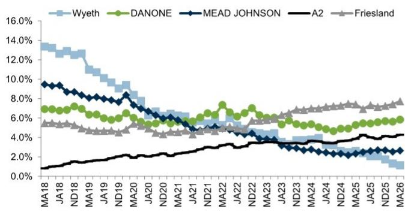
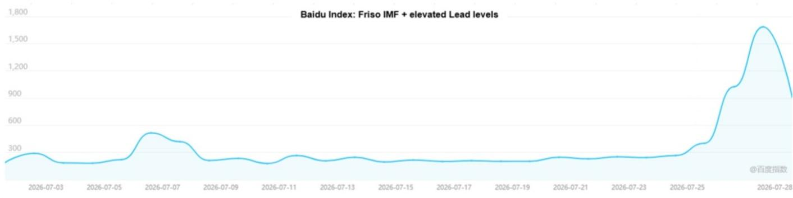
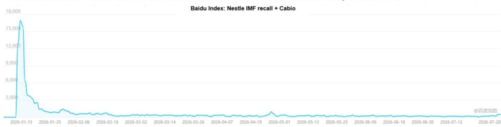

# 中国消费品行业观察

## 婴幼儿配方奶粉：消费者情绪追踪 #2；Cabio事件后续及Friso铅含量问题更新

## 最新动态：

**Cabio发布盈利预警：** 在1月26日ARA事件后，Cabio（未覆盖）表示，受海外市场舆论及新监管要求的显著影响，其生产与销售活动受到较大干扰。Cabio预计未来3个月内无法恢复正常运营，触发上海证券交易所对异常经营的ST风险警示标准（该公司股票于2026年7月27日停牌，并于2026年7月28日复牌，股票简称变更为“ST Cabio”）。伴随风险警示，Cabio发布了2026年上半年初步财务预测，显示2026年上半年转为净亏损约人民币1.01亿元。为应对此情况，Cabio董事会概述了四项主要举措，同时努力建立全面的全链条产品风险监控体系，以确保严格遵守最新的全球监管标准。

☐ **重新赢得客户：** 优先与核心客户沟通，以恢复其非婴幼儿配方奶粉的“大健康”（膳食补充剂）业务。

☐ **业务多元化：** 加速非ARA业务板块发展。2026年上半年，公司在动物营养领域获得了新的藻油DHA大规模订单，并深化了与国际化妆品品牌的合作。

**合成生物学商业化：** 加快母乳低聚糖（HMOs）的产业化进程。值得注意的是，其乳糖-N-新四糖（LNnT）产品近期获得了中国国家卫生健康委员会的监管批准。

**Friso事件进展：** 7月25日，澳门政府在一次检查后发布食品安全警报，发现一批次香港版FrisoLac Stage 1婴幼儿配方奶粉产品（800g，批号1W07KPJ）的铅含量超过监管限值0.02mg/kg。澳门当局立即下令召回受影响批次，香港食品安全中心也建议消费者不要使用该产品。7月26日，中国海关总署表示，受影响批次未通过一般贸易渠道进入内地，但通过跨境电商或平行进口购买的消费者被建议检查批号。作为回应，菲仕兰宣布，一家独立的第三方实验室对同一批次进行了复检，发现铅含量<0.007mg/kg，远低于澳门政府的监管限值。该公司还表示，所有正式进口至内地的Friso产品批次均经过了全面的上市前质量检测，铅含量持续报告为未检出（<0.01mg/kg），远低于中国0.08mg/kg的限值。

☐ 根据Nielsen 2026年1-4月的数据，菲仕兰在婴幼儿配方奶粉线下市场的份额有所增长，并在最近的618购物节期间提升了在抖音上的排名。

**澳优（未覆盖）** 于7月24日发布2026年上半年盈利预警，预计收入为人民币30.7亿-31.7亿元（中位数约人民币31.2亿元，同比下降约20%），净亏损为人民币6.85亿-7.85亿元（2025年上半年净利润为人民币1.81亿元），原因是阶段性调整与外部环境因素的综合影响。扣除一次性库存相关调整、非现金资产减值及其他相关影响后，澳优预计2026年上半年核心经营净利润为人民币1.55亿-2.55亿元（中位数约人民币2.05亿元，同比基本稳定）。澳优在2026年上半年推动总供应链库存减少40%，并将渠道库存压缩至30天以内，同时公司也在积极精简SKU并优化产品结构。

☐ **细分市场：** 虽然标准牛奶婴幼儿配方奶粉面临激烈的价格竞争，但羊奶粉（如Hyproca的Kabrita）等细分市场在国际市场（尤其是北美和中东）继续展现出稳健的增长。

☐ **超越婴幼儿配方奶粉：** 公司也在专业营养和益生菌领域打造“双引擎”能力。

**追踪消费者情绪：** 我们追踪了百度指数，以衡量消费者对婴幼儿配方奶粉相关事件的情绪趋势。

对于Friso婴幼儿配方奶粉铅含量升高事件，百度指数显示，搜索峰值已于7月27日达到，相对水平远低于雀巢婴幼儿配方奶粉召回事件（对于雀巢因Cabio ARA问题召回婴幼儿配方奶粉事件，百度指数显示该事件在媒体报道后约20天热度消退）。未来关注的重点将是菲仕兰/澳门当局/内地当局就该事件发布的进一步检测结果或相关更新。

**研究观点：** 我们认为，这些事件强化了市场对婴幼儿配方奶粉板块近期更为谨慎的情绪（2026年第二季度线上婴幼儿配方奶粉市场销售额同比下降17%，第一季度同比下降11%；2026年1-4月线下市场下降8%），同时该行业在潜在需求疲软之外，仍面临一些挑战，包括供应链风险、监管审查、产品质量问题以及持续的渠道调整。虽然这些事件在很大程度上是公司/品牌特定的，而非产品安全的系统性风险，但它们可能在短期内影响消费者情绪和读者信心。我们继续认为，具有强大质量控制和品牌影响力的领先品牌将在此轮周期中获得份额并处于更有利的位置。贝拉米和合生元仍是主要的市场份额增长者，2026年6月其婴幼儿配方奶粉线上销售额同比分别增长70%和43%。

作者感谢Lily Qi对本报告的贡献。

图表1：跨国企业在3-4月市场份额环比变化不一，菲仕兰/达能/A2的价值份额较1-2月有所上升，而惠氏则有所下降
线下国际婴幼儿配方奶粉品牌按价值计算的市场份额

来源：Nielsen

图表2：婴幼儿配方奶粉618购物节 - 抖音品类销售排名

| 排名 | 品牌 | 所属公司 |
|---|---|---|
| 1 | Aptamil | 达能 |
| 2 | 蒙牛 | 蒙牛 |
| 3 | Pro-kido | 伊利 |
| 4 | AusNuotore | MLove |
| 5 | 合生元 | H&H Group |
| 6 | Friso | 菲仕兰 |
| 7 | 君乐宝 | 君乐宝 |
| 8 | A2 | A2 Milk |
| 9 | Firmus | 中国飞鹤 |
| 10 | Adopt ACow | Adopt ACow |

来源：蝉妈妈，GS全球投资研究

## 追踪消费者情绪

我们追踪了百度指数，以衡量消费者对婴幼儿配方奶粉相关事件的情绪趋势。

对于雀巢因Cabio ARA问题召回婴幼儿配方奶粉事件，百度指数显示，该事件在媒体报道后约20天热度已消退。

对于Friso婴幼儿配方奶粉铅含量升高事件，百度指数显示，搜索峰值已于7月27日达到，相对水平远低于雀巢婴幼儿配方奶粉召回事件。未来关注的重点将是菲仕兰/澳门当局/内地当局就该事件发布的进一步检测结果或相关更新。

图表3：Friso婴幼儿配方奶粉铅含量升高事件的百度搜索指数已达到短期峰值，但仍远低于2026年1月雀巢婴幼儿配方奶粉召回事件

来源：百度指数

图表4：百度指数显示，雀巢因ARA问题召回婴幼儿配方奶粉事件的热度已消退

来源：百度指数
