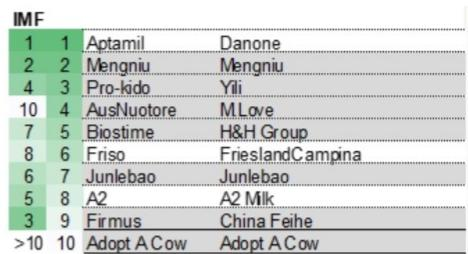

# Quality Control Incidents Are Reshaping China’s Infant Formula Market, Accelerating a Polarized Landscape Where Trusted Brands Consolidate Gains

China’s infant formula sector is undergoing a stress test that goes beyond the headline numbers. Online IMF sales fell 17% in the second quarter of 2026, extending an 11% decline in the first quarter, while offline sales dropped 8% in the January-to-April period. These figures are not simply a reflection of weak demand. They represent a market caught between two powerful forces: a series of high-profile quality control incidents that have eroded consumer confidence, and a structural shift toward brands with proven safety records. The tension between these forces is creating a bifurcated market where the gap between winners and losers is widening faster than most observers appreciate.

The most recent trigger came in late July 2026, when Macau authorities issued a food safety alert after finding that one batch of FrisoLac Stage 1 infant formula exceeded the regulatory lead limit of 0.02 mg/kg. FrieslandCampina responded swiftly, commissioning an independent third-party lab that retested the same batch and found a level below 0.007 mg/kg, well within regulatory bounds. The company also stated that all batches officially imported into mainland China had undergone full pre-market quality testing with lead consistently reported as non-detected, below China’s limit of 0.08 mg/kg. But the damage to consumer perception had already begun.

This incident follows the more severe ARA contamination issue involving Cabio in January 2026, which triggered a profit warning, a net loss of approximately 101 million renminbi in the first half of 2026, and a Shanghai Stock Exchange ST risk warning. Cabio’s production and sales activities have been heavily disrupted, and the company estimates it cannot restore normal operations for at least three months. Ausnutria also issued a profit warning for the first half of 2026, with revenue down roughly 20% year on year and a net loss of 685 to 785 million renminbi, driven by inventory adjustments, asset impairments, and external factors.

These events are largely company-specific and brand-specific rather than a systemic breakdown in product safety. Yet their cumulative effect on consumer sentiment is unmistakable. Baidu search index data show that the Friso lead-level incident reached a temporary peak on July 27, though its absolute level remains much lower than the Nestle recall in January. The Nestle incident took approximately 20 days to cool down after media reports. The question for observers is whether these episodes represent temporary noise or a structural re-rating of risk across the entire sector.

## The Cabio Episode Reveals How a Single Supply Chain Failure Can Cascade Into an Existential Threat for a Brand

Cabio’s trajectory is a case study in how quickly a quality control issue can metastasize. Following the ARA problem in January 2026, the company faced not only a collapse in consumer trust but also new regulatory requirements that further disrupted production and sales. The Shanghai Stock Exchange’s ST risk warning, triggered by the expectation that normal operations cannot resume within three months, has effectively placed the company in a category reserved for firms with severe operational abnormalities. Trading was suspended on July 27, 2026, and resumed the next day under the stock abbreviation “ST Cabio.”

Cabio’s board has outlined four initiatives to address the crisis, including re-engaging core clients to restore its non-infant formula “big health” dietary supplements business, accelerating diversification into non-ARA segments, commercializing synthetic biology products such as human milk oligosaccharides, and building a comprehensive full-chain product risk monitoring system. The company has already secured new large-scale orders for algal DHA oil in the animal nutrition sector and deepened partnerships with international cosmetics brands. But these moves, while strategically sensible, do not address the fundamental problem: the core infant formula business remains in limbo, and the ST designation creates a stigma that will persist even after operations normalize.

The lesson is straightforward. In a market where trust is the single most important asset, a single quality failure can destroy years of brand equity. Cabio’s experience also highlights a structural vulnerability: companies with heavy exposure to a single product category or a single supply chain node face asymmetric downside risk. The market is now pricing in the possibility that similar incidents could occur elsewhere, and the discount applied to the entire sector reflects that uncertainty.

## FrieslandCampina’s Response to the Lead Alert Demonstrates How Crisis Management Can Reinforce Brand Strength

FrieslandCampina’s handling of the lead-level incident stands in sharp contrast to Cabio’s experience. The Macau government’s alert could have triggered a broader consumer panic, especially given the heightened sensitivity after the Nestle recall. Instead, FrieslandCampina’s rapid commissioning of an independent third-party retest, combined with transparent communication about its mainland China quality protocols, appears to have contained the damage. The Baidu search index shows that public interest in the Friso incident peaked quickly and at a much lower level than the Nestle event, suggesting that consumers are differentiating between brands based on their response.

This differentiation is already visible in market share data. Based on Nielsen data from January to April 2026, FrieslandCampina gained value share in the offline international infant formula market, alongside Danone and A2 Milk, while Wyeth saw its share decline. On Douyin, Friesland improved its ranking during the recent 618 shopping festival, moving from eighth to sixth place in the infant formula category. These gains suggest that consumers are not simply fleeing the entire category but are reallocating their trust toward brands that demonstrate rigorous quality control and transparent crisis management.

The strategic implication is clear. In an environment where quality incidents are inevitable, the competitive advantage accrues not to the brand that never faces a problem, but to the brand that can demonstrate a credible, repeatable, and transparent process for handling problems when they arise. FrieslandCampina’s ability to point to independent lab results, pre-market testing protocols, and a clear regulatory compliance record converts a potential liability into a trust signal. This is a capability that cannot be built overnight and is not easily replicated by smaller players.

## Specialized Segments and Supply Chain Discipline Are Becoming the Primary Defenses Against Commoditization and Price Pressure

The broader infant formula market is facing intense price competition in the standard cow-milk segment. Against this backdrop, two strategies are emerging as effective differentiators: specialization and supply chain discipline. Ausnutria’s experience illustrates both. The company reported that its goat milk formula brand, Kabrita, continues to show robust international growth, particularly in North America and the Middle East. This is not a coincidence. Specialized segments such as goat milk formula, organic products, and hypoallergenic formulations command higher price points and are less susceptible to the price wars that characterize the standard cow-milk category.

At the same time, Ausnutria has focused aggressively on inventory discipline. In the first half of 2026, the company drove a 40% reduction in total supply chain inventory and compressed channel inventory to under 30 days. It is also actively streamlining SKUs and optimizing product structures. These actions are not merely cost-saving measures. They represent a strategic recognition that in a market where demand is soft and consumer trust is fragile, excess inventory creates both financial and reputational risk. Products sitting in the channel for extended periods are more likely to be subject to quality degradation, regulatory scrutiny, or price discounting that undermines brand positioning.

The combination of specialization and supply chain discipline is particularly powerful because it creates a virtuous cycle. Specialized products generate higher margins, which allow for greater investment in quality control and supply chain technology. Better supply chain management reduces the risk of quality incidents and improves the ability to respond quickly when they occur. This, in turn, reinforces consumer trust and supports premium pricing. The companies that can execute this cycle are the ones most likely to emerge from the current adjustment with stronger competitive positions.

## The Market Is Rewriting Its Decision Framework: Observers Must Shift From Demand Forecasting to Trust Assessment

The events of the past six months suggest that the traditional framework for evaluating infant formula companies—focusing on birth rates, disposable income trends, and distribution expansion—is no longer sufficient. These factors remain relevant, but they are being overshadowed by a more urgent consideration: the ability to maintain and demonstrate product safety across the entire value chain.

A revised decision framework should prioritize three dimensions. First, supply chain transparency and control. Companies that own or tightly manage their raw material sourcing, manufacturing, and logistics are better positioned to prevent contamination and to trace the source of any problem that does occur. The ability to produce independent third-party test results quickly, as FrieslandCampina did, is a marker of this capability. Second, brand diversification and specialization. Companies with exposure to multiple product categories or specialized segments have a buffer against the impact of a quality incident in any single product line. Cabio’s ability to pivot toward dietary supplements and DHA oil is a positive step, but it would have been far more valuable if those businesses had been established before the crisis. Third, crisis response protocols. The speed, transparency, and credibility of a company’s response to an incident directly determine the magnitude and duration of the reputational damage. Baidu search data show that the market is paying close attention to these responses, and the difference between a well-managed and poorly managed incident can be measured in weeks of negative sentiment versus months.

The leading brands have already demonstrated their ability to gain share under this framework. Bellamy and Biostime remain the key market share gainers, with online infant formula sales up 70% and 43% year on year respectively in June 2026. These gains are not simply a function of marketing spend or distribution muscle. They reflect a market that is increasingly rewarding brands with strong quality control reputations and punishing those that fail to meet the standard. The current cycle is not about growth; it is about selection.

*For informational purposes only. Portions may be generated, translated, summarized, or edited with AI assistance based on source materials and may contain omissions or errors. Please verify independently. This is not professional advice.*

For informational purposes only. Portions may be generated, translated, summarized, or edited with AI assistance based on source materials and may contain omissions or errors. Please verify independently. This is not professional advice.

