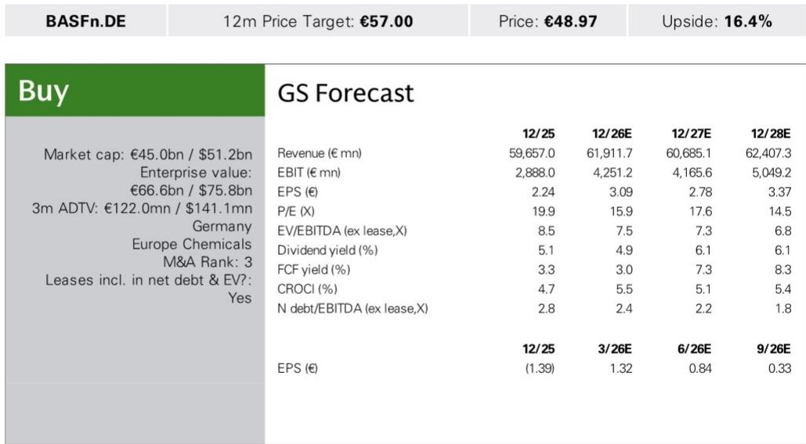
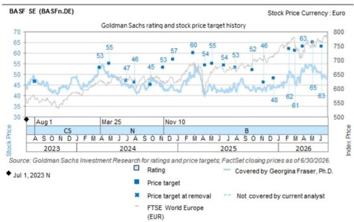

# BASF 2026年第二季度业绩观察：量增背后，现金流与成本结构成为关注焦点

BASF公布2026年第二季度调整后EBITDA为24.49亿欧元，高于市场预期18%，并超过7月15日发布的初步数据。集团销售额172亿欧元，超出预期5%，主要得益于7.3%的同比增长量（市场预期仅为2.0%）。表面上看，这些数字显示公司正处于周期性复苏阶段。但深入分析后，情况更为复杂：集团层面定价低于市场预期121个基点，现金转化率从去年同期的89%骤降至21%，且业绩超预期部分集中在利润率较低的部门和公司/其他业务板块中波动性较大的商品交易收益。市场不应将本季度视为持续增长势头的信号。季度盈利轨迹的峰值可能出现在2026年第二季度，公司自身的指引和现金流动态均指向下半年将趋于紧张。

本次财报中更重要的变化并非季度业绩超预期，而是BASF在盈利表象之下正在进行的结构性转型。员工人数自1954年以来首次降至30,000名全职员工以下，管理层已设定目标，到2029年将净现金固定成本较2024年水平降低20%。这些并非增量效率措施，而是对成本基础进行的有意重塑，以抵消欧洲化工竞争力结构性削弱的影响。与此同时，BASF已表示，相对于有机增长，无机增长的吸引力有所提升，这开启了一个新的讨论：一旦去杠杆目标达成，公司将如何运用其资产负债表。对于长期观察者而言，关键问题已不再是下一季度的量增长轨迹，而是BASF能否在收缩成本结构、重建现金转化率以及在该行业整合压力下做出审慎资金配置决策的同时，维持盈利增长。

## 量的增长真实存在，但掩盖了预示利润率压力的定价疲软

2026年第二季度业绩最显著的特点是量增长的广度和幅度。每个部门都超出了市场对量的预期，其中化学品部门实现了20.7%的同比增长（市场预期8.5%），营养与护理部门增长12.3%（市场预期1.1%）。集团量增长7.3%，是市场预期2.0%的三倍多。单看这一数据，似乎表明终端市场需求强劲且市场份额成功扩大，尤其是在此前几个季度面临严重压力的上游化学品领域。

但量的增长是有代价的。集团定价同比增长11.5%，低于市场预期的12.7%，且缺口集中在两个关键部门。材料部门定价为13.3%，而市场预期为20.7%，差距达738个基点。营养与护理部门定价为-1.7%，而市场预期为+2.3%。农业解决方案部门定价也低于市场预期391个基点。结论显而易见：BASF正在推动量增长，但其定价能力低于市场预期。这与去库存周期结束、客户重返市场的情景一致，但定价环境仍具竞争性，尤其是在中国新增产能对全球基准价格形成影响的领域。

量与定价之间的背离对利润率可持续性有直接影响。量增长最大的化学品部门，调整后EBITDA利润率仅为10.5%，低于市场预期486个基点。该部门在以往周期中利润率曾超过15%。量在恢复但利润率仍受压缩，表明盈利组合正转向价值较低的产品流。市场不应将2026年第二季度的量增长轨迹外推为广泛的利润率复苏。量的增长似乎是周期性的且可能是暂时的，而定价疲软则指向将持续存在的结构性阻力。

## 现金转化率骤降，转型成本将成为未来几个季度的新常态

2026年第二季度财报中最令人关注的数据点是现金生成能力的显著恶化。经营活动现金流从2025年第二季度的15.85亿欧元降至5.24亿欧元，导致隐含现金转化率从89%降至仅21%。自由现金流转为负值，为-1.89亿欧元，而去年同期为5.32亿欧元。这并非会自动逆转的营运资金异常现象，而是反映了将在可预见的未来对现金流产生压力的结构性变化。

现金流下降中约2亿欧元归因于与重组措施和农业解决方案部门新ERP系统相关的转型支出。这并非一次性项目。BASF正处于多年成本重组计划的早期阶段，该计划需要在实现2029年净现金固定成本降低20%的目标之前进行前期现金支出。应收账款和库存的增加也吸收了现金，这在量快速增长时是典型现象，但积累的幅度超出预期。管理层已表示，全年盈利增长和资本支出下降应能抵消营运资金积累，但2026年第二季度的数据表明，现金转化率的恢复充其量将在下半年实现。

对于以自由现金流回报表现评估BASF的观察者而言，2026年第二季度业绩是一个现实检验。该公司2026年自由现金流回报表现目前估计为3.0%，对于一家正在进行重组的周期性化工公司而言，这一水平较低。全年自由现金流15亿至23亿欧元的指引区间意味着下半年将有所恢复，但容错空间很小。如果营运资金继续以2026年第二季度的速度吸收现金，或者转型成本上升，自由现金流结果可能低于市场预期的23亿欧元。市场的关注点应从EBITDA超预期转向现金流轨迹，因为现金生成能力将决定BASF去杠杆以及最终向股东返还资金的能力。

## 盈利超预期质量低于表面所示，下半年面临阻力

对2026年第二季度EBITDA超预期部分进行分解，发现其中很大一部分来自质量较低的来源。公司/其他部门实现了8000万欧元的EBITDA，而市场预期为-1.42亿欧元——这一2.22亿欧元的波动是由强劲的商品交易业绩推动的。剔除该部门后，超预期幅度显著收窄。材料部门超预期28.4%，工业解决方案部门超预期28.8%，这两者均为真正的运营超预期。但化学品部门（在上游组合中盈利权重最高）EBITDA低于市场预期26.1%，表面技术部门低于预期36.8%。

盈利质量之所以重要，是因为它影响超预期的可持续性。商品交易收益本质上具有波动性，不能依赖其支撑未来季度。材料部门的超预期虽然令人印象深刻，但其定价显著低于预期，表明驱动因素是量驱动的成本吸收而非定价能力。农业解决方案部门EBITDA超预期16.1%，但该部门具有高度季节性，第一季度通常占全年盈利的较大比例。2026年第二季度农业解决方案部门EBITDA为4.48亿欧元，不到2026年第一季度11.02亿欧元的一半，这符合正常的季节性规律，但也意味着该部门在下半年不太可能以相同幅度再次超预期。

更广泛的宏观背景强化了谨慎态度。欧洲化工需求仍受到德国工业生产疲软、相对于全球同行的能源成本高企以及来自中国生产商的持续竞争压力的制约。2026年下半年，某些终端市场（尤其是汽车和建筑行业，它们是BASF材料部门和表面技术部门的关键终端市场）可能会出现去库存。公司自身的EBITDA指引区间为69亿至77亿欧元，这意味着下半年的运行速率低于2026年第二季度的年化速度。市场应预期下半年盈利将出现环比放缓，2026年第二季度的超预期不应被解读为盈利上调周期的开始。

## 评估BASF转型阶段的决策框架

对于试图在当前水平评估BASF风险回报特征的观察者而言，2026年第二季度业绩提供了一个清晰的框架，包含三个必须依次通过的关卡，才能使该公司的研究逻辑具有吸引力。

第一关是现金流恢复。BASF必须在2026年下半年证明，2026年第二季度21%的现金转化率是一个低谷，且经营活动现金流能够持续恢复到至少60-70%的转化率。这要求转型支出稳定在或低于每季度2亿欧元的水平，营运资金增长随着量增长正常化而放缓，以及资本支出继续从2026年第二季度的7.13亿欧元水平下降。如果2026年全年自由现金流低于15亿欧元，去杠杆时间表将延长，未来并购或股息增长的资产负债表灵活性将受到限制。

第二关是化学品部门的利润率可持续性。该部门是BASF上游竞争力的风向标。2026年第二季度10.5%的EBITDA利润率低于市场预期486个基点，表明该部门的恢复速度并不像量数据所显示的那样迅速。观察者应关注化学品部门利润率能否在下半年回升至12-15%的区间，这将表明定价能力正在恢复。如果利润率仍低于11%，则将确认欧洲基础化学品的竞争格局已发生结构性恶化，这将对整个集团的盈利潜力产生负面影响。

第三关是资金配置纪律。BASF已表示，相对于有机增长，无机增长的吸引力有所提升，这明确表明一旦去杠杆目标达成，并购将被提上议程。截至2026年第二季度末，公司净债务与EBITDA比率为2.4倍，低于2025年末的2.8倍，但仍高于1.5-2.0倍的范围，该范围才能提供充分的战略灵活性。观察者应评估任何未来并购是否符合价值创造框架——即是否增强了公司在高利润率下游领域（如农业解决方案和营养与护理）的竞争地位，或者是否有可能重蹈过去整合面临结构性阻力的欧洲大宗商品资产的错误。管理层在电话会议上关于并购标准的评论基调将比任何单一盈利数据点更为重要。

## 结构性成本削减是利润率扩张最可信的路径，但执行风险较高

2026年第二季度财报中战略意义最重大的要素是BASF成本削减目标的量化。CoreShift目标——到2029年净现金固定成本较2024年降低20%——是一项超越典型重组计划的意图声明。它表明BASF不仅是在适应当前周期，而是在重新定位其成本基础，以适应一个永久性需求较低、成本较高的欧洲运营环境。员工人数70多年来首次降至30,000人以下，这证明该计划正在执行，而不仅仅是宣布。

该目标的规模值得关注。从2024年基数算起，五年内净现金固定成本降低20%，意味着如果量保持稳定，年化节省将显著提升EBITDA利润率。但执行风险同样巨大。如此规模的重组需要前期现金支出（如2026年第二季度现金流数据所示），并存在关键部门运营中断的风险。农业解决方案部门的新ERP系统是一个特别值得关注的执行风险来源，因为化工行业的大规模IT转型历史上曾导致暂时性效率低下和客户服务中断。观察者应监控季度重组支出以及任何关于实施时间表的评论。如果成本节省按计划实现，BASF在正常化量环境下的盈利潜力将显著高于当前市场预期。但现金流压力将首先出现，而回报最早要到2027年才能显现。

## 市场的谨慎是理性的，情绪只有在交易评论好于预期时才会转变

随着地缘政治紧张局势加剧以及欧洲工业前景恶化，市场对BASF的情绪已变得日益谨慎。2026年第二季度业绩虽然在EBITDA总体数字上超出预期，但并未提供改变这种谨慎立场的催化剂。盈利质量参差不齐，现金流疲弱，指引暗示下半年将放缓。市场认为季度增长势头峰值出现在2026年第二季度的看法可能是正确的，未来几个季度出现去库存和利润率压缩是合理的情景。

任何情绪变化都需要管理层在电话会议上提供好于预期的当前交易评论。具体而言，市场需要听到订单簿在第三季度依然强劲，材料和化学品部门的定价正在企稳，以及现金流恢复进展顺利。如果没有此类评论，该公司的报价可能会在区间内波动，因为市场正在消化财报中喜忧参半的信号。对该公司的评估将取决于成本削减计划的执行情况以及宏观环境不再进一步恶化。目前，证据支持对该报价持谨慎态度，转型故事提供了长期逻辑，但近期盈利和现金流轨迹提供的确定性有限。

*仅供参考。部分内容可能基于源材料通过AI辅助生成、翻译、摘要或编辑，可能存在遗漏或错误。请独立核实。本文不构成专业建议。*

仅供参考。部分内容可能基于源材料通过AI辅助生成、翻译、摘要或编辑，可能存在遗漏或错误。请独立核实。本文不构成专业建议。

