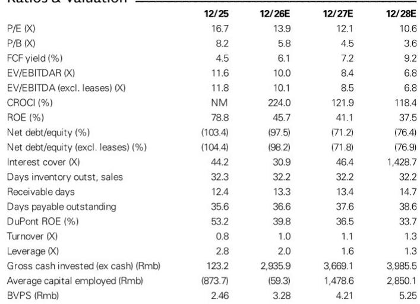
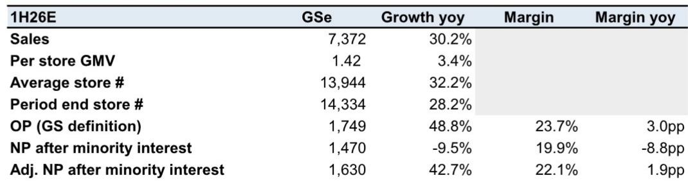
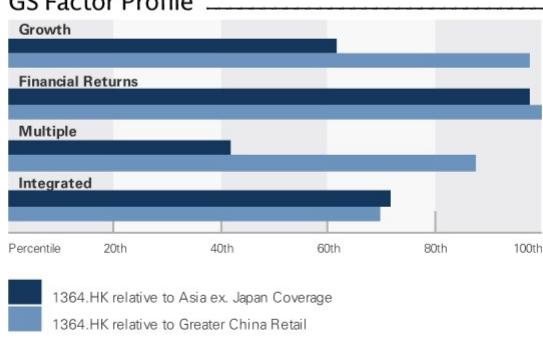

# GS：古茗控股业务与近期数据观察

古茗控股（1364.HK）预计在8月下旬披露2026年上半年业绩。GS在最新报告中预测，公司上半年营收同比增长30%，调整后核心净利润同比增长43%，分别达到73.72亿元和16.30亿元。但报告同时将2026至2028年调整后核心净利润预测下调6%至13%，主要原因是开店节奏变化——2026年净新增门店预期从3600家降至2000家，叠加配送补贴正常化速度快于预期、可转债融资成本上升以及有效税率小幅提高。

自2026年第二季度以来，古茗报价已回调19%，当前交易在13倍2026年预期市盈率，而GS预计公司2026年调整后核心净利润同比增长17%。报告认为，市场已部分反映了开店节奏变化与同店销售短期承压的预期。GS更新公司观点，对应20倍2026年预期市盈率。

## 1. 门店扩张空间仍存，但节奏从数量转向质量

报告指出，虽然加盟商意愿减弱和公司自身对门店质量的优先考量导致短期开店节奏变化，但古茗的门店网络仍远小于蜜雪冰城和瑞幸咖啡，扩张空间依然可观。2026年上半年净新增门店预计为780家，期末门店总数达到14,334家，同比增长28.2%。GS认为，公司正在从追求开店数量转向提升单店质量，这一策略调整可能在中长期支撑更健康的同店销售表现。

> **KC评论：** 开店节奏变化并不等同于增长故事结束。古茗的门店密度仍低于头部竞品，关键在于公司能否通过品类扩展和产品差异化维持单店效率，而非单纯依靠门店数量驱动收入增长。

## 2. 同店销售承压但利润率改善，运营杠杆持续释放

GS预计2026年全年单店GMV同比下降2%，主要受去年高基数影响。但2026年上半年单店GMV预计同比增长3.4%，部分受益于配送渠道占比提升和品类扩展。利润率方面，报告预计2026年上半年毛利率为33%，同比扩张1.6个百分点；运营利润率同比扩张1.9个百分点（若采用毛利率减SG&A口径则扩张3个百分点）。运营杠杆效应正在显现，SG&A费用率同比有所下降，但部分被外汇损失增加所抵消。

## 3. 品类扩展与产品创新成为同店销售支撑因素

报告特别关注古茗在品类扩展方面的进展，包括咖啡销售占比和早餐业务的推进。这些新品类不仅有助于提升客单价，还能在竞争激烈的茶饮市场中创造差异化。GS认为，品类扩展、差异化新品以及对门店质量的持续关注，将支撑同店销售在去年高基数下保持韧性。读者在业绩发布时应重点关注：近期同店销售表现及下半年展望、品类扩展进展（包括咖啡和早餐的销售占比）、门店网络扩张策略、竞争格局变化以及股东回报计划。

## 4. 可复用观察框架：如何评估连锁消费品牌的开店节奏变化

这份报告提供了一个可复用的分析框架：当连锁品牌主动调整开店节奏时，需要同时观察三个维度——存量门店的同店销售趋势、新品类对客单价和复购率的拉动效果、以及运营杠杆是否持续释放。如果开店节奏变化的同时同店销售企稳、利润率改善，那么这种节奏变化可能是健康的战略调整；反之，如果同店销售持续下滑且利润率承压，则需重新评估品牌的市场定位和竞争壁垒。古茗当前的情况偏向前者，但下半年同店销售能否在低基数下企稳，仍是关键验证节点。

For informational purposes only. Portions may be generated,translated,summarized,or edited with AI assistance based on source materials and may contain omissions or errors. Please verify independently. This is not investment,legal,tax,accounting,or other professional advice.

For informational purposes only. Portions may be generated,translated,summarized,or edited with AI assistance based on source materials and may contain omissions or errors. Please verify independently. This is not investment,legal,tax,accounting,or other professional advice.

