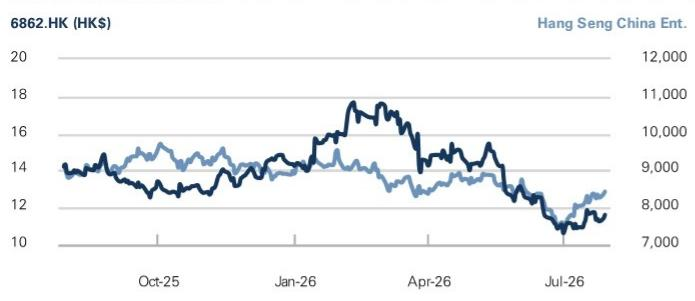

# Haidilao International Holding (6862.HK)

1H26 preview: Expect slower core business recovery while fast growing new business to dilute margins; Neutral

6862.HK

12m Price Target: HK\$12.20

Price: HK\$11.62

Upside: $5.0\%$

Haidilao is expected to release its 1H26 results in late Aug. We expect +8.0%/+5.0% yoy sales/reported NP growth to Rmb 22,355mn/1,847mn in 1H26. We lower our 1H26 forecasts to reflect: 1) lower growth of table turn growth in 1H26 at c.2% and ASP moderation of c.1% (vs our previous assumption of c.3% sales per store growth); 2) slower store expansion on the back of more store closures in 1H26; 3) lower NPM due to lower other gains reflecting potentially less gain from franchise business transfer and loss on foreign exchange while largely stable OPM. For FY26, we reduce revenue forecast by 2.6%, as we expect sales per store forecast to decline from c.+3% to c.-0.5% yoy for the core business considering the slower recovery in 1H26, fluid consumption/weather condition, and higher base especially into 4Q26. Although net store expansion has progressed more slowly than expected in 1H26, we assume openings to accelerate and closures to moderate in 2H26, leaving our end-2026 store count forecast broadly unchanged. We also lower NPM forecast given more margin dilution from new businesses, and lower other gains.

Into results, we expect investors to focus on: 1) Recent core business SSSG performance and 2H26 outlook in terms of both table turn and pricing strategy; 2) Core brand's store expansion strategy; 3) Updates on new business, including any operational bright spots and scaling plans; 4) Mid-term margin recovery trajectory; 5) Shareholder returns and capital allocation.

We view the recovery of Haidilao's core business will take longer than previously expected, while fast-growing new businesses will continue to dilute group margins before reaching meaningful scale. That said, we believe the company's attractive shareholder returns and Founder's share purchase should provide downside support for the share price. Overall, we lower our FY26-28E revenue forecasts by 2-4% and reported net profit forecasts by 7-15%, while we maintain payout ratio assumption at

## NEUTRAL

Michelle Cheng
+852-2978-6631 | michelle.cheng@gs.com
GS (Asia) L.L.C.

Xinyu Ruan
+852-2978-7347 | xinyu.ruan@gs.com
GS (Asia) L.L.C.

Molly Dai
+852-3966-4000 | molly.dai@gs.com
GS (Asia) L.L.C.

## Key Data

Market cap: HK\$64.8bn / \$8.3bn  
Enterprise value: HK\$58.6bn / \$7.5bn  
3m ADTV: HK\$198.9mn / \$25.4mn  
China  
Greater China Retail  
M&A Rank: 3  
Leases incl. in net debt & EV?: Yes

GS Forecast

<table><tr><td></td><td>12/25</td><td>12/26E</td><td>12/27E</td><td>12/28E</td></tr><tr><td>Revenue (Rmb mn) New</td><td>43,225.4</td><td>45,658.3</td><td>48,102.2</td><td>50,662.2</td></tr><tr><td>Revenue (Rmb mn) Old</td><td>43,225.4</td><td>46,888.0</td><td>49,859.3</td><td>52,672.6</td></tr><tr><td>EBITDA (Rmb mn)</td><td>7,162.6</td><td>7,046.0</td><td>6,995.9</td><td>7,379.3</td></tr><tr><td>EPS (Rmb) New</td><td>0.75</td><td>0.72</td><td>0.74</td><td>0.76</td></tr><tr><td>EPS (Rmb) Old</td><td>0.75</td><td>0.78</td><td>0.84</td><td>0.89</td></tr><tr><td>P/E (X)</td><td>18.3</td><td>13.9</td><td>13.6</td><td>13.2</td></tr><tr><td>P/B (X)</td><td>7.6</td><td>5.3</td><td>5.1</td><td>4.8</td></tr><tr><td>Dividend yield (%)</td><td>4.8</td><td>6.3</td><td>6.5</td><td>6.7</td></tr><tr><td>CROCI (%)</td><td>16.1</td><td>21.0</td><td>29.6</td><td>28.9</td></tr><tr><td></td><td>6/25</td><td>12/25</td><td>6/26E</td><td>12/26E</td></tr><tr><td>EPS (Rmb)</td><td>0.32</td><td>0.42</td><td>0.34</td><td>0.39</td></tr></table>

GS Factor Profile

  
Source: Company data, GS estimates. See disclosures for details.

# Haidilao International Holding (6862.HK)

Rating since Jun 27, 2024  
Ratios & Valuation

<table><tr><td></td><td>12/25</td><td>12/26E</td><td>12/27E</td><td>12/28E</td></tr><tr><td>P/E (X)</td><td>18.3</td><td>13.9</td><td>13.6</td><td>13.2</td></tr><tr><td>P/B (X)</td><td>7.6</td><td>5.3</td><td>5.1</td><td>4.8</td></tr><tr><td>FCF yield (%)</td><td>4.4</td><td>5.7</td><td>6.3</td><td>6.3</td></tr><tr><td>EV/EBITDAR (X)</td><td>9.6</td><td>7.2</td><td>7.2</td><td>6.9</td></tr><tr><td>EV/EBITDA (excl. leases) (X)</td><td>10.4</td><td>7.8</td><td>7.9</td><td>7.5</td></tr><tr><td>CROCI (%)</td><td>16.1</td><td>21.0</td><td>29.6</td><td>28.9</td></tr><tr><td>ROE (%)</td><td>39.6</td><td>39.2</td><td>38.2</td><td>37.5</td></tr><tr><td>Net debt/equity (%)</td><td>(55.4)</td><td>(50.9)</td><td>(48.5)</td><td>(45.7)</td></tr><tr><td>Net debt/equity (excl. leases) (%)</td><td>(90.5)</td><td>(78.3)</td><td>(74.7)</td><td>(70.9)</td></tr><tr><td>Interest cover (X)</td><td>91.9</td><td>94.9</td><td>95.8</td><td>99.2</td></tr><tr><td>Days inventory outst, sales</td><td>9.0</td><td>9.2</td><td>9.2</td><td>9.2</td></tr><tr><td>Receivable days</td><td>12.8</td><td>12.7</td><td>12.7</td><td>12.7</td></tr><tr><td>Days payable outstanding</td><td>85.9</td><td>85.3</td><td>86.2</td><td>86.1</td></tr><tr><td>DuPont ROE (%)</td><td>40.5</td><td>38.4</td><td>37.4</td><td>36.7</td></tr><tr><td>Turnover (X)</td><td>2.0</td><td>2.0</td><td>2.1</td><td>2.1</td></tr><tr><td>Leverage (X)</td><td>2.2</td><td>2.1</td><td>2.1</td><td>2.1</td></tr><tr><td>Gross cash invested (ex cash) (Rmb)</td><td>35,829.2</td><td>18,800.3</td><td>20,298.3</td><td>22,050.7</td></tr><tr><td>Average capital employed (Rmb)</td><td>4,046.4</td><td>5,148.2</td><td>6,059.1</td><td>6,606.9</td></tr><tr><td>BVPS (Rmb)</td><td>1.80</td><td>1.88</td><td>1.97</td><td>2.08</td></tr></table>

Growth & Margins (%)

<table><tr><td colspan="5">Growth &amp; Margins (%)</td></tr><tr><td></td><td>12/25</td><td>12/26E</td><td>12/27E</td><td>12/28E</td></tr><tr><td>Total revenue growth</td><td>1.1</td><td>5.6</td><td>5.4</td><td>5.3</td></tr><tr><td>EBITDA growth</td><td>(14.9)</td><td>(1.6)</td><td>(0.7)</td><td>5.5</td></tr><tr><td>EPS growth</td><td>(14.0)</td><td>(3.7)</td><td>2.2</td><td>3.3</td></tr><tr><td>DPS growth</td><td>(20.3)</td><td>(3.7)</td><td>2.2</td><td>3.3</td></tr><tr><td>EBIT margin</td><td>11.5</td><td>11.2</td><td>10.7</td><td>10.5</td></tr><tr><td>EBITDA margin</td><td>16.6</td><td>15.4</td><td>14.5</td><td>14.6</td></tr><tr><td>Net income margin</td><td>9.4</td><td>8.8</td><td>8.5</td><td>8.4</td></tr></table>

Price Performance  

<table><tr><td></td><td>3m</td><td>6m</td><td>12m</td></tr><tr><td>Absolute</td><td>(17.1)%</td><td>(25.1)%</td><td>(19.1)%</td></tr><tr><td>Rel. to the Hang Seng China Ent.</td><td>(15.0)%</td><td>(15.6)%</td><td>(12.0)%</td></tr></table>

Source: FactSet. Price as of 28 Jul 2026 close.

Income Statement (Rmb mn)

<table><tr><td></td><td>12/25</td><td>12/26E</td><td>12/27E</td><td>12/28E</td></tr><tr><td>Total revenue</td><td>43,225.4</td><td>45,658.3</td><td>48,102.2</td><td>50,662.2</td></tr><tr><td>Cost of goods sold</td><td>(17,526.2)</td><td>(18,786.6)</td><td>(19,792.2)</td><td>(20,693.5)</td></tr><tr><td>SG&amp;A</td><td>(6,645.6)</td><td>(6,792.6)</td><td>(6,874.9)</td><td>(7,288.9)</td></tr><tr><td>R&amp;D</td><td>-</td><td>-</td><td>-</td><td>-</td></tr><tr><td>Other operating inc./(exp.)</td><td>-</td><td>-</td><td>-</td><td>-</td></tr><tr><td>EBITDA</td><td>7,162.6</td><td>7,046.0</td><td>6,995.9</td><td>7,379.3</td></tr><tr><td>Depreciation &amp; amortization</td><td>(2,182.1)</td><td>(1,935.5)</td><td>(1,840.1)</td><td>(2,043.6)</td></tr><tr><td>EBIT</td><td>4,980.6</td><td>5,110.5</td><td>5,155.9</td><td>5,335.7</td></tr><tr><td>Net interest inc./(exp.)</td><td>21.8</td><td>19.6</td><td>(11.2)</td><td>(11.9)</td></tr><tr><td>Income/(loss) from associates</td><td>49.3</td><td>54.3</td><td>59.7</td><td>65.7</td></tr><tr><td>Pre-tax profit</td><td>5,811.7</td><td>5,567.2</td><td>5,687.9</td><td>5,875.6</td></tr><tr><td>Provision for taxes</td><td>(1,769.8)</td><td>(1,558.8)</td><td>(1,592.6)</td><td>(1,645.2)</td></tr><tr><td>Minority interest</td><td>7.9</td><td>8.1</td><td>8.1</td><td>8.4</td></tr><tr><td>Preferred dividends</td><td>-</td><td>-</td><td>-</td><td>-</td></tr><tr><td>Net inc. (pre-exceptionals)</td><td>4,049.8</td><td>4,016.5</td><td>4,103.4</td><td>4,238.8</td></tr><tr><td>Post-tax exceptionals</td><td>-</td><td>-</td><td>-</td><td>-</td></tr><tr><td>Net inc. (post-exceptionals)</td><td>4,049.8</td><td>4,016.5</td><td>4,103.4</td><td>4,238.8</td></tr><tr><td>EPS (basic, pre-except) (Rmb)</td><td>0.75</td><td>0.72</td><td>0.74</td><td>0.76</td></tr><tr><td>EPS (diluted, pre-except) (Rmb)</td><td>0.75</td><td>0.72</td><td>0.74</td><td>0.76</td></tr><tr><td>EPS (basic, post-except) (Rmb)</td><td>0.75</td><td>0.72</td><td>0.74</td><td>0.76</td></tr><tr><td>EPS (diluted, post-except) (Rmb)</td><td>0.75</td><td>0.72</td><td>0.74</td><td>0.76</td></tr><tr><td>DPS (Rmb)</td><td>0.66</td><td>0.63</td><td>0.65</td><td>0.67</td></tr><tr><td>Div. payout ratio (%)</td><td>87.9</td><td>87.9</td><td>87.9</td><td>87.9</td></tr></table>

Balance Sheet (Rmb mn)

<table><tr><td></td><td>12/25</td><td>12/26E</td><td>12/27E</td><td>12/28E</td></tr><tr><td>Cash &amp; cash equivalents</td><td>7,942.1</td><td>7,075.7</td><td>7,094.2</td><td>7,069.1</td></tr><tr><td>Accounts receivable</td><td>1,503.7</td><td>1,672.9</td><td>1,673.7</td><td>1,851.0</td></tr><tr><td>Inventory</td><td>1,076.9</td><td>1,231.8</td><td>1,200.5</td><td>1,342.6</td></tr><tr><td>Other current assets</td><td>1,904.6</td><td>1,904.6</td><td>1,904.6</td><td>1,904.6</td></tr><tr><td>Total current assets</td><td>12,427.3</td><td>11,885.0</td><td>11,872.9</td><td>12,167.2</td></tr><tr><td>Net PP&amp;E</td><td>6,379.0</td><td>7,092.1</td><td>7,778.3</td><td>8,265.1</td></tr><tr><td>Net intangibles</td><td>49.3</td><td>49.3</td><td>49.3</td><td>49.3</td></tr><tr><td>Total investments</td><td>173.1</td><td>173.1</td><td>173.1</td><td>173.1</td></tr><tr><td>Other long-term assets</td><td>3,061.6</td><td>3,077.4</td><td>3,105.9</td><td>3,142.6</td></tr><tr><td>Total assets</td><td>22,090.2</td><td>22,276.9</td><td>22,979.5</td><td>23,797.3</td></tr><tr><td>Accounts payable</td><td>4,208.2</td><td>4,573.0</td><td>4,780.8</td><td>4,983.5</td></tr><tr><td>Short-term debt</td><td>2,428.1</td><td>2,428.1</td><td>2,428.1</td><td>2,428.1</td></tr><tr><td>Short-term lease liabilities</td><td>856.8</td><td>856.8</td><td>860.5</td><td>867.9</td></tr><tr><td>Other current liabilities</td><td>1,830.9</td><td>1,841.6</td><td>1,798.2</td><td>1,825.2</td></tr><tr><td>Total current liabilities</td><td>9,324.0</td><td>9,699.5</td><td>9,867.6</td><td>10,104.7</td></tr><tr><td>Long-term debt</td><td>0.0</td><td>0.0</td><td>0.0</td><td>-</td></tr><tr><td>Long-term lease liabilities</td><td>2,649.7</td><td>2,013.0</td><td>2,021.7</td><td>2,039.0</td></tr><tr><td>Other long-term liabilities</td><td>111.4</td><td>111.4</td><td>111.4</td><td>111.4</td></tr><tr><td>Total long-term liabilities</td><td>2,761.1</td><td>2,124.4</td><td>2,133.1</td><td>2,150.4</td></tr><tr><td>Total liabilities</td><td>12,085.1</td><td>11,823.8</td><td>12,000.7</td><td>12,255.1</td></tr><tr><td>Preferred shares</td><td>-</td><td>-</td><td>-</td><td>-</td></tr><tr><td>Total common equity</td><td>10,013.9</td><td>10,469.9</td><td>11,003.9</td><td>11,575.6</td></tr><tr><td>Minority interest</td><td>(8.8)</td><td>(16.9)</td><td>(25.0)</td><td>(33.4)</td></tr><tr><td>Total liabilities &amp; equity</td><td>22,090.2</td><td>22,276.9</td><td>22,979.5</td><td>23,797.3</td></tr><tr><td>Net debt, adjusted</td><td>(6,853.9)</td><td>(5,987.4)</td><td>(6,005.9)</td><td>(5,980.8)</td></tr></table>

Cash Flow (Rmb mn)

<table><tr><td colspan="5">Cash Flow (Rmb mn)</td></tr><tr><td></td><td>12/25</td><td>12/26E</td><td>12/27E</td><td>12/28E</td></tr><tr><td>Net income</td><td>4,049.8</td><td>4,016.5</td><td>4,103.4</td><td>4,238.8</td></tr><tr><td>D&amp;A add-back</td><td>2,182.1</td><td>1,935.5</td><td>1,840.1</td><td>2,043.6</td></tr><tr><td>Minority interest add-back</td><td>(7.9)</td><td>(8.1)</td><td>(8.1)</td><td>(8.4)</td></tr><tr><td>Net (inc)/dec working capital</td><td>77.8</td><td>40.7</td><td>238.4</td><td>(116.7)</td></tr><tr><td>Other operating cash flow</td><td>(637.6)</td><td>(188.1)</td><td>(158.9)</td><td>(158.7)</td></tr><tr><td>Cash flow from operations</td><td>5,664.2</td><td>5,796.5</td><td>6,014.9</td><td>5,998.6</td></tr><tr><td>Capital expenditures</td><td>(1,672.6)</td><td>(1,836.5)</td><td>(1,680.5)</td><td>(1,638.0)</td></tr><tr><td>Acquisitions</td><td>-</td><td>-</td><td>-</td><td>-</td></tr><tr><td>Divestitures</td><td>-</td><td>-</td><td>-</td><td>-</td></tr><tr><td>Others</td><td>226.1</td><td>(445.5)</td><td>146.4</td><td>133.9</td></tr><tr><td>Cash flow from investing</td><td>(1,446.5)</td><td>(2,281.9)</td><td>(1,534.1)</td><td>(1,504.1)</td></tr><tr><td>Repayment of lease liabilities</td><td>(742.7)</td><td>(789.7)</td><td>(808.8)</td><td>(838.1)</td></tr><tr><td>Dividends paid (common &amp; pref)</td><td>(4,133.3)</td><td>(3,560.5)</td><td>(3,569.4)</td><td>(3,667.1)</td></tr><tr><td>Inc/(dec) in debt</td><td>302.0</td><td>(30.8)</td><td>(84.1)</td><td>(14.4)</td></tr><tr><td>Other financing cash flows</td><td>(516.1)</td><td>0.0</td><td>0.0</td><td>0.0</td></tr><tr><td>Cash flow from financing</td><td>(5,090.2)</td><td>(4,381.0)</td><td>(4,462.3)</td><td>(4,519.6)</td></tr><tr><td>Total cash flow</td><td>(872.5)</td><td>(866.5)</td><td>18.5</td><td>(25.1)</td></tr><tr><td>Free cash flow</td><td>3,248.9</td><td>3,170.4</td><td>3,525.6</td><td>3,522.5</td></tr></table>

Source: Company data, GS estimates.

c.88% for FY26-28E, implying MSD-HSD% dividend yield. We maintain Neutral while lowering our target price to HK\$12.2 (from HK\$14.3), based on 9x EV/EBITDA (vs. 10x previously), reflecting weaker consumer sentiment and our reduced earnings outlook.

Relevant reports:

China Restaurants: Monthly Tracker: Jun update: weakness continued with weather headwind; FMD relatively resilient despite high base

## Earnings forecasts

Sales: We expect 1H26 revenue to grow by c.8% YoY, driven by growth in delivery and other restaurant businesses, alongside steady table-turn improvement (c.2% on average in 1H26 based on our monthly tracker). This should be partially offset by store closures impact and c.1% decline in ASP based on our estimation. For FY26, we expect revenue to increase modestly by c.1% YoY, as we now project sales per store to decline c.0.5% YoY, given demand recovery remains slow and as base becomes more challenging in 2H26.

Margin: We expect NPM to modestly decline yoy in 1H26, due to savings from staff costs and depreciation expenses with efforts seen in 2H25, offset by GPM headwinds, higher expense ratios associated with new business expansion, and lower other gains. For FY26, we also expect NPM to decline slightly considering greater contribution from lower-margin new businesses, higher foreign-exchange losses, and fewer gains from franchise business transfers.

Exhibit 1: Earnings revisions

<table><tr><td rowspan="2"></td><td colspan="3">2026E</td><td colspan="3">2027E</td><td colspan="3">2028E</td></tr><tr><td>New</td><td>Old</td><td>Change</td><td>New</td><td>Old</td><td>Change</td><td>New</td><td>Old</td><td>Change</td></tr><tr><td>Total Revenue</td><td>45,658</td><td>46,888</td><td>-2.6%</td><td>48,102</td><td>49,859</td><td>-3.5%</td><td>50,662</td><td>52,673</td><td>-3.8%</td></tr><tr><td>Raw materials and consumables used</td><td>(18,787)</td><td>(19,621)</td><td>-4.3%</td><td>(19,792)</td><td>(20,692)</td><td>-4.3%</td><td>(20,694)</td><td>(21,596)</td><td>-4.2%</td></tr><tr><td>Staff costs</td><td>(14,969)</td><td>(14,909)</td><td>0.4%</td><td>(16,279)</td><td>(16,045)</td><td>1.5%</td><td>(17,344)</td><td>(17,235)</td><td>0.6%</td></tr><tr><td>Property rentals and related expenses</td><td>(1,226)</td><td>(1,246)</td><td>-1.7%</td><td>(1,258)</td><td>(1,289)</td><td>-2.4%</td><td>(1,304)</td><td>(1,331)</td><td>-2.0%</td></tr><tr><td>Utilities expenses</td><td>(1,559)</td><td>(1,601)</td><td>-2.6%</td><td>(1,642)</td><td>(1,702)</td><td>-3.5%</td><td>(1,729)</td><td>(1,798)</td><td>-3.8%</td></tr><tr><td>Depreciation and amortization</td><td>(1,146)</td><td>(1,253)</td><td>-8.5%</td><td>(1,031)</td><td>(1,199)</td><td>-14.0%</td><td>(1,206)</td><td>(1,347)</td><td>-10.5%</td></tr><tr><td>Travelling and related expenses</td><td>(306)</td><td>(314)</td><td>-2.6%</td><td>(322)</td><td>(334)</td><td>-3.5%</td><td>(339)</td><td>(353)</td><td>-3.8%</td></tr><tr><td>Other expense</td><td>(2,557)</td><td>(2,462)</td><td>3.8%</td><td>(2,622)</td><td>(2,544)</td><td>3.1%</td><td>(2,710)</td><td>(2,635)</td><td>2.9%</td></tr><tr><td>Operating Profit</td><td>5,111</td><td>5,482</td><td>-6.8%</td><td>5,156</td><td>6,055</td><td>-14.8%</td><td>5,336</td><td>6,378</td><td>-16.3%</td></tr><tr><td>Adjusted EBITDA</td><td>6,099</td><td>6,576</td><td>-7.3%</td><td>6,029</td><td>7,094</td><td>-15.0%</td><td>6,381</td><td>7,563</td><td>-15.6%</td></tr><tr><td>Pre-Tax Profit - Reported</td><td>5,567</td><td>6,082</td><td>-8.5%</td><td>5,688</td><td>6,612</td><td>-14.0%</td><td>5,876</td><td>6,952</td><td>-15.5%</td></tr><tr><td>Income Tax Expense</td><td>(1,559)</td><td>(1,764)</td><td>-11.6%</td><td>(1,593)</td><td>(1,917)</td><td>-16.9%</td><td>(1,645)</td><td>(2,016)</td><td>-18.4%</td></tr><tr><td>Net Income - Reported</td><td>4,016</td><td>4,327</td><td>-7.2%</td><td>4,103</td><td>4,704</td><td>-12.8%</td><td>4,239</td><td>4,945</td><td>-14.3%</td></tr><tr><td>Net Income - Recurring (GS defined)</td><td>3,943</td><td>4,115</td><td>-4.2%</td><td>3,930</td><td>4,530</td><td>-13.3%</td><td>4,065</td><td>4,772</td><td>-14.8%</td></tr><tr><td colspan="10">YoY %</td></tr><tr><td>Revenue</td><td>5.6%</td><td>8.5%</td><td>-2.8ppt</td><td>5.4%</td><td>6.3%</td><td>-1.0ppt</td><td>5.3%</td><td>5.6%</td><td>-0.3ppt</td></tr><tr><td>Raw materials and consumables used</td><td>7.2%</td><td>12.0%</td><td>-4.8ppt</td><td>5.4%</td><td>5.5%</td><td>-0.1ppt</td><td>4.6%</td><td>4.4%</td><td>0.2ppt</td></tr><tr><td>Staff costs</td><td>6.4%</td><td>5.9%</td><td>0.4
