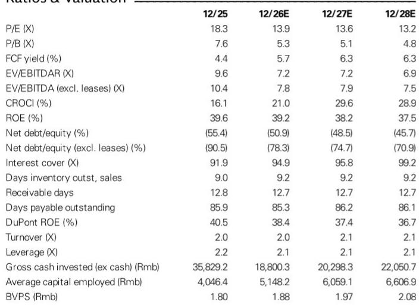
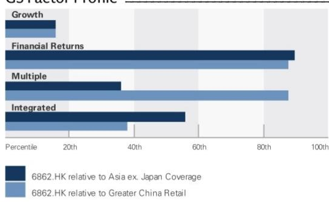
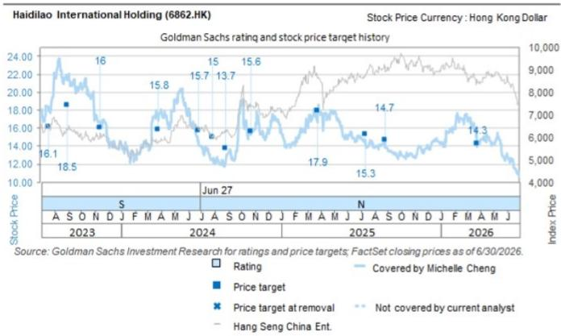

# GS：海底捞业务与近期数据观察

GS在1H26业绩预览中下调了海底捞的收入和利润预测，核心判断是：核心品牌同店销售的恢复将比此前预期更慢，而快速成长的新业务在达到可观规模前将持续稀释集团利润率。报告将FY26-28E收入预测下调2-4%，净利润预测下调7-15%。

这份报告的核心矛盾在于：海底捞正在经历一个“旧引擎减速、新引擎尚未成型”的过渡期。一方面，核心火锅业务的翻台率增长节奏变化至约2%，客单价出现约1%的下滑，门店扩张速度慢于预期，上半年甚至出现更多关店。另一方面，外卖和其他餐饮业务虽然增长较快，但利润率低于核心业务，且需要时间才能达到足以影响集团整体盈利的规模。

> **KC评论：** 报告中最值得关注的数字是2026年全年单店收入从之前预期的同比增长约3%下调至同比下滑约0.5%。这个变化意味着海底捞核心业务的增长逻辑正在从“量价齐升”转向“量稳价降”，而新业务尚不能弥补这个缺口。

## 1. 1H26预期：收入增长8%但利润率承压

GS预计海底捞1H26收入同比增长约8%至223.55亿元，但净利润增速仅为5%至18.47亿元。收入增长的主要驱动力来自外卖和其他餐饮业务，以及翻台率约2%的温和改善。但客单价约1%的下滑、门店关闭的影响、以及新业务扩张带来的费用率上升，共同对利润率形成不确定性。

报告特别指出，1H26的其他收益可能减少，原因包括特许经营权转让收益减少和外汇损失。这意味着海底捞过去几年通过品牌授权和门店调整获得的一次性收益正在消退，利润结构将更多依赖经营性业务的真实盈利能力。

## 2. 全年展望：单店收入转负，利润率持续稀释

对于2026年全年，GS将收入预测下调2.6%至456.58亿元，核心调整在于单店收入从同比增长约3%下调至同比下滑约0.5%。报告认为，消费复苏缓慢、天气因素影响、以及4Q26的高基数效应，将使下半年经营环境更具挑战性。

利润率方面，报告预计全年净利率将从2025年的9.4%降至8.8%。新业务（如外卖、其他餐饮品牌）的贡献增加是主要稀释因素——这些业务的毛利率和经营利润率均低于核心火锅业务。此外，员工成本和折旧费用的节省部分被原材料成本不确定性、新业务费用率上升所抵消。

## 3. 读者关注焦点：五个关键变量

报告列出了读者在1H26业绩发布时应关注的五个方面：核心品牌同店销售表现及下半年展望（包括翻台率和定价策略）；核心品牌的门店扩张策略；新业务的运营亮点和规模化计划；中期利润率恢复轨迹；股东回报和资本配置。

其中，新业务的规模化进度可能是最关键的变量。报告认为，新业务在达到“有意义的规模”之前将持续稀释利润率，但并未给出具体的时间表或规模门槛。这意味着读者需要自行判断新业务何时能够从“成本中心”转变为“利润中心”。

## 4. 估值框架调整：EV/EBITDA倍数从10倍降至9倍

GS将估值基准从10倍EV/EBITDA下调至9倍，理由是消费情绪减弱和盈利前景下调。基于2026年预估EBITDA约70.46亿元，较当前价格约11.62港元有约5%的上行空间。

报告同时强调，海底捞的高股东回报（预计FY26-28E派息率约88%，对应股息率约6.3-6.7%）以及创始人的股份观点偏积极，为报价提供了节奏变化支撑。这意味着即使基本面恢复慢于预期，估值底部可能相对明确。

> **KC评论：** GS将估值倍数从10倍降至9倍，这个调整幅度（-10%）小于盈利预测的下调幅度（-7%至-15%），说明报告认为当前报价已经部分反映了基本面的走弱。但9倍EV/EBITDA对于一家处于转型期的餐饮公司是否合理，取决于新业务能否在未来1-2年内证明其规模化能力。

## 5. 可复用的观察框架：核心业务恢复与新业务稀释的平衡

这份报告提供了一个分析餐饮企业转型期的框架：核心业务的恢复速度（翻台率、客单价、单店收入）决定了基本盘，新业务的扩张速度和利润率决定了增量，而两者之间的时间差决定了利润率的短期方向。

对于海底捞而言，核心业务的恢复需要更长时间，而新业务的规模化也需要时间。在这两个时间窗口重叠之前，利润率将持续承压。读者需要跟踪的关键指标包括：核心品牌的同店销售趋势、新业务的收入占比和经营利润率、以及门店扩张的节奏和效率。

For informational purposes only. Portions may be generated,translated,summarized,or edited with AI assistance based on source materials and may contain omissions or errors. Please verify independently. This is not investment,legal,tax,accounting,or other professional advice.

For informational purposes only. Portions may be generated,translated,summarized,or edited with AI assistance based on source materials and may contain omissions or errors. Please verify independently. This is not investment,legal,tax,accounting,or other professional advice.

