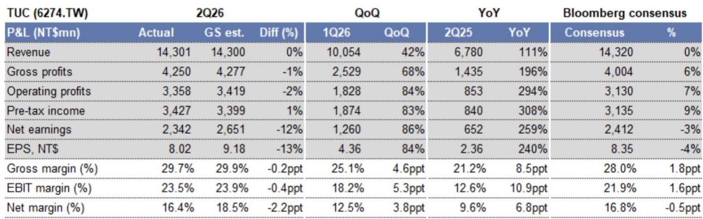
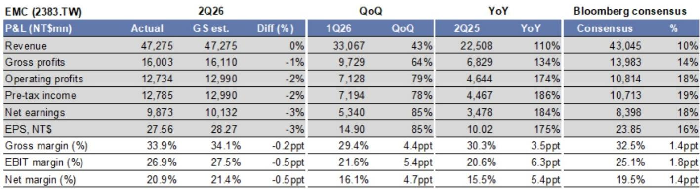
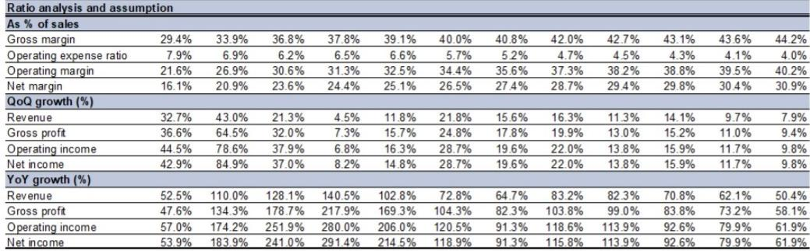

# High-End CCL Pricing Has Entered a Structural Uptrend, Not a Cyclical Blip

The second quarter of 2026 delivered a clear signal that the copper-clad laminate industry is undergoing a fundamental repricing cycle, not merely a seasonal recovery. Taiwan's two leading high-end CCL manufacturers, EMC and TUC, both reported gross margins that exceeded Bloomberg consensus by 1.4 and 1.8 percentage points respectively, driven by a combination of 10 to 60 percent price increases across product lines and accelerating adoption of M8-grade materials for next-generation AI server platforms. These results were not anomalies. They represent the first tangible evidence that pricing power has structurally shifted from PCB fabricators to high-end CCL suppliers, a reversal of the bargaining dynamics that have defined this supply chain for the past decade.

The implications extend far beyond quarterly earnings beats. With EMC's gross margin jumping 4.4 percentage points quarter-over-quarter to 33.9 percent and TUC's expanding 4.6 points to 29.7 percent, both companies have entered a margin expansion trajectory that the consensus estimates have systematically underestimated. The source of this margin improvement is not a single product cycle. It is the convergence of three structural forces: AI server demand that is pulling high-end CCL capacity into persistent shortage, a pricing reset that is now spreading from premium to mainstream grades, and a capacity expansion cycle that is already fully pre-sold to customers for years into the future. Each of these forces reinforces the others, creating a compound effect on profitability that most observers have not yet priced.

The strategic question for portfolio allocation is not whether this cycle will end, but whether the market has correctly discounted the duration and magnitude of the pricing and margin expansion that lies ahead. Based on the evidence from 2Q26 results, the supply chain checks, and the forward capacity booking data, the answer is that the margin trajectory is still in its early innings, and the risk of underestimation is substantially greater than the risk of overestimation.

## Pricing Hikes Are Accelerating Across the Product Stack, Not Just at the High End

The most underappreciated development in the 2Q26 results is that pricing increases are propagating downward from M8+ premium grades into M7 and below categories, a dynamic that directly contradicts the typical pattern in specialty chemical markets where premium segments lead and commodity segments lag indefinitely. According to the supply chain analysis, EMC and TUC are implementing quarterly price increases of 10 to 40 percent or more on M7 and lower-grade CCL products in the second half of 2026. This is not a temporary catch-up. It is a deliberate strategy by both companies to accelerate product mix improvement by raising the floor on all products, thereby pulling forward the revenue and margin contribution from the broader portfolio.

The mechanism is straightforward. As AI server projects such as Trainium 3, Rubin, and TPU v8 ramp in the second half of 2026, demand for M8 and M9 grade CCL is absorbing the highest-quality production lines. This creates a capacity bottleneck that cascades downward. PCB customers, desperate to secure any high-quality CCL supply to improve their own production yields, are accepting price increases on lower grades as a condition for maintaining allocation on premium grades. The report notes that PCB customers' willingness to accept pricing hikes on M8+ products will begin from the end of 3Q26, but the data already shows that pricing momentum has been building across the stack since 2Q26. This is a textbook example of capacity-constrained pricing power in a vertically integrated supply chain where the bottleneck component can extract rents from downstream customers who have no viable substitutes.

The financial impact is material. For EMC, the report estimates that overall pricing will increase by another 0 to 10 percent quarter-over-quarter in 3Q26, but this range likely understates the potential upside if the M7 and below pricing hikes accelerate as indicated. For TUC, which has already implemented a 10 to 60 percent price increase across all product lines in 2Q26, the sequential comparison will be more moderate, but the base effect means that year-over-year pricing comparisons will remain extraordinarily favorable through at least mid-2027.

## Capacity Expansion Through 2028 Is Already Fully Booked, Eliminating the Oversupply Risk

Investor skepticism about high-end CCL has historically centered on one concern: that strong demand will trigger aggressive capacity additions, leading to oversupply and margin compression within 12 to 18 months. The data from both EMC and TUC directly refutes this narrative. Not only are both companies expanding capacity by 35 to 40 percent year-over-year in 2027 and by at least 20 to 50 percent in 2028, but every sheet of that new capacity has already been contracted by end customers.

The specifics are striking. EMC plans to expand capacity by 1.8 million sheets per month in the first half of 2028, from a base of 9.3 million sheets by the end of 2027, with additional capacity possible in the second half of 2029. TUC announced it will add 1.95 million sheets per month of capacity between 2028 and early 2029, from 3.8 million sheets by the end of 2027. In both cases, supply chain checks confirm that the new capacity is fully booked by high-end customers across AI server, low-earth-orbit satellite, and high-end switching applications. This is not speculative capacity built on demand forecasts. It is capacity that is pre-sold to customers who are themselves facing multi-year demand visibility from hyperscaler data center buildouts and satellite constellation deployments.

The strategic implication is that the high-end CCL market has transitioned from a spot-market pricing model to a contract-driven allocation model. Customers are booking capacity years in advance, which fundamentally changes the risk profile for suppliers. Revenue visibility extends well beyond typical semiconductor or component cycles. Gross margin stability is enhanced because pricing is negotiated on multi-year contracts rather than reset quarterly based on spot supply-demand balances. And the barrier to entry for new competitors is raised, because any new entrant would need to secure both the technical qualification and the customer commitments years before production even begins.

## The Substrate CCL Opportunity Represents a Second Margin Inflection Point for EMC

While the core CCL business is already delivering margin expansion, EMC's substrate CCL business represents a separate and potentially larger margin catalyst that is not yet reflected in consensus estimates. The report indicates that EMC's substrate CCL is expected to pass qualification in the third quarter of 2026, with initial earnings contribution beginning in the fourth quarter. The gross margin profile for this business is dramatically higher than the company average, with the report estimating that substrate CCL gross margins can easily reach 40 to 50 percent or higher after mass production.

This matters because substrate CCL is a different product category with different competitive dynamics. It is used in advanced IC substrates for high-performance computing and AI accelerators, where the technical requirements are more stringent and the qualification cycles are longer. The addressable market is also growing faster than the general CCL market, driven by the same AI and high-performance computing demand that is boosting the core business. If EMC successfully enters this market, it will gain exposure to a higher-margin, faster-growing segment that is currently served by a smaller set of specialized suppliers. The revenue contribution in 2027 and 2028 is estimated at 1 and 4 percent respectively, but the margin contribution will be disproportionately large given the 40 to 50 percent gross margin assumption.

For those analyzing EMC, the substrate CCL opportunity should be evaluated as a real option with asymmetric upside. The qualification risk is real, but the report's supply chain checks suggest that the process is on track. If successful, this business line alone could add 100 to 200 basis points to consolidated gross margins in 2027 and 2028, above and beyond the margin expansion already expected from the core CCL business.

## A Decision Framework for Allocating Capital to High-End CCL

For institutional investors evaluating exposure to the high-end CCL theme, the evidence from 2Q26 supports a framework organized around three variables: pricing trajectory, capacity pre-booking, and customer concentration. Each variable provides a different lens for assessing the sustainability of the margin expansion and the appropriate valuation multiple.

First, pricing trajectory. The key metric to monitor is not the absolute level of prices but the quarter-over-quarter change in blended ASP across all product grades. The report indicates that pricing is accelerating across the stack, with M7 and below products seeing 10 to 40 percent quarterly increases in 2H26. Investors should track whether this acceleration broadens or narrows. If pricing momentum spreads to mid-grade products, it confirms that the capacity constraint is systemic. If it remains concentrated at the high end, the margin expansion will be more limited in duration.

Second, capacity pre-booking. The fact that all new capacity through 2028 is already booked by end customers is the single most important data point for long-term margin visibility. Investors should monitor the pace of new capacity announcements and the extent to which they are accompanied by customer commitments. If new capacity continues to be pre-sold, it validates the demand sustainability narrative. If capacity additions begin to outpace customer commitments, the oversupply risk re-emerges.

Third, customer concentration. Both EMC and TUC are serving a concentrated set of hyperscaler and AI server customers. This concentration is a double-edged sword. It provides strong near-term demand visibility, but it also creates dependency on the investment cycles of a small number of end customers. Investors should assess whether the customer base is diversifying, particularly into LEO satellite and high-end switching applications, which would reduce the correlation to any single end market.

Applying this framework to the current data, all three variables are pointing in the same direction. Pricing is accelerating, capacity is pre-sold, and the customer base is expanding beyond pure AI server into adjacent high-growth verticals. This combination supports the view that the high-end CCL margin expansion is structural, not cyclical, and that the current valuation multiples do not fully reflect the duration and magnitude of the opportunity.

## The Thailand Plant Tax Distortion Is a Temporary Artifact, Not a Structural Headwind

One data point that has created confusion in the TUC results is the higher-than-expected tax rate of 32 percent in 2Q26, which caused net income to miss both the analyst estimate and Bloomberg consensus by 12 and 4 percent respectively. The source of the tax rate spike is the loss-making Thailand plant, which is generating tax losses that cannot be fully utilized against profits in other jurisdictions until the plant reaches breakeven.

This is a timing issue, not a profitability issue. The report indicates that the Thailand plant is expected to reach breakeven in the third quarter of 2026, which would normalize the tax rate to a more stable level. The plant is strategically important because it provides TUC with additional capacity to capture market share in the Trainium 3 ramp, where the report estimates TUC's share will increase from 10 to 20 percent in 1H26 to 30 to 40 percent in 2H26. The tax distortion is the cost of building that capacity ahead of demand, and it will reverse as the plant ramps to profitability.

Investors should look through this one-time tax effect and focus on the underlying operating margin trajectory. TUC's operating margin expanded by 5.3 percentage points quarter-over-quarter to 23.5 percent in 2Q26, and the report expects further expansion to 26.9 percent in 3Q26. The operating profit beat relative to consensus was 7 percent, even after the tax distortion masked the net income outperformance. The core business is executing at a level that is ahead of both the street and the most bullish analyst estimates.

*For informational purposes only. Portions may be generated, translated, summarized, or edited with AI assistance based on source materials and may contain omissions or errors. Please verify independently. This is not investment, legal, tax, accounting, or other professional advice.*

For informational purposes only. Portions may be generated, translated, summarized, or edited with AI assistance based on source materials and may contain omissions or errors. Please verify independently. This is not investment, legal, tax, accounting, or other professional advice.

