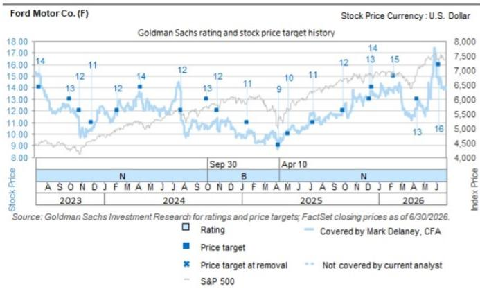

# GS：日本汽车-福特财报启示，美国定价与储能需求

福特汽车在7月29日发布的第二季度财报中，将全年调整后EBIT指引从85-105亿美元上调至100-110亿美元。这一调整主要来自Ford Blue——该公司的燃油与混动业务部门，其全年EBIT展望从45-50亿美元上调至50-55亿美元。GS日本分析师Kota Yuzawa和Ken Kawamoto认为，这份财报释放了两个对日本汽车制造商有参考价值的信号：美国市场定价环境依然稳定，储能系统需求正在积累。

报告维持对本田、丰田和斯巴鲁的积极看法，核心逻辑是这三家公司对美国市场敞口较高，且拥有较强的混动产品组合。此外，福特管理层对储能系统需求的信心，可能推动市场重新关注本田在美国的储能业务。

## 1. 美国市场定价与产品组合保持稳定

福特管理层在财报沟通中表示，美国市场的定价和产品组合依然处于有利区间。皮卡整体需求强劲，V8发动机的占比正在上升。公司预计全年定价将实现约0.5%的同比增长。

这一信号对日本汽车制造商的意义在于，美国市场并未出现此前部分读者担心的价格竞争或需求波动。对于丰田、本田和斯巴鲁而言，美国是其利润贡献最大的单一市场，稳定的定价环境意味着这些公司近期的盈利预期具备一定支撑。

> **KC评论：** 0.5%的全年定价增长幅度并不大，但方向是向上的。在通胀和利率环境尚未完全明朗的背景下，定价能力本身就是一个值得关注的观察指标。福特作为美国本土车企，其定价信号对日本车企的参考价值在于：如果美国市场整体定价环境稳定，日本车企凭借混动产品的差异化优势，可能获得比福特更有利的定价空间。

## 2. 储能系统订单积累指向2028年产能目标

福特管理层对基于棱柱形磷酸铁锂电池的储能系统业务给出了较为具体的展望。订单积压正在稳步积累，目标是到2028年实现20 GWh的年产能。订单机会也在从公用事业客户向更广泛的客户群体扩展。

对于日本汽车制造商，储能业务是一个相对被低估的增长点。本田已经在美国布局储能业务，福特的订单积累趋势可能意味着这个市场正在进入规模化阶段。GS分析师认为，随着市场对储能需求的关注度提升，本田在美国的储能业务可能获得更多读者关注。

## 3. 贸易框架讨论中的汇率与关税因素

关于美墨加协定，福特管理层强调自己是美国本土生产比例最高的品牌。同时，管理层指出，日韩汽车制造商受益于弱势本币，且面临15%的对美出口关税。这一表述实际上点明了当前贸易讨论中的一个关键变量：汇率波动对竞争格局的影响。

日元对美元在过去两年持续走弱，这为日本车企在出口定价和利润换算上提供了缓冲。如果贸易框架调整涉及关税或原产地规则的变化，汇率因素将成为影响日本车企竞争力的重要变量。报告没有对这一不确定性给出明确判断，但指出了这一观察维度。

## 4. 一个可复用的观察框架：从竞争对手财报中提取信号

对于跟踪日本汽车制造商的读者，福特财报提供了一个可复用的分析框架：关注竞争对手的定价指引、产品组合变化和储能业务进展，而不是仅仅依赖日本车企自身发布的财务数据。

具体来说，可以关注三个指标：一是美国市场定价趋势（福特全年定价预期是否继续上调或下调）；二是混动车型的销售占比变化（福特V8发动机占比上升说明燃油车需求仍有韧性）；三是储能订单的积累速度（如果福特2028年20 GWh目标提前或延后，将反映行业需求节奏）。这三个指标来自竞争对手的公开披露，但直接关联到日本车企的竞争环境和增长空间。

For informational purposes only. Portions may be generated,translated,summarized,or edited with AI assistance based on source materials and may contain omissions or errors. Please verify independently. This is not investment,legal,tax,accounting,or other professional advice.

For informational purposes only. Portions may be generated,translated,summarized,or edited with AI assistance based on source materials and may contain omissions or errors. Please verify independently. This is not investment,legal,tax,accounting,or other professional advice.

