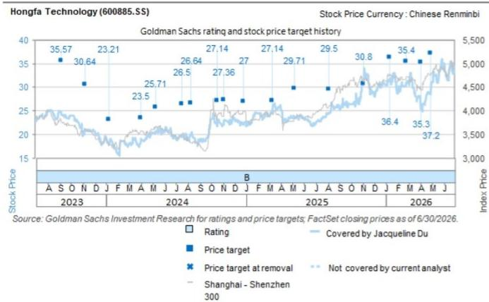

## Hongfa Technology (600885.SS): 2Q26 results in line; strong order visibility backed by market share gains and pricing power

Post market close on July 29, Hongfa announced 2Q26 results that were in line with our expectations. 2Q26 revenue/gross profit/operating profit/net profit reached Rmb5,914mn/1,963mn/1,007mn/672mn, +36%/+30%/+26%/+21% yoy, and +4%/+3%/+6%/+1% vs. GSe. 2Q26 GPM/OPM/NPM were 33%/17%/11%, -1pp/-1pp/-1pp yoy, all in line with GSe. We slightly adjust our 2026-30E EPS by <1% with 12-m TP now at Rmb45.5.

Jacqueline Du
+852-2978-1783 |
jacqueline.du@gs.com
GS (Asia) L.L.C.

We maintain our positive view on Hongfa, expecting the company to deliver 27% yoy revenue growth in 2026E, driven partially by its pricing power to pass through raw material price increases (with 10pp+ revenue growth contribution from price hikes), as well as strong volume growth across its end markets. This represents a significant acceleration versus its historical revenue CAGR of 15% over the past ten years. Volume growth should outperform underlying industry growth (such as in home appliances and autos), reflecting a structural acceleration in market share gains. Smaller players have been increasingly affected by raw material price hikes and weaker operating cash flow, while global competitors such as Omron have announced the spin-off of its Device & Module Solutions Business (including relays, switches and sensors), recognizing intensifying global competition (link). With strong demand visibility into 2027E, we believe Hongfa should be well positioned to capture incremental demand, supported by its historical ability to increase production shifts and raise utilization rates towards 100%+ when demand is strong.

We also expect GPM to recover from $33.2\%$ in 2Q26 to $34.5\%$ in 3Q26E and $35.1\%$ in 4Q26E, as raw material prices stabilize and Hongfa completes its price hikes. We see limited risk of price reductions even if raw material prices pull back, given the current supply environment. More importantly, strong revenue growth and higher utilization rates should provide meaningful operating leverage and support further GPM recovery.

HVDC relay: We expect 2026E revenue to grow 30% yoy, driven by continued market share gains through expanded global customer coverage across Europe and Southeast Asia, as well as higher content value from increasing penetration of 800V EV platforms.

General relay: We expect 2026E revenue to grow 36% yoy, driven by both price increases and market share gains against smaller players whose operations have been affected by raw material price increases, while also supported by strong ESS demand.

Auto relay: We expect 2026E revenue to grow 16% yoy, as pricing increases were successfully implemented in 2Q26.

Power relay: We expect 2026E revenue to grow 24% yoy, driven by improving demand in Europe and higher State Grid-related smart meter installation volume.

Industrial control relay: We expect 2026E revenue to grow 29% yoy, driven by sustained demand from new energy, semiconductors, domestic substitution and overseas recovery, supported by improving OEM demand from customers such as Schneider.

Signal relay: We expect 2026E revenue to grow 20% yoy, supported by strong order visibility.

AIDC applications: The company completed sample deliveries by 2Q26 and expects to establish a clearer commercialization plan by 4Q26-2027E. In addition to HVDC relays and general relays, Hongfa is also exploring potential opportunities in connectors, film capacitors, vacuum capacitors and cabinets for data centers in the US and Southeast Asia.

Exhibit 1: Hongfa 2Q26 financial summary

<table><tr><td>Hongfa Technology (600885.SS)</td><td>1Q25</td><td>2Q25</td><td>3Q25</td><td>4Q25</td><td>1Q26</td><td>2Q26</td><td>yoy %</td><td>qoq %</td><td>Prior 2Q26E GSe</td><td>Diff %</td></tr><tr><td>Revenue (Rmb mn)</td><td>3,983</td><td>4,364</td><td>4,567</td><td>4,288</td><td>5,108</td><td>5,914</td><td>36%</td><td>16%</td><td>5,674</td><td>4%</td></tr><tr><td colspan="11">Segment breakdown</td></tr><tr><td>Gross profit (Rmb mn)</td><td>1,345</td><td>1,513</td><td>1,615</td><td>1,432</td><td>1,639</td><td>1,963</td><td>30%</td><td>20%</td><td>1,906</td><td>3%</td></tr><tr><td>EBIT (Rmb mn)</td><td>605</td><td>798</td><td>764</td><td>388</td><td>751</td><td>1,007</td><td>26%</td><td>34%</td><td>947</td><td>6%</td></tr><tr><td>Net profit (Rmb mn)</td><td>411</td><td>553</td><td>506</td><td>288</td><td>484</td><td>672</td><td>21%</td><td>39%</td><td>663</td><td>1%</td></tr><tr><td>EPS (Rmb)</td><td>0.39</td><td>0.38</td><td>0.35</td><td>0.19</td><td>0.31</td><td>0.43</td><td>15%</td><td>39%</td><td>0.43</td><td>1%</td></tr><tr><td>Gross profit margin (%)</td><td>34%</td><td>35%</td><td>35%</td><td>33%</td><td>32%</td><td>33%</td><td>-1pp</td><td>1pp</td><td>34%</td><td>0pp</td></tr><tr><td>EBIT margin (%)</td><td>15%</td><td>18%</td><td>17%</td><td>9%</td><td>15%</td><td>17%</td><td>-1pp</td><td>2pp</td><td>17%</td><td>0pp</td></tr><tr><td>Net profit margin (%)</td><td>10%</td><td>13%</td><td>11%</td><td>7%</td><td>9%</td><td>11%</td><td>-1pp</td><td>2pp</td><td>12%</td><td>0pp</td></tr></table>

Source: Company data, GS Global Investment Research

The author would like to thank Zhou Li, Hao Chen, Zhihan Ye, and Junfang Zhang for their contributions to this report.

## Research thesis, Valuation methodology and Risks

Hongfa is a top relay producer with $27\%$ global market share as of 2025 (No.1). We expect continued market share gains driven by technology strength in the autos (both ICE and EV)/home appliance/power/signal sectors, and by rising adoption of high-voltage DC architectures in AIDC and ESS applications. We believe the vehicle electrification trend is poised to support China's industrial component companies as content per vehicle rises significantly in EV vs. ICE, while Hongfa's leading position in HVDC relays positions it to benefit from the 800V DC transition in both automotive and power infrastructure. In addition to strong smart meter demand as the global power grid enters a replacement cycle to incorporate more renewable energy generation and adapt for rising electricity demand, we now also see AIDC and ESS build-out adding incremental relay demand from data centers and backup/storage systems. We view the stock's valuation as attractive vs. our China Industrial Tech coverage, with potential catalysts coming from: (1) strong customer penetration among global EV OEM customers, (2) fast smart meter order gains against replacement demand, and (3) an acceleration in AIDC-related HVDC and general relay orders, as well as ESS-HVDC deployments, as global data center and power operators upgrade toward higher-efficiency DC and storage-rich architectures.

## Price Target Risks and Methodology - Hongfa Technology

Target price: Our 12m target price of Rmb45.5 is based on 2028E P/E of 24x discounted back to 2027E.

Downside risks: (1) Weaker-than-expected smart meter revenue recognition; (2) Weaker-than-expected revenue from front-loaded solar inverter revenue; (3) Further increase in copper and silver prices that negatively impacts GPM.

<table><tr><td>600885.SS</td><td>12m Price Target: Rmb45.50</td><td colspan="2">Price: Rmb33.98</td><td colspan="2">Upside: 33.9%</td></tr><tr><td>Buy</td><td colspan="5">GS Forecast</td></tr><tr><td></td><td></td><td>12/25</td><td>12/26E</td><td>12/27E</td><td>12/28E</td></tr><tr><td rowspan="11">Market cap: Rmb52.6bn / $7.8bn Enterprise value: Rmb55.8bn / $8.3bn 3m ADTV: Rmb762.2mn / $112.3mn China China Industrial Tech &amp; Machinery M&amp;A Rank: 3 Leases incl. in net debt &amp; EV?: No</td><td>Revenue (Rmb mn) New</td><td>17,202.5</td><td>21,827.2</td><td>25,432.1</td><td>28,196.5</td></tr><tr><td>Revenue (Rmb mn) Old</td><td>17,202.5</td><td>21,647.8</td><td>25,191.0</td><td>27,925.3</td></tr><tr><td>EBITDA (Rmb mn)</td><td>3,653.8</td><td>4,430.6</td><td>5,160.9</td><td>6,162.9</td></tr><tr><td>EPS (Rmb) New</td><td>1.14</td><td>1.42</td><td>1.74</td><td>2.09</td></tr><tr><td>EPS (Rmb) Old</td><td>1.14</td><td>1.41</td><td>1.72</td><td>2.07</td></tr><tr><td>P/E (X)</td><td>22.5</td><td>24.0</td><td>19.5</td><td>16.2</td></tr><tr><td>P/B (X)</td><td>3.1</td><td>3.7</td><td>3.3</td><td>2.9</td></tr><tr><td>Dividend yield (%)</td><td>1.4</td><td>1.5</td><td>1.8</td><td>2.2</td></tr><tr><td>CROCI (%)</td><td>18.6</td><td>16.4</td><td>17.2</td><td>18.0</td></tr><tr><td></td><td>3/26</td><td>6/26E</td><td>9/26E</td><td>12/26E</td></tr><tr><td>EPS (Rmb)</td><td>0.31</td><td>0.43</td><td>0.41</td><td>0.26</td></tr></table>

Source: Company data, GS estimates, FactSet. Price as of 29 Jul 2026 close.

## Disclosure Appendix

## Reg AC

I, Jacqueline Du, hereby certify that all of the views expressed in this report accurately reflect my personal views about the subject company or companies and its or their securities. I also certify that no part of my compensation was, is or will be, directly or indirectly, related to the specific recommendations or views expressed in this report.

Unless otherwise stated, the individuals listed on the cover page of this report are analysts in GS' Global Investment Research division.

Contributing Authors: Jacqueline Du GS (Asia) L.L.C..

Unless otherwise stated, the individuals listed in the Contributing Authors disclosure of this report are analysts in GS' Global Investment Research division.

## GS Factor Profile

The GS Factor Profile provides investment context for a stock by comparing key attributes to the market (i.e. our universe of rated stocks) and its sector peers. The four key attributes depicted are: Growth, Financial Returns, Multiple (e.g. valuation) and Integrated (a composite of Growth, Financial Returns and Multiple). Growth, Financial Returns and Multiple are calculated by using normalized ranks for specific metrics for each stock. The normalized ranks for the metrics are then averaged and converted into percentiles for the relevant attribute. The precise calculation of each metric may vary depending on the fiscal year, industry and region, but the standard approach is as follows:

Growth is based on a stock's forward-looking sales growth, EBITDA growth and EPS growth (for financial stocks, only EPS and sales growth), with a higher percentile indicating a higher growth company. Financial Returns is based on a stock's forward-looking ROE, ROCE and CROCI (for financial stocks, only ROE), with a higher percentile indicating a company with higher financial returns. Multiple is based on a stock's forward-looking P/E, P/B, price/dividend (P/D), EV/EBITDA, EV/FCF and EV/Debt Adjusted Cash Flow (DACF) (for financial stocks, only P/E, P/B and P/D), with a higher percentile indicating a stock trading at a higher multiple. The Integrated percentile is calculated as the average of the Growth percentile, Financial Returns percentile and (100% - Multiple percentile).

Financial Returns and Multiple use the GS analyst forecasts at the fiscal year-end at least three quarters in the future. Growth uses inputs for the fiscal year at least seven quarters in the future compared with the year at least three quarters in the future (on a per-share basis for all metrics).

For a more detailed description of how we calculate the GS Factor Profile, please contact your GS representative.

## M&A Rank

Across our global coverage, we examine stocks using an M&A framework, considering both qualitative factors and quantitative factors (which may vary across sectors and regions) to incorporate the potential that certain companies could be acquired. We then assign a M&A rank as a means of scoring companies under our rated coverage from 1 to 3, with 1 representing high (30%-50%) probability of the company becoming an acquisition target, 2 representing medium (15%-30%) probability and 3 representing low (0%-15%) probability. For companies ranked 1 or 2, in line with our standard departmental guidelines we incorporate an M&A component into our target price. M&A rank of 3 is considered immaterial and therefore does not factor into our price target, and may or may not be discussed in research.

## Quantum

Quantum is GS' proprietary database providing access to detailed financial statement histories, forecasts and ratios. It can be used for in-depth analysis of a single company, or to make comparisons between companies in different sectors and markets.

## Disclosures

The rating(s) for Hongfa Technology is/are relative to the other companies in its/their coverage universe: AVIC Jonhon, Best, Bochu, CRRC Corp. (A), CRRC Corp. (H), Centre Testing Intl Group, Estun Automation Co.(A), Estun Automation Co.(H), Faratronic, Haitian International Holdings, Han's Laser Technology, HangKe Technology, Hongfa Technology, Huaming, Kehua Data Co., Lead Intelligent (A), Lead Intelligent (H), Leader Harmonious Drive Systems Co., Luster LightTech Co., Megmeet, Moons' Electric, NARI Technology, Nantong Jianghai Capacitor Co., OPT Machine Vision Tech Co., Sanhua Intelligent Controls (A), Sanhua Intelligent Controls (H), Shanghai Baosight Software, Shenzhen Envicool Technology, Shenzhen Inovance Technology Co., Shenzhen Kstar Science & Tech, Shuanghuan Driveline, Sieyuan Electric, Techtronic Industries, Wuhan Raycus Fiber Laser Tech, Yiheda Automation, Yingliu, Zhejiang Supcon Technology Co., Zhuzhou CRRC Times Electric Co. (A), Zhuzhou CRRC Times Electric Co. (H)

## Company-specific regulatory disclosures

The following disclosures relate to relationships between The GS Group, Inc. (with its affiliates, “GS”) and companies covered by GS Global Investment Research and referred to in this research.

GS beneficially owned 1% or more of common equity (excluding positions managed by affiliates and business units not required to be aggregated under US securities law) as of the month end preceding this report: Hongfa Technology (Rmb33.98)

## Distribution of ratings/investment banking relationships

GS Investment Research global Equity coverage universe

<table><tr><td rowspan="2"></td><td colspan="3">Rating Distribution</td><td colspan="3">Investment Banking Relationships</td></tr><tr><td>Buy</td><td>Hold</td><td>Sell</td><td>Buy</td><td>Hold</td><td>Sell</td></tr><tr><td>Global</td><td>50%</td><td>34%</td><td>16%</td><td>65%</td><td>59%</td><td>43%</td></tr></table>

As of July 1, 2026, GS Global Investment Research had investment ratings on 3,104 equity securities. GS assigns stocks as Buys and Sells on various regional Investment Lists; stocks not so assigned are deemed Neutral. Such assignments equate to Buy, Hold and Sell for the purposes of the above disclosure required by the FINRA Rules. See 'Ratings, Coverage universe and related definitions' below. The Investment Banking Relationships chart reflects the percentage of subject companies within each rating category for whom GS has provided investment banking services within the previous twelve months.

## Price target and rating history chart(s)

  
The price targets shown should be considered in the context of all prior published GS, which may or may not have included price targets, as well as developments relating to the company, its industry and financial markets.

## Target price history table(s) Hongfa Technology (600885.SS)

Date of report Target price (Rmb) Closing price (Rmb)

<table><tr><td>22-Jul-26</td><td>45.00</td><td>33.33</td></tr><tr><td>30-Apr-26</td><td>37.20</td><td>31.14</td></tr><tr><td>03-Apr-26</td><td>35.30</td><td>25.57</td></tr><tr><td>24-Feb-26</td><td>35.40</td><td>30.93</td></tr><tr><td>12-Jan-26</td><td>36.40</td><td>31.36</td></tr><tr><td>03-Nov-25</td><td>30.80</td><td>30.77</td></tr><tr><td>06-Aug-25</td><td>29.50</td><td>24.57</td></tr><tr><td>07-May-25</td><td>41.60</td><td>23.72</td></tr><tr><td>11-Mar-25</td><td>38.00</td><td>24.99</td></tr><tr><td>26-Dec-24</td><td>37.80</td><td>22.20</td></tr><tr><td>04-Nov-24</td><td>38.30</td><td>22.77</td></tr><tr><td>18-Oct-24</td><td>38.00</td><td>23.09</td></tr><tr><td>12-Aug-24</td><td>37.30</td><td>20.54</td></tr><tr><td>18-Jul-24</td><td>37.10</td><td>19.86</td></tr><tr><td>09-May-24</td><td>36.00</td><td>20.35</td></tr><tr><td>01-Apr-24</td><td>32.90</td><td>18.68</td></tr><tr><td>08-Jan-24</td><td>32.50</td><td>17.77</td></tr><tr><td>07-Nov-23</td><td>42.90</td><td>20.88</td></tr><tr><td>06-Sep-23</td><td>49.80</td><td>24.61</td></tr></table>

Price targets shown in table(s) are unadjusted for corporate actions.

## Regulatory disclosures

## Disclosures required by United States laws and regulations

See company-specific regulatory disclosures above for any of the following disclosures required as to companies referred to in this report: manager or co-manager in a pending transaction; $1\%$ or other ownership; compensation for certain services; types of client relationships; managed/co-managed public offerings in prior periods; directorships; for equity securities, market making and/or specialist role. GS trades or may trade as a principal in debt securities (or in related derivatives) of issuers discussed in this report.

The following are additional required disclosures: Ownership and material conflicts of interest: GS policy prohibits its analysts, professionals reporting to analysts and members of their households from owning securities of any company in the analyst's area of coverage. Analyst compensation: Analysts are paid in part based on the profitability of GS, which includes investment banking revenues. Analyst as officer or director: GS policy generally prohibits its analysts, persons reporting to analysts or members of their households from serving as an officer, director or advisor of any company in the analyst's area of coverage. Non-U.S. Analysts: Non-U.S. analysts may not be associated persons of GS & Co. LLC and therefore may not be subject to FINRA Rule 2241 or FINRA Rule 2242 restrictions on communications with a subject company, public appearances and trading in securities covered by the analysts.

## Additional disclosures required under the laws and regulations of jurisdictions other than the United States

The following disclosures are those required by the jurisdiction indicated, except to the extent already made above pursuant to United States laws and regulations. Australia: GS Australia Pty Ltd and its affiliates are not authorised deposit-taking institutions (as that term is defined in the Banking Act 1959 (Cth)) in Australia and do not provide banking services, nor carry on a banking business, in Australia. This research, and any access to it, is intended only for “wholesale clients” within the meaning of the Australian Corporations Act, unless otherwise agreed by GS. In producing research reports, members of Global Investment Research of GS Australia may attend site visits and other meetings hosted by the companies and other entities which are the subject of its research reports. In some instances the costs of such site visits or meetings may be met in part or in whole by the issuers concerned if GS Australia considers it is appropriate and reasonable in the specific circumstances relating to the site visit or meeting. To the extent that the contents of this document contains any financial product advice, it is general advice only and has been prepared by GS without taking into account a client's objectives, financial situation or needs. A client should, before acting on any such advice, consider the appropriateness of the advice having regard to the client's own objectives, financial situation and needs. A copy of certain GS Australia and New Zealand disclosure of interests and a copy of GS' Australian Sell-Side Research Independence Policy Statement are available at: https://www.goldmansachs.com/disclosures/australia-new-zealand/index.html. Brazil: Disclosure information in relation to CVM Resolution n. 20 is available at https://www.gs.com/worldwide/brazil/area/gir/index.html. Where applicable, the Brazil-registered analyst primarily responsible for the content of this research report, as defined in Article 20 of CVM Resolution n. 20, is the first author named at the beginning of this report, unless indicated otherwise at the end of the text. Canada: This information is being provided to you for information purposes only and is not, and under no circumstances should be construed as, an advertisement, offering or solicitation by GS & Co. LLC for purchasers of securities in Canada to trade in any Canadian security. GS & Co. LLC is not registered as a dealer in any jurisdiction in Canada under applicable Canadian securities laws and generally is not permitted to trade in Canadian securities and may be prohibited from selling certain securities and products in certain jurisdictions in Canada. If you wish to trade in any Canadian securities or other products in Canada please contact GS Canada Inc., an affiliate of The GS Group Inc., or another registered Canadian dealer. Hong Kong: Further information on the securities of covered companies referred to in this research may be obtained on request from GS (Asia) L.L.C. India: Further information on the subject company or companies referred to in this research may be obtained from GS (India) Securities Private Limited, Research Analyst - SEBI Registration Number INH000001493, 10th Floor, Ascent-Worli, Sudam Kalu Ahire Marg, Worli, Mumbai-400 025, India, Corporate Identity Number U74140MH2006FTC160634, Phone +91 22 6616 9000, Fax +91 22 6616 9001. GS may beneficially own 1% or more of the securities (as such term is defined in clause 2 (h) the Indian Securities Contracts (Regulation) Act, 1956) of the subject company or companies referred to in this research report. Registration granted by SEBI and certification from NISM in no way guarantee performance of the intermediary or provide any assurance of returns to investors. GS (India) Securities Private Limited compliance officer and investor grievance contact details, a copy of the annual compliance audit report and other relevant information and disclosures can be found at this link:

https://www.goldmansachs.com/worldwide/india/research-analyst. Japan: See below. Korea: This research, and any access to it, is intended only for “professional investors” within the meaning of the Financial Services and Capital Markets Act, unless otherwise agreed by GS. Further information on the subject company or companies referred to in this research may be obtained from GS (Asia) L.L.C., Seoul Branch. New Zealand: GS New Zealand Limited and its affiliates are neither “registered banks” nor “deposit takers” (as defined in the Reserve Bank of New Zealand Act 1989) in New Zealand. This research, and any access to it, is intended for “wholesale clients” (as defined in the Financial Advisers Act 2008) unless otherwise agreed by GS. A copy of certain GS Australia and New Zealand disclosure of interests is available at: https://www.goldmansachs.com/disclosures/australia-new-zealand/index.html. Russia: Research reports distributed in the Russian Federation are not advertising as defined in the Russian legislation, but are information and analysis not having product promotion as their main purpose and do not provide appraisal within the meaning of the Russian legislation on appraisal activity. Research reports do not constitute a personalized investment recommendation as defined in Russian laws and regulations, are not addressed to a specific client, and are prepared without analyzing the financial circumstances, investment profiles or risk profiles of clients. GS assumes no responsibility for any investment decisions that may be taken by a client or any other person based on this research report. Singapore: GS (Singapore) Pte. (Company Number: 198602165W), which is regulated by the Monetary Authority of Singapore, accepts legal responsibility for this research, and should be contacted with respect to any matters arising from, or in connection with, this research. Taiwan: This material is for reference only and must not be reprinted without permission. Investors should carefully consider their own investment risk. Investment results are the responsibility of the individual investor. United Kingdom: Persons who would be categorized as retail clients in the United Kingdom, as such term is defined in the rules of the Financial Conduct Authority, should read this research in conjunction with prior GS on the covered companies referred to herein and should refer to the risk warnings that have been sent to them by GS International. A copy of these risks warnings, and a glossary of certain financial terms used in this report, are available from GS International on request.

European Union and United Kingdom: Disclosure information in relation to Article 6 (2) of the European Commission Delegated Regulation (EU) (2016/958) supplementing Regulation (EU) No 596/2014 of the European Parliament and of the Council (including as that Delegated Regulation is implemented into United Kingdom domestic law and regulation following the United Kingdom's departure from the European Union and the European Economic Area) with regard to regulatory technical standards for the technical arrangements for objective presentation of investment recommendations or other information recommending or suggesting an investment strategy and for disclosure of particular interests or indications of conflicts of interest is available at https://www.gs.com/disclosures/europeanpolicy.html which states the European Policy for Managing Conflicts of Interest in Connection with Investment Research.

Japan: GS Japan Co., Ltd. is a Financial Instrument Dealer registered with the Kanto Financial Bureau under registration number Kinsho 69, and a member of Japan Securities Dealers Association, Financial Futures Association of Japan Type II Financial Instruments Firms Association, and Investment Management Association of Japan. Sales and purchase of equities are subject to commission pre-determined with clients plus consumption tax. See company-specific disclosures as to any applicable disclosures required by Japanese stock exchanges, the Japanese Securities Dealers Association or the Japanese Securities Finance Company.

## Ratings, coverage universe and related definitions

Buy (B), Neutral (N), Sell (S) Analysts recommend stocks as Buys or Sells for inclusion on various regional Investment Lists. Being assigned a Buy or Sell on an Investment List is determined by a stock's total return potential relative to its coverage universe. Any stock not assigned as a Buy or a Sell on an Investment List with an active rating (i.e., a stock that is not Rating Suspended, Not Rated, Early-Stage Biotech, Coverage Suspended or Not Covered), is deemed Neutral. Each region manages Regional Conviction Lists, which are selected from Buy rated stocks on the respective region's Investment Lists and represent investment recommendations focused on the size of the total return potential and/or the likelihood of the realization of the return across their respective areas of coverage. The addition or removal of stocks from such Conviction Lists are managed by the Investment Review Committee or other designated committee in each respective region and do not represent a change in the analysts' investment rating for such stocks.

Total return potential represents the upside or downside differential between the current share price and the price target, including all paid or anticipated dividends, expected during the time horizon associated with the price target. Price targets are required for all covered stocks. The total return potential, price target and associated time horizon are stated in each report adding or reiterating an Investment List membership.

Coverage Universe: A list of all stocks in each coverage universe is available by primary analyst, stock and coverage universe at https://www.gs.com/research/hedge.html.

Not Rated (NR). The investment rating, target price and earnings estimates (where relevant) are removed pursuant to GS policy when GS is acting in an advisory capacity in a merger or in a strategic transaction involving this company, when there are legal, regulatory or policy constraints due to GS' involvement in a transaction, and in certain other circumstances. Early-Stage Biotech (ES). An investment rating and a target price are not assigned pursuant to GS policy when this company has neither a drug, treatment or medical device that has passed a Phase II clinical trial nor a license to distribute a post-Phase II drug, treatment or medical device. Rating Suspended (RS). GS has suspended the investment rating and price target for this stock, because there is not a sufficient fundamental basis for determining an investment rating or target price. The previous investment rating and target price, if any, are no longer in effect for this stock and should not be relied upon. Coverage Suspended (CS). GS has suspended coverage of this company. Not Covered (NC). GS does not cover this company.

## Global product; distributing entities

GS Global Investment Research produces and distributes research products for clients of GS on a global basis. Analysts based in GS offices around the world produce research on industries and companies, and research on macroeconomics, currencies, commodities and portfolio strategy. This research is disseminated in Australia by GS Australia Pty Ltd (ABN 21 006 797 897); in Brazil by GS do Brasil Corretora de Títulos e Valores Mobiliários S.A.; Public Communication Channel GS Brazil: 0800 727 5764 and / or contatogoldmanbrasil@gs.com. Available Weekdays (except holidays), from 9am to 6pm. Canal de Comunicação com o Público GS Brasil: 0800 727 5764 e/ou contatogoldmanbrasil@gs.com. Horário de funcionamento: segunda-feira à sexta-feira (exceto feriados), das 9h às 18h; in Canada by GS & Co. LLC; in Hong Kong by GS (Asia) L.L.C.; in India by GS (India) Securities Private Ltd.; in Japan by GS Japan Co., Ltd.; in the Republic of Korea by GS (Asia) L.L.C., Seoul Branch; in New Zealand by GS New Zealand Limited; in Russia by OOO GS; in Singapore by GS (Singapore) Pte. (Company Number: 198602165W); and in the United States of America by GS & Co. LLC. GS International has approved this research in connection with its distribution in the United Kingdom.

GS International (“GSI”), authorised by the Prudential Regulation Authority (“PRA”) and regulated by the Financial Conduct Authority (“FCA”) and the PRA, has approved this research in connection with its distribution in the United Kingdom.

European Economic Area: GS Bank Europe SE (“GSBE”) is a credit institution incorporated in Germany and, within the Single Supervisory Mechanism, subject to direct prudential supervision by the European Central Bank and in other respects supervised by German Federal Financial Supervisory Authority (Bundesanstalt für Finanzdienstleistungsaufsicht, BaFin) and Deutsche Bundesbank and disseminates research within the European Economic Area.

## General disclosures

This research is for our clients only. Other than disclosures relating to GS, this research is based on current public information that we consider reliable, but we do not represent it is accurate or complete, and it should not be relied on as such. The information, opinions, estimates and forecasts contained herein are as of the date hereof and are subject to change without prior notification. We seek to update our research as appropriate, but various regulations may prevent us from doing so. Other than certain industry reports published on a periodic basis, the large majority of reports are published at irregular intervals as appropriate in the analyst's judgment.

GS conducts a global full-service, integrated investment banking, investment management, and brokerage business. We have investment banking and other business relationships with a substantial percentage of the companies covered by Global Investment Research. GS & Co. LLC, the United States broker dealer, is a member of SIPC (https://www.sipc.org).

Our salespeople, traders, and other professionals may provide oral or written market commentary or trading strategies to our clients and principal trading desks that reflect opinions that are contrary to the opinions expressed in this research. Our asset management area, principal trading desks and investing businesses may make investment decisions that are inconsistent with the recommendations or views expressed in this research.

The analysts named in this report may have from time to time discussed with our clients, including GS salespersons and traders, or may discuss in this report, trading strategies that reference catalysts or events that may have a near-term impact on the market price of the equity securities discussed in this report, which impact may be directionally counter to the analyst's published price target expectations for such stocks. Any such trading strategies are distinct from and do not affect the analyst's fundamental equity rating for such stocks, which rating reflects a stock's return potential relative to its coverage universe as described herein.

We and our affiliates, officers, directors, and employees will from time to time have long or short positions in, act as principal in, and buy or sell, the securities or derivatives, if any, referred to in this research, unless otherwise prohibited by regulation or GS policy.

The views attributed to third party presenters at GS arranged conferences, including individuals from other parts of GS, do not necessarily reflect those of Global Investment Research and are not an official view of GS.
