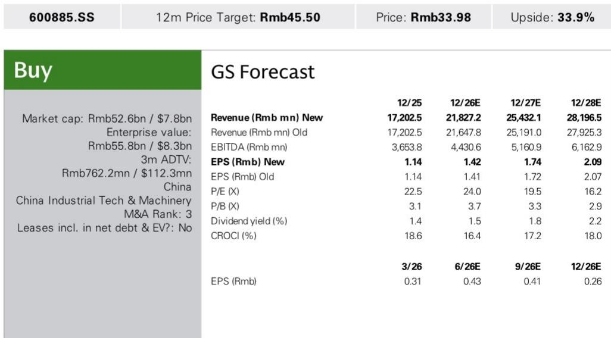
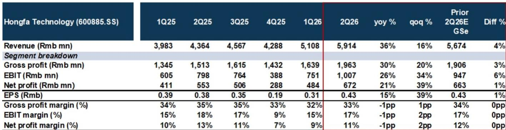

# 宏发科技：定价能力与市场份额增长正创造结构性成长拐点

2026年第二季度，宏发科技实现营业收入59.14亿元，同比增长36%，超出某全球投行报告预期4%。这并非一次性表现。毛利润达到19.63亿元，同比增长30%，营业利润和净利润分别增长26%和21%。公司正在执行一项在中国工业零部件制造商中较为少见的策略：同时提价并扩大市场份额。

关键洞察在于，宏发预计2026年全年营收增长27%，较其十年历史复合增长率15%明显加速。其中超过10个百分点的增长将仅来自提价，因为公司成功将原材料成本上涨传导给客户。这种定价能力，加上在竞争对手疲软时结构性获取市场份额，以及一家全球竞争对手退出继电器业务，共同创造了一个当前估值尚未反映的多年增长轨迹。

报告预计，毛利率在第二季度降至33.2%后，将在2026年第三季度恢复至34.5%，第四季度恢复至35.1%。这一恢复由两个相互强化的因素驱动：原材料价格稳定以及已实施提价的全年效应。即使大宗商品价格回落，公司面临的降价风险也有限，因为当前供应短缺的环境使其拥有小企业所缺乏的定价纪律。

## 宏发在量增的同时提价，表明其竞争地位发生根本性转变

36%的营收增长与仅暂时受压的毛利率相结合，讲述了一个超越周期性需求的故事。宏发所处的环境中，原材料成本上涨已使小型竞争对手的经营现金流承压至中断点。与此同时，一家主要全球竞争对手欧姆龙宣布剥离其设备与模块解决方案业务（包括继电器、开关和传感器），明确提到全球竞争加剧。

这种双重动态为宏发创造了一个不仅是周期性、更是结构性的窗口。公司不仅受益于终端市场需求的增长，还在主动取代那些无法匹敌其规模、成本结构或客户关系的竞争对手。报告预计，在大家电和汽车领域，宏发的销量增长将超过行业基础增长，这直接反映了其市场份额的获取。

定价能力尤为值得关注。在许多工业企业难以维持利润率的环境中，宏发已成功在多个产品线实施提价。汽车继电器定价在2026年第二季度成功上调。通用继电器营收同比增长36%，由提价和市场份额增长共同驱动。这家公司并非仅仅乘着需求浪潮，而是在主动重塑其收入组合和利润率结构。

## 每个主要产品板块增长均超15%，且由不同但相互强化的结构性趋势驱动

报告按产品板块细分了营收预期，模式引人注目。每个板块预计在2026年至少同比增长16%，其中几个板块增长更快。高压直流继电器预计增长30%，受欧洲和东南亚全球客户覆盖扩大以及800V电动汽车平台渗透率提升带来的更高内容价值驱动。通用继电器预计增长36%，受提价和针对小型竞争对手的市场份额增长驱动，并得到强劲储能系统需求的额外支持。

汽车继电器预计增长16%，这是一个较为温和但仍健康的增速，反映了成功的价格实施。电力继电器预计增长24%，受欧洲需求改善和国家电网相关智能电表安装量增加驱动。工业控制继电器预计增长29%，受新能源、半导体、国产替代和海外复苏（包括施耐德等客户OEM需求改善）的持续需求支持。信号继电器预计增长20%，受强劲订单可见度支持。

这些增长驱动因素的多样性很重要。宏发并不依赖任何单一终端市场。公司同时受益于车辆电动化、电网现代化、储能建设、工业自动化和数据中心扩张。这种多元化降低了任何一个终端市场放缓对整体增长轨迹造成重大影响的风险。

## 毛利率回升故事由经营杠杆支撑，而不仅仅是提价

报告预计毛利率将从2026年第二季度的33.2%回升至第四季度的35.1%。这一回升并非仅依赖原材料价格稳定。报告明确指出，强劲的营收增长和更高的产能利用率应提供有意义的经营杠杆，并支持毛利率进一步回升。

这是一个关键点。宏发已展现出在需求强劲时增加生产班次并将产能利用率提升至100%或以上的能力。随着营收增长，固定成本被摊薄到更大的基数上，每增加一个单位产量的边际利润很高。提价、原材料成本稳定和更高利用率的结合，对利润率产生了复合效应，这种效应无法通过简单外推近期趋势来完全捕捉。

报告预计，即使原材料价格回落，降价风险也有限，这一点同样重要。在供应短缺的环境中，公司可以维持定价纪律。已接受提价的客户不太可能要求降价，除非竞争压力迫使他们这样做，而宏发的市场地位表明竞争压力正在减弱而非增加。

## 评估框架：如何从三个时间维度看待宏发的风险回报特征

对于评估宏发的观察者来说，关键问题不在于公司当前周期执行得如何，而在于当前增长轨迹是否可持续，以及估值是否充分反映了潜力。

在六个月的维度上，主要驱动因素将是毛利率回升。报告预计，2026年下半年利润率将逐季改善。如果原材料价格继续稳定或下降，并且公司的提价完全反映在收入组合中，季度业绩可能超出当前预期。这一时间段的主要风险是铜或银价格反转，它们是继电器制造的关键原材料投入。

在十二个月的维度上，关注点应转向订单可见度和市场份额动态。报告描述了进入2027年的强劲需求可见度，受客户覆盖扩Daiwa全球竞争对手退出支持。关键问题在于，宏发能否继续从经营现金流仍受压的小型竞争对手手中赢得份额。如果竞争环境继续整合，即使终端市场需求放缓，营收增长也可能保持在20%以上。

在三年维度上，最重要的驱动因素是公司向新应用的扩张，特别是在AI数据中心领域。报告指出，宏发在2026年第二季度完成了AIDC应用的样品交付，并预计在2026年第四季度或2027年建立更清晰的商业化计划。公司正在探索美国及东南亚数据中心连接器、薄膜电容器、真空电容器和机柜的机会。如果这一扩张成功，可能开辟一个新的增长方向，而当前营收预测中尚未反映这一点。这一时间段的风险在于商业化所需时间超出预期，或者这些新产品类别的竞争动态比继电器业务更具挑战性。

## 估值逻辑有吸引力，但真正上行空间取决于市场是否开始定价一个多年增长周期

目标价为33.98元。该目标基于2028年24倍市盈率，并折现回2027年。按当前价格，该报价约为2026年预期收益的24倍和2027年预期收益的19.5倍。

对于一家营收增长27%、利润率扩大且结构性获取市场份额的公司来说，这些倍数并不苛刻。问题在于，市场是否会开始定价一个多年增长周期，而不是将当前加速视为周期性峰值。报告的营收预测显示，增长将持续到2028年，营收达到282亿元，而2025年为172亿元。这意味着三年复合年增长率约为18%。

报告中指出的下行风险值得关注。智能电表收入确认弱于预期可能减缓电力继电器增长。太阳能逆变器收入前置弱于预期可能造成基数效应。铜和银价格进一步上涨可能延迟毛利率回升。然而，鉴于宏发终端市场的多样性以及公司已证明的传导成本上涨的能力，这些风险似乎可控。

更重要的风险在于，市场低估了宏发竞争优势的持久性。定价能力、市场份额增长、经营杠杆以及向新应用扩张的结合，创造了一种难以复制的复合增长动态。将宏发视为周期性工业公司的观察者，可能会错过正在发生的结构性转变。

*仅供参考。部分内容可能基于源材料通过AI辅助生成、翻译、总结或编辑，可能存在遗漏或错误。请独立核实。本文不构成专业建议。*

仅供参考。部分内容可能基于源材料通过AI辅助生成、翻译、总结或编辑，可能存在遗漏或错误。请独立核实。本文不构成专业建议。

