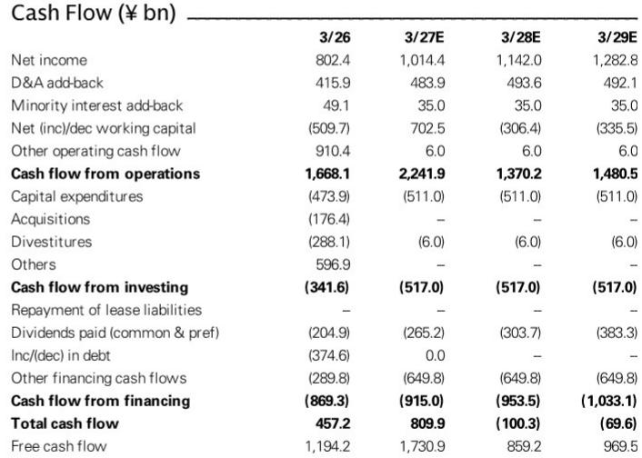
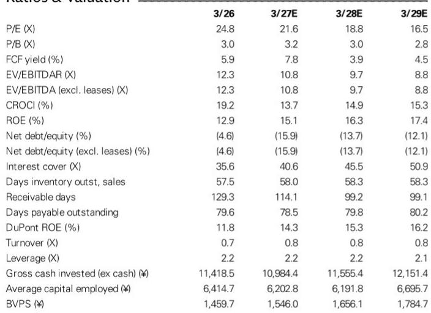
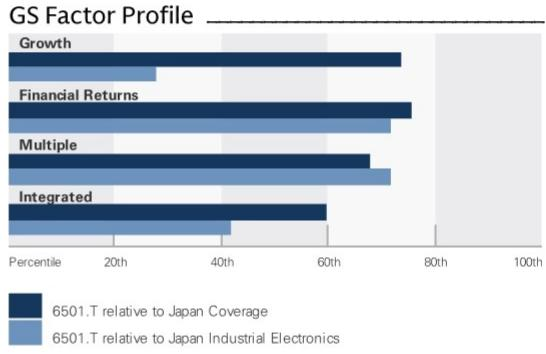

# Hitachi's Energy Business Is No Longer a Cyclical Play — It Is the Structural Growth Engine Reshaping the Entire Company's Market Position

Hitachi reported first-quarter results that exceeded expectations on both sales and adjusted operating profit, with sales of ¥2,709.5 billion against a consensus estimate of ¥2,356.7 billion and adjusted operating profits of ¥294.3 billion versus the ¥250.6 billion Bloomberg consensus. The company raised its full-year guidance for sales to ¥11.7 trillion and adjusted EBITA to ¥1,520 billion, up from ¥11.1 trillion and ¥1,420 billion respectively. The most important detail is where the revision came from: the Energy segment accounted for ¥76 billion of the ¥100 billion upward adjustment to adjusted EBITA guidance. This is not a diversified conglomerate bumping up numbers across the board. It is a single segment — one that barely existed in its current form five years ago — pulling the entire corporation upward.

Observers have long treated Hitachi as a restructuring story, a sprawling Japanese industrial conglomerate slowly shedding legacy businesses and improving margins. That narrative is now outdated. The company has become a concentrated bet on the global electrification and power infrastructure cycle, and the data from this quarter suggests the cycle is accelerating faster than management itself anticipated. The implications for revenue growth, margin trajectory, and market valuation are more profound than a simple guidance raise implies.

The Energy segment posted sales of ¥911.9 billion, adjusted EBITA of ¥129.0 billion, and orders up 87% year-over-year — or 94% excluding nuclear. The order backlog reached ¥10.3 trillion, up 12% from the end of the prior fiscal year. Management had assumed year-over-year sales growth in the high teens for the current fiscal year, but growth is currently running above 20% even on a USD basis. The company explicitly stated that if this trend continues into the next fiscal year, there could be upside to its medium-term outlook. That is a rare admission from a Japanese industrial management team, which typically under-promises and over-delivers only within a single fiscal year frame.

The critical strategic question is whether this performance is cyclical or structural. The evidence points strongly to structural. Global power grid investment is being driven by renewable energy integration, data center buildout, electric vehicle charging infrastructure, and the need to upgrade aging transmission and distribution networks in developed economies. These are not demand sources that will peak in two years. They are multi-decade investment cycles. Hitachi Energy, with its transformer, switchgear, and grid automation portfolio, sits directly in the path of that capital flow. The 87% order growth is not a one-quarter anomaly; it reflects a backlog that is now 11 times the segment's quarterly sales run rate.

## The Energy Segment Has Become the Dominant Driver of Group-Level Margin Expansion and Earnings Visibility

The numbers make the shift unmistakable. In the prior fiscal year, Energy contributed roughly 26% of group adjusted EBITA. Based on the revised guidance, that share will rise to approximately 38% in the current year. More importantly, the segment's margin trajectory is improving. Management cited three specific drivers: better margins on the order backlog, progress with AI utilization alongside the full-scale contribution of the ERP system introduced in FY3/25, and improved project management that minimizes the construction portion of EPC contracts. The last point is particularly important. By reducing the low-margin construction component and focusing on higher-margin equipment and system integration, Hitachi is structurally improving the quality of its Energy earnings.

The profit improvement is not speculative. The company's own guidance revision implies that Energy adjusted EBITA margins are expected to improve from roughly 12.5% in the prior year to approximately 14.2% in the current year. Given the order backlog composition and the operational leverage from capacity expansion, there is reasonable basis to expect further margin expansion in subsequent years. The analyst estimates reflect this, with adjusted operating profit forecasts for FY3/27 through FY3/29 raised by 6%, 5%, and 4% respectively.

The 800V DC rack architecture initiative provides a concrete window into the next growth phase. Hitachi is supporting technical studies for this next-generation data center power architecture, with industry forecasts suggesting adoption beginning around FY3/29. The company expects to begin demonstration tests for power conversion and grid interconnection systems in early 2027. This is not a speculative R&D project; it is a direct response to the power density requirements of AI data centers. Solid-state transformers, which integrate control, power electronics, and transformer technologies, represent a longer-term opportunity. Hitachi Energy has expertise across all three domains, positioning it to capture value as the technology transition occurs. Management acknowledges the transition will take time, but the direction of travel is clear: data center power demand is creating a new product cycle for the Energy segment.

## The Digital Systems & Services Segment Reveals a Divergent Picture: Domestic Strength Masks GlobalLogic's Structural Challenge

Digital Systems & Services reported sales of ¥719.0 billion and adjusted EBITA of ¥85.5 billion, slightly above sales expectations but below profit expectations. The domestic business was firm, driven by AI transformation demand in finance, public sector, and transportation. Finance was up 25% year-over-year, Social was up 10%, and Industrial was down 2%. Orders were flat year-over-year but up 10% excluding the impact of a drop-off in large-scale public sector orders.

The challenge is overseas. GlobalLogic, Hitachi's digital engineering subsidiary acquired in 2021, reported standalone sales of US$488 million, down 2% year-over-year, with profits also declining. The market environment remains challenging, and the company is strategically curbing low-margin projects. This is the right decision for margin quality, but it means the overseas DSS business is not contributing to growth in the near term.

The contrast with Energy could not be starker. Energy is firing on all cylinders globally. DSS overseas is in a deliberate contraction of low-quality revenue. The divergence has strategic implications for capital allocation. Hitachi has set a target for domestic DSS sales of up to ¥5 trillion, to be achieved through productivity improvements from AI utilization — productivity improved by about 10% as of end-FY3/26, with a target of 30% by FY3/28 — and inorganic investment. The appointment of Anand Birje as CEO of the Digital Engineering & AI Solutions business unit, which includes GlobalLogic and Hitachi Digital Services, signals that management is taking the challenge seriously. But the earnings data suggests that meaningful improvement in the overseas DSS business is still several quarters away.

The DSS guidance revision was modest: sales guidance raised from ¥3,190 billion to ¥3,220 billion, adjusted EBITA from ¥500 billion to ¥508 billion. The domestic SI & services business is performing well, but it cannot compensate for the global IT services slowdown. This segment is likely to remain a relative drag on group performance until the GlobalLogic business stabilizes and returns to growth.

## Mobility and Connective Industries Provide Diversification, but Neither Challenges Energy as the Primary Value Driver

Mobility, primarily railway systems, reported sales of ¥344.4 billion and adjusted EBITA of ¥30.4 billion, slightly above expectations. Performance was firm in Europe, supported by growth in the signaling and control business and a reduction in acquisition-related costs for the Thales GTS business. Orders were up 25% year-over-year, and the order backlog reached ¥7.4 trillion, up 5% from the end of the prior fiscal year. Guidance for Mobility sales and adjusted EBITA was raised to ¥1,450 billion and ¥136 billion respectively.

Connective Industries reported sales of ¥761.0 billion and adjusted EBITA of ¥83.4 billion, also above expectations. Contributions came from measurement and analysis systems, distribution transformers compliant with new energy-saving standards, and expansion of the building services business in China. Orders were up 25% year-over-year, with measurement and analysis systems up 55%. Guidance for the segment was raised to ¥3,250 billion in sales and ¥385 billion in adjusted EBITA.

These segments are performing well and contribute to the overall earnings picture. But they are not the reason the company deserves a re-assessment. Mobility is a high-backlog, steady-state business with limited margin expansion potential. Connective Industries is diverse and benefits from energy-efficiency regulation, but its growth rate and margin profile are below Energy's. The strategic center of gravity is clearly in Energy, and the discussion around valuation revolves around how much of that segment's growth is already priced in.

## A Framework for Observers: Reassess Hitachi as an Energy-Weighted Portfolio, Not a Diversified Industrial Conglomerate

The most useful way to think about Hitachi from an observation perspective is to decompose the company into three distinct portfolios and assess each on its own terms.

The first portfolio is Energy, which represents roughly 35% of group sales and 38% of adjusted EBITA based on the revised guidance. This portfolio deserves a premium assessment. It is growing revenue above 20% in USD terms, has an order backlog of 11 times quarterly sales, is expanding margins through operational leverage and mix improvement, and is positioned for multiple secular growth drivers including grid modernization, renewable energy integration, and data center power infrastructure. The 800V DC and solid-state transformer initiatives provide additional optionality. Comparable companies in the electrical equipment and grid infrastructure space trade at 25-35x forward earnings. Applying a 25x multiple to the Energy segment's earnings implies a standalone value that is significant relative to the current group market capitalization.

The second portfolio is DSS, representing roughly 27% of sales and 33% of adjusted EBITA. This portfolio is a mixed picture. The domestic business is solid, with AI transformation driving demand and productivity improvements providing margin upside. The overseas business, primarily GlobalLogic, is facing challenges. The segment as a whole deserves a lower multiple, perhaps 15-18x forward earnings, reflecting the growth uncertainty and competitive pressure in IT services. The key catalyst to watch is whether the GlobalLogic business can return to growth in the second half of the fiscal year and whether the AI productivity target of 30% by FY3/28 translates into visible margin improvement.

The third portfolio includes Mobility, Connective Industries, and other smaller businesses, representing roughly 38% of sales and 29% of adjusted EBITA. These are steady, capital-intensive businesses with moderate growth and limited margin expansion potential. They deserve single-digit or low-teens multiples. Mobility has a large order backlog but low margins. Connective Industries benefits from energy-efficiency trends but is diverse and difficult to model with precision.

When the portfolio is weighted this way, the implied group valuation becomes more attractive than a simple P/E multiple on consolidated earnings. The key assumption behind this perspective is that Energy's growth and margin trajectory continue, and that the market gradually assigns a higher multiple to the group as the Energy segment becomes a larger share of earnings.

There are risks. The Middle East impact, initially assumed at -¥40 billion on sales and -¥20 billion on adjusted EBITA, was only -¥16 billion and -¥7 billion in the first quarter, but geopolitical disruption remains unpredictable. The overseas DSS recovery could take longer than expected. And the Energy segment, despite strong orders, still faces execution risk in ramping capacity and delivering on the backlog at improving margins. But the direction of the evidence is clear: Hitachi is becoming a different company, and the case for observation rests on whether the market recognizes that transformation in the valuation.

*For informational purposes only. Portions may be generated, translated, summarized, or edited with AI assistance based on source materials and may contain omissions or errors. Please verify independently. This is not professional advice.*

For informational purposes only. Portions may be generated, translated, summarized, or edited with AI assistance based on source materials and may contain omissions or errors. Please verify independently. This is not professional advice.

