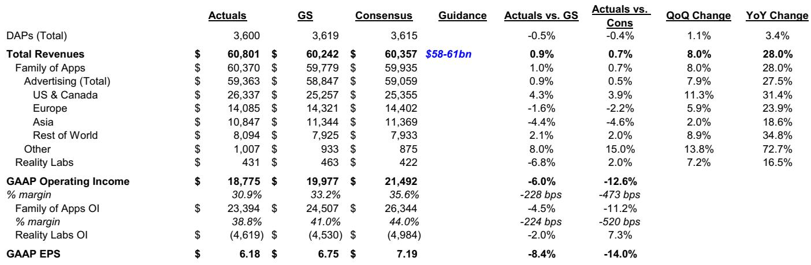
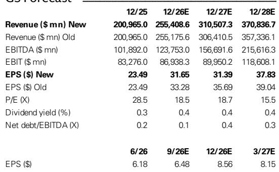
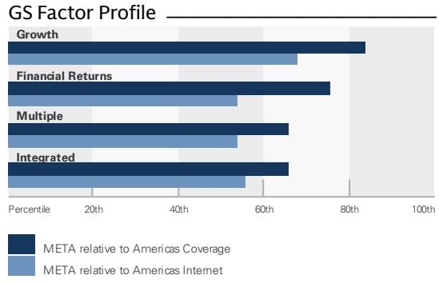

# GS：Meta业务与近期数据观察

Meta在Q2 2026财报中传递了一个清晰但尚未完全被市场消化的信号：AI驱动的计算研究已经在核心广告业务中产生可量化的回报，但管理层对长期资本支出的框架仍停留在定性描述阶段。这份GS研报的核心判断是，Meta正在用短期收入增长和广告效率提升来证明其AI投入的合理性，但读者对2027-2028年资本支出路径的疑虑并未消除。

报告将Meta管理层传达的信息归纳为四个层次：AI研究通过参与度、提到系统、广告表现和变现效率在核心应用家族中持续产生健康回报；AI代理作为核心业务之外的延伸，正在成为规模化AI投入的可见路径；企业级AI机会涵盖基础模型API、业务构建工具和计算直接变现，但研究规模与变现路径仍不清晰；基础设施研究维持高位，但长期资本计划缺乏具体框架。GS因此将2027-2028年累计资本支出预测上调约14%。

> **KC评论：** 这份报告最值得关注的是管理层“短期优先建设计算能力”的表述。这意味着2026-2027年的运营支出和资本支出相对额可能继续上升，而非市场此前预期的增速节奏变化。读者需要重新评估Meta未来两年的自由现金流轨迹。

## 1. 核心广告业务提供AI投入回报的早期证据

Meta Q2广告收入同比增长28%，这一增速由广泛的应用家族参与度提升和变现效率改善共同支撑。AI驱动的广告工具Advantage+在Q2已达到750亿美元年化收入规模。管理层明确表示，内容提到改进和变现效率提升是收入表现的主要驱动力。

这些数据构成了Meta当前叙事的基础：AI投入不是纯粹的前瞻性押注，而是已经在核心业务中产生可测量的回报。GS认为，这为管理层继续扩大AI相关支出提供了短期合理性。

## 2. AI代理成为核心业务之外最清晰的变现路径

管理层在电话会上勾勒了AI代理的多种变现可能性：面向消费者的个性化AI代理、为现有广告主和创作者提供的AI工具、以及面向中小企业的自动化解决方案。这些机会对应着订阅制、使用量定价和结果导向型商业模式。

报告特别指出，AI代理是Meta从“提升现有业务效率”向“创造新收入来源”过渡的关键环节。但GS也承认，这些变现路径目前仍处于框架描述阶段，缺乏具体的收入贡献数据。

## 3. 企业级AI机会范围广泛但路径不清晰

Meta将企业级AI机会分为三个层次：基础模型API服务、帮助企业构建和规模化运营的工具（“业务即服务”模式）、以及计算能力的直接变现（如云许可协议）。这一框架覆盖了从技术输出到运营服务的完整链条。

但报告同时指出，读者最关心的问题——建设这些业务所需的研究规模以及变现的时间表——管理层并未给出明确答案。GS认为，这种不确定性可能在短期内继续影响市场情绪。

## 4. 资本支出峰值预期被推迟，自由现金流承压

GS将Meta 2027-2028年累计资本支出预测上调约14%，主要依据是管理层对市场机会的定性描述以及持续的供需失衡。报告中的财务模型显示，资本支出占收入比例将从2025年的35.9%上升至2027年的70.9%，随后在2028年回落至62.4%。

自由现金流的变化更为直观：2025年为461亿美元，2026年骤降至139亿美元，2027年预计为负值。折旧与摊销从2025年的186亿美元快速攀升至2028年的970亿美元，这意味着即使收入保持增长，账面利润也将承受巨大不确定性。

> **KC评论：** 自由现金流从正转负的时间窗口是这份报告最容易被忽略的细节。2027年负自由现金流意味着Meta可能需要依赖外部融资或调整资本配置优先级来维持研究节奏。这对关注公司财务弹性的读者是一个重要观察点。

## 5. 管理层优先短期计算建设，而非长期平衡

报告中最具洞察力的判断来自管理层的一个表述：在短期内，建设并规模化计算能力比长期平衡更重要。GS将其解读为2026-2027年运营支出和资本支出相对额将继续面临上行不确定性，直到增速在更远的未来节奏变化。

这一立场意味着Meta正在主动选择牺牲短期利润率和自由现金流，以换取AI基础设施的先发优势。GS认为，如果Meta能够证明其计算投入的回报率高于成本，这将成为推动市场重新定价的催化剂。

## 6. 读者需要关注的三个关键辩论

GS将未来12-18个月读者对Meta的审视框架归纳为三个核心问题：未来12-18个月研究的速度和规模；AI计算在核心应用家族内外的新变现机会的发展；公司如何利用内部和外部融资选项来支持这些研究。

报告认为，这些辩论可能在短期内继续影响报价表现，但当前市场定价低估了Meta在未来12-18个月内将计算能力产品化和变现的能力。GS维持其对公司长期结构性增长主题的定位。

For informational purposes only. Portions may be generated,translated,summarized,or edited with AI assistance based on source materials and may contain omissions or errors. Please verify independently. This is not investment,legal,tax,accounting,or other professional advice.

For informational purposes only. Portions may be generated,translated,summarized,or edited with AI assistance based on source materials and may contain omissions or errors. Please verify independently. This is not investment,legal,tax,accounting,or other professional advice.

