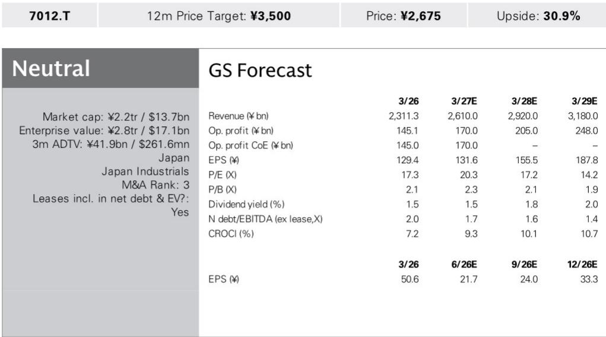
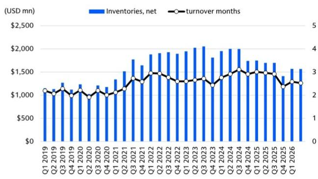
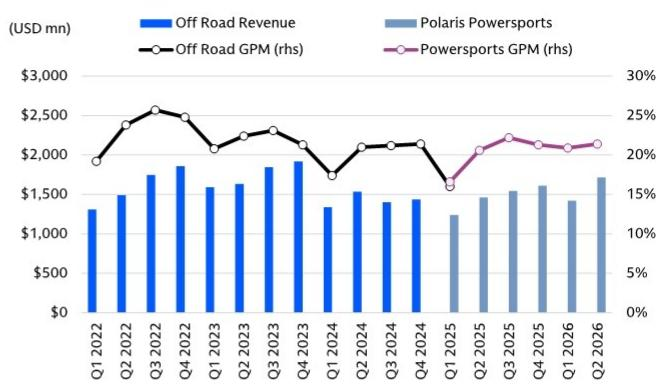

# 跨境贸易与行业变化观察

Polaris二季度财报中一个容易被忽略的细节，是IEEPA关税退税被正式确认入账。这家川崎重工在四轮车领域的直接竞争对手，二季度调整后EBITDA利润率同比回升540个基点至11.8%，即便剔除7400万美元的关税退税，利润和利润率仍实现同比增长。这份研究笔记的核心判断是：Polaris的业绩改善并非完全依赖一次性退税，其业务环境本身在好转，这对川崎重工的动力运动与发动机业务具有参照意义。

## 1. 关税退税入账但非利润改善的相对少见驱动

Polaris二季度调整后销售额20.23亿美元，同比增长9%，有机增长达17%。利润增长来自销量提升、产品组合优化、净定价改善以及关税退税四个因素。研究笔记特别指出，剔除退税后公司仍实现同比利润增长和利润率改善，并据此上调了全年指引。这意味着，即便后续退税效应消退，Polaris的盈利基础可能已经得到一定修复。对于川崎重工而言，目前其1Q3/27的PS&E部门利润预估为70亿日元，并未计入任何IEEPA关税退税影响。如果川崎重工也能在同期获得类似退税，则存在向上修正的空间。

> **观察评论：** 这里的关键不是退税金额本身，而是Polaris在没有退税的情况下也能实现利润增长。这暗示北美四轮车市场的定价环境和成本结构可能在改善，而不仅仅是政策红利。

## 2. 北美ORV市场份额连续五个季度提升

Polaris动力运动部门二季度销售额17.15亿美元，同比增长17%，毛利率21.4%，同比提升77个基点。其中ORV零售单位销量同比增长5%，而整体市场仅录得低个位数增长。Polaris已连续五个季度实现市场份额提升，尤其在utility ORV领域录得两位数同比增长。这一趋势对川崎重工构成直接竞争不确定性。研究笔记明确表示将密切关注川崎摩托车的市场份额变化。川崎重工在北美摩托车零售的移动年总量趋势，以及side-by-side车型的同比零售单位趋势，将是后续观察的重点。

## 3. 促销费用和库存周期仍是关键变量

Polaris管理层预计下半年销售额同比持平，但净定价有望受益于促销费用下降等因素。如果川崎重工的新车型推广顺利，其销售促销费用可能低于当前预估，从而为全年PS&E部门260亿日元的利润预估（公司指引为300亿日元）带来上行空间。研究笔记同时提示，Polaris在utility ORV领域的份额增长趋势值得持续跟踪。川崎重工当前PS&E部门利润预估为70亿日元，低于上年同期的80亿日元，主要反映持续高企的促销费用和关税影响。

## 4. 一个可复用的观察框架：竞争对手财报的交叉验证

这份研究笔记提供了一个实用的分析思路：当一家公司的业务与竞争对手高度重叠时，竞争对手的季度财报可以成为验证自身假设的“前哨”。Polaris的业绩改善——无论是关税退税的确认、市场份额的连续提升，还是促销费用可能下降的信号——都为评估川崎重工PS&E部门的短期利润走向提供了参照系。读者可以关注川崎重工后续季度中，其北美零售数据、促销费用变化以及是否确认关税退税，来验证或修正当前预估。

For informational purposes only. Portions may be generated,translated,summarized,or edited with AI assistance based on source materials and may contain omissions or errors. Please verify independently. This is not investment,legal,tax,accounting,or other professional advice.

For informational purposes only. Portions may be generated,translated,summarized,or edited with AI assistance based on source materials and may contain omissions or errors. Please verify independently. This is not investment,legal,tax,accounting,or other professional advice.

