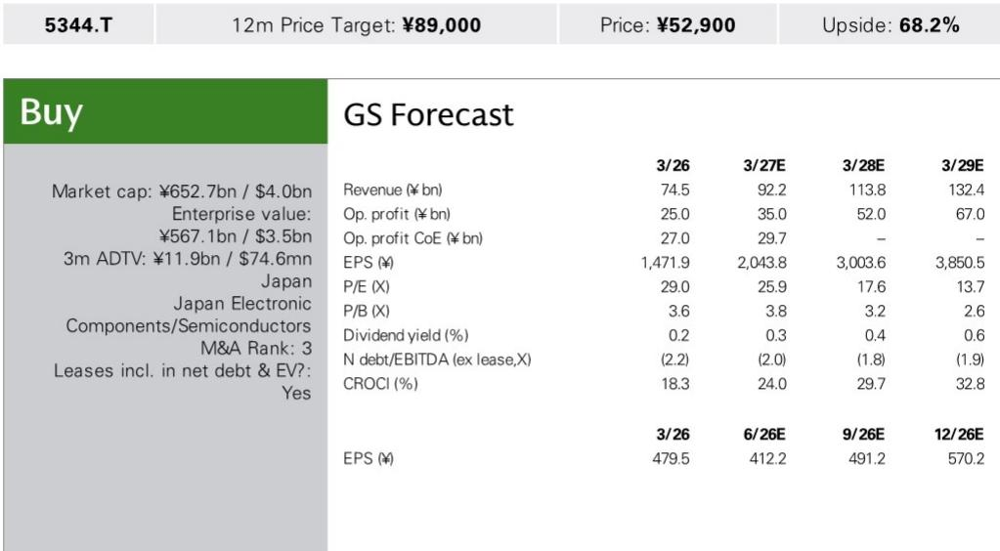
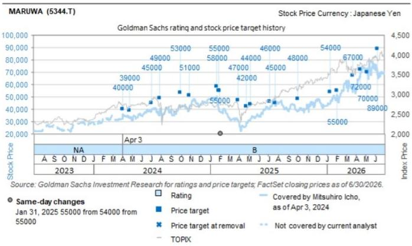

# GS：MARUWA 1Q与AI及近期数据观察

日本电子元器件制造商MARUWA在7月29日盘中发布了2027财年第一季度业绩。营业利润63亿日元，低于GS此前预期的70亿日元。但公司同时将全年营业利润指引从297亿日元上调至337亿日元，汇率假设从153日元/美元调整为158日元/美元。GS更新公司观点，认为1Q的利润缺口已在预期之内，而全年指引上调的核心驱动力是AI应用订单的确认和交付日期锁定。

这份报告的关键信号在于：1Q的利润低于预期并非需求问题，而是库存结构问题。公司明确表示，低利润率AI相关产品的库存已在1Q基本消化完毕，生产端的良率问题也已解决。这意味着从2Q开始，出货结构将转向更高利润率的产品组合。

## 1. 1Q利润缺口源于低利润率库存出货，而非需求变化

1Q营业利润低于GS预期约7亿日元，主要原因是公司在一季度出货了部分4Q26（1-3月）生产的低利润率库存产品。这类产品在上一季度生产时成本较高，但售价按当前订单结算，导致当季利润率被拉低。

报告同时指出，生产端的良率问题已在1Q得到解决，低利润率AI相关库存几乎全部出清。GS认为这一利润缺口符合其此前预期，并非意外。公司报价在业绩公布后下跌约5%，但GS将其视为一个观察节点。

> **KC评论：** 1Q利润低于预期但全年指引上调，这种组合通常意味着公司对后续季度有较高能见度。关键在于低利润率库存出清后，2Q起的出货结构将如何变化——这比单季利润数字本身更重要。

## 2. AI应用全年销售指引弹性较高，半导体应用复苏提前至2Q

按应用领域拆分，1Q销售额中通信约92亿日元（其中AI约60亿日元），汽车约35亿日元，半导体约23亿日元，工业设备约20亿日元。全年指引中，通信领域销售增速上调至接近同比+50%，其中AI应用指引超过弹性较高，达到约310亿日元。

半导体应用的复苏时间点被提前。公司此前预期半导体业务在2H恢复，现在认为2Q即可看到改善，并指出2Q半导体销售额可能达到30亿日元。半导体应用的订单量处于历史最高水平。汽车领域增速维持在同比略超+5%，半导体领域接近+20%。

## 3. 产能扩张与订单能见度构成公司层面的增长驱动

报告强调，MARUWA正在进入一个由公司特定因素驱动的AI应用销售加速期。这些因素包括产能扩张（Seto第二工厂预计在2H开始全面贡献销售），以及AI产品市场本身的扩张。公司表示，全年指引上调是基于订单和交付日期的确认，而非预测性假设。

GS认为，这些公司层面的因素——产能到位、订单确认、库存出清——叠加在一起，构成了一个与单纯行业贝塔不同的增长逻辑。半导体应用的订单创历史新高，也说明下游需求并非仅限于AI一个领域。

## 4. 估值框架与关键假设

基于FY28 EBITDA和12.5x EV/EBITDA倍数。这一倍数来自历史EBITDA利润率与EV/EBITDA倍数的相关性分析。报告列出的主要不确定性包括：终端应用（AI/通用服务器、xEV、SPE）研究低于预期、供应链中断和库存调整导致终端需求下降、以及替代技术的出现。

对于关注日本电子元器件产业链的读者，这份报告提供了一个观察框架：当一家公司的产能扩张节奏、订单能见度和库存周期同时指向一个方向时，单季度的利润波动可能并不改变中期趋势。关键变量在于2Q起的产品组合变化和半导体应用的复苏能否如期兑现。

For informational purposes only. Portions may be generated,translated,summarized,or edited with AI assistance based on source materials and may contain omissions or errors. Please verify independently. This is not investment,legal,tax,accounting,or other professional advice.

For informational purposes only. Portions may be generated,translated,summarized,or edited with AI assistance based on source materials and may contain omissions or errors. Please verify independently. This is not investment,legal,tax,accounting,or other professional advice.

