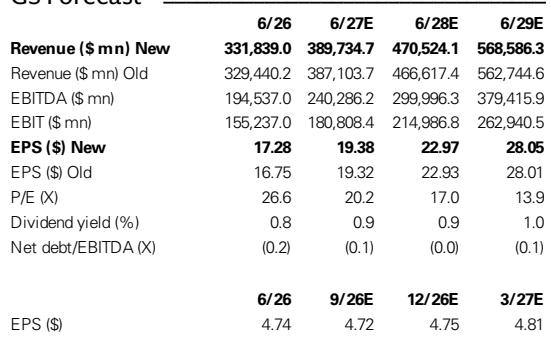
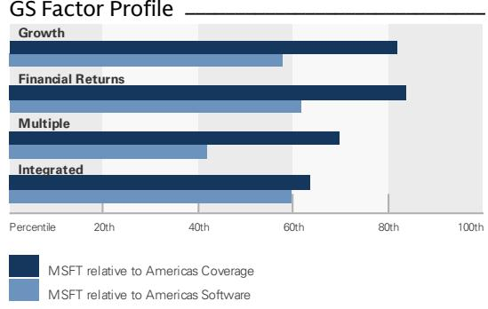
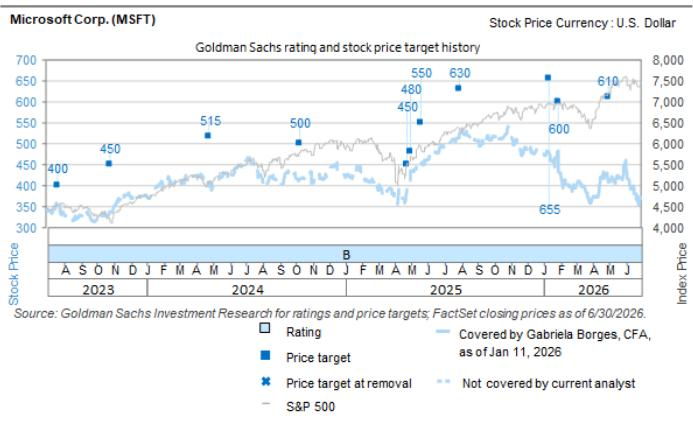

# GS：微软在企业AI生态角色从模型转向生态中枢

微软4QFY26财报公布后，盘后报价上涨约7%。这份GS研报的核心判断是：微软正在用一份超预期的季度数据，回应市场过去几个季度对其AI投入回报的持续关注。4Q营收900亿美元（同比+17%），非GAAP EPS 4.74美元（同比+23%），分别超出市场预期3%和11%。但比数字更重要的是，微软在三个关键讨论点上提供了可验证的证据：Azure加速增长伴随产能约束、AI单位宏观环境改善且云利润率稳定、Copilot货币化路径日益清晰。

研报认为，企业AI采购的重心正在从“选择哪个前沿模型”转向“选择哪个前沿生态”。微软的角色因此变得更加战略性。

## 1. Azure加速增长背后有多重货币化杠杆

Azure在4Q以43%的恒定汇率增速超出市场预期的40%，且是在持续面临GPU产能约束和第一方模型占用算力的背景下实现的。GS分析师指出，市场对通胀推高资本开支的影响已有充分预期（约对CY26资本开支产生14%的影响），但微软内部利润率目标并未因组件涨价而调整。

微软提供了几个改善Azure货币化的具体数据点：GPU的上线时间缩短了近50%，持续的成本优化正在推进，以及针对GitHub高级用户、PaaS和CPU相关服务的精细化定价与捆绑策略。报告提出一个值得关注的后续变量：定价改进、自研芯片和模型多样化能否在FY27推动利润率出现阶跃式变化。

> **KC评论：** 这里的关键不是Azure增速本身，而是微软在产能受限的情况下仍能加速增长，说明需求端比供给端更强劲。读者需要跟踪的是，当产能瓶颈逐步缓解后，Azure增速能否维持甚至进一步上行。

## 2. Copilot付费席位季度净增超1000万，采用模式从座位数转向消费量

微软4Q末拥有超过3000万付费Copilot席位，季度净增超过1000万，是上一季度的两倍以上。用户满意度评分在过去三个季度弹性较高，人均对话次数同比增长约2倍，平均参与度已接近Outlook和Teams的水平。

更重要的结构性变化是，微软预计M365商业云增速将在整个FY27加速，驱动力来自Copilot采用、E5和E7等高端SKU组合，以及基于消费的货币化机会。E7上线两个月后已被数百家企业客户采用，覆盖数百万席位，其中安永一家就部署了40万席位。

GitHub最近转向新定价框架后，消费收入增长且利润率改善，为Copilot货币化从纯座位订阅转向“座位+消费”模式提供了先例。研报认为，这种模式切换实质上是微软可寻址市场的扩张——当定价从按人头转向按工作单元，企业嵌入Copilot的深度将决定收入天花板。

## 3. 企业模型策略分化，微软生态定位成为差异化优势

GS在季度内的行业交流中观察到，企业正在形成更精细的模型策略：并非所有token都同等重要，企业开始区分哪些请求路由到前沿模型、哪些使用开源模型或小型语言模型。微软的前沿工程师部署计划（Frontier program）和模型路由能力，使其能够根据上下文为不同请求匹配最合适的模型，同时为客户实现token效率优化。

这意味着，当企业不再只依赖单一模型时，微软作为提供多种模型选择、开发工具、数据层和部署基础设施的生态平台，其战略价值反而上升。研报认为，微软在AI生态中的角色正变得比单一模型提供商更具粘性。

## 4. 资本开支仍在高位，但自由现金流边际改善

4Q资本开支410亿美元（同比+69%），略低于市场预期的424亿美元。自由现金流196亿美元（同比-23%），但显著高于市场预期的134亿美元。GS将FY27至FY29的营收预测上调至3900亿、4710亿和5690亿美元，EPS预测上调至19.38、22.97和28.05美元，估值倍数维持28倍PE不变。

研报列出的主要节奏变化不确定性包括：自研芯片爬坡周期较长可能限制市场份额或毛利率扩张、非Azure领域的研究超出预期、关键管理层变动、以及定制软件趋势对应用业务的潜在冲击。

For informational purposes only. Portions may be generated,translated,summarized,or edited with AI assistance based on source materials and may contain omissions or errors. Please verify independently. This is not investment,legal,tax,accounting,or other professional advice.

For informational purposes only. Portions may be generated,translated,summarized,or edited with AI assistance based on source materials and may contain omissions or errors. Please verify independently. This is not investment,legal,tax,accounting,or other professional advice.

