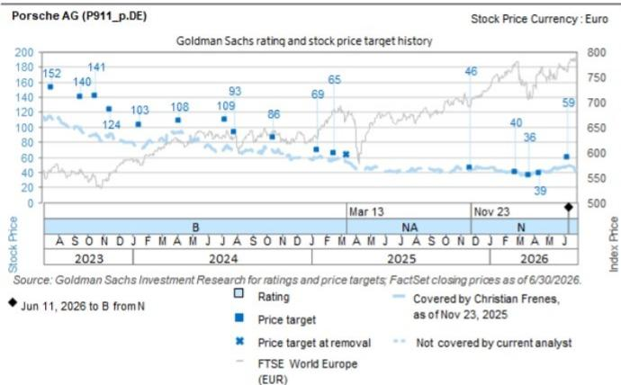

# Porsche AG (P911_p.DE): 2Q26 利润率表现超预期，核心业务稳健，汽车业务现金流高于预期

保时捷股份公司于今日（7月29日）公布了2026年第二季度业绩。受911车型产品组合的推动（符合我们的研究判断），其核心业务表现更为强劲，市场对保时捷2026年每股回报的普遍预期可能小幅上调。我们维持对该公司的积极看法。

**第二季度业绩超预期：** 保时捷股份公司第二季度集团息税前利润为7.53亿欧元，高于公司汇总的普遍预期（7.13亿欧元 / 我们的预期为7.85亿欧元）。营业收入符合市场普遍预期（88.0亿欧元 / 我们的预期为92.4亿欧元），使得第二季度利润率达到8.5%（市场预期8.1%，我们的预期8.5%）。本季度受到约3亿欧元重组费用的影响，但该费用已被约3亿欧元的准备金释放完全抵消。得益于高端911车型（GTS、Turbo和GT车型）的强劲占比，本季度单车收入为12.6万欧元，高于我们的预期（12.5万欧元）。保时捷第二季度每股回报为0.81欧元（市场预期0.57欧元，我们的预期0.64欧元），受益于17%的较低税率（我们预期为30%）。

**汽车业务净现金流高于预期，得益于运营和营运资本的改善：** 保时捷第二季度汽车业务净现金流为5.06亿欧元，低于市场普遍预期（6.08亿欧元），但高于我们的估计（3.44亿欧元），主要得益于运营业务的改善和营运资本的贡献，但同时也受到约3亿欧元养老金负债的影响。第二季度，公司研发支出为5.17亿欧元（我们预期为5.96亿欧元），资本化率为38.5%（我们预期为43%），导致损益表面临约-1.65亿欧元（我们预期为-1.31亿欧元）的压力。这使得净现金流利润率为6.5%，高于全年3-5%的指引区间。

**2026年指引维持不变：** 保时捷股份公司维持其2026年全年指引，预计营业收入在350-360亿欧元之间，集团销售回报率在5.5%-7.5%之间。对于汽车业务EBITDA，公司继续预期利润率为15%-17%。对于2027年，公司表示将继续进行数亿欧元的重组。

**电话会议关键问题：** 1) 实现利润率回升至10%以上的路径与时间点，以及迈向中期指引（最高15%）的后续步骤；2) 现金流指引的关键支柱及布加迪股权出售的流入；3) 重组及其他特殊项目在2026年的持续影响更新；4) 近期车型发布计划及产品组合展望；5) 关税缓解措施的更新。

Christian Frenes  
+44(20)7051-8641 |  
christian.frenes@gs.com  
GS International

Robert Triulzi  
+44(20)7552-2281 | robert.triulzi@gs.com GS International

Shivam Kotecha
+1(332)245-7822 |
shivam.kotecha@gs.com
GS India SPL

Monika Mengting Liu, CFA
+44(20)7051-7601 | monika.liu@gs.com
GS International

# 保时捷股份公司 2026年第二季度业绩

## 报告数据与预期及市场共识对比

图表1：保时捷股份公司2026年第二季度业绩 vs. 我们的预期及公司汇总市场共识

<table><tr><td rowspan="2">百万欧元</td><td colspan="5">2026年第二季度</td><td colspan="3">2026年预期</td></tr><tr><td>报告值</td><td>我们的预期</td><td>市场共识</td><td>报告值 vs. 我们的预期</td><td>报告值 vs. 市场共识</td><td>我们的预期</td><td>市场共识</td><td>我们的预期 vs. 市场共识</td></tr><tr><td>营业收入</td><td>8,829</td><td>9,236</td><td>8,804</td><td>-4.4%</td><td>0.3%</td><td>36,039</td><td>35,129</td><td>2.6%</td></tr><tr><td>营业利润</td><td>753</td><td>785</td><td>713</td><td>-4.1%</td><td>5.6%</td><td>2,284</td><td>2,252</td><td>1.4%</td></tr><tr><td>营业利润率, %</td><td>8.5%</td><td>8.5%</td><td>8.1%</td><td>0.0pp</td><td>0.4pp</td><td>6.3%</td><td>6.4%</td><td>-0.1pp</td></tr><tr><td>每股回报</td><td>0.81</td><td>0.64</td><td>0.57</td><td>26.3%</td><td>42.5%</td><td>2.32</td><td>1.82</td><td>27.3%</td></tr><tr><td>每股分红</td><td>不适用</td><td>不适用</td><td>不适用</td><td>不适用</td><td>不适用</td><td>1.20</td><td>1.04</td><td>15.4%</td></tr><tr><td colspan="9">汽车业务</td></tr><tr><td>汽车业务收入</td><td>7,777</td><td>8,243</td><td>7,800</td><td>-5.7%</td><td>-0.3%</td><td>31,944</td><td>30,912</td><td>3.3%</td></tr><tr><td>汽车业务EBITDA</td><td>1,496</td><td>1,557</td><td>1,429</td><td>-3.9%</td><td>4.7%</td><td>5,353</td><td>5,232</td><td>2.3%</td></tr><tr><td>汽车业务EBITDA利润率, %</td><td>19.2%</td><td>18.9%</td><td>18.3%</td><td>0.3pp</td><td>0.9pp</td><td>16.8%</td><td>16.9%</td><td>-0.2pp</td></tr><tr><td>汽车业务营业利润</td><td>691</td><td>704</td><td>631</td><td>-1.8%</td><td>9.5%</td><td>2,005</td><td>1,923</td><td>4.2%</td></tr><tr><td>汽车业务营业利润率, %</td><td>8.9%</td><td>8.5%</td><td>8.1%</td><td>0.3pp</td><td>0.8pp</td><td>6.3%</td><td>6.2%</td><td>0.1pp</td></tr><tr><td>汽车业务净现金流</td><td>506</td><td>344</td><td>608</td><td>47.2%</td><td>-16.8%</td><td>1,020</td><td>1,352</td><td>-24.6%</td></tr><tr><td>汽车业务净现金流利润率, %</td><td>6.5%</td><td>4.2%</td><td>7.8%</td><td>2.3pp</td><td>-1.3pp</td><td>3.2%</td><td>4.4%</td><td>-1.2pp</td></tr><tr><td>交付量 (千辆)</td><td>61</td><td>66</td><td>62</td><td>-6.8%</td><td>-1.1%</td><td>250</td><td>248</td><td>1.1%</td></tr></table>

来源：公司数据，GS全球投资研究，Visible Alpha共识数据

## 估值与主要风险

我们继续基于远期市盈率对保时捷进行估值，对其2027/2028财年混合每股回报应用20倍的目标倍数，得出12个月目标报价为57欧元。

## 下行风险：

- **新产品发布和交付时间表延迟：** 无论是由于监管、供应商还是开发方面的挫折，任何预期的产品发布进一步推迟，都将延长现有的销量缺口，并延迟预期的交付/利润率恢复。

- **关键细分市场竞争加剧：** 来自传统欧洲性能车同行以及向高端市场进军的资本雄厚的中国电动汽车新进入者的压力加大，可能会削弱我们研究判断所依赖的定价能力和平均售价增长假设。

- **纯电动和内燃机车型交付增长放缓及供需错配：** 更快的电动化监管推动或消费者对纯电动车型的接受速度放缓，可能导致库存失衡，从而在纯电动车型上出现稀释利润率的折扣，同时内燃机车型提前退出。

- **交付不足或纯电动车型毛利率低于预期导致盈利能力下降：** 如果由于电池成本上升、平台经济性不佳或竞争性定价压力导致纯电动车型的单位经济效益令人失望，那么911车型组合正常化所带来的抵消作用可能不足以维持集团层面的利润率目标。

- **在华业务持续调整：** 由于豪华车税率门槛进一步调整、来自中国高端制造商的国内竞争加剧，或更广泛的宏观环境变化，可能导致保时捷在华交付量显著低于我们的基准情形。

- **未能确保原材料供应：** 地缘政治紧张局势、出口限制或采购集中风险导致的供应中断，可能在生产延迟和投入成本上升，因为保时捷正朝着其中期目标扩大纯电动车型的生产。

<table><tr><td>P911_p.DE</td><td>12个月目标报价: €57.00</td><td colspan="2">报价: €44.86</td><td colspan="2">潜在空间: 27.1%</td></tr><tr><td>积极</td><td colspan="5">GS预测</td></tr><tr><td></td><td></td><td>12/25</td><td>12/26E</td><td>12/27E</td><td>12/28E</td></tr><tr><td>市值: €409亿 / $465亿</td><td>营业收入 (百万欧元)</td><td>36,272.0</td><td>36,038.7</td><td>35,677.8</td><td>37,601.6</td></tr><tr><td>企业价值:</td><td>息税前利润 (百万欧元)</td><td>413.0</td><td>2,284.4</td><td>3,034.9</td><td>4,036.0</td></tr><tr><td>€507亿 / $579亿</td><td>每股回报 (欧元)</td><td>0.47</td><td>1.84</td><td>2.46</td><td>3.27</td></tr><tr><td>3个月日均交易量: €2440万 / $2820万</td><td>EV/EBITDA (倍)</td><td>8.5</td><td>7.3</td><td>6.3</td><td>5.4</td></tr><tr><td>德国</td><td>市盈率 (倍)</td><td>100.2</td><td>24.4</td><td>18.2</td><td>13.7</td></tr><tr><td>欧洲汽车</td><td>股息率 (%)</td><td>2.1</td><td>2.7</td><td>2.9</td><td>3.3</td></tr><tr><td>并购排名: 3</td><td>自由现金流回报表现 (%)</td><td>0.8</td><td>1.5</td><td>5.0</td><td>7.0</td></tr><tr><td>租赁包含在净债务及企业价值中?:</td><td>CROCI (%)</td><td>10.3</td><td>8.7</td><td>9.9</td><td>10.4</td></tr><tr><td>是</td><td>净债务/EBITDA (倍)</td><td>1.1</td><td>0.9</td><td>0.7</td><td>0.4</td></tr><tr><td></td><td></td><td>3/26</td><td>6/26E</td><td>9/26E</td><td>12/26E</td></tr><tr><td></td><td>每股回报 (欧元)</td><td>0.44</td><td>0.64</td><td>0.28</td><td>0.96</td></tr></table>

来源：公司数据，GS预测，FactSet。报价截至2026年7月28日收盘。

## 披露附录

## Reg AC

我们，Christian Frenes, Robert Triulzi, Shivam Kotecha 和 Monika Mengting Liu, CFA，特此证明本报告中表达的所有观点准确反映了我们个人对相关公司及其证券的看法。我们还证明，我们的薪酬中没有任何部分直接或间接地与报告中表达的具体建议或观点相关。

除非另有说明，本报告封面所列人员为GS全球投资研究部分析师。

撰稿作者：Christian Frenes GS International, Robert Triulzi GS International, Shivam Kotecha GS India SPL, Monika Mengting Liu, CFA GS International。

除非另有说明，本报告撰稿作者披露中列出的人员为GS全球投资研究部分析师。

## GS因子概况

GS因子概况通过将股票的关键属性与市场（即我们的评级股票池）及其行业同行进行比较，提供投资背景。所描绘的四个关键属性是：增长、财务回报、倍数（例如估值）和综合（增长、财务回报和倍数的复合）。增长、财务回报和倍数是通过对每只股票的特定指标使用标准化排名来计算的。然后将指标的标准化排名进行平均，并转换为相关属性的百分位数。每个指标的具体计算可能因财年、行业和地区而异，但标准方法如下：

增长基于股票的前瞻性销售增长、EBITDA增长和每股回报增长（对于金融股，仅基于每股回报和销售增长），百分位数越高表示公司增长越高。财务回报基于股票的前瞻性ROE、ROCE和CROCI（对于金融股，仅基于ROE），百分位数越高表示公司财务回报越高。倍数基于股票的前瞻性市盈率、市净率、价格/股息、EV/EBITDA、EV/FCF和EV/债务调整后现金流（对于金融股，仅基于市盈率、市净率和价格/股息），百分位数越高表示股票交易倍数越高。综合百分位数计算为增长百分位数、财务回报百分位数和（100% - 倍数百分位数）的平均值。

财务回报和倍数使用GS分析师对未来至少三个季度后的财年末的预测。增长使用对未来至少七个季度后的财年与未来至少三个季度后的财年相比的输入（所有指标均基于每股）。

有关我们如何计算GS因子概况的更详细说明，请联系您的GS代表。

## 并购排名

在我们的全球覆盖范围内，我们使用并购框架审视股票，考虑定性因素和定量因素（可能因行业和地区而异），以纳入某些公司可能被收购的可能性。然后，我们将并购排名作为对我们评级覆盖范围内的公司进行评分的一种方式，从1到3，其中1表示公司成为收购目标的可能性较高（30%-50%），2表示可能性中等（15%-30%），3表示可能性较低（0%-15%）。对于排名为1或2的公司，根据我们标准部门指引，我们将并购组成部分纳入我们的目标报价。并购排名为3被视为不重要，因此不计入我们的报价目标，并且可能在研究中讨论或不讨论。

## Quantum

Quantum是GS的专有数据库，提供详细的财务报表历史、预测和比率。它可用于对单一公司进行深入分析，或比较不同行业和市场的公司。

## 披露信息

保时捷股份公司的评级是相对于其覆盖范围内的其他公司而言的：阿斯顿·马丁拉贡达全球控股公司、宝马、法拉利NV、梅赛德斯-奔驰集团股份公司、保时捷股份公司、雷诺、斯特兰蒂斯NV、大众汽车

## 公司特定监管披露

以下披露涉及GS集团（及其关联公司，“GS”）与GS全球投资研究所涵盖的公司之间的关系，并在此研究中提及。

GS在过去12个月内因投资银行服务获得报酬：保时捷股份公司（€44.86）

GS预计在未来3个月内将寻求或打算寻求投资银行服务的报酬：保时捷股份公司（€44.86）

GS在过去12个月内与保时捷股份公司（€44.86）存在投资银行服务客户关系

GS在过去12个月内与保时捷股份公司（€44.86）存在非投资银行证券相关服务客户关系

GS在过去12个月内与保时捷股份公司（€44.86）存在非证券服务客户关系

评级/投资银行关系分布 GS投资研究全球股票覆盖范围

<table><tr><td rowspan="2"></td><td colspan="3">评级分布</td><td colspan="3">投资银行关系</td></tr><tr><td>积极</td><td>中性</td><td>消极</td><td>积极</td><td>中性</td><td>消极</td></tr><tr><td>全球</td><td>50%</td><td>34%</td><td>16%</td><td>65%</td><td>59%</td><td>43%</td></tr></table>

截至2026年7月1日，GS全球投资研究对3,104只股票进行了投资评级。GS将股票指定为各种区域投资清单上的积极和消极；未如此指定的股票被视为中性。就FINRA规则要求的上述披露而言，此类指定等同于积极、持有和消极。请参阅下面的“评级、覆盖范围和相关定义”。投资银行关系图表反映了每个评级类别中GS在过去十二个月内提供过投资银行服务的标的公司的百分比。

## 报价目标和评级历史图表

  
所示的报价目标应结合所有先前发布的GS报告（可能包含或不包含报价目标）以及公司、其行业和金融市场的发展情况来考虑。

## 报价目标历史表格 保时捷股份公司 (P911_p.DE)

<table><tr><td>报告日期</td><td>目标报价 (€)</td><td>收盘报价 (€)</td></tr><tr><td>13-Jul-26</td><td>57.00</td><td>44.60</td></tr><tr><td>11-Jun-26</td><td>59.00</td><td>48.51</td></tr><tr><td>14-Apr-26</td><td>39.00</td><td>43.29</td></tr><tr><td>23-Mar-26</td><td>36.00</td><td>37.31</td></tr><tr><td>24-Feb-26</td><td>40.00</td><td>41.55</td></tr><tr><td>23-Nov-25</td><td>46.00</td><td>43.21</td></tr><tr><td>18-Feb-25</td><td>65.00</td><td>58.26</td></tr><tr><td>14-Jan-25</td><td>69.00</td><td>59.66</td></tr><tr><td>15-Oct-24</td><td>86.00</td><td>68.24</td></tr><tr><td>29-Jul-24</td><td>93.00</td><td>69.52</td></tr><tr><td>09-Jul-24</td><td>109.00</td><td>72.58</td></tr><tr><td>05-Apr-24</td><td>108.00</td><td>93.10</td></tr><tr><td>16-Jan-24</td><td>103.00</td><td>73.72</td></tr><tr><td>17-Nov-23</td><td>124.00</td><td>90.92</td></tr><tr><td>18-Oct-23</td><td>141.00</td><td>91.56</td></tr><tr><td>18-Sep-23</td><td>140.00</td><td>96.24</td></tr></table>

表格中显示的报价目标未针对公司行为进行调整。

## 监管披露

## 美国法律法规要求的披露

请参阅上述公司特定监管披露，了解本报告中提及的公司所需的任何以下披露：待处理交易中的经理或联合经理；1%或以上的所有权；特定服务的报酬；客户关系类型；先前期间的已管理/联合管理公开发行；董事职位；对于股票，做市和/或专家角色。GS可能作为本金交易或可能交易本报告中讨论的发行人的债务证券（或相关衍生品）。

以下是额外要求的披露：所有权和重大利益冲突：GS政策禁止其分析师、向分析师报告的专业人员及其家庭成员持有分析师覆盖范围内任何公司的证券。分析师薪酬：分析师的薪酬部分基于GS的盈利能力，其中包括投资银行收入。分析师作为高管或董事：GS政策通常禁止其分析师、向分析师报告的人员或其家庭成员担任分析师覆盖范围内任何公司的高管、董事或顾问。非美国分析师：非美国分析师可能不是GS & Co. LLC的关联人员，因此可能不受FINRA规则2241或FINRA规则2242关于与标的公司沟通、公开露面以及交易分析师所覆盖证券的限制。

## 美国以外司法管辖区法律法规要求的额外披露

以下披露是所指示司法管辖区要求的披露，除非已根据美国法律法规在上文作出。澳大利亚：GS Australia Pty Ltd及其关联公司不是澳大利亚的授权存款机构（该术语定义见1959年澳大利亚银行法），不提供银行服务，也不在澳大利亚开展银行业务。除非GS另有约定，本研究及其任何访问权限仅适用于澳大利亚公司法含义内的“批发客户”。在编制研究报告时，GS Australia全球投资研究部门的成员可能会参加由作为其研究报告对象的公司和其他实体主办或组织的实地考察和其他会议。在某些情况下，如果GS Australia认为在实地考察或会议的具体情况下是适当和合理的，此类实地考察或会议的费用可能部分或全部由相关发行人承担。如果本文档内容包含任何金融产品建议，则仅为一般性建议，由GS在未考虑客户的目标、财务状况或需求的情况下编制。客户在根据任何此类建议采取行动之前，应考虑该建议是否适合其自身的目标、财务状况和需求。某些GS Australia和New Zealand的利益披露以及GS澳大利亚卖方研究独立性政策声明的副本可在以下网址获取：https://www.goldmansachs.com/disclosures/australia-new-zealand/index.html。巴西：与CVM第20号决议相关的披露信息可在https://www.gs.com/worldwide/brazil/area/gir/index.html获取。在适用的情况下，根据CVM第20号决议第20条的定义，主要负责本研究报告内容的巴西注册分析师是本报告开头指定的第一作者，除非文本末尾另有说明。加拿大：此信息仅供您参考，在任何情况下均不应被解释为GS & Co. LLC为在加拿大交易任何加拿大证券而向加拿大证券购买者发布的广告、要约或招揽。GS & Co. LLC未在加拿大任何司法管辖区注册为适用加拿大证券法下的交易商，通常不被允许交易加拿大证券，并且可能被禁止在加拿大的某些司法管辖区出售某些证券和产品。如果您希望在加拿大交易任何加拿大证券或其他产品，请联系GS Canada Inc.（GS Group Inc.的关联公司）或其他注册的加拿大交易商。香港：可根据要求从GS (Asia) L.L.C.获取本研究中提及的所覆盖公司证券的进一步信息。印度：可从GS (India) Securities Private Limited获取本研究中提及的标的公司或公司的进一步信息，研究分析师 - SEBI注册号INH000001493，地址：10th Floor, Ascent-Worli, Sudam Kalu Ahire Marg, Worli, Mumbai-400 025, India，公司识别号U74140MH2006FTC160634，电话+91 22 6616 9000，传真+91 22 6616 9001。GS可能实益拥有本研究报告提及的标的公司或公司1%或以上的证券（该术语定义见1956年印度证券合同（监管）法第2(h)条）。SEBI的注册和NISM的认证不以任何方式保证中介机构的业绩或向读者提供任何回报保证。GS (India) Securities Private Limited的合规官和读者投诉联系详情、年度合规审计报告副本以及其他相关信息和披露可在此链接找到：https://www.goldmansachs.com/worldwide/india/research-analyst。日本：见下文。韩国：除非GS另有约定，本研究及其任何访问权限仅适用于金融服务和资本市场法含义内的“专业读者”。可从GS (Asia) L.L.C., Seoul Branch获取本研究中提及的标的公司或公司的进一步信息。新西兰：GS New Zealand Limited及其关联公司不是新西兰的“注册银行”或“存款接受者”（定义见1989年新西兰储备银行法）。除非GS另有约定，本研究及其任何访问权限适用于“批发客户”（定义见2008年金融顾问法）。某些GS Australia和New Zealand的利益披露副本可在以下网址获取：https://www.goldmansachs.com/disclosures/australia-new-zealand/index.html。俄罗斯：在俄罗斯联邦分发的研究报告不属于俄罗斯立法定义的广告，而是信息和分析，其主要目的不是产品推广，并且不提供俄罗斯评估活动立法意义上的评估。研究报告不构成俄罗斯法律法规定义的个人化研究交流，不针对特定客户，并且是在未分析客户的财务状况、投资概况或风险状况的情况下编制的。GS不对客户或任何其他人基于本研究报告可能做出的任何投资决策承担责任。新加坡：GS (Singapore) Pte.（公司编号：198602165W），受新加坡金融管理局监管，对本研究承担法律责任，如有任何与本研究报告相关的事宜，应联系该公司。台湾：此材料仅供参考，未经许可不得转载。读者应仔细考虑自身的投资风险。投资结果由个人读者自行负责。英国：在英国可能被归类为零售客户（该术语定义见金融行为监管局规则）的人士，应结合先前GS关于本报告所提及的所覆盖公司的报告阅读本研究，并应参考GS International已发送给他们的风险警告。这些风险警告的副本以及本报告中使用的某些金融术语的词汇表，可应要求从GS International获取。

欧盟和英国：与欧盟委员会授权条例(EU) (2016/958)第6(2)条（包括该授权条例在英国脱离欧盟和欧洲经济区后作为英国国内法律和法规实施的情况）相关的披露信息，关于研究交流或建议投资策略的其他信息客观呈现的技术安排，以及特定利益或利益冲突迹象的披露，可在https://www.gs.com/disclosures/europeanpolicy.html获取，其中说明了与投资研究相关的利益冲突管理欧洲政策。

日本：GS Japan Co., Ltd.是在关东财务局注册的金融工具交易商，注册号Kinsho 69，是日本证券交易商协会、金融期货协会、第二类金融工具交易商协会和日本投资管理协会的成员。股票的买卖需支付与客户预先确定的佣金加上消费税。有关日本证券交易所、日本证券交易商协会或日本证券金融公司要求的任何适用披露，请参阅公司特定披露。

## 评级、覆盖范围和相关定义

积极 (B), 中性 (N), 消极 (S) 分析师建议将股票作为积极或消极纳入各种区域投资清单。被指定为投资清单上的积极或消极取决于股票相对于其覆盖范围的总体回报潜力。任何未被指定为投资清单上的积极或消极且具有有效评级（即，不是评级暂停、未评级、早期生物技术、覆盖暂停或未覆盖的股票）的股票被视为中性。每个区域管理区域确信清单，这些清单选自各自区域投资清单上评级为积极的股票，代表侧重于总体回报潜力大小和/或在其各自覆盖范围内实现回报的可能性的研究交流。此类确信清单中股票的添加或移除由各区域的投资审查委员会或其他指定委员会管理，并不代表分析师对该等股票投资评级的变更。

总体回报潜力代表当前股价与报价目标之间的上行或下行差异，包括在报价目标相关时间范围内预期支付或已宣告的所有股息。所有覆盖的股票都需要报价目标。总体回报潜力、报价目标及相关时间范围在每份添加或重申投资清单成员资格的报告中有说明。

覆盖范围：每个覆盖范围内的所有股票列表可通过主要分析师、股票和覆盖范围在https://www.gs.com/research/hedge.html获取。

未评级 (NR)。当GS在涉及该公司的合并或战略交易中担任顾问角色时，当由于GS参与交易而存在法律、监管或政策限制时，以及在某些其他情况下，根据GS政策，投资评级、报价目标和盈利预测（如相关）将被移除。早期生物技术 (ES)。当该公司既没有通过II期临床试验的药物、治疗或医疗设备，也没有分销后II期药物、治疗或医疗设备的许可时，根据GS政策，不分配投资评级和报价目标。评级暂停 (RS)。GS已暂停对该股票的投资评级和报价目标，因为没有足够的基本面基础来确定投资评级或目标报价。先前的投资评级和报价目标（如有）不再对该股票有效，不应依赖。覆盖暂停 (CS)。GS已暂停对该公司的覆盖。未覆盖 (NC)。GS不覆盖该公司。

## 全球产品；分发实体

GS全球投资研究为GS的客户在全球范围内制作和分发研究产品。位于全球GS办公室的分析师对行业和公司以及宏观经济、货币、大宗商品和投资组合策略进行研究。本研究在澳大利亚由GS Australia Pty Ltd (ABN 21 006 797 897)分发；在巴西由GS do Brasil Corretora de Títulos e Valores Mobiliários S.A.分发；GS巴西公共沟通渠道：0800 727 5764 和/或 contatogoldmanbrasil@gs.com。工作日（节假日除外），上午9点至下午6点。在加拿大由GS & Co. LLC分发；在香港由GS (Asia) L.L.C.分发；在印度由GS (India) Securities Private Ltd.分发；在日本由GS Japan Co., Ltd.分发；在韩国由GS (Asia) L.L.C., Seoul Branch分发；在新西兰由GS New Zealand Limited分发；在俄罗斯由OOO GS分发；在新加坡由GS (Singapore) Pte.（公司编号：198602165W）分发；在美国由GS & Co. LLC分发。GS International已批准本研究在英国的分发。

GS International (“GSI”)，由审慎监管局授权并由金融行为监管局和审慎监管局监管，已批准本研究在英国的分发。

欧洲经济区：GS Bank Europe SE (“GSBE”) 是一家在德国注册的信贷机构，在单一监管机制下，接受欧洲央行的直接审慎监管，并在其他方面接受德国联邦金融监管局和德国联邦银行的监管，并在欧洲经济区内分发研究。

## 一般披露

本研究仅供我们的客户使用。除与GS相关的披露外，本研究基于我们认为可靠的当前公开信息，但我们不声明其准确或完整，并且不应依赖于此。本文所含信息、意见、估计和预测截至本文日期，如有更改，恕不另行通知。我们力求适时更新我们的研究，但各种法规可能阻止我们这样做。除某些定期发布的行业报告外，大部分报告根据分析师的判断不定期发布。

GS开展全球全方位服务、综合投资银行、投资管理和经纪业务。我们与全球投资研究所覆盖的相当大比例的公司存在投资银行和其他业务关系。GS & Co. LLC，美国经纪交易商，是SIPC的成员 (https://www.sipc.org)。

我们的销售人员、交易员和其他专业人士可能会向我们的客户和主要交易部门提供口头或书面的市场评论或交易策略，这些评论或策略反映了与本研究中表达的意见相反的意见。我们的资产管理领域、主要交易部门和投资业务可能做出与本研究中包含的建议或观点不一致的投资决策。

本报告中指定的分析师可能不时与我们的客户（包括GS销售人员和交易员）讨论，或可能在本报告中讨论，涉及可能对本报告中讨论的股票的市场报价产生近期影响的催化剂或事件的交易策略，该影响可能在方向上与分析师对该等股票发布的报价目标预期相反。任何此类交易策略均不同于且不影响分析师对该等股票的基本股票评级，该评级反映了股票相对于其覆盖范围的回报潜力，如本文所述。

除非法规或GS政策禁止，我们及我们的关联公司、高级职员、董事和员工将不时持有多头或空头头寸，作为本金交易，以及买入或卖出本研究中提及的证券或衍生品（如有）。

在GS组织的会议上归因于第三方演讲者（包括来自GS其他部门的个人）的观点不一定反映全球投资研究的观点，也不是GS的官方观点。

本文引用的任何第三方，包括任何销售人员、交易员和其他专业人士或其家庭成员，可能持有与本报告指定分析师表达的观点不一致的所提及产品的头寸。

本研究不构成在任何司法管辖区出售或招揽购买任何证券的要约，在该等司法管辖区此类要约或招揽将是非法的。它不构成个人建议，也不考虑个别客户的具体投资目标、财务状况或需求。客户应考虑本研究中的任何建议或推荐是否适合其特定情况，并在适当情况下寻求专业建议，包括税务建议。本研究中提及的投资的价值和价格以及从中获得的收入可能会波动。过往表现并非未来表现的指引，未来回报不保证，且可能发生原始资本损失。汇率波动可能对某些投资的价值或价格或从中获得的收入产生不利影响。

某些交易，包括涉及期货、期权和其他衍生品的交易，会带来重大风险，并不适合所有读者。读者应审查当前的期权和期货披露文件，这些文件可从GS销售代表或https://www.theocc.com/about/publications/character-risks.jsp和https://www.goldmansachs.com/disclosures/cftc_fcm_disclosures获取。在涉及多次买卖期权（如价差）的期权策略中，交易成本可能很大。将应要求提供支持文件。

全球投资研究提供的不同服务水平：GS全球投资研究向您提供的服务水平和类型可能与向GS内部和其他外部客户提供的服务水平和类型不同，具体取决于多种因素，包括您个人对沟通频率和方式的偏好、您的风险状况和投资重点及视角（例如，全市场、特定行业、长期、短期）、您与GS整体客户关系的规模和范围，以及法律和监管限制。例如，某些客户可能要求在特定研究报告发布时收到通知，某些客户可能要求将我们内部客户网站上提供的分析师基本面分析的基础数据通过数据馈送或其他方式以电子方式交付给他们。分析师基本面研究观点的任何变化（例如，对股票的评级、报价目标或盈利预测的重大变化）都不会在任何客户之前传达，而是通过电子方式在我们的内部客户网站上广泛发布研究报告，或通过其他必要方式，向所有有权接收此类报告的客户传达。

所有研究报告同时通过电子方式在我们的内部客户网站上发布，并可供所有客户使用。并非所有研究内容都会重新分发给我们的客户或提供给第三方聚合商，GS也不对第三方聚合商重新分发我们的研究负责。对于与一只或多只证券、市场或资产类别相关的研究、模型或其他数据（包括相关服务），请联系您的GS代表或访问https://research.gs.com。

披露信息也可在https://www.gs.com/research/hedge.html或联系研究合规部，地址：200 West Street, New York, NY 10282获取。

## © 2026 GS.

您仅可为自己使用而存储、展示、分析、修改、重新格式化及打印通过本服务向您提供的信息。未经GS明确书面同意，您不得转售或逆向工程此信息以计算或开发任何用于披露和/或营销的指数，或创建任何其他衍生作品、商业产品、数据或产品。未经GS明确书面同意，您不得以任何格式向任何第三方发布、传输或以其他方式复制此信息的全部或部分。前述限制包括但不限于，使用、提取、下载或检索此信息的全部或部分，以训练或微调机器学习或人工智能系统，或作为任何此类系统的提示或输入来提供或复制此信息的全部或部分。
