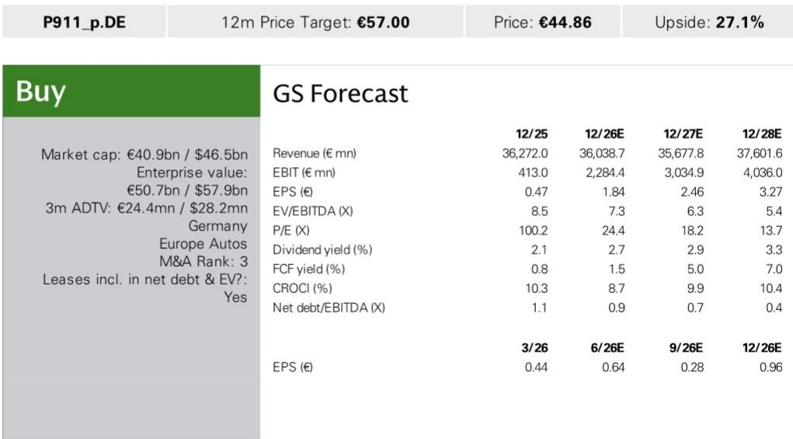
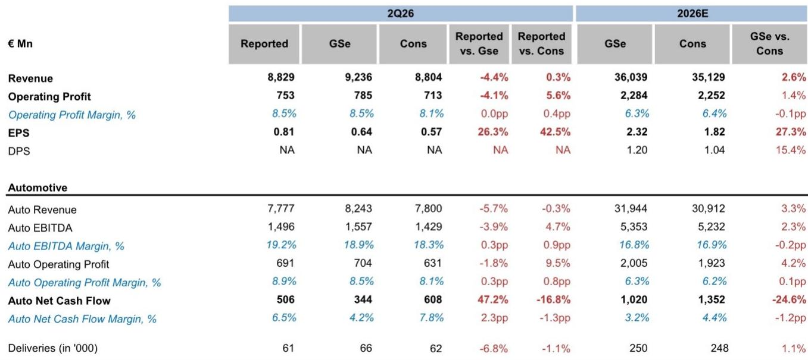

# Porsche’s 911 Mix Is Proving the Margin Thesis Right, But the Path to 10% Requires More Than Model Momentum

Porsche AG reported second-quarter 2026 earnings on July 29 that beat consensus on operating profit and delivered a surprise in earnings per share, driven by a tax rate nearly half of what analysts had modeled. The group EBIT of €753 million landed above the company-compiled consensus of €713 million, yielding an 8.5% margin that matched the analyst team’s estimate and exceeded the street view by 40 basis points. Revenue of €8.83 billion was roughly in line with consensus, but the composition of that revenue—specifically the revenue per vehicle of €126,000, above the €125,000 forecast—signals that the mix shift toward top-end 911 variants is delivering real financial leverage.

This is not a quarter that should be dismissed as a one-off tax benefit or a restructuring accounting offset. The underlying operating performance improved, and the direction of travel matters more than any single line item. The company absorbed roughly €300 million in restructuring charges while simultaneously releasing a similar provision amount, creating a net effect on reported profit. Strip those away, and the core business generated an operating margin that already sits above the midpoint of the full-year guidance range of 5.5% to 7.5%. The question for observers is no longer whether Porsche can survive the transition, but whether it can compound this momentum into a sustainable return to double-digit margins.

The timing of this report is strategically important. Porsche is navigating a period of heavy model investment, tariff uncertainty, and a structural shift in its China business. Yet the second-quarter results suggest that the product cycle—particularly the strength of the 911 family—is providing a bridge that many had doubted existed. The analyst team’s case rests on a specific chain of logic: the 911 mix normalizes, restructuring costs fade, and the company re-establishes a margin trajectory toward its medium-term target of up to 15%. The second-quarter data supports the first link in that chain.

## The 911 Mix Is Delivering Revenue Per Vehicle Growth That Offsets Volume Pressure

Revenue per vehicle rose to €126,000 in the second quarter, exceeding the analyst estimate of €125,000 and representing a meaningful premium over the broader portfolio average. This is not a function of broad-based price increases. It is a product mix story. The second quarter saw a higher share of top-end 911 models—specifically the GTS, Turbo, and GT variants—which carry significantly higher transaction prices and better margins than the entry-level Carrera models or the Taycan and Macan lineups.

The mechanism here is straightforward but often underestimated by the market. Porsche’s 911 franchise operates with a degree of pricing power that is rare in the automotive industry. Customers are willing to pay a premium for exclusivity, performance, and the halo effect of the brand’s motorsport heritage. When the mix shifts upward within that franchise, the revenue per vehicle lifts disproportionately because the incremental cost of a GT model versus a base Carrera is far lower than the incremental price. The margin leverage is embedded in the product architecture.

This matters because Porsche is simultaneously facing volume headwinds. Deliveries in the second quarter were 61,000 units, below the analyst estimate of 66,000 and slightly below consensus. The company is not growing unit sales in the near term. It is growing value per unit. For a luxury automaker, that is the more important metric. Volume-driven growth would require competing in lower-margin segments or discounting to move metal. Value-driven growth protects margins and reinforces brand positioning.

The implication for observers is that the 911 mix thesis is not a theoretical construct. It is showing up in reported financials. If the mix continues to normalize toward higher-end variants as supply constraints ease and the model cycle matures, revenue per vehicle has further room to rise. The analyst team’s full-year 2026 revenue estimate of €36.0 billion implies only modest volume recovery. The margin improvement comes from mix and cost, not from selling more cars.

## Restructuring Charges Are Masking the Underlying Margin Trajectory

The second quarter included roughly €300 million in restructuring charges, fully offset by an equal provision release. This accounting symmetry made the reported EBIT clean, but it obscures the fact that the underlying business is generating margins above the guided range. The 8.5% group margin already exceeds the midpoint of the full-year 5.5% to 7.5% target. Even if one normalizes for the provision release, the operating performance is tracking toward the higher end of guidance.

Restructuring is not a one-time event. The company indicated that a three-digit million amount of restructuring would continue into 2027. This is consistent with a multiyear efficiency program aimed at reducing structural costs in the ICE powertrain operations while investing in the BEV platform. The charges are real, but they are also planned. The market’s job is to distinguish between recurring operational weakness and deliberate reinvestment.

The key insight is that the restructuring burden is front-loaded. As the charges decline over the next 12 to 18 months, the reported margin should mechanically improve, assuming the underlying business does not deteriorate. The analyst team’s 2027 EBIT estimate of €3.03 billion implies a margin of roughly 8.5%, rising to €4.04 billion and 10.7% in 2028. That trajectory depends on restructuring peaking in 2026 and fading thereafter.

A limitation worth noting: the company’s own guidance does not explicitly endorse a rapid return to 10% margins. The medium-term target of up to 15% remains aspirational and depends on BEV gross margins improving, China stabilizing, and no further tariff escalation. The second-quarter results are encouraging, but they do not prove the medium-term case. They prove the near-term case.

## Auto Net Cash Flow Surprised to the Upside, But the Quality Deserves Scrutiny

Auto net cash flow came in at €506 million for the second quarter, well above the analyst estimate of €344 million but below the consensus figure of €608 million. The cash flow margin of 6.5% exceeded the full-year guidance of 3% to 5%, which is a positive signal for liquidity and balance sheet strength.

The beat relative to the analyst estimate was driven by better operating performance and working capital management. However, the quarter also included a €0.3 billion pension liability payment that weighed on cash flow. Additionally, the company spent less on R&D than expected—€517 million versus the €596 million estimate—and capitalized a lower share of that spending, which created a P&L headwind of €165 million versus the €131 million estimate. Lower R&D spend in a given quarter is not necessarily a sign of discipline. It could reflect timing of program milestones or delays in development.

The cash flow picture is better than feared, but it is not yet strong. The full-year auto net cash flow estimate of €1.02 billion implies a margin of 3.2%, near the low end of guidance. The company has room to improve, but it needs to sustain the operating momentum while increasing R&D investment in the BEV platform. That tension—between investing for the future and delivering near-term cash flow—will define the stock’s risk profile over the next 12 months.

## A Decision Framework for Observers: Three Conditions for the Bull Case to Play Out

The second-quarter results provide an opportunity to reassess the thesis through a structured lens. Observers should evaluate three conditions that must hold for the stock to perform.

First, the 911 mix must continue to normalize toward higher-end variants. This is the most visible and most controllable driver. The company has demonstrated it can deliver revenue per vehicle growth even with flat or declining volumes. The risk is that the mix peaks earlier than expected, either because supply constraints ease and volume shifts toward lower-end models or because the BEV transition forces Porsche to compete in segments where pricing power is weaker. The second-quarter data supports the bull case on this condition.

Second, restructuring costs must decline as a percentage of revenue over the next four quarters. The company has guided for continued charges into 2027, but the market needs to see a clear peak and decline. If restructuring persists at the current run rate, the reported margin will remain suppressed even if the underlying business improves. The analyst team’s 2027 EBIT estimate implies that restructuring falls by roughly half from 2026 levels. That is a reasonable assumption, but it is not guaranteed.

Third, the China business must stabilize. This is the most uncertain condition. Porsche has faced headwinds from luxury tax threshold adjustments, intensifying competition from domestic premium OEMs, and broader macroeconomic dynamics in the Chinese market. The second-quarter report does not provide granular China data, but the risk is clearly flagged in the downside risk section. A sharper-than-expected decline in China deliveries would offset gains from the 911 mix and restructuring savings. Observers should monitor China delivery trends as a leading indicator for the overall thesis.

If all three conditions hold, the path to 10% margins by 2028 is credible. If any one fails, the stock will likely trade sideways or lower until the next catalyst.

## The Valuation Case Rests on Earnings Recovery, Not Multiple Expansion

At the current price of €44.86, Porsche trades at roughly 24 times the 2026 EPS estimate of €1.84. That is not cheap in absolute terms, but it is reasonable for a luxury brand with pricing power and a clear path to earnings growth. The analyst team applies a 20x target multiple on a blended 2027 and 2028 EPS estimate.

The valuation argument is not that Porsche deserves a premium multiple. It is that earnings will grow into the current multiple. The 2026 EPS estimate of €1.84 implies a 24x P/E. The 2028 EPS estimate of €3.27 implies a forward P/E of roughly 14x at the current price. If the company delivers on the margin trajectory, the stock will re-rate as the market discounts higher future earnings.

The risk is that the earnings recovery is slower than expected. The downside scenarios outlined in the report—product launch delays, competitive pressure, BEV margin disappointment, China dynamics—could push the earnings trajectory lower and extend the timeline for margin recovery. The analyst team’s view reflects conviction that the recovery is real and that the market is underestimating the compounding effect of mix improvement and cost reduction.

For now, the second-quarter data provides the strongest evidence to date that the thesis is working.

*For informational purposes only. Portions may be generated, translated, summarized, or edited with AI assistance based on source materials and may contain omissions or errors. Please verify independently. This is not professional advice.*

For informational purposes only. Portions may be generated, translated, summarized, or edited with AI assistance based on source materials and may contain omissions or errors. Please verify independently. This is not professional advice.

