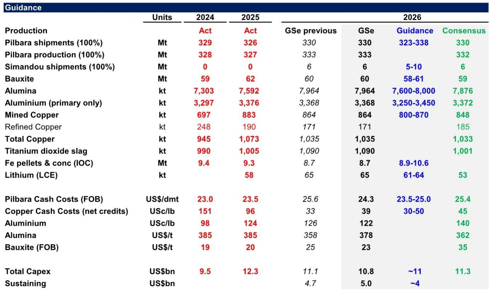
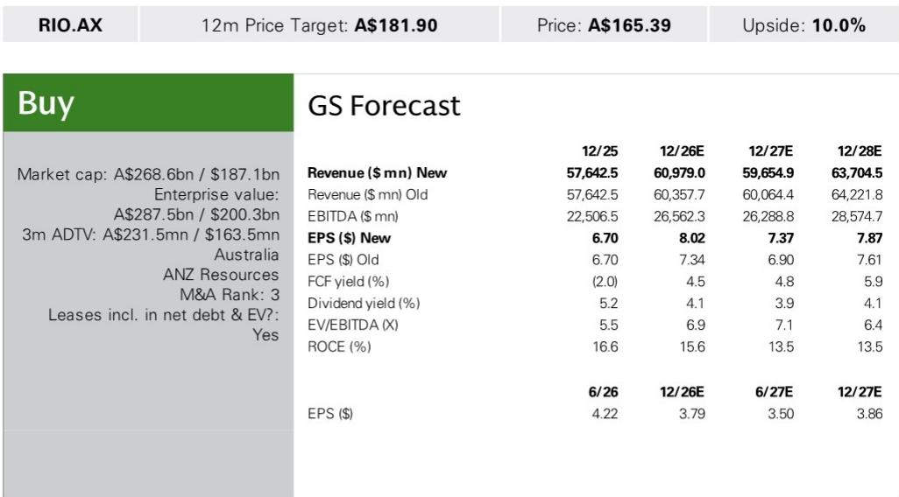
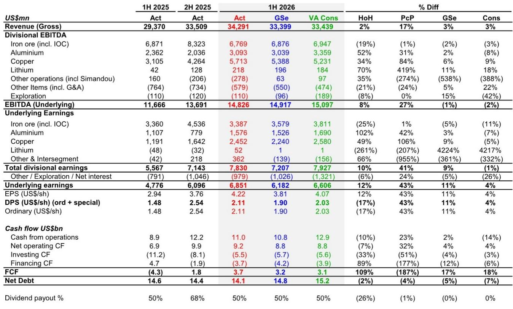

# GS：力拓业务与近期数据观察

力拓2026年上半年业绩显示，公司正在执行一项比市场预期更激进的简化战略。这份GS研究笔记的核心判断是，力拓的铜当量产量增长路径和成本削减力度，正在改变其资产组合的盈利结构，而市场对这一变化的定价尚未充分反映。

上半年力拓实现基础EBITDA 148亿美元，同比增长28%，略低于市场共识的151亿美元，但净利润69亿美元同比增长43%，超出GS预期约11%。超预期部分主要来自约25%的有效税率，低于此前30%的指引。分部门看，铜业务（宾汉姆峡谷）、铁矿石（皮尔巴拉）和铝业务均实现超预期表现，部分被项目评估费用和通胀相关拨备增加所抵消。

净债务141亿美元，低于GS预期的148亿美元，主要得益于经营现金流高于预期和资本开支节奏变化。中期股息每股211美分，总额34亿美元，对应50%派息率，高于GS预期的190美分。

> **KC评论：** 力拓在成本削减和资产剥离上的执行力，比市场此前预期的更具体。1.8亿美元的成本削减目标占集团总成本基础约5%，这个比例在大型矿业公司中并不常见，意味着管理层对运营效率的重视程度在提升。

## 1. 全部22个主要开发项目按计划或超前推进

力拓的增长项目执行能力是这份报告最值得关注的信号。所有22个主要开发项目均按计划或超前推进，包括西芒杜铁矿、皮尔巴拉替代矿、阿根廷锂矿和奥尤陶勒盖地下矿增产。项目评估和可行性研究支出从去年同期的4.5亿美元增至10亿美元，表明公司在削减其他领域成本的同时，仍在持续投入增长管道。

铜矿项目进展尤为具体。Resolution铜矿已开始在土地交换后的新区域进行地表钻探，地下钻探计划于2026年三季度启动。奥尤陶勒盖因蒙古政府延迟批准Entrée Resources的许可证转让，可能导致2027-2028年铜金产量减少约5万吨。力拓正在推进品位较低的Panel 0和Panel 2 North，Panel 1预计为最后投产的采区。

## 2. 成本削减目标从6.5亿提升至18亿美元

力拓在2025年底读者日提出的“更强、更锐、更简”议程正在加速落地。成本削减目标从6.5亿美元提升至18亿美元，上半年已实现13亿美元的年化运行率，其中8.7亿美元已实际入账。这18亿美元约占集团年度成本基础约370亿美元的5%。

管理层表示，下半年额外约10亿美元的削减将大致平均来自产量提升和成本控制，且月度执行势头持续改善。力拓正在从集中式管理模式转向更精简的分权运营模式，将更多决策权下放至矿山现场。

非核心资产剥离也在推进。力拓计划出售50-100亿美元的非核心资产，GS识别出约100亿美元的潜在剥离标的。到2026年底有望释放约50亿美元，其中皮尔巴拉电力资产可能在2026年下半年释放30-40亿美元。

## 3. 铜当量产量预计从2027年起年均增长约3%

力拓的增长叙事正在从铁矿石转向铜和铝。研报预测，力拓的铜当量产量将从2025年到2030年增长约10%，同期EBITDA增长约30%。2026年铜当量产量增速仅约1%，但2027-2030年年均增速约3%。

增长驱动力包括：奥尤陶勒盖地下铜矿增产、宾汉姆峡谷从2027年起品位提升、西芒杜铁矿石增产、皮尔巴拉铁矿石发货量中期目标提升至3.45-3.6亿吨、铝利润率扩大以及阿根廷锂矿增长。

力拓近期还宣布与中铝成立合资公司，以约9.03亿美元收购巴西铝生产商CBA约69%股权，力拓出资约2.98亿美元。这笔交易凸显力拓在大西洋盆地的铝土矿和氧化铝战略缺口——力拓在太平洋盆地拥有330万吨氧化铝产能，但在大西洋盆地短缺260万吨。

> **KC评论：** 力拓的资产组合正在从以铁矿石为主的单一结构，转向铜、铝、铁矿石多元驱动的格局。到2030年，铜和铝预计贡献集团EBITDA的约60%，而2026年这一比例约为45-50%。这种结构变化意味着力拓的估值框架可能需要从铁矿石周期股转向多元化矿业公司。

## 4. 估值处于历史均值区间，资产净值折价约20%

力拓当前报价对应约0.8倍资产净值，低于必和必拓的0.9倍和福特斯丘的1.1倍。以未来12个月EBITDA计算，力拓约7倍，与必和必拓持平，处于25年历史均值6.5-7倍区间，但仍低于纯铜矿公司。主要调整包括降低原铝和皮尔巴拉铁矿石成本假设，以及提高宾汉姆峡谷铜收入。资产净值上调2%至约199澳元。

力拓报价自2026年6月高点已回撤约15%，当时估值峰值约8.5-9倍EBITDA。当前约7倍EBITDA的估值水平，结合约5%的自由现金流回报表现，在铜和铝价格假设下具有一定吸引力。但需注意，力拓的盈利增长高度依赖铜价维持在600美分/磅以上，以及铝价在120美分/磅以上的假设。

For informational purposes only. Portions may be generated,translated,summarized,or edited with AI assistance based on source materials and may contain omissions or errors. Please verify independently. This is not investment,legal,tax,accounting,or other professional advice.

For informational purposes only. Portions may be generated,translated,summarized,or edited with AI assistance based on source materials and may contain omissions or errors. Please verify independently. This is not investment,legal,tax,accounting,or other professional advice.

