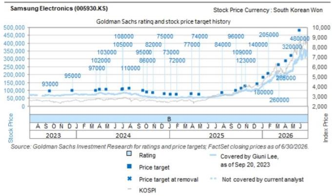
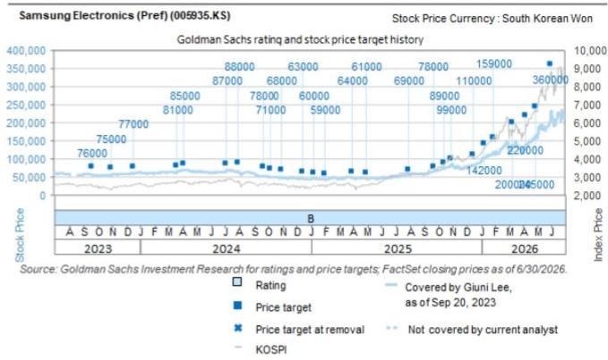

# 存储定价正经历结构性转变，而非仅仅是周期性波动

长期以来，关于存储半导体的传统叙事一直是无情的周期性：繁荣、萧条、重复。这种框架现在已不完整。基于2026年7月行业简报中的专家评估，对韩国存储生态系统的详细分析表明，当前的定价环境并非仅仅是另一个周期性高点，而是由三种同时发生且历史上从未如此汇聚的力量驱动的结构性重新定价的早期阶段。传统DRAM定价预计将在2026年第三季度实现稳健的两位数环比增长，第四季度可能连续第二次实现两位数增长。这不是正常的周期性行为。典型的周期此时本应开始放缓。相反，供应限制正在加深，需求本身的性质也在以打破旧模式的方式发生变化。

然而，最具影响力的信号在于更远的未来。对于高带宽存储器，2027年的定价轨迹指向可能在当前水平上弹性较高，这得益于作为HBM生产成本基础的常规DRAM定价上涨。一家全球投行报告预测，2027年HBM定价将同比增长87%，这一数字显著超过了市场共识预期的52%。这两个数字之间的差距正是战略机遇所在。市场共识仍将存储视为大宗商品周期进行定价。结构性现实是，存储正成为一种差异化、产能受限且客户锁定的资产类别。

这种转变不仅对存储生产商的读者很重要，对依赖存储可用性和成本的科技供应链中的每个参与者也很重要。云超大规模企业、企业硬件买家、汽车OEM和AI芯片设计商都将面临一个比过去十年中任何时期都更紧张、更昂贵、更注重关系的采购环境。充裕、廉价、现货市场的存储时代正在结束。战略分配、长期合同和先进产品溢价定价的时代正在开启。

## 长期协议正在改写存储行业的商业架构

存储市场中最被低估的结构性变化是长期协议从松散的框架文件演变为具有约束力、财务上可执行的合同。行业专家报告称，超过一半的服务器DRAM已被LTA覆盖，且覆盖率预计将进一步增加。这些并非以往周期中的握手协议。它们包含可观的预付款条款、照付不议条款和取消罚金，为买卖双方创造了真正的经济粘性。

其战略含义直接而有力。在以往的周期中，存储生产商容易受到需求突然蒸发的影响，因为客户取消或推迟订单没有罚金。当前的LTA结构改变了这种计算方式。签署HBM或服务器DRAM照付不议合同的客户，无论其自身需求是否实现，都必须付款。这将库存风险从生产商转移到了客户，从而稳定了生产商的收入流和产能利用率。对于观察者而言，这意味着领先存储公司的盈利波动性将低于基础产品周期所暗示的水平。存储公司报价与存储现货价格的关联度正在下降。

对于客户而言，其含义同样重要但不太令人舒适。先进存储的采购不再是现货市场行为。它需要战略承诺、财务预付款，以及愿意提前数年锁定数量和价格条款。延迟LTA谈判的公司可能会在供应紧张时期被分配较低的优先级。这些协议的约束力意味着，存储供应不仅由价格决定，还由客户关系的深度和财务承诺的规模来分配。这是对大宗商品存储模式的根本性背离，代表着议价能力向生产商的永久性转移。

## 中国存储供应商短期内不构成竞争威胁，但窗口期正在关闭

读者普遍担心，中国存储供应商激进的产能扩张将充斥市场并压缩现有领导者的利润空间。专家评估为这种短期至中期的担忧提供了清晰且基于证据的反驳。中国供应商确实在大力投资产能，但中国企业与领先韩国生产商在生产良率、技术水平和产品可靠性方面的差距仍然很大。这个差距在未来两三年内不会迅速缩小到足以威胁市场结构的程度。

这不是一个轻率的结论。这是一个关于先进存储进入壁垒性质的战略观察。例如，HBM不仅需要先进的光刻技术，还需要复杂的堆叠、热管理和测试工艺，这些工艺需要数年时间才能开发和完善。HBM的良率学习曲线陡峭，鉴于每个成品模块的高价值，低良率的成本是高昂的。在2027年产能分配的相关规划期内，中国供应商不太可能在先进HBM产品上实现具有竞争力的良率。

对买家而言，其战略含义是，在可预见的未来，当前存储生产的领导者仍将是先进供应的主要来源。存储供应的多元化是一个值得称赞的长期目标，但并非现实的短期选择。试图在LTA谈判中利用中国供应商来对抗韩国供应商的公司会发现杠杆有限。技术差距是真实存在的，它直接转化为定价能力。

然而，这一评估附带一个重要的时间限制。专家并非认为中国供应商永远不会具有竞争力。论点是在短期至中期内，它们不是一个可见的威胁。出于战略规划目的，这意味着当前的定价和合同环境至少在未来两三年内是持久的，但公司应利用这段时间来确保长期供应安排，而不是假设有利条件会无限期持续。

## 产能增加正在加速，但比特增长率仍低于历史平均水平

专家简报中最反直觉的发现之一是，2026年产能增加的速度高于历史水平，但比特增长率预计将低于历史平均水平。通过理解产品组合的转变，这个明显的悖论得以解决。随着存储生产商将更多产能分配给HBM生产，每片晶圆的有效比特产出下降，因为HBM比常规DRAM需要更多的处理步骤、测试和封装资源。行业正在增加更多工厂，但每个工厂生产的总比特数减少，因为它生产的比特更复杂、更有价值。

这种动态对定价有直接而强大的影响。在常规DRAM周期中，产能增加最终会压倒需求并导致价格下跌。在当前环境下，产能增加正被向HBM的过渡所吸收，这消耗了产能却没有产生相应的比特量。结果是，即使行业总资本支出上升，常规DRAM的供应也受到有效限制。这是专家预期定价持续强劲背后的结构性机制。

对于买家而言，其含义是传统的存储定价领先指标——产能利用率——已不再可靠。一个总晶圆产能利用率很高的行业，可能仍无法生产出足够的常规DRAM比特来满足需求。每片晶圆内部的产品组合比晶圆总数更重要。这意味着采购团队需要开发更复杂的存储供应模型，以考虑HBM对产能的不成比例消耗。简单地外推行业资本支出将对未来的供应可用性产生误导性结论。

## 混合键合技术将逐步采用，而非颠覆性，从而延长当前技术的生命周期

HBM生产中向混合键合技术的过渡被广泛讨论为可能重塑竞争格局的潜在拐点。专家评估为更乐观的叙事提供了一个清醒的反驳。虽然现有键合技术将随着DRAM芯片堆叠数量的增加而面临越来越大的困难，但专家预计混合键合技术不会早期采用，因为在大规模生产规模下实现足够的良率需要相当多的时间和精力。存储公司预计将采取逐步采用的路径，在混合键合技术成熟的同时探索无焊剂键合等中间解决方案。

其战略含义是，当前HBM的技术领导者不太可能被竞争对手突然的混合键合技术突破所颠覆。技术路线图是演进性的，而非革命性的。这延长了那些已经掌握现有键合工艺并围绕其建立了制造基础设施的公司的竞争优势。这也意味着HBM生产的成本结构不会经历突然的阶梯式下降，从而压缩利润空间。

对于客户而言，混合键合技术的逐步采用意味着未来HBM代的性能改进将是渐进式的，而非戏剧性的。早期HBM过渡中那种代际飞跃正在让位于一个稳定但较慢的改进时期。这影响了AI加速器路线图和数据中心架构决策的规划假设。存储性能包络线不会突然扩展，这更强调架构效率和软件优化，而非仅仅依赖存储带宽增益。

## 存储采购与观察决策框架

上述分析可以综合为一个实用的决策框架，适用于两个不同的受众：负责存储供应的采购主管和评估存储领域敞口的观察人士。

对于采购主管，该框架基于三个原则。第一，先进产品的现货市场存储采购时代正在结束。公司必须与领先生产商建立LTA关系，这些关系需要以预付款和照付不议条款的形式进行财务承诺。第二，HBM供应的分配将由客户关系的深度决定，而非支付溢价现货价格的意愿。延迟参与的公司面临被降低优先级的风险。第三，领先与落后存储生产商之间的技术差距足够大，以至于供应来源的多元化是一个多年项目，而非短期选择。采购策略应侧重于从现有领导者那里确保数量，同时在三到五年的时间内投资于替代来源的认证流程。

对于观察人士，该框架基于四个原则。第一，领先存储生产商的盈利正变得比历史模式所暗示的周期性更弱，因为LTA结构提供了收入可见性和库存风险转移。市场可能低估了盈利质量的结构性改善。第二，对2027年HBB定价的共识预期过低。专家评估的潜在弹性较高，以及投行87%的同比增长估计，表明共识尚未完全纳入HBM对常规DRAM供应的产能蚕食效应。第三，来自中国存储供应商的威胁是真实但延迟的。韩国生产商当前的竞争优势窗口可能持续两到三年，在此期间它们将产生超额的现金流。第四，混合键合技术的逐步采用延长了当前技术领导者的护城河，并降低了颠覆性技术转变的风险。

这一分析最重要的二阶含义是，存储行业正在经历一个尚未反映在市场定价或采购行为中的结构性转变。具有约束力的LTA、HBM驱动的产能蚕食、有限的近期竞争以及渐进的技术演进相结合，创造了一个在可预见的未来有利于生产商而非买家的定价和合同环境。旧的周期性剧本已经过时。需要一个新的结构性剧本，而现在是采用它的时候了。

*仅供参考。部分内容可能基于源材料通过AI辅助生成、翻译、总结或编辑，可能存在遗漏或错误。请独立核实。这不构成任何专业建议。*

仅供参考。部分内容可能基于源材料通过AI辅助生成、翻译、总结或编辑，可能存在遗漏或错误。请独立核实。这不构成任何专业建议。

