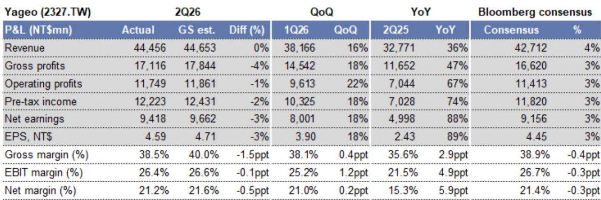
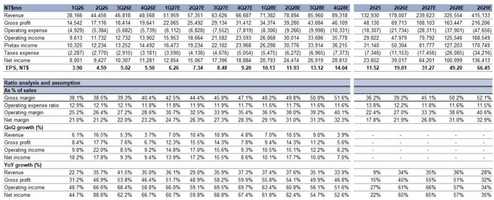
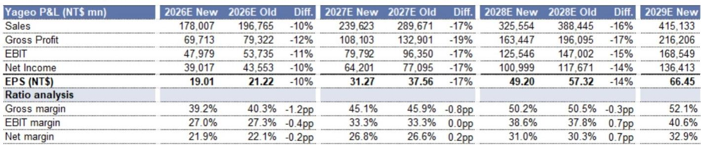

# The Passive Component Bottleneck Is Becoming the Active Constraint on AI Infrastructure Scaling

Yageo, the world’s third-largest multilayer ceramic capacitor (MLCC) manufacturer, reported that its book-to-bill ratio hit 2.2 at the end of June 2026, up from just over 1.0 in the first quarter. This single statistic encapsulates a structural shift: demand for passive components is now outstripping supply by a factor of more than two to one, and the imbalance is accelerating. The era of passive components as a commoditized afterthought in the electronics supply chain is over.

The implications extend far beyond Yageo’s market valuation. A book-to-bill ratio of 2.2 means that for every dollar of product shipped, the company received USD 2.20 in new orders. In a capital-intensive industry where utilization rates have historically oscillated between 75% and 85%, this level of demand signals that the passive component supply chain is entering a period of sustained scarcity. The bottleneck is no longer GPUs, memory, or advanced packaging alone. It is now the humble capacitor.

Three forces are converging to create this scarcity. First, AI servers consume dramatically more MLCCs per unit than conventional servers. Second, the industry is shifting production capacity toward high-end, AI-grade components, which simultaneously tightens supply for standard products. Third, customers are rushing to secure long-term supply agreements (LTAs) for the very components that are becoming hardest to source. The combination of these forces means that the passive component industry is transitioning from a cyclical business to a structurally undersupplied one, with pricing power shifting decisively to manufacturers.

## Yageo’s Utilization Rate Trajectory Confirms That Standard and Premium Capacitors Are Both Heading Toward Full Capacity

In the second quarter of 2026, Yageo operated its standard product lines at 80–85% utilization and its premium lines at over 85%. For the third quarter, management guided that both categories will exceed 90%. This is not a gradual recovery. It is a step-change acceleration. The company is effectively telling the market that it expects to be operating at or near full capacity across virtually all product lines within the next three months.

The significance of this guidance lies in the distinction between standard and premium products. In past cycles, standard MLCCs were the swing factor — they absorbed demand spikes and bore the brunt of downturns. Premium products, by contrast, enjoyed more stable demand and higher margins. What is different now is that both segments are simultaneously approaching capacity constraints. This dual-tightening dynamic removes the traditional safety valve. When standard products run hot, manufacturers cannot simply divert premium capacity to fill the gap, and vice versa. The result is a system-wide constraint that affects every downstream customer, from smartphone assemblers to hyperscale data center operators.

The utilization rate data also explains why Yageo is expanding capacity across multiple geographies simultaneously — Kaohsiung, Mexico, Vietnam, and Suzhou. The company has multiple CAPEX plans already in the pipeline, with capacity additions scheduled to come online on a quarterly basis. This is not a speculative build-out. It is a defensive response to demand that is already exceeding available supply.

## The Book-to-Bill Ratio of 2.2 Signals That Order Backlogs Are Growing Faster Than Shipments, Creating a Self-Reinforcing Scarcity Cycle

A book-to-bill ratio of 2.2 is historically anomalous. In the passive component industry, ratios above 1.0 typically trigger capacity additions, but ratios above 1.5 have been rare even during the strongest upcycles. The current reading indicates that new orders are flowing in at more than double the rate of shipments. This divergence can only be resolved in one of two ways: either shipments accelerate dramatically, or order intake moderates. The evidence from Yageo’s guidance and capacity expansion plans suggests the former is the intended path, but the magnitude of the gap raises a critical question: can capacity additions keep pace?

The structural answer is no, at least not in the near term. Passive component manufacturing is not a fast-follower industry. Building new production lines, qualifying products, and ramping yields takes 12 to 18 months even under aggressive timelines. During that period, the backlog will continue to grow. Customers, recognizing this dynamic, are responding by placing larger and earlier orders, which in turn inflates the book-to-bill ratio further. This is a self-reinforcing cycle. The more customers perceive potential supply tightness, the more they order, and the more they order, the more supply tightness appears imminent.

The risk is that the book-to-bill ratio becomes a misleading signal of true end-demand if it is inflated by double-ordering. However, Yageo’s management noted that the ratio improved on a monthly basis throughout the second quarter, reaching the 2.2 level only at the end of June. This sequential improvement suggests that the demand is real and accelerating, not a one-time spike driven by panic buying. Moreover, the company reported that customers showing the strongest interest in long-term supply agreements are those with the highest AI-driven growth. This correlation between AI exposure and LTA demand provides a credible anchor for the order data.

## AI Revenue Exposure Has Already Exceeded the 2026 Target, and the Product Mix Shift Toward High-Capacitance Capacitors Is Tightening Supply of Mid-to-Low-End Components

Yageo reported that AI-related revenue reached 16% of total revenue in the second quarter of 2026, up from 14–15% in the first quarter. This is ahead of the company’s original target of 15% for the full year 2026. The acceleration is not marginal. It is a full quarter ahead of schedule, and management indicated that the trend is likely to continue upward given the strength of AI demand.

The mechanism driving this shift is the rapid increase in high-capacitance capacitor content in next-generation AI servers. These servers require more capacitors per unit, and the capacitors themselves are more technically demanding. As Yageo reallocates production capacity toward these high-end components, the supply of mid-to-low-end capacitors — the workhorses of the electronics industry — is expected to tighten. This is the second-order effect that matters most for the broader market.

The global MLCC industry is estimated to have allocated approximately 9% of capacity to AI-grade components in 2025. That figure is projected to rise to 14% in 2026, 24% in 2027, and 32% in 2028. Each percentage point of capacity shifted to AI-grade products removes capacity from the non-AI pool. The result is that global non-AI MLCC utilization rates, which stood at 75% in 2025, are expected to climb to 82% in 2026, 97% in 2027, and 100% in 2028. This is a supply dynamic that has nothing to do with demand for traditional electronics. It is a direct consequence of the AI build-out.

For companies that rely on commodity MLCCs — automotive, industrial, consumer electronics — the implication is clear: component availability will become an operational consideration within the next 12 to 18 months. Procurement teams that have not already begun securing long-term supply agreements may find themselves unable to source sufficient quantities at any price.

## Long-Term Supply Agreements Are Becoming the Dominant Channel for MLCC and Tantalum Capacitors, Reshaping Pricing and Allocation Dynamics

Yageo noted increasing customer interest in entering LTAs, with demand concentrated on MLCCs and tantalum capacitors. The customers showing the strongest interest are those experiencing higher growth driven by AI. This is a significant structural shift. In the past, LTAs in the passive component industry were primarily used for stable, high-volume products with predictable demand. They were not the norm for commodity components. That is changing.

The move toward LTAs benefits manufacturers in two ways. First, it provides revenue visibility and reduces the risk of demand volatility. Second, it gives manufacturers greater leverage in pricing negotiations. When a customer commits to a multi-year volume agreement, the manufacturer can allocate capacity more efficiently and command a premium for the certainty it provides. The flip side is that customers who do not enter LTAs may find themselves at the back of the allocation queue, receiving only whatever residual capacity remains after LTA commitments are fulfilled.

This dynamic is particularly important for tantalum capacitors, which are used extensively in AI servers and other high-performance applications. Tantalum is a specialized product with a concentrated supply base. Yageo’s focus on expanding tantalum capacitor capacity, alongside MLCC capacity, indicates that the company sees this as a high-growth, high-margin segment. The combination of AI demand growth and LTA-driven allocation means that spot market availability for tantalum capacitors is likely to shrink, pushing prices higher for non-LTA buyers.

## A Decision Framework for Navigating the Passive Component Supply Dynamics

The data from Yageo’s second-quarter results provides a clear signal for strategic decision-making. The following framework translates the report’s insights into actionable considerations for procurement teams, supply chain managers, and industry observers.

First, assess your exposure to MLCCs and tantalum capacitors across the entire product portfolio. Many companies underestimate their passive component consumption because these components are low-cost individually and are often managed at the category level rather than the strategic level. The cost per unit may be cents, but the impact of a shortage is measured in lost revenue. Map every product line that uses MLCCs or tantalum capacitors, and quantify the volume required over the next 12 to 24 months.

Second, evaluate whether your current supply agreements provide adequate coverage. If your procurement is primarily spot-market or short-term contract-based, you are exposed to both price increases and allocation risk. The window for entering LTAs is narrowing. As Yageo and other manufacturers fill their capacity with LTA commitments, the remaining spot availability will diminish. Companies that delay risk being unable to secure supply at any price.

Third, monitor the non-AI MLCC utilization rate as a leading indicator. The industry consensus estimate is that non-AI utilization will reach 82% in 2026, 97% in 2027, and 100% in 2028. Each percentage point increase tightens supply. When utilization exceeds 90%, pricing typically accelerates and lead times extend. Procurement teams should use these thresholds as triggers for escalation: at 85%, initiate LTA discussions; at 90%, secure contingency inventory; at 95%, prepare for allocation.

Fourth, consider the margin implications for your own business. If you are a downstream manufacturer that uses passive components as inputs, rising component costs will compress your margins unless you can pass them through to customers. The pricing power in the passive component supply chain has shifted to manufacturers. Companies that have not hedged their input costs or renegotiated customer contracts may face earnings pressure in 2027 and 2028.

Fifth, for those tracking the industry, the key variable is not whether Yageo will benefit from this cycle — it clearly will — but how much of the upside is already reflected in current expectations. The company’s earnings forecasts have been revised down by 10% for 2026, 17% for 2027, and 14% for 2028, reflecting more conservative pricing assumptions. The tension is between the strong demand signals (book-to-bill of 2.2, AI exposure ahead of target, full utilization) and the downward revisions. This tension will be resolved by whether the pricing assumptions prove too conservative or too optimistic. The margin expansion trajectory is the single most important metric to track.

The passive component industry is undergoing a structural transformation driven by AI. The evidence from Yageo’s second-quarter results is unambiguous: demand is accelerating, capacity is constrained, and the balance of power has shifted to manufacturers. Companies that recognize this early and adjust their procurement and pricing strategies accordingly will have a competitive advantage. Those that treat passive components as a low-priority procurement category may face operational disruptions and margin compression. The supply dynamics are real, and they are not going away.

*For informational purposes only. Portions may be generated, translated, summarized, or edited with AI assistance based on source materials and may contain omissions or errors. Please verify independently. This is not professional advice.*

For informational purposes only. Portions may be generated, translated, summarized, or edited with AI assistance based on source materials and may contain omissions or errors. Please verify independently. This is not professional advice.

