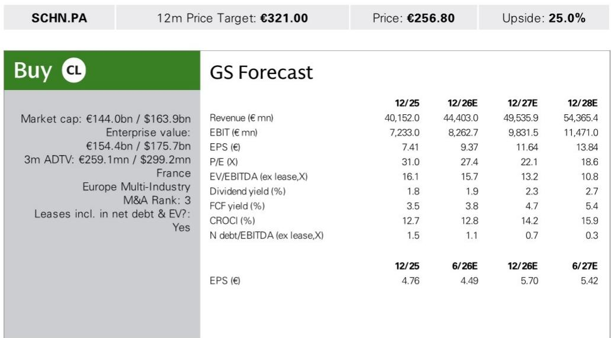
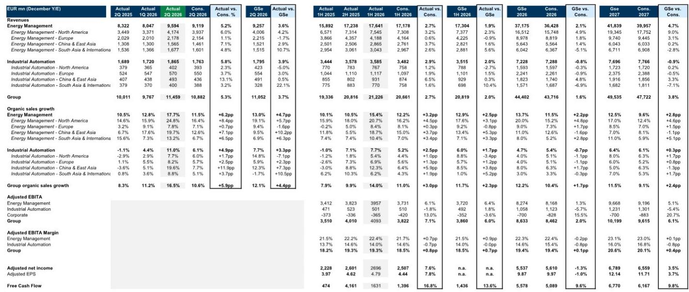
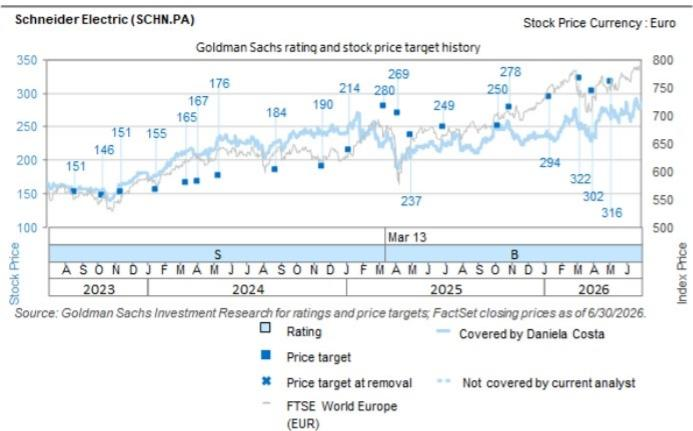

# GS：施耐德电气业务与近期数据观察

施耐德电气2026年第二季度交出了一份超出市场预期的成绩单。GS在最新研报中指出，公司当季有机销售增长达到16.5%，较市场预期的10.6%高出近6个百分点，两大业务板块均有贡献。更值得关注的是，管理层同步上调了全年指引——有机销售增速从7-10%提升至10-13%，利润率目标也从19.1-19.4%上调至19.4-19.7%。GS认为，这一组合拳将推动2026年每股收益共识至少出现低个位数百分比的上修。

这份业绩的亮点不仅在于数字本身，更在于其背后的结构性驱动因素。数据中心业务延续了行业性的三位数增长，但报告同时揭示了一个容易被忽视的信号：住宅业务在欧洲也出现了环比改善。这意味着施耐德的增长并非仅仅依赖单一赛道。

## 1. 中国工业自动化业务增速领跑，与西门子形成正向共振

施耐德第二季度工业自动化板块有机销售增长11.0%，远超市场预期的6.1%。其中，中国及东亚地区增速高达19.6%，较市场预期的7.7%高出近12个百分点。GS特别指出，这一表现与西门子近期在中国工业自动化领域的积极信号形成正向共振。对于关注中国制造业资本开支周期的读者而言，这组数据提供了两个观察维度：一是施耐德在中国市场的份额获取能力，二是工业自动化整体需求可能正在走出底部。

> **KC评论：** 中国工业自动化业务19.6%的增速是本次业绩中最具信息量的数字之一。它既反映了施耐德自身的产品竞争力，也可能预示着中国制造业资本开支的边际回暖。但报告没有完全展开的是，这一增速能否在下半年持续，仍需观察订单转化率和客户库存水平。

## 2. 能源管理板块北美领涨，利润率结构优于主要竞争对手

能源管理业务第二季度有机销售增长17.7%，北美地区以24.8%的增速成为最大引擎。GS测算，施耐德整体营业利润率（OSG）为16.5%，高于ABB的12%。这一差距主要来自工业自动化板块的更强表现——施耐德在该领域的利润率结构优于ABB，而能源管理板块的利润率差异相对较小。对于跨行业比较的读者，这意味着施耐德的利润质量不仅来自数据中心需求，还来自其工业自动化业务的差异化定位。

## 3. 自由现金流表现强劲，现金转换率有望在下半年继续改善

在多数工业公司本季度自由现金流偏弱的背景下，施耐德的表现显得尤为突出。第二季度自由现金流达到16.31亿欧元，较市场预期高出16.8%。管理层预计，现金转换率将在下半年继续提升。GS认为，这一趋势与公司利润率改善、营运资本管理优化以及资本开支节奏相关。对于估值框架依赖自由现金流的读者，这一信号值得纳入模型调整的考量。

## 4. 业绩上调后的观察框架：关注定价策略与并购方向

GS在研报中列出了四个需要关注的关键问题，这些也是读者在业绩会后可以持续跟踪的观察点：第一，管理层如何解释对Cognite的收购预期，以及更广泛的并购战略；第二，下半年定价策略是否会有调整；第三，工业自动化板块的收入增长能否在下半年转化为更高的经营杠杆；第四，订单积压的演变趋势。这些问题的答案将决定本次业绩超预期是短期脉冲还是可持续的结构性改善。

> **KC评论：** GS提出的四个问题实际上构成了一个完整的验证框架。定价策略和经营杠杆决定了利润率能否持续扩张，并购方向影响资本配置效率，而订单积压则是判断收入可持续性的先行指标。读者可以将这四个维度作为后续跟踪施耐德的核心观察清单。

For informational purposes only. Portions may be generated,translated,summarized,or edited with AI assistance based on source materials and may contain omissions or errors. Please verify independently. This is not investment,legal,tax,accounting,or other professional advice.

For informational purposes only. Portions may be generated,translated,summarized,or edited with AI assistance based on source materials and may contain omissions or errors. Please verify independently. This is not investment,legal,tax,accounting,or other professional advice.

