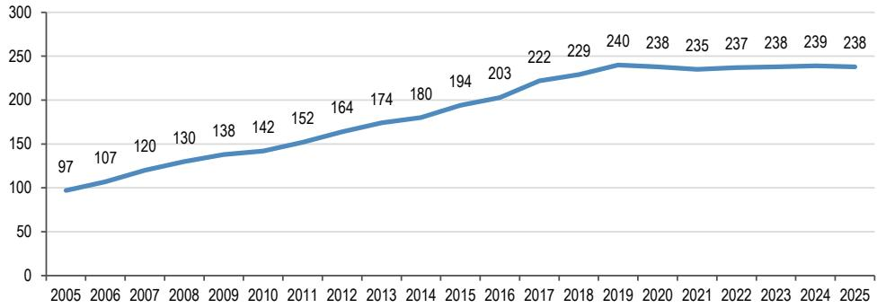
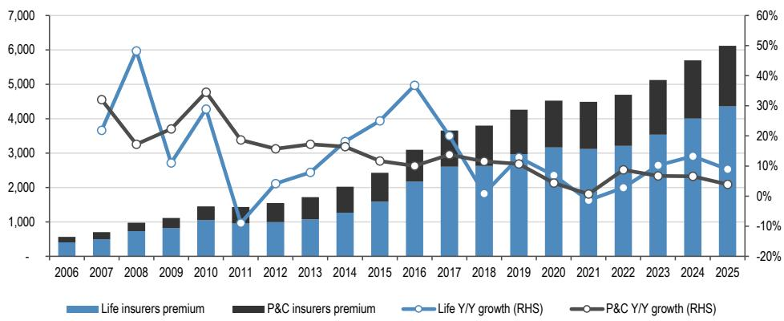
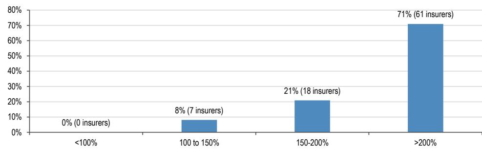
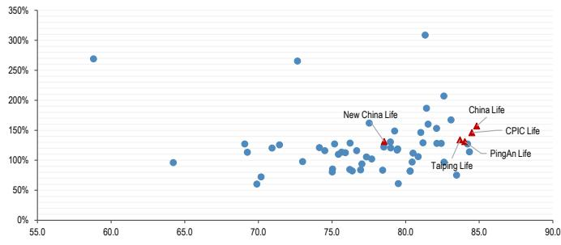
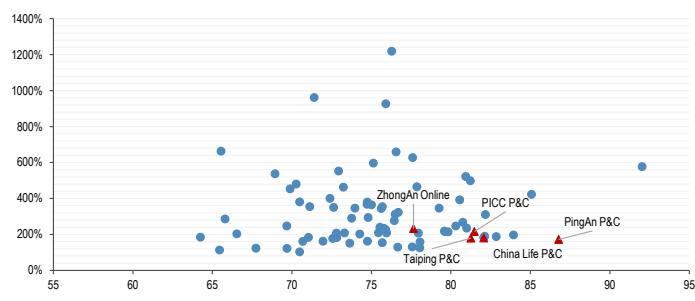

本材料无意向中国大陆读者分发，亦不构成在中国大陆境内提供证券投资咨询服务。未经JPM书面同意，不得转载、出售或重新分发本材料或其任何部分。

## 中国保险业

## 夏季系列：市场分化风险上升，小型机构面临资本压力

在本报告中，我们分析了163家保险公司，包括75家人身险公司和88家非人身险公司，重点关注偿付能力资本、风险管理和股东回报。自2005年以来，保险法人实体数量从2005年12月的97家增加了一倍多，到2025年6月达到238家，其中包括13家保险集团、75家人身险公司、88家非人身险公司、7家再保险公司、9家养老保险公司、7家健康保险公司以及39家政策性保险公司和资产管理机构。然而，人身险和非人身险的总保费增长较为温和，保险深度从2015年的3.5%提升至2025年的4.4%。我们的初步看法是，人身险和非人身险领域的市场分化可能会加速，尤其是在那些需要反复注资的小型保险公司之间。这应会扩大规模领先者与资本受限的小型参与者之间的投资差异。在我们覆盖的中小型保险公司中，我们认为中国太平和中国再保险是行业结构调整的潜在受益者。在区域银行领域，类似的讨论正在展开，宁波银行是我们偏好的标的，其增长潜力更佳。

- **市场结构**。中国的保险市场在顶端呈现寡头垄断格局，但下层较为分散，前五大保险公司占据了人身险/非人身险保费的45%/68%。虽然人均GDP超过1万美元支撑了长期渗透率提升的故事，但保险业仍然是高度资本密集型的，需要在分销、客户获取、理赔基础设施和风险管理方面进行前期投入。正在进行的银保渠道改革不成比例地有利于拥有更好客户资源的大型保险公司，阻碍了中小型保险公司产生内生收益。因此，规模成为关键的差异化因素，这引发了关于在可预见的未来有多少参与者能够生存的问题。

- **人身险公司**。对75家人身险公司的概览显示，大型公司与中小型公司在资本效率、核心偿付能力缓冲和监管风险评级方面的差距正在扩大。上市保险公司继续保持核心偿付能力充足率>100%，而17家非上市保险公司低于100%，其中包括4家保险公司低于70%（最低要求：50%），这可能会触发资本补充要求。许多中小型人身险公司面临品牌认知度较弱、新业务增长缓慢和资本风险上升的问题。对于大多数公司而言，市场资金似乎不愿持续流入小型参与者，这进一步给业务模式收缩带来压力，因为微薄的回报无法覆盖长期资本成本。我们预计，在结构性竞争加剧的背景下，它们将逐渐让出市场份额。

- **非人身险公司**。我们对88家非人身险公司的审查表明竞争正在加剧，尤其是在车险领域，定价压力持续影响承保盈利能力。大约55%的非人身险公司在2025年报告了承保亏损。截至2026年3月，只有7家非人身险公司的核心偿付能力充足率低于150%，而前五大非人身险公司的平均水平为180%。我们认为，大型非人身险公司受益于理赔规模、数据、再保险渠道和多元化的风险池，而中小型参与者仍然面临区域业务集中、单一产品板块、巨灾损失和周期性定价压力的风险。

- **区域银行**。类似的趋势正在区域银行领域展开，整合淘汰了那些资本薄弱、资产质量和运营效率低下的中小型参与者，而拥有信贷增长能力的优质特许经营权则得以巩固。

保险业

MW Kim AC
(852) 2800-8517
mw.kim@JPM.com
JPM Securities (Asia Pacific) Limited/ JPM Broking (Hong Kong) Limited

Dan Wang
(86-21) 6106-6349
dan.wang@JPM.com
SAC Registration Number: S1730524080001
JPM Securities (China) Company Limited

Haomin Chen
(86-21) 6106 6347
haomin.chen@JPM.com
SAC Registration Number: S1730524080002
JPM Securities (China) Company Limited

Katherine Lei
(852) 2800-8552
katherine.lei@JPM.com
JPM Securities (Asia Pacific) Limited/ JPM Broking (Hong Kong) Limited

请参阅第13页的分析师认证和重要披露，包括非美国分析师披露。

## 研究主题

中国保险业受益于结构性的支持性监管政策。中央政府推出了一系列支持性措施，降低了保险参与者的准入门槛。2005年后，持牌保险法人实体的数量显著增加，从2005年12月的97家，在2019年12月达到240家的峰值，然后略微下降至2025年6月的238家。该行业包括13家保险集团、75家人身险公司、88家非人身险公司、7家再保险公司、9家养老保险公司、7家健康保险公司以及39家政策性保险公司和资产管理机构。

我们将中国保险业的发展分为两个阶段。扩张阶段为2005年至2019年，其基础是旨在扩大保险供给以满足不断增长的消费需求的自由化许可规则。这一趋势反映在行业保费中，在此期间，人身险和非人身险合并保费录得17%的年复合增长率。随后的阶段（2020-2025年）优先考虑高质量发展而非规模扩张。监管机构推动保险公司加强承保纪律，并建立管理宏观和微观风险的能力，以支持与全球同行相比的可持续竞争力。当局还分阶段放宽了外商直接投资限制，从2020年的人身险公司开始，将外资持股上限从此前的51%逐步提高至100%（链接）。为了在开放的环境中竞争，国内保险公司需要升级风险管理框架。政策制定者现在允许通过全资子公司或合资企业进行更大的外资参与。即便如此，作为市场规模代理指标的总保费（人身险+非人身险）在过去五年中仅实现了6%的年复合增长率，将保险深度（=保费/GDP）从2015年的3.5%推高至2025年的4.4%。

中国的保险市场在寡头垄断结构下运行：前五大参与者分别占据了人身险和非人身险市场45%和68%的份额。我们的分析涵盖了163家保险公司（75家人身险和88家非人身险），重点关注偿付能力资本、风险管理实践和股东回报潜力。虽然所有大型非人身险公司的核心偿付能力充足率均保持在100%以上，但截至2026年3月，28%的人身险公司报告核心偿付能力充足率低于100%，这表明其吸收风险的资本充足性较弱。从权益读者的角度来看，这削弱了对向股东进行可持续超额资本分配的预期。相比之下，大型保险公司始终保持偿付能力充足率高于120%，并拥有稳定的股息分配记录。

简而言之，我们预计中期内大型保险公司与中小型保险公司之间的市场分化将进一步扩大。关键驱动因素包括资本约束、渠道准入不均以及宏观风险抵御能力的不对称。我们的初步看法是，人身险和非人身险领域的分化将加剧，因为市场资金似乎不愿持续流入小型参与者，原因是微薄的回报无法覆盖长期资本成本，尤其是在面临反复资本补充要求风险的情况下。因此，我们预计，在结构性竞争加剧的背景下，中小型保险公司将逐渐让出市场份额。

**定位（保险业）**：在我们覆盖的中小型保险公司中，中国太平和中国再保险在市场集中度上升的背景下，有望成为赢家。受制于薄弱的资本缓冲、有限的分销渠道和缓慢的内生收益，许多中小型保险公司面临持续失去市场份额的风险。分销改革将高质量资源引导至成熟的行业参与者。凭借成熟的分红保险业务和均衡的资本配置，中国太平有能力独立于并购活动，有机地承接业务流。

对于中国再保险而言，资本压力促使中小型保险公司探索资本补充途径。鉴于内部资本生成有限且外部融资成本较高，财务再保险成为缓解偿付能力压力的一种可行工具。即使监管机构收紧了管理财务再保险的规则，此类工具也将逐步提升偿付能力缓冲薄弱的主险公司的再保险覆盖需求，从而在更广泛的行业分化中推动市场份额增长。

我们在中国区域银行领域看到了类似的讨论和一系列观察结果。在经历了十年的牌照驱动扩张之后，自2020年以来，受包商银行事件的催化，监管机构已果断地从规模增长转向风险化解和“减量提质”。整合在村镇银行中最为明显。根据媒体报道（链接），2025年有310家村镇银行完成了合并重组或解散，截至2026年7月9日，已有134家村镇银行退出。

国家金融监督管理总局数据显示，截至2025年上半年，共有124家城市商业银行和3,381家农村金融机构。总体而言，截至2026年上半年，它们占银行体系资产的27%，我们认为它们是银行体系中的薄弱环节，因为与大型同行相比，它们的不良贷款率更高、拨备覆盖率更低、资产回报率和资本充足率更弱（表2）。

**定位（银行业）**：尽管我们的覆盖范围集中在风险较低、运营效率较高的领先区域银行，但读者对行业中中小型参与者的脆弱性——包括较不稳定的每股收益增长、较薄的资本缓冲以及由此导致的较低股息可见性——仍持谨慎态度。因此，在区域银行中，市场对高收益的中小型银行给予了一个股息可靠性折价，而更青睐那些估值有可信增长故事支撑的银行。在我们覆盖的区域银行中，我们偏好宁波银行，基于其在2026财年的手续费增长潜力和稳定的资产质量。

图1：中国 – 持牌保险公司时间序列数据
法人实体数量  

来源：国家金融监督管理总局，中国统计局。2005年至2018年的持牌保险公司数量基于中国统计局每年发布的《中国统计年鉴》，而2019年至2025年的数据则基于国家金融监督管理总局每年披露的金融机构法人完整名单。这些数据截至每个财年年底。保险公司法人实体总数包括保险集团、财产险公司、人身险公司、健康保险公司、养老保险公司、再保险公司、资产管理公司、政策性保险公司和相互保险组织。

表1：中国 – 过去六年追踪的持牌保险公司
法人实体数量

<table><tr><td></td><td>2019年12月</td><td>2020年12月</td><td>2021年12月</td><td>2022年12月</td><td>2023年12月</td><td>2024年12月</td><td>2025年6月</td></tr><tr><td>保险集团/控股公司</td><td>14</td><td>14</td><td>13</td><td>13</td><td>13</td><td>13</td><td>13</td></tr><tr><td>财产险公司</td><td>88</td><td>87</td><td>87</td><td>88</td><td>88</td><td>89</td><td>88</td></tr><tr><td>人身险公司</td><td>81</td><td>75</td><td>75</td><td>75</td><td>75</td><td>75</td><td>75</td></tr><tr><td>养老保险公司</td><td>8</td><td>9</td><td>9</td><td>10</td><td>9</td><td>9</td><td>9</td></tr><tr><td>健康保险公司</td><td>7</td><td>7</td><td>7</td><td>7</td><td>7</td><td>7</td><td>7</td></tr><tr><td>再保险公司</td><td>12</td><td>14</td><td>7</td><td>7</td><td>7</td><td>7</td><td>7</td></tr><tr><td>保险资产管理公司</td><td>26</td><td>28</td><td>33</td><td>33</td><td>35</td><td>35</td><td>35</td></tr><tr><td>政策性保险公司</td><td>1</td><td>1</td><td>1</td><td>1</td><td>1</td><td>1</td><td>1</td></tr><tr><td>相互保险组织</td><td>3</td><td>3</td><td>3</td><td>3</td><td>3</td><td>3</td><td>3</td></tr><tr><td>总计</td><td>240</td><td>238</td><td>235</td><td>237</td><td>238</td><td>239</td><td>238</td></tr></table>

来源：国家金融监督管理总局。2019年至2025年的数据基于国家金融监督管理总局每年披露的金融机构法人完整名单。

表2：中国银行体系按机构类型划分的概览和关键比率

<table><tr><td rowspan="2"></td><td rowspan="2">2025年上半年机构数量</td><td colspan="3">占2026年上半年银行体系百分比</td><td colspan="5">2026年第一季度关键比率</td></tr><tr><td>资产</td><td>负债</td><td>权益</td><td>资本充足率</td><td>不良贷款率</td><td>拨备覆盖率</td><td>资产回报率</td><td>净息差</td></tr><tr><td>国有大型银行</td><td>6</td><td>44%</td><td>44%</td><td>41%</td><td>17.54%</td><td>1.22%</td><td>240.70%</td><td>0.60%</td><td>1.29%</td></tr><tr><td>股份制银行</td><td>12</td><td>16%</td><td>16%</td><td>17%</td><td>13.14%</td><td>1.22%</td><td>204.60%</td><td>0.74%</td><td>1.54%</td></tr><tr><td>城市商业银行</td><td>124</td><td>14%</td><td>14%</td><td>12%</td><td>12.09%</td><td>1.85%</td><td>171.20%</td><td>0.57%</td><td>1.38%</td></tr><tr><td>农村金融机构</td><td>3,381</td><td>13%</td><td>13%</td><td>11%</td><td>12.85%</td><td>2.79%</td><td>156.90%</td><td>0.45%</td><td>1.58%</td></tr><tr><td>其他*</td><td>547</td><td>13%</td><td>13%</td><td>19%</td><td></td><td></td><td></td><td></td><td></td></tr><tr><td>银行体系总计</td><td>4,070</td><td>100%</td><td>100%</td><td>100%</td><td>15.00%</td><td>1.51%</td><td>203.10%</td><td>0.60%</td><td>1.40%</td></tr></table>

来源：国家金融监督管理总局 [2025年上半年银行业金融机构法人名单（链接）；商业银行主要指标表（链接）]，中国人民银行，CEIC [银行资产/负债数据于2026年7月27日从CEIC网站获取；CEIC显示原始来源为人民银行]。\*其他包括政策性银行、国家开发银行、民营银行、外资银行、非银行金融机构、金融资产投资公司和理财公司；机构数量数据截至2025年上半年末。

# 顶端寡头垄断，下层分散

2025年，中国保险总保费达到6.1万亿元人民币，约合8700亿美元，自2005年以来增长超过三倍。该市场的特点是领先参与者之间呈现寡头垄断结构，同时小型参与者之间则高度分散。截至2025年，前五大保险公司占据了人身险保费的45%和非人身险保费的68%。

市场份额趋势在不同板块间出现明显分化。在人身险领域，前五大保险公司的合计份额从2021年的51.7%逐渐下降至2025年的45.3%，而同期前五大非人身险公司的份额稳定在68%左右。值得注意的是，过去五年中，持牌人身险公司的数量稳定在75家。这表明，大型人身险公司市场份额的逐渐侵蚀更可能归因于现有中小型参与者之间竞争的加剧。在行业向分红型产品转变的支持下，许多中小型人身险公司实现了短期的保费扩张，尽管这种增长伴随着重大的资本消耗风险。

国家金融监督管理总局的数据显示，持牌保险法人实体的总数从2019年底的240家略微下降至2025年6月的238家。经过多年的快速扩张，监管机构已转向更严格的监管，而新牌照的增长已趋于平稳。尽管人均GDP超过1万美元支撑了保险深度的长期上升空间，但该行业仍然是高度资本密集型的。保险公司在分销网络、客户获取、数字基础设施、理赔服务和风险管理框架方面面临巨大的前期成本。

与其他发达市场类似，中国的人身险业务严重依赖代理和银保渠道，面对面接触有助于稳定的保单转化。代理渠道通常对缺乏规模和经验丰富的销售队伍的中小型保险公司不太有利。历史上，较小的保险公司优先考虑银保渠道以产生新业务，利用有吸引力的银行佣金率。然而，正在进行的银保改革正在削弱这一传统优势，并扩大参与者之间的结构性差异。随着银行佣金费率上限的实施，竞争已转向产品差异化和服务质量，而非渠道报酬。银行越来越有动力采用更严格的对家选择标准，这不成比例地有利于具有更强品牌认知度和更广泛客户覆盖的大型保险公司，而非中小型同行。

代理渠道也变得越来越具有竞争性，留给中小型保险公司扩大可持续新业务的空间有限。因此，规模优势应成为关键的竞争差异化因素。我们预计，持续的竞争压力、资本约束和脆弱的新业务势头将加速中期内人身险和非人身险领域的结构性重组。

图2：中国保险 – 人身险公司和财产险公司保费趋势
十亿元人民币，%  
  
来源：国家金融监督管理总局。数据截至2026年7月23日。注：人身险和财产险公司保费代表人身险公司和非人身险公司的合并已赚保费，由国家金融监督管理总局按年度披露。

表3：中国人身险公司 – 前五大参与者与其余参与者的市场份额 %, 百分点

<table><tr><td></td><td>2021</td><td>2022</td><td>2023</td><td>2024</td><td>2025</td><td>变化</td></tr><tr><td>中国人寿</td><td>19.90%</td><td>19.20%</td><td>18.10%</td><td>16.80%</td><td>16.70%</td><td>0.0百分点</td></tr><tr><td>平安人寿</td><td>14.60%</td><td>13.70%</td><td>13.20%</td><td>12.60%</td><td>12.70%</td><td>0.1百分点</td></tr><tr><td>太保寿险</td><td>6.70%</td><td>6.90%</td><td>6.60%</td><td>6.00%</td><td>5.90%</td><td>0.0百分点</td></tr><tr><td>新华人寿</td><td>5.20%</td><td>5.10%</td><td>4.70%</td><td>4.30%</td><td>4.50%</td><td>0.2百分点</td></tr><tr><td>泰康人寿</td><td>5.30%</td><td>5.30%</td><td>5.70%</td><td>5.70%</td><td>5.50%</td><td>-0.2百分点</td></tr><tr><td>前五大寿险公司</td><td>51.70%</td><td>50.20%</td><td>48.30%</td><td>45.20%</td><td>45.30%</td><td>0.0百分点</td></tr><tr><td>其余</td><td>48.30%</td><td>49.80%</td><td>51.70%</td><td>54.80%</td><td>54.70%</td><td>0.0百分点</td></tr></table>

来源：国家金融监督管理总局及各保险公司2021年至2025年年报。注：市场份额基于各保险公司总保费占国家金融监督管理总局披露的人身险公司合并已赚保费的百分比计算。

表4：中国非人身险公司 – 前五大保险公司与其余保险公司的市场份额 %, 百分点

<table><tr><td></td><td>2021</td><td>2022</td><td>2023</td><td>2024</td><td>2025</td><td>变化</td></tr><tr><td>人保财险</td><td>32.80%</td><td>32.70%</td><td>32.50%</td><td>31.80%</td><td>31.60%</td><td>-0.2百分点</td></tr><tr><td>平安产险</td><td>19.70%</td><td>20.00%</td><td>19.00%</td><td>19.00%</td><td>19.50%</td><td>0.5百分点</td></tr><tr><td>太保产险</td><td>6.70%</td><td>6.60%</td><td>6.70%</td><td>6.60%</td><td>6.40%</td><td>-0.2百分点</td></tr><tr><td>国寿财险</td><td>6.70%</td><td>6.60%</td><td>6.70%</td><td>6.60%</td><td>6.40%</td><td>-0.2百分点</td></tr><tr><td>中华联合</td><td>4.10%</td><td>4.10%</td><td>4.10%</td><td>4.00%</td><td>4.00%</td><td>0.0百分点</td></tr><tr><td>前五大非寿险公司</td><td>70.00%</td><td>70.00%</td><td>69.10%</td><td>68.00%</td><td>68.00%</td><td>0.0百分点</td></tr><tr><td>其余</td><td>30.00%</td><td>30.00%</td><td>30.90%</td><td>32.00%</td><td>32.00%</td><td>0.0百分点</td></tr></table>

来源：国家金融监督管理总局及各保险公司2021年至2025年年报。注：市场份额基于各保险公司总保费占国家金融监督管理总局披露的非人身险公司合并已赚保费的百分比计算。

## 宏观环境变化提升偿付能力风险

截至2025年6月，中国有75家持牌人身险公司和88家非人身险公司。我们根据最新的个体监管披露评估偿付能力状况，并注意到并非所有保险公司都公布了截至2026年3月的偿付能力数据。我们的样本涵盖了已发布季度报告的60家人身险公司和86家非人身险公司。

所有上市人身险公司的核心偿付能力充足率均保持在100%以上。即便如此，约28%的样本人身险公司，即17家非上市公司，其核心偿付能力充足率低于100%。其中包括四家非上市保险公司，其比率低于70%，而最低监管要求为50%。非人身险公司通常比人身险同行保持了更强的资本缓冲。截至2026年3月，只有7家非人身险公司的核心偿付能力充足率低于150%，而前五大非人身险公司的平均值为180%。

保险是一个资本密集型行业，新业务的扩张持续消耗资本。尽管人身险子行业已转向对利率不太敏感的分红型产品，但资本化薄弱的人身险公司，尤其是中小型参与者，在为增长所需的资本支出提供资金方面面临越来越大的压力。这可能会引发近期的资本补充要求。同样，非人身险公司面临日益激烈的竞争，尤其是在车险领域，持续的定价压力正在影响承保盈利能力。内生收益可能难以产生有意义的资本补充，这反映在约55%的非人身险公司在2025年报告了承保亏损。

大型非人身险公司看起来更有能力受益于规模优势、稳健的数据基础设施、再保险渠道和多元化的风险池，并得到坚实偿付能力状况的支持。相比之下，中小型保险公司仍然面临更集中的业务组合。鉴于其有限的资本缓冲，它们可能被迫缩小产品范围，并在应对意外巨灾事件和周期性定价压力时缩减再保险覆盖。

图3：中国人身险公司 – 核心偿付能力充足率分布 %  
  
来源：中国保险行业协会。注：所有偿付能力数据截至2026年3月。在75家人身险公司中，共有60家保险公司在其各自的2026年第一季度偿付能力报告中进行了偿付能力披露，而其余保险公司自2025年或更早以来未更新其偿付能力报告。

图4：中国非人身险公司 – 核心偿付能力充足率分布  
  
来源：中国保险行业协会。注：所有偿付能力数据截至2026年3月。在88家非人身险公司中，共有86家在其各自的2026年第一季度偿付能力报告中进行了偿付能力披露，而其余公司自2025年或更早以来未更新其偿付能力报告。

## 风险管理评分与保险风险评级

我们已经说明了大型与中小型保险公司之间核心偿付能力充足率的差异。尽管如此，我们认为，仅凭核心偿付能力充足率不足以评估一家保险公司的整体偿付能力状况。对可持续运营韧性的全面评估需要补充指标，最显著的是中国“偿二代”二期偿付能力监管体系下的SARMRA评分和保险风险评级。

## SARMRA，偿付能力风险管理要求与评估

SARMRA是定性的第二支柱监管评估，满分为100分，由监管机构按滚动周期进行。它评估保险公司在保险、市场、信用、操作、流动性、战略和声誉风险方面的企业风险管理框架。它还评估风险政策的完整性和实施的有效性。

该评分具有实际的资本影响。较弱的SARMRA结果会增加操作风险的最低资本要求。换句话说，较低的SARMRA评分会提高资本费用，并增加新业务扩张的资本消耗。虽然偿付能力比率反映了静态的资本缓冲，但SARMRA捕捉了保险公司风险治理框架的可持续性。

关键阈值是80分（满分100分）。高于80分的评分可以降低操作风险的最低资本要求，并提高资本效率。相反，低于80分的评分会触发更高的资本附加费。大型保险公司通常报告SARMRA评分高于80分，而许多较小的保险公司评分在70至80分之间。评分低于70分的保险公司通常在风险治理方面存在重大缺陷。

根据60家人身险公司和79家非人身险公司披露的SARMRA文件，约12%（即16家保险公司）的评分低于70分，另有24%（即34家保险公司）的评分在70至75分之间。在我们覆盖的范围内，主要的大型保险公司始终保持着高于80分的SARMRA评分，表明其风险管理能力稳健。

许多中小型保险公司在有限的风险基础设施下运营。在资本密集型分红保单快速扩张的背景下，低SARMRA评分加剧了资本压力，强化了业务增长、资本消耗和受限股东回报之间的联系。

表5：中国保险公司 – SARMRA评分
满分100分

<table><tr><td>评分</td><td>人身险公司数量</td><td>占比</td><td>非人身险公司数量</td><td>占比</td><td>合计</td><td>占比</td></tr><tr><td>>=85</td><td>0</td><td>0%</td><td>3</td><td>4%</td><td>3</td><td>2%</td></tr><tr><td>80-85</td><td>23</td><td>38%</td><td>14</td><td>18%</td><td>37</td><td>27%</td></tr><tr><td>75-80</td><td>22</td><td>37%</td><td>27</td><td>34%</td><td>49</td><td>35%</td></tr><tr><td>70-75</td><td>9</td><td>15%</td><td>25</td><td>32%</td><td>34</td><td>24%</td></tr><tr><td><70</td><td>6</td><td>10%</td><td>10</td><td>13%</td><td>16</td><td>12%</td></tr><tr><td>总计</td><td>60</td><td>100%</td><td>79</td><td>100%</td><td>139</td><td>100%</td></tr></table>

来源：中国保险行业协会。注：所有SARMRA评分来自各保险公司2026年第一季度偿付能力报告。在75家人身险公司中，共有60家保险公司在其各自的2026年第一季度偿付能力报告中披露了SARMRA评分，而其余保险公司自2025年或更早以来未更新其偿付能力报告。在88家非人身险公司中，共有79家在其各自的2026年第一季度偿付能力报告中披露了SARMRA评分，而其余公司自2025年或更早以来未更新其偿付能力报告。

## 保险风险评级

保险风险评级是一个季度性的整体风险分类系统，设有八个等级，从AAA到D，即AAA、AA、A、BBB、BB、B、C和D。它通过整合核心和综合偿付能力比率、SARMRA评分、公司治理、流动性状况、合规记录和潜在操作风险来评估保险公司的整体偿付能力风险，从而实现差异化的监管监督。监管机构对评级为C或D的保险公司采取严格的纠正措施，包括限制新业务、分销和投资活动。

保险风险评级解决了单一偿付能力指标的局限性。一些保险公司可能报告了充足的资本比率，但仍面临隐藏的治理或流动性风险，而保险风险评级框架旨在捕捉这些风险。持续的保险风险评级下调是压力的早期预警信号，可能引发股东重组或加速市场分化。

在我们60家人身险公司和85家非人身险公司的样本中，我们覆盖的所有大型上市参与者的保险风险评级均为BB或以上。相比之下，一家人身险公司和三家非人身险公司持有C评级，表明需要紧急监管干预以控制偿付能力风险。

这种多维度的风险管理工具包为权益读者提供了关键见解。SARMRA反映了内部风险治理能力，而保险风险评级则提供了整合的整体风险评估。因此，仅通过偿付能力比率评估保险公司会给出不完整的视图。全面评估需要三个支柱的视角：偿付能力比率、SARMRA评分和保险风险评级结果。在此背景下，许多较小的保险公司在中期内面临持续的生存压力，受到薄弱的风险控制、波动的保险风险评级状况和仅有的边际偿付能力缓冲的制约。

表6：中国保险公司 – 保险风险评级

<table><tr><td>评级</td><td>人身险公司数量</td><td>占比</td><td>非人身险公司数量</td><td>占比</td><td>合计</td><td>占比</td></tr><tr><td>AAA</td><td>5</td><td>8%</td><td>6</td><td>7%</td><td>11</td><td>8%</td></tr><tr><td>AA</td><td>12</td><td>20%</td><td>13</td><td>15%</td><td>25</td><td>17%</td></tr><tr><td>A</td><td>6</td><td>10%</td><td>10</td><td>12%</td><td>16</td><td>11%</td></tr><tr><td>BBB</td><td>10</td><td>17%</td><td>14</td><td>16%</td><td>24</td><td>17%</td></tr><tr><td>BB</td><td>17</td><td>28%</td><td>22</td><td>26%</td><td>39</td><td>27%</td></tr><tr><td>B</td><td>9</td><td>15%</td><td>17</td><td>20%</td><td>26</td><td>18%</td></tr><tr><td>C</td><td>1</td><td>2%</td><td>3</td><td>4%</td><td>4</td><td>3%</td></tr><tr><td>D</td><td>0</td><td>0%</td><td>0</td><td>0%</td><td>0</td><td>0%</td></tr><tr><td>总计</td><td>60</td><td>100%</td><td>85</td><td>100%</td><td>145</td><td>100%</td></tr></table>

来源：中国保险行业协会。注：所有保险风险评级截至2025年第三季度或2025年第二季度，如各保险公司2026年第一季度偿付能力报告中所披露。在75家人身险公司中，共有60家保险公司在其各自的2026年第一季度偿付能力报告中披露了保险风险评级，而其余保险公司自2025年或更早以来未更新其偿付能力报告。在88家非人身险公司中，共有85家在其各自的2026年第一季度偿付能力报告中披露了保险风险评级，而其余保险公司自2025年或更早以来未更新其偿付能力报告。

图5：中国人身险公司 – 核心偿付能力与SARMRA评分对比图
x轴为SARMRA评分，y轴为2026年3月核心偿付能力比率  
  
来源：中国保险行业协会。各保险公司2026年第一季度偿付能力报告。

图6：中国非人身险公司 – 核心偿付能力与SARMRA评分对比图
x轴为SARMRA评分，y轴为2026年3月核心偿付能力比率  
  
来源：中国保险行业协会。各保险公司2026年第一季度偿付能力报告。

# 资本约束加深了规模领先者与中小型保险公司之间的鸿沟

小型保险公司表现出有限的资本缓冲，反映在较弱的核心偿付能力充足率、较低的SARMRA评分和较弱的保险风险评级上。向分红型保险产品的转变，加上对保障型保险需求的上升，使得该行业本质上具有资本密集型特征。在此背景下，我们认为小型人身险公司缺乏足够的资本能力来扩大新业务。资本化程度较低的非人身险公司也可能需要控制增长或精简业务线以保存资本。

资本约束因分销领域的结构性阻力而加剧。根据《中国保险年鉴2024》，经纪人和中介机构仅贡献了约7%的人身险保费，而代理人和银保渠道占93%。这表明中国的人身险分销在结构上仍然依赖于传统的代理和银保渠道。人身险仍然是人驱动的，但中小型参与者通常运营着规模较小且经验不足的代理团队，同时更依赖银保渠道。

这些动态正在加剧明显的市场分化。大型保险公司更有能力获得更大的市场份额，而中小型参与者则面临市场份额的逐渐侵蚀，因为业务扩张未达预期。保险公司的净利润来自承保和
