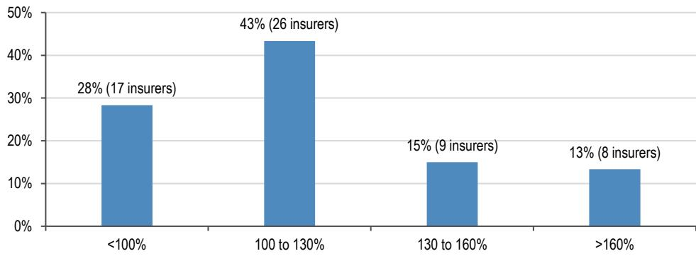
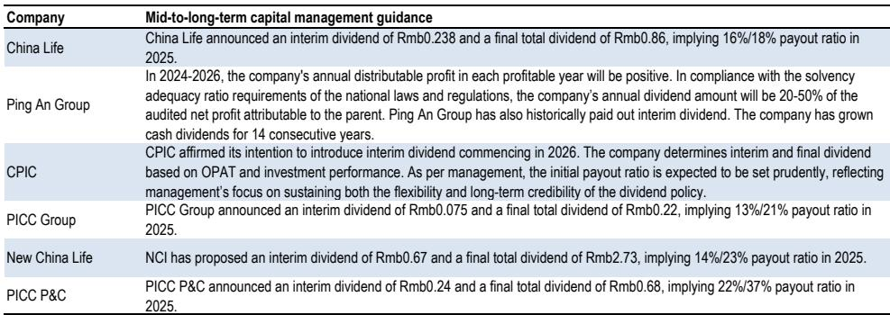

# 中国保险市场正呈现分层趋势，资本约束将加速分化

中国保险行业已进入一个转折点。在经历了二十年以牌照驱动的扩张（法人实体数量从2005年的97家弹性较高至2025年中的238家）之后，市场正进入结构性整合阶段。前五大寿险公司控制了45%的保费，前五大非寿险公司则占据了68%的份额。然而，在这一寡头格局之下，市场碎片化程度依然显著。在我们分析的75家寿险公司中，截至2026年3月，28%的公司核心偿付能力比率低于100%，其中四家低于70%，已接近可能触发强制性资本补充要求的50%监管红线。这并非周期性的短期波动，而是一个结构性分化——未来三到五年内，它将区分出行业中的领先者与追赶者。

推动这一分化的机制直接而严苛。中国的保险业仍是一个高度资本密集型的行业，需要在分销网络、客户获取、理赔基础设施和风险管理等方面进行前期投入。中小型保险公司缺乏足够的规模来产生足以覆盖其长期资本成本的内生收益。而市场资本正越来越不愿持续流入这些参与者，尤其是在反复注资似乎不可避免的情况下。结果形成了一个自我强化的循环：低回报抑制外部资本，资本约束限制业务增长，而停滞的增长进一步压低回报。

这一动态正发生在更有利于现有大型机构的监管背景下。银保渠道改革设定了佣金费率上限，并将竞争转向产品差异化和服务质量，这些优势不成比例地惠及那些品牌认知度更强、客户覆盖更广的大型保险公司。代理人渠道——历来是小型参与者的短板——竞争也变得更加激烈。规模不再仅仅是一个优势；它正逐渐成为生存的前提条件。对于关注市场的人来说，信号是明确的：规模领先者与资本受限的小型参与者之间的市场表现差异将会扩大，且这一分化将加速。

## 28%的寿险公司核心偿付能力低于100%，资本充足状况出现分化

中国75家寿险公司的偿付能力数据显示，市场并非因商业模式创新而分化，而是因资本充足状况而异。所有上市保险公司的核心偿付能力比率均高于100%，且大多数稳定在120%以上——这一水平足以支持稳定的分红，并为应对宏观环境波动提供缓冲。然而，在非上市寿险公司中，情况明显不同。17家公司的核心偿付能力低于100%，其中四家低于70%。监管最低要求是50%，但实际触发监管关注和资本补充要求的门槛往往远高于此。

这种资本缓冲的差距并非暂时的疲弱表现，而是反映了内生资本生成能力的结构性不足。许多中小型寿险公司面临新业务增长乏力、品牌认知度较弱以及分销成本上升的问题。行业向分红型产品的转型，虽然短期内为部分小型参与者带来了保费增长，但也伴随着显著的资本消耗风险。当低回报无法覆盖长期资本成本时，其财务逻辑便难以为继。来自母公司或公开市场的外部资本，越来越不愿持续填补这一缺口，尤其是在其基础业务模式未能显示出可持续回报路径的情况下。

其结果是市场份额的逐步但不可逆转的流失。过去五年，前五大寿险公司的合计市场份额从51.7%下降至45.3%，但这种侵蚀并非来自新进入者，而是来自那些通过分红型产品实现短期保费扩张的现有中小型参与者。随着资本约束收紧和监管改革限制渠道准入，这些增长正变得脆弱。结构性趋势是重新集中，而非进一步分散。

## 约55%的非寿险公司在2025年报告承保亏损，仅七家核心偿付能力低于150%

非寿险领域呈现出不同但同样具有说明意义的分化图景。在88家非寿险公司中，约55%在2025年报告了承保亏损。车险——仍是最大的非寿险险种——的价格竞争持续影响承保盈利能力。大型非寿险公司受益于理赔规模、更丰富的数据资源、更好的再保险渠道以及跨多个产品线和地域的多元化风险组合。相比之下，中小型非寿险公司仍暴露于狭窄的区域性业务、单一产品板块、巨灾天气损失以及周期性的价格压力之下。

偿付能力数据进一步印证了这一分化。截至2026年3月，仅七家非寿险公司的核心偿付能力低于150%，而前五大非寿险公司的平均水平约为180%。差距虽不如寿险领域显著，但方向一致。小型参与者的资本缓冲更薄，而许多公司报告的承保亏损将进一步侵蚀这些缓冲。对于非寿险公司而言，盈利路径依赖于规模驱动的成本优势和风险分散，而这两者对于小型参与者而言在结构上难以获得。

监管环境也在变化。监管机构收紧了关于财务再保险的规则——这是小型保险公司曾用于管理偿付能力压力的工具。虽然这一收紧将逐步提升来自资本缓冲薄弱的主险公司的再保险需求，但它也移除了一些弱势参与者赖以留在市场的“拐杖”。结果将是进一步的整合，小型非寿险公司要么被迫增资、让渡市场份额，要么退出市场。

## 区域银行业也呈现类似动态，整合正在淘汰弱势参与者并拉大业绩差距

我们在保险业观察到的相同结构性分化，在中国区域银行业同样明显。截至2025年中，共有124家城市商业银行和3381家农村金融机构，占银行体系资产的27%。然而，这些机构的不良贷款率更高、拨备覆盖率更低、资产回报率更弱、资本比率更薄，均逊于其大型同行。这种分化并非假设，而是可量化的。2026年第一季度，城商行的不良贷款率为1.85%，资产回报率为0.57%；相比之下，国有大行的这两项指标分别为1.22%和0.60%。农村金融机构表现更差，不良贷款率为2.79%，资产回报率为0.45%。

监管重心从规模增长转向风险化解——以包商银行事件为催化剂——加速了整合进程。仅2025年一年，就有310家村镇银行完成了合并重组或解散，截至2026年7月，已有134家退出。这一模式与保险业如出一辙：十年牌照驱动的扩张之后，是向质量而非数量的急剧转向。对于观察者而言，这意味着中小型区域银行面临着与其保险业同行相同的资本约束、更弱的盈利增长和更低的分红可预见性。市场已开始对高收益的中小型银行的分红可靠性给予折价，而更青睐那些拥有可信增长故事和稳定资产质量的机构。

## 决策框架：如何应对分化趋势

对于关注这一结构性分化的观察者而言，决策框架建立在三个相互关联的因素之上：资本充足状况、分销渠道准入和宏观风险韧性。每个因素都将整合者与被整合者区分开来。

资本充足状况是最直接的筛选标准。核心偿付能力持续高于120%的保险公司拥有吸收宏观冲击、维持分红和支撑内生增长的缓冲。低于100%的公司则面临有限的选择：寻求外部资本、削减分红或收缩业务。实践中，最后一种选择最为常见，并转化为市场份额的流失。对于寿险公司而言，这一门槛尤为重要，因为分红型产品的增长会快速消耗资本。偿付能力缓冲薄弱的保险公司，即使需求强劲，也无法积极竞争新业务。

分销渠道准入是第二个筛选标准。银保渠道改革收窄了小型保险公司曾通过支付更高佣金而享有的竞争优势。银行现在受佣金上限约束，正在采用更严格的交易对手选择标准，更青睐品牌认知度更强、客户关系更广的大型保险公司。代理人渠道——已是小型参与者的短板——并未提供任何缓解。结果是，分销正成为一种只有规模才能有效摊销的固定成本。没有明确分销优势的保险公司将发现，以支持正回报的成本来获取新业务变得越来越困难。

宏观风险韧性是第三个筛选标准。大型保险公司受益于多元化的风险组合、更好的再保险渠道，以及吸收巨灾损失而不危及偿付能力的能力。小型非寿险公司集中于狭窄的区域性业务或单一产品板块，面临周期性价格压力和天气相关损失，一次事件就可能抹去多年的承保利润。寿险公司面临不同但同样重要的宏观风险：分红型产品对市场波动和利率变动的敞口。大型参与者可以更有效地对冲这些风险，并维持更稳定的回报表现。

应用这一框架，在中小市值覆盖范围内，有两家保险公司可能成为行业重组的受益者。中国太平，凭借其成熟的分红型保险业务和均衡的资本配置，有望捕捉到自然迁移的业务流，而无需依赖并购活动。中国再保险面临一个不同但互补的机遇。随着资本压力促使中小型保险公司探索资本补充途径，财务再保险成为缓解偿付能力压力的可行工具。即使监管机构收紧对此类工具的规则，来自资本缓冲薄弱的主险公司的再保险需求仍将上升，从而在行业整体分化的背景下推动中国再保险的市场份额增长。

在区域银行业，同样的逻辑适用。宁波银行，凭借其费用增长潜力和稳定的资产质量，代表了那种能够在维持资本纪律的同时实现信贷增长复合的优质机构。市场已开始给予此类机构估值溢价，而随着整合淘汰弱势参与者，这一溢价应会扩大。

贯穿始终的核心观察并非押注保险需求或银行信贷增长的周期性复苏。而是认识到，中国的金融服务行业正在经历一场结构性调整，而资本、分销和风险管理是区分领先者与追赶者的三个轴心。那些为这一分化做好准备、青睐规模领先者和资本充足的机构、而非依赖持续注资的小型参与者的观察者，将更好地与市场的基本经济逻辑保持一致。

*仅供参考。部分内容可能基于源材料通过AI辅助生成、翻译、总结或编辑，可能存在遗漏或错误。请独立核实。本文不构成任何专业建议。*

仅供参考。部分内容可能基于源材料通过AI辅助生成、翻译、总结或编辑，可能存在遗漏或错误。请独立核实。本文不构成任何专业建议。

