# Z.AI (2513 HK)

**Hold: ARR Growth; Observations from Kimi K3**

- Raise ARR assumptions; adjust target price based on updated margin outlook and share count
- Sector competition continues, but Z.ai may have potential to advance with larger parameter models
- Maintain Hold, adjust target price to HKD1,500 (from HKD1,900)

**Estimate and target price changes:** Z.ai (Zhipu) ARR reached USD1bn in July (per Bloomberg News on 17 July 2026), ahead of the prior guidance for December 2026. We raise ARR estimates to USD2bn (from USD1bn) for December 2026 and USD6.5bn (from USD2.4bn) for December 2027. While the revenue mix shift toward lower-margin API may affect margins, we expect Z.ai to reach profitability in 2027 rather than 2028. However, we adjust our target price to HKD1,500 (from HKD1,900), reflecting updated free cash flow assumptions considering pricing competition, increased share count following the HKD31bn H-share follow-on offerings in July 2026, and exchange rate changes (USD-HKD). Our target price implies 14x P/ARR for December 2027, compared to Anthropic's 8x (based on HSBC's global tech platforms team estimates on Anthropic's ARR and USD1.2trn valuation in secondary market transactions, Business Insider, 9 July 2026). The premium reflects Z.ai's faster ARR growth of 220% versus Anthropic's 50%. Maintain Hold.

**Observations from the Kimi K3 launch:**
1. **Scaling trends continue:** K3's capability improvement appears linked to higher parameter size (increasing from 1trn for K2.7 to 2.8trn). Z.ai may potentially catch up with its next model, as GLM-5.2 currently has 744bn parameters.
2. **Sector competition intensifies:** K3's launch suggests that open-weight models could advance to 3trn parameter models in 3Q26, including MiniMax and DeepSeek. We note that iteration frequency from frontier labs has accelerated recently—five leading US players (Anthropic, OpenAI, Google, SpaceXAI, Meta) all released model updates in July to date (exhibit 2). This indicates that model leadership has become more temporary, and frontier labs need to maintain investment.
3. **Computing capacity supports ARR:** K3 has significantly slower token throughput than peers and paused new consumer subscriptions two days after launch, suggesting computing capacity constraints. In contrast, Z.ai has begun operating a 1GW data center (several clusters, each with over 10k domestic chips), with progress in using domestic chips for inferencing (Bloomberg News, 21 July 2026), helping address computing constraints. Additionally, per Sina News on 21 July 2026, Z.ai acquired XCore Sigma (a heterogeneous AI compute software provider) to improve utilization of various chip types. We believe these measures can support Z.ai's continued ARR growth amid robust user demand.

**Potential developments and considerations:**
- (1) Launch of a new GLM in 3Q26 (positive)
- (2) Model iterations from competitors (consideration)
- (3) Geopolitical factors related to potential restrictions on Chinese frontier models in the US market (consideration)
- (4) Lock-up expiry (consideration): approximately 38% of Z.ai's shares could become available in early January 2027
- (5) Fundraising or IPO of frontier labs could affect market dynamics

## Disclosures & Disclaimer

This report must be read with the disclosures and the analyst certifications in the Disclosure appendix, and with the Disclaimer, which forms part of it.

## Equities

Internet Software & Services

China

**MAINTAIN HOLD**

**TARGET PRICE (HKD)** | **1,500.00**
**PREVIOUS TARGET (HKD)** | **1,900.00**
**SHARE PRICE (HKD)** | **1,281.00**
**UPSIDE/DOWNSIDE** | **+17.1%**
*(as of 27 Jul 2026)*

## MARKET DATA

Market cap (HKDm) | 586,584
Market cap (USDm) | 74,796
3m ADTV (USDm) | 648

| | |
|---|---|
| Free float | 10% |
| BBG | 2513 HK |
| RIC | 2513.HK |

**FINANCIALS AND RATIOS (CNY)**

| Year to | 12/2025a | 12/2026e | 12/2027e | 12/2028e |
|---|---|---|---|---|
| HSBC EPS | -19.95 | -5.37 | 3.72 | 18.83 |
| HSBC EPS (prev) | -19.95 | -7.08 | -4.46 | 0.99 |
| Change (%) | 0.0 | 24.2 | nm | 1,799.8 |
| Consensus EPS | -10.80 | -9.70 | -8.81 | -3.04 |
| PE (x) | nm | nm | 297.7 | 58.7 |
| Dividend yield (%) | 0.0 | 0.0 | 0.0 | 0.0 |
| EV/EBITDA (x) | nm | nm | 198.6 | 34.6 |
| ROE (%) | 52.8 | -19.2 | 5.5 | 25.8 |

**52-WEEK PRICE (HKD)**
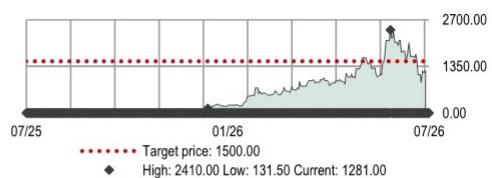
*Source: LSEG IBES, HSBC estimates*

## Ritchie Sun\*, CFA
Analyst, Internet Research
The Hongkong and Shanghai Banking Corporation Limited
ritchie.k.h.sun@hsbc.com.hk
+852 2822 4392

## Charlene Liu\*
Head of Internet and Gaming Research, Asia Pacific
The Hongkong and Shanghai Banking Corporation Limited, Singapore Branch
charlene.r.liu@hsbc.com.sg
+65 6658 0615

## Peishan Wang\*
Analyst, Internet Research
The Hongkong and Shanghai Banking Corporation Limited
peishan.wang@hsbc.com.hk
+852 3941 7008

\* Employed by a non-US affiliate of HSBC Securities (USA) Inc, and is not registered/qualified pursuant to FINRA regulations

Issuer of report: The Hongkong and Shanghai Banking Corporation Limited

## View HSBC Global Investment Research at:
https://www.research.hsbc.com

## Financials & valuation: Z.AI

**Financial statements**

| Year to | 12/2025a | 12/2026e | 12/2027e | 12/2028e |
|---|---|---|---|---|
| **Profit & loss summary (CNYm)** | | | | |
| Revenue | 724 | 7,206 | 29,176 | 66,237 |
| EBITDA | -3,517 | -3,186 | 2,291 | 12,687 |
| Depreciation & amortisation | -270 | -721 | -2,042 | -2,981 |
| Operating profit/EBIT | -3,787 | -3,906 | 249 | 9,706 |
| Net interest | -74 | -84 | -84 | -84 |
| PBT | -4,718 | -3,930 | 229 | 9,690 |
| HSBC PBT | -4,718 | -3,930 | 229 | 9,690 |
| Taxation | 0 | 0 | 0 | -969 |
| Net profit | -1,918 | -3,910 | 249 | 8,741 |
| HSBC net profit | -3,182 | -2,628 | 2,001 | 11,154 |

| **Cash flow summary (CNYm)** | | | | |
| Cash flow from operations | -2,246 | -690 | 6,300 | 19,311 |
| Capex | -23 | -735 | -2,013 | -3,113 |
| Cash flow from investment | -376 | -735 | -2,013 | -3,113 |
| Dividends | 0 | 0 | 0 | 0 |
| Change in net debt | -98 | -44,694 | -4,281 | -16,192 |
| FCF equity | -2,269 | -1,425 | 4,287 | 16,198 |

| **Balance sheet summary (CNYm)** | | | | |
| Intangible fixed assets | 90 | 90 | 90 | 90 |
| Tangible fixed assets | 854 | 868 | 839 | 972 |
| Current assets | 3,571 | 48,395 | 52,896 | 69,028 |
| Cash & others | 2,745 | 47,440 | 51,721 | 67,913 |
| Total assets | 4,854 | 49,753 | 54,288 | 70,621 |
| Operating liabilities | 12,275 | 13,598 | 16,054 | 21,154 |
| Gross debt | 605 | 605 | 605 | 605 |
| Net debt | -2,140 | -46,835 | -51,116 | -67,308 |
| Shareholders' funds | -8,093 | 35,508 | 37,608 | 48,861 |
| Invested capital | -10,505 | -11,683 | -13,950 | -18,977 |

**Ratio, growth and per share analysis**

## Hold

**Valuation data**

| Year to | 12/2025a | 12/2026e | 12/2027e | 12/2028e |
|---|---|---|---|---|
| EV/sales | 695.9 | 63.7 | 15.6 | 6.6 |
| EV/EBITDA | nm | nm | 198.6 | 34.6 |
| EV/IC | | | | |
| PE* | nm | nm | 297.7 | 58.7 |
| PB | | 15.3 | 15.8 | 13.4 |
| FCF yield (%) | -0.4 | -0.3 | 0.8 | 3.2 |
| Dividend yield (%) | 0.0 | 0.0 | 0.0 | 0.0 |

\* Based on HSBC EPS (diluted)

**ESG metrics**

| Environmental Indicators | 12/2025a | Governance Indicators | 12/2025a |
|---|---|---|---|
| GHG emission intensity* | 5.9 | No. of board members | 9 |
| Energy intensity* | 11.2 | Average board tenure (years) | 1.1 |
| CO2 reduction policy | Yes | Female board members (%) | 22.2 |
| **Social Indicators** | **12/2025a** | Board members independence (%) | 33.3 |
| Employee costs as % of revenues | 188.2 | | |
| Employee turnover (%) | n.a | | |
| Diversity policy | Yes | | |

| Year to | 12/2025a | 12/2026e | 12/2027e | 12/2028e |
|---|---|---|---|---|
| **Y-o-y % change** | | | | |
| Revenue | 131.9 | 894.9 | 304.9 | 127.0 |
| EBITDA | | | | 453.8 |
| Operating profit | | | | 3,804.0 |
| PBT | | | | 4,131.7 |
| HSBC EPS | | | | 406.8 |

| **Ratios (%)** | | | | |
| Revenue/IC (x) | -0.1 | -0.6 | -2.3 | -4.0 |
| ROIC | 45.1 | 35.2 | -1.9 | -53.1 |
| ROE | 52.8 | -19.2 | 5.5 | 25.8 |
| ROA | -102.2 | -14.4 | 0.4 | 14.0 |
| EBITDA margin | -485.5 | -44.2 | 7.9 | 19.2 |
| Operating profit margin | -522.8 | -54.2 | 0.9 | 14.7 |
| EBITDA/net interest (x) | | | 27.2 | 150.4 |
| Net debt/equity | 0.0 | -132.0 | -136.1 | -138.0 |
| Net debt/EBITDA (x) | 0.6 | 14.7 | -22.3 | -5.3 |

| **Per share data (CNY)** | | | | |
| EPS Rep (diluted) | -12.03 | -7.99 | 0.46 | 14.76 |
| HSBC EPS (diluted) | -19.95 | -5.37 | 3.72 | 18.83 |
| DPS | 0.00 | 0.00 | 0.00 | 0.00 |
| Book value | -50.73 | 72.53 | 69.84 | 82.48 |

*Source: Company data, HSBC*
\* GHG intensity and energy intensity are measured in kg and kWh respectively against revenue in USD '000s

| | |
|---|---|
| **Issuer information** | |
| Share price (HKD) | 1,281.00 |
| Target price (HKD) | 1,500.00 |
| RIC (Equity) | 2513.HK |
| Bloomberg (Equity) | 2513 HK |
| Market cap (USDm) | 74,796 |

| | |
|---|---|
| Free float | 4% |
| Sector | Internet Software & Services |
| Country/Region | China |
| Analyst | Ritchie Sun, CFA |
| Contact | +852 2822 4392 |

**Price relative**
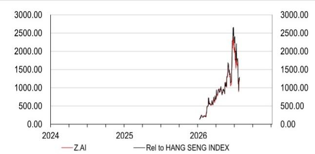
*Source: HSBC*
*Note: Priced at close of 27 Jul 2026*

## Competition

**Exhibit 1: Comparison between Z.ai and Moonshot on key metrics**

| Company | Z.ai | Moonshot |
|---|---|---|
| **Key model metrics** | | |
| Flagship model | GLM-5.2 | Kimi K3 |
| Release date | 13-Jun-26 | 16-Jul-26 |
| Core architecture | DeepSeek Sparse Attention (DSA) + IndexShare | Kimi Delta Attention (KDA) + Attention Residuals (AttnRes) + Stable LatentMoE |
| Total parameters (bn) | 744 | 2,800 |
| Activated parameters (bn) | 40 | 104 |
| Activation ratio (%) | 5.4% | 3.7% |
| Experts | 8 out of 256 experts | 16 out of 896 experts |
| Training data scale (trn tokens) | 30 | n.a. |
| Context window (m) | 1 | 1 |
| Modality | Text | Native multi-modal |

| **Cost vs. Intelligence vs. Speed** | | |
| API pricing (USD) | | |
| Input (Cache hit) | 0.26 | 0.3 |
| Input (Cache miss) | 1.4 | 3 |
| Output | 4.4 | 15 |
| Cost per task (USD) | 0.32 | 0.72 |
| Artificial Analysis Intelligence Index | 51 | 57 |
| Output speed (tps) | 211 | 33 |

| **Financial metrics** | | |
| Latest ARR (USDbn) | 1 | 0.3 |
| Latest ARR date | Jul-26 | Jun-26 |
| Latest valuation (USDbn) | 76 | 50 |
| P/ARR (x) | 76 | 167 |

*Source: Company data, Bloomberg, Artificial Analysis (data as of 27 July 2026). Note: share price is as of 27 July 2026*

**Exhibit 2: More companies have launched model iterations in July 2026**

*(Table showing major product launches from Jan 2025 to Jul 2026 across various companies including GLM, Opus, Fable, Sonnet, Gemini, GPT, Grok, Meta, MiniMax, DeepSeek, Qwen, Kimi, HY, and various agent products)*

*Source: Company data, HSBC*

**Exhibit 3: Zhipu has been consistently advancing relative to top US and China models**
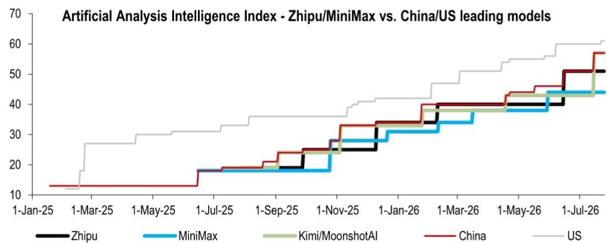
*Source: Artificial Analysis. Note: Latest data as of 27 July 2026*

**Exhibit 4: GLM-5.2's price performance remains competitive compared to some western models**
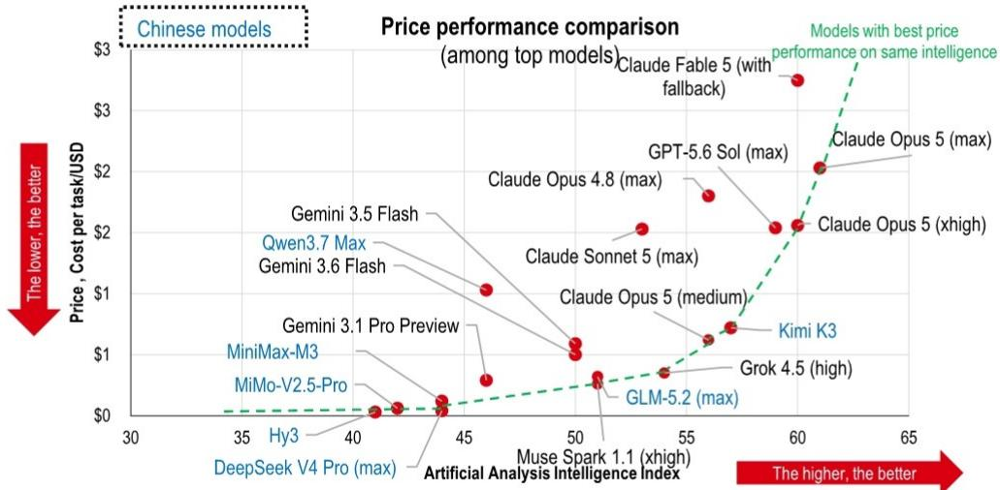
*Source: Artificial Analysis; Note: Cost per task using average cost per task in the index.*

**Exhibit 5: Parameter size for open weight models has increased significantly**

| Key latest models | Context Window (k) | Parameters (bn) | Activated parameters (bn) | Open/Proprietary |
|---|---|---|---|---|
| GLM-5.2 | 1,000 | 744 | 40 | Open |
| Kimi-K3 | c1,000 | 2,800 | 104 | Open* |
| Kimi-K2.7 Code | 256 | 1,000 | 32 | Open |
| MiniMax-M3 | 1,000 | 428 | 23 | Open |
| Claude Fable 5 | 1,000 | n.a. | n.a. | Proprietary |
| GLM-5.1 | c200 | c750 | 40 | Open |
| Kimi-K2.6 | 256 | 1,000 | 32 | Open |
| MiniMax-M2.7 | 205 | 230 | 10 | Open |
| DeepSeek-V4 Pro | 1,000 | 1,600 | 49 | Open |
| Qwen 3.8 Max preview | n.a | 2,400 | n.a. | Open* |
| Claude Opus 5 | 1,000 | n.a. | n.a. | Proprietary |
| GPT-5.6 | 1,000 | n.a. | n.a. | Proprietary |
| Gemini 3.1 Pro Preview | 1,000 | n.a. | n.a. | Proprietary |
| HY3 | 256 | 295 | 21 | Open |

*Source: Company data, Artificial Analysis, Huggingface. Note: K3 and Qwen 3.8 Max are reported to be open weight but details will be announced later by companies.*

**Exhibit 6: Key positive and negative share price catalysts for Zhipu in the rest of the year**
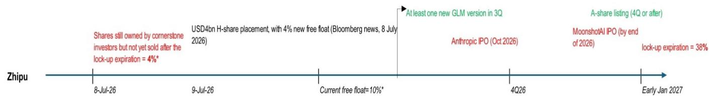
*Source: Company filings, Hang Seng Index, HSBC. Note: % numbers in chart are as % of total company shares. Green highlights represent positive catalysts, red highlights represent considerations.*

## ARR

**Exhibit 7: We expect Zhipu MaaS's ARR to reach USD2bn in December 2026 (51x yoy)**
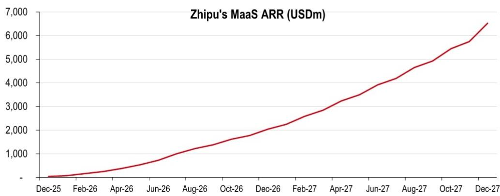
*Source: Company data, HSBC estimates*

**Exhibit 8: We expect Zhipu MaaS's ARR to grow faster than Anthropic's ARR**
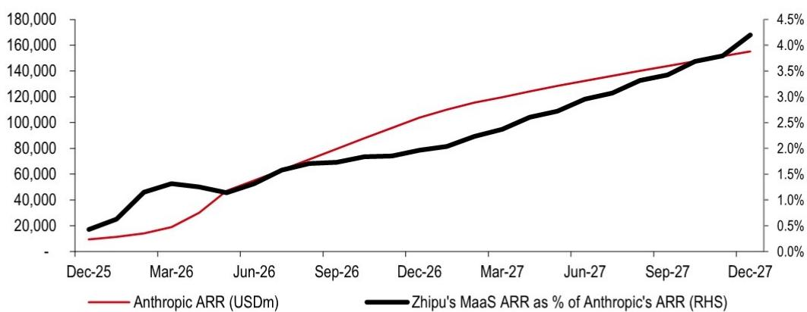
*Source: Company data, HSBC estimates*

**Exhibit 9: Z.ai's P/latest ARR ratio vs. peers**
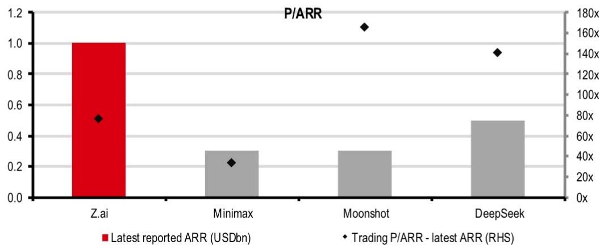
*Source: Company data, HSBC estimates, Sina News, 36Kr News, Bloomberg News, Bloomberg. Note: Share price is as of 27 July 2026*

## Token consumption trends

**Exhibit 10: Zhipu's average daily token on OpenRouter showed growth in June and July to date**
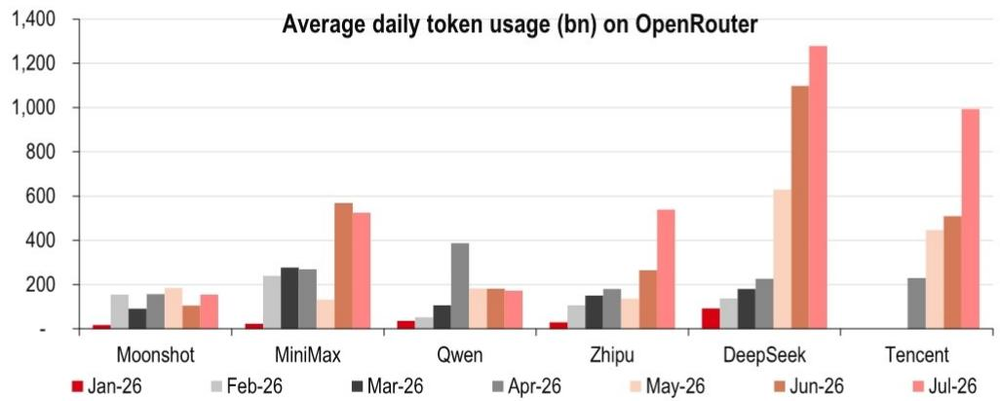
*Source: OpenRouter, HSBC. Note: Tencent has low base in Jan-Mar before HY3 on OpenRouter; July data using daily average up to 26 July 2026*

**Exhibit 11: Zhipu's token usage increased meaningfully post GLM-5.2 launch**

*Source: OpenRouter, company data, HSBC*

**Exhibit 12: Daily token usage trend on OpenRouter post each model launch – Zhipu**
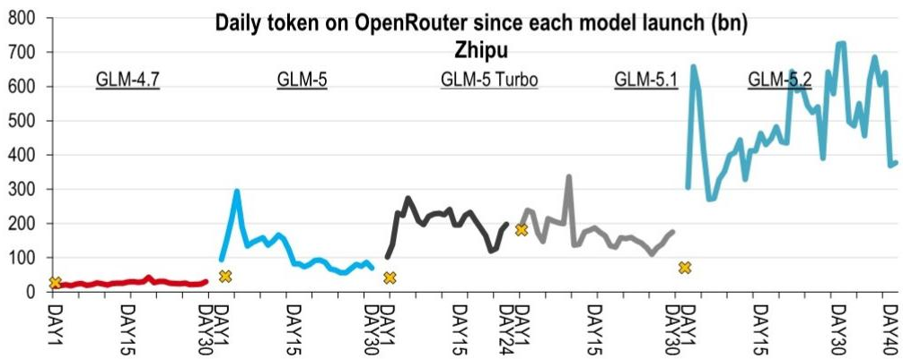
*Source: OpenRouter, HSBC. Note: Token volume showing total token from the provider not only new model; cross sign showing the token volume day right before the launch date*

**Daily token on OpenRouter since each model launch (bn)**
**Exhibit 13: Daily token trend on OpenRouter post each model launch – MiniMax**
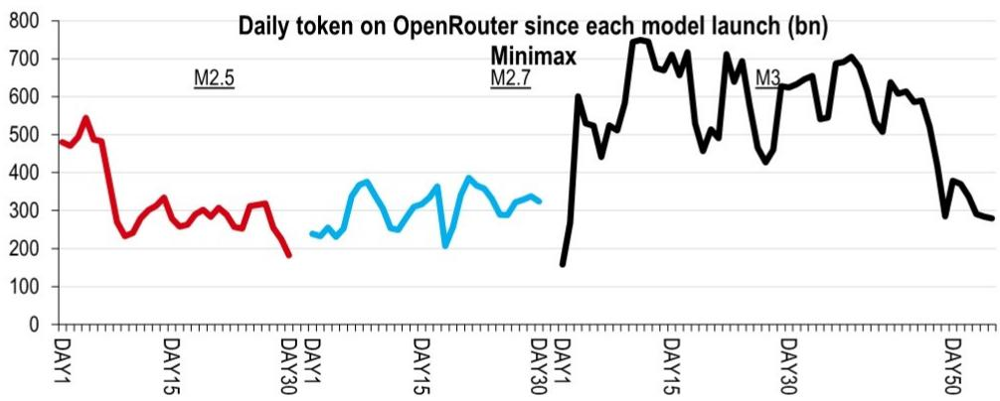
*Source: OpenRouter, HSBC. Note: Token volume showing total token from the provider not only new model; cross sign showing the token volume day right before the launch date*

**Exhibit 14: Daily token trend on OpenRouter post each model launch – Kimi**
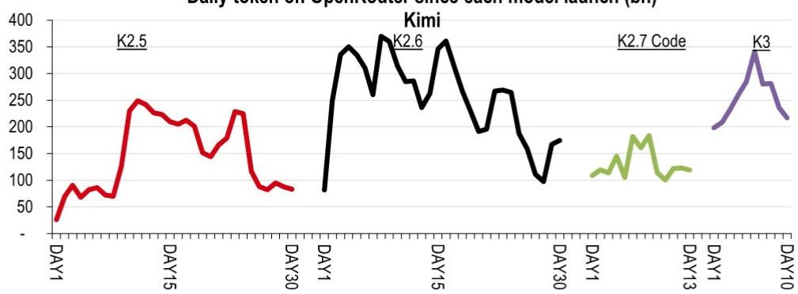
*Source: OpenRouter, HSBC. Note: Token volume showing total token from the provider not only new model; cross sign showing the token volume day right before the launch date*

**Exhibit 15: Daily token trend on OpenRouter post each model launch – DeepSeek**
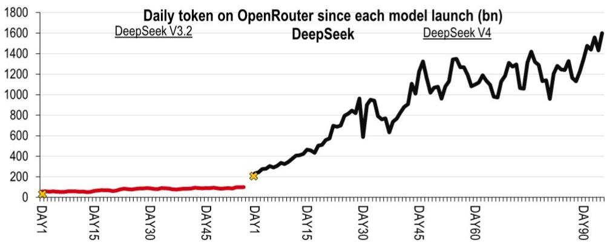
*Source: OpenRouter, HSBC. Note: Token volume showing total token from the provider not only new model; cross sign showing the token volume day right before the launch date*

## Estimate changes

Z.ai ARR reached USD1bn in July (per Bloomberg News on 17 July 2026), ahead of the guidance by December 2026. We raise ARR estimates to USD2bn (from USD1bn) in December 2026 and USD6.5bn (from USD2.4bn) in December 2027. Though the revenue mix shift to lower-margin API will affect margins, we expect Z.ai to turn profitable in 2027 instead of 2028. Our target price adjustment to HKD1,500 (from HKD1,900) factors in updated free cash flow assumptions to reflect pricing competition, higher share count after the HKD31bn H-share follow-on offerings in July 2026, and exchange rate changes (USD-HKD).

**Exhibit 16: Estimate changes**

*(Table showing estimate changes for 2026e, 2027e, 2028e including revenue, gross margin, operating profit, net income, and EPS figures)*

*Source: HSBC estimates*

## Valuation and considerations

| | Valuation | Considerations to our view |
|---|---|---|
| **Z.AI** | **Methodology: DCF** | **Positive considerations:** |
| 2513 HK | **Assumptions:** We have a Hold rating on Zhipu, with a HKD1,500.00 target price (from HKD1,900.00). This is based on a 10-year discounted cash flow (DCF) model, based on 11.8% WACC and 3% terminal growth rate. WACC is based on a 4.25% risk-free rate and 4.75% market risk premium (based on HSBC's global equity strategy team views), a 0.5% regulatory risk premium (due to being on the BIS Entity list), 1.45 beta, and 0.3% debt-to-debt & equity ratio. | ◆ Addressing computing capacity constraints |
| Current price: HKD1,281.00 | | ◆ GLM iterations |
| Target price: HKD1,500.00 | | ◆ Faster-than-expected path to break-even |
| Up/downside: +17.1% | We raise ARR estimates to USD2bn and USD6.5bn in December 2026 and December 2027, from USD1bn and USD2.4bn. While the revenue mix shift to lower-margin API will affect margins, we expect Z.ai to turn profitable in 2027 instead of 2028. Our target price adjustment to HKD1,500.00 factors in updated free cash flow assumptions to reflect pricing competition, higher share count after the HKD31bn H-share follow-on offerings in July 2026, and exchange rate changes (USD-HKD). | ◆ Endorsement from major industry players |
| | Our target price implies approximately 17% upside; we have a Hold rating given the competitive landscape in the LLM market. | **Considerations:** |
| | | ◆ New model launches from competitors that may affect token usage growth |
| | | ◆ Potential IPO of competitors (e.g., Anthropic, OpenAI, Kimi) that could affect market dynamics |
| | | ◆ Lock-up periods ending on 7 January 2027 |
| | | ◆ Model performance relative to expectations after iterations |
| | | ◆ Timeline to break-even |
| | | ◆ Cash burn and funding requirements |
| | | ◆ Geopolitical factors |

# Disclosure appendix

## Analyst Certification

The following analyst(s), economist(s), or strategist(s) who is(are) primarily responsible for this report, including any analyst(s) whose name(s) appear(s) as author of an individual section or sections of the report and any analyst(s) named as the covering analyst(s) of a subsidiary company in a sum-of-the-parts valuation certifies(y) that the opinion(s) on the subject security(ies) or issuer(s), any views or forecasts expressed in the section(s) of which such individual(s) is(are) named as author(s), and any other views or forecasts expressed herein, including any views expressed on the back page of the research report, accurately reflect their personal view(s) and that no part of their compensation was, is or will be directly or indirectly related to the specific recommendation(s) or views contained in this research report: Ritchie Sun, CFA, Charlene Liu and Peishan Wang

## Important disclosures

## Equities: Stock ratings and basis for financial analysis

HSBC and its affiliates, including the issuer of this report ("HSBC") believes an investor's decision to buy or sell a stock should depend on individual circumstances such as the investor's existing holdings, risk tolerance and other considerations and that investors utilise various disciplines and investment horizons when making investment decisions. Ratings should not be used or relied on in isolation as investment advice. Different securities firms use a variety of ratings terms as well as different rating systems to describe their recommendations and therefore investors should carefully read the definitions of the ratings used in each research report. Further, investors should carefully read the entire research report and not infer its contents from the rating because research reports contain more complete information concerning the analysts' views and the basis for the rating.

## HSBC assigns ratings on the following basis:

The target price is based on the analyst's assessment of the stock's actual current value, although we expect it to take six to 12 months for the market price to reflect this. When the target price is more than 20% above the current share price, the stock will be classified as a Buy; when it is between 5% and 20% above the current share price, the stock may be classified as a Buy or a Hold; when it is between 5% below and 5% above the current share price, the stock will be classified as a Hold; when it is between 5% and 20% below the current share price, the stock may be classified as a Hold or a Reduce; and when it is more than 20% below the current share price, the stock will be classified as a Reduce.

Our ratings are re-calibrated against these bands at the time of any 'material change' (initiation or resumption of coverage, change in target price or estimates).

Upside/Downside is the percentage difference between the target price and the share price.

## Rating distribution for long-term investment opportunities

As of 30 June 2026, the distribution of all independent ratings published by HSBC is as follows:

| Buy | 61% | (13% of these provided with Investment Banking Services in the past 12 months) |
| Hold | 34% | (10% of these provided with Investment Banking Services in the past 12 months) |
| Sell | 5% | (8% of these provided with Investment Banking Services in the past 12 months) |

For the purposes of the distribution above the following mapping structure is used during the transition from the previous to current rating models: under our previous model, Overweight = Buy, Neutral = Hold and Underweight = Sell; under our current model Buy = Buy, Hold = Hold and Reduce = Sell. For rating definitions under both models, please see "Stock ratings and basis for financial analysis" above.

For the distribution of non-independent ratings published by HSBC, please see the disclosure page available at http://www.hsbcnet.com/gbm/financial-regulation/investment-recommendations-disclosures.

**Share price and rating changes for long-term investment opportunities**

**Z.AI (2513.HK) share price performance HKD Vs HSBC rating history**

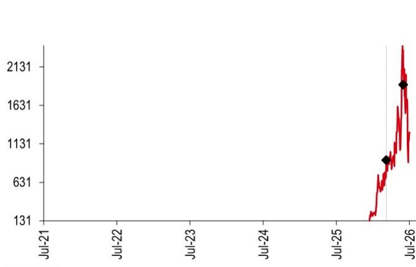

**Rating & target price history**

| From | To | Date | Analyst |
| N/A | Hold | 01 Apr 2026 | Ritchie Sun, CFA |
| **Target price** | **Value** | **Date** | **Analyst** |
| Price 1 | 920 | 01 Apr 2026 | Ritchie Sun, CFA |
| Price 2 | 1900 | 25 Jun 2026 | Ritchie Sun, CFA |

*Source: HSBC*

To view a list of all the independent fundamental ratings/recommendations disseminated by HSBC during the preceding 12-month period, and the location where we publish our quarterly distribution of non-fundamental recommendations (applicable to Fixed Income and Currencies research only), please use the following links to access the disclosure page:

Clients of HSBC Private Bank: www.research.privatebank.hsbc.com/Disclosures

All other clients: www.research.hsbc.com/A/Disclosures

## HSBC & Analyst disclosures

**Disclosure checklist**

| Company | Ticker | Recent price | Price date | Disclosure |
| Z.AI | 2513.HK | 1281.00 | 27 Jul 2026 | 11 |

*Source: HSBC*

1 HSBC has managed or co-managed a public offering of securities for this company within the past 12 months.
2 HSBC expects to receive or intends to seek compensation for investment banking services from this company in the next 3 months.
3 At the time of publication of this report, HSBC Securities (USA) Inc. is a Market Maker in securities issued by this company.
4 As of 30 June 2026, HSBC beneficially owned 1% or more of a class of common equity securities of this company.
5 This company was a client of HSBC or had during the preceding 12 month period been a client of and/or paid compensation to HSBC in respect of investment banking services.
6 This company was a client of HSBC or had during the preceding 12 month period been a client of and/or paid compensation to HSBC in respect of non-investment banking securities-related services.
7 This company was a client of HSBC or had during the preceding 12 month period been a client of and/or paid compensation to HSBC in respect of non-securities services.
8 A covering analyst/s has received compensation from this company in the past 12 months.
9 A covering analyst/s or a member of his/her household has a financial interest in the securities of this company, as detailed below.
10 A covering analyst/s or a member of his/her household is an officer, director or supervisory board member of this company, as detailed below.
11 At the time of publication of this report, HSBC is a non-US Market Maker in securities issued by this company and/or in securities in respect of this company.
12 As of 22 July 2026, HSBC beneficially held a net long position of more than 0.5% of this company's total issued share capital, calculated according to the SSR methodology.
13 As of 22 July 2026, HSBC beneficially held a net short position of more than 0.5% of this company's total issued share capital, calculated according to the SSR methodology.
14 HSBC Qianhai Securities Limited holds 1% or more of a class of common equity securities of this company.

HSBC and its affiliates will from time to time sell to and buy from customers the securities/instruments, both equity and debt (including derivatives) of companies covered in HSBC on a principal or agency basis or act as a market maker or liquidity provider in the securities/instruments mentioned in this report.

Analysts, economists, and strategists are paid in part by reference to the profitability of HSBC which includes investment banking, sales & trading, and principal trading revenues.

Whether, or in what time frame, an update of this analysis will be published is not determined in advance.

Non-U.S. analysts may not be associated persons of HSBC Securities (USA) Inc, and therefore may not be subject to FINRA Rule 2241 or FINRA Rule 2242 restrictions on communications with the subject company, public appearances and trading securities held by the analysts.

Economic sanctions laws imposed by certain jurisdictions such as the US, the EU, the UK, and others, may prohibit persons subject to those laws from making certain types of investments, including by transacting or dealing in securities of particular issuers, sectors, or regions. This report does not constitute advice in relation to any such laws and should not be construed as an inducement to transact in securities in breach of such laws.

For disclosures in respect of any company mentioned in this report, please see the most recently published report on that company available at www.hsbcnet.com/research. HSBC Private Bank clients should contact their Relationship Manager for queries regarding other research reports. In order to find out more about the proprietary models used to produce this report, please contact the authoring analyst.

HSBC may use Artificial Intelligence (AI) tools approved for adoption within HSBC in the development of its research reports, utilizing these technologies to analyse large volumes of data, enhance efficiency and improve the overall user experience. This includes but is not limited to paraphrasing, developing suitable captions and supporting data visualisation. It is important to note that while AI tools assist in various aspects of report creation, all investment recommendations and opinions presented herein are formulated and approved exclusively by our research analysts. The final content of the report reflects the professional judgement and expertise of our research analysts, ensuring compliance with regulatory standards and maintaining the integrity of our research process.

## Additional disclosures

1 This report is dated as at 28 July 2026.
2 All market data included in this report are dated as at close 27 July 2026, unless a different date and/or a specific time of day is indicated in the report.
3 HSBC has procedures in place to identify and manage any potential conflicts of interest that arise in connection with its Research
