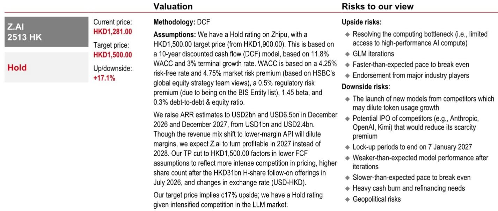
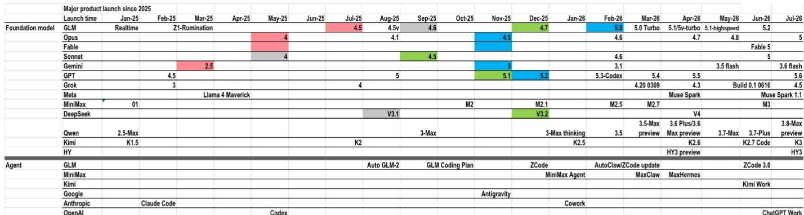
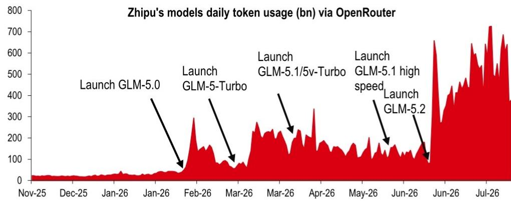

# HSBC：智谱AI年化与AI及近期数据观察

智谱（Z.ai）在2026年7月实现年化经常性收入（ARR）10亿美元，比公司此前指引的2026年底提前约5个月。HSBC随即调整其ARR预测——2026年底从10亿升至20亿美元，2027年底从24亿升至65亿美元。但与此同时，这一调整背后，是收入结构向低毛利API倾斜、竞争加剧导致定价承压、以及7月完成310亿港元H股增发后股本扩张三重因素共同作用的结果。报告认为智谱有望在2027年实现盈利，而非此前预期的2028年。

## 1. Kimi K3发布揭示规模定律仍在加速

月之暗面于2026年7月16日发布的Kimi K3模型，总参数量从上一代K2.7的1万亿跃升至2.8万亿，激活参数1040亿。HSBC认为这一跃升验证了规模定律的持续有效性。相比之下，智谱当前旗舰模型GLM-5.2总参数量仅为7440亿。报告指出，智谱有可能通过下一代模型缩小差距，但时间窗口正在收窄——K3的发布意味着中国开源权重模型可能在2026年第三季度集体迈入3万亿参数时代，MiniMax和DeepSeek均被列为潜在跟进者。

> **KC评论：** 参数规模差距是当前值得关注的竞争维度。GLM-5.2的7440亿参数与K3的2.8万亿之间，存在能力代际差异。智谱能否在3-6个月内推出参数规模接近2万亿的下一代模型，将直接决定其ARR增长能否持续。

## 2. 模型迭代频率加速，领先地位趋于短暂

报告展示了一个关键事实：2026年7月至今，仅美国五家前沿实验室——Anthropic、OpenAI、Google、SpaceXAI、Meta——全部发布了模型更新。HSBC认为，模型能力的领先地位已变得更加临时化，前沿实验室必须持续投入以维持竞争力。这一判断对智谱意味着两件事：一是追赶窗口期缩短，二是研发投入难以缩减，这将持续影响自由现金流。

## 3. 算力约束成为ARR增长的差异化变量

K3发布后暴露了一个关键短板：其token吞吐速度远低于同行，且发布仅两天便暂停了面向消费者的新订阅。HSBC将此归因于算力不足。而智谱在算力侧已采取差异化布局——根据彭博2026年7月21日报道，智谱已开始运营一个1GW的数据中心（包含多个集群，每个集群配备超过1万块国产芯片），并在国产芯片推理方面取得突破。此外，据新浪2026年7月21日报道，智谱收购了异构AI计算软件提供商XCore Sigma，以提升多种芯片的利用率。HSBC认为，这些措施能够支撑智谱在用户需求旺盛的情况下持续扩大ARR。

## 4. 估值框架：P/ARR溢价背后是增长差异

HSBC以14倍2027年P/ARR为智谱定价，对比Anthropic的8倍（基于HSBC全球科技平台团队对Anthropic ARR的估算及二级市场交易隐含的1.2万亿美元估值）。溢价的核心支撑是增长差异：智谱2027年ARR增速约220%，而Anthropic约为50%。主要反映更低的自由现金流假设（竞争加剧导致定价承压）、增发后更高的股本基数，以及美元兑港元汇率变化。报告同时提示，约38%的智谱股份可能在2027年1月初解禁，以及前沿实验室的融资或IPO可能降低稀缺性溢价。

HSBC更新公司观点。报告认为，智谱在算力基础设施和国产芯片适配方面的先发布局，可能成为其在模型能力追赶期维持ARR增长的关键缓冲。但模型迭代频率的加速和参数规模竞赛的升级，意味着竞争格局仍在快速演变中。

For informational purposes only. Portions may be generated,translated,summarized,or edited with AI assistance based on source materials and may contain omissions or errors. Please verify independently. This is not investment,legal,tax,accounting,or other professional advice.

For informational purposes only. Portions may be generated,translated,summarized,or edited with AI assistance based on source materials and may contain omissions or errors. Please verify independently. This is not investment,legal,tax,accounting,or other professional advice.

