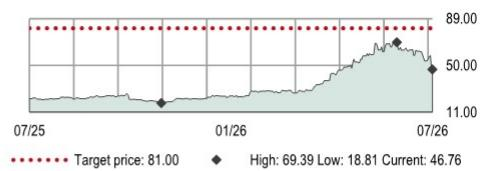
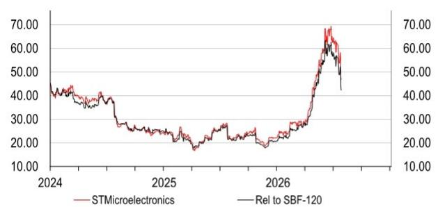

# STMicroelectronics (STMPA FP)

## 研究观点：指引调整，需求信号积极

- 复苏进程有所调整，但趋势未变：2026年第三季度展望略低于预期，但需求信号依然强劲，订单出货比“接近2”
- AI/光学领域需求持续上升，分销库存已低于目标水平
- 维持积极看法，目标价从84.00欧元调整至81.00欧元

**复苏节奏略有调整——但趋势仍在延续：** STM公布的2026年第二季度业绩表现不一，第三季度指引低于我们的预期（详见《STMicro：2026年第二季度初步分析——需求评论积极的缓慢复苏》，2026年7月23日）。相较于近期市场对价格和AI主题的乐观情绪（详见《从低谷到加速》，2026年6月29日），该展望明显令人失望，但我们认为这反映的是复苏形态的差异，而非复苏本身的缺失。管理层关于以下方面的评论：（A）整体订单出货比“接近2”，（B）分销库存低于公司目标水平，（C）持续的价格上调，以及（D）净资本支出预计处于20-22亿美元区间的高端，均印证了我们对潜在需求强劲回升的看法。结合制造重组计划的进展，我们仍认为未来几年存在利润率与盈利显著回升的空间。考虑到业绩及第三季度较为温和的展望，我们将2026/2027年调整后营业利润预期下调4.4%/5.9%。目前我们预计2028/2030年调整后每股收益分别为4.1美元/6.2美元，仍较2025/2026年的0.5美元/1.4美元有显著增长。维持积极看法。

**预期调整：** 反映第二季度业绩、第三季度展望及管理层评论，我们将2026/2027年收入预期下调1.7%/1.1%，调整后营业利润预期下调4.4%/5.9%。

**目标价调整至81欧元（此前为84欧元）：** 我们的估值方法保持不变。随着回升趋势已启动（尽管轨迹与我们此前预期有所不同），我们仍预计未来几年利润率将显著恢复（2028/2029年利润率分别为21.9%/25.3%，高于2025年的4.7%）。我们继续采用2030年预期市盈率18倍（不变）对STM进行估值，然后以9.67%的加权平均资本成本（无风险利率4.25%，股权风险溢价4%，贝塔系数1.35）将所得公允价值折现。由此得出每股目标价81.00欧元（此前为84.00欧元），ADR目标价93.00美元（此前为97.00美元）（欧元/美元汇率1.15）。

## 披露与免责声明

## 股票研究

半导体与设备

法国

## 维持积极看法

目标价（欧元） 此前目标价（欧元）

81.00 84.00

当前价格（欧元） 潜在空间

46.76 +73.2%

（截至2026年7月24日）

市场数据

<table><tr><td>市值（百万欧元）</td><td>42,616</td></tr><tr><td>市值（百万美元）</td><td>48,446</td></tr><tr><td>3个月日均交易量（百万美元）</td><td>229</td></tr></table>

<table><tr><td>自由流通比例</td><td>70%</td></tr><tr><td>彭博代码</td><td>STMPA FP</td></tr><tr><td>路透代码</td><td>STMPA.PA</td></tr></table>

财务数据与比率（美元）

<table><tr><td>财年截至</td><td>2025年实际</td><td>2026年预期</td><td>2027年预期</td><td>2028年预期</td></tr><tr><td>HSBC每股收益</td><td>0.53</td><td>1.43</td><td>2.82</td><td>4.05</td></tr><tr><td>HSBC每股收益（此前）</td><td>0.53</td><td>1.44</td><td>3.06</td><td>4.23</td></tr><tr><td>变化（%）</td><td>0.0</td><td>-1.2</td><td>-7.9</td><td>-4.3</td></tr><tr><td>市场一致预期每股收益</td><td>0.60</td><td>1.34</td><td>2.66</td><td>3.74</td></tr><tr><td>市盈率（倍）</td><td>101.0</td><td>37.3</td><td>18.9</td><td>13.1</td></tr><tr><td>股息率（%）</td><td>0.7</td><td>0.7</td><td>0.7</td><td>0.7</td></tr><tr><td>企业价值/EBITDA（倍）</td><td>21.8</td><td>14.4</td><td>8.6</td><td>6.2</td></tr><tr><td>净资产回报表现（%）</td><td>2.7</td><td>7.3</td><td>13.6</td><td>17.2</td></tr></table>

52周价格（欧元）  
  
来源：Refinitiv IBES，HSBC预期

## Adithya Metuku\*, CFA

高级全球科技分析师
HSBC银行
adithya.metuku@hsbc.com
+44 203 268 2960

Kalpesh Mahadik\*, CFA
副分析师
班加罗尔

\*受雇于HSBC证券（美国）公司的非美国关联机构，未根据FINRA规定注册/取得资格

## 财务数据与估值：STMicroelectronics

财务报表

<table><tr><td>财年截至</td><td>2025年实际</td><td>2026年预期</td><td>2027年预期</td><td>2028年预期</td></tr><tr><td colspan="5">利润表摘要（百万美元）</td></tr><tr><td>收入</td><td>11,799</td><td>14,524</td><td>17,412</td><td>19,641</td></tr><tr><td>EBITDA</td><td>2,029</td><td>3,136</td><td>5,086</td><td>6,646</td></tr><tr><td>折旧与摊销</td><td>-1,854</td><td>-1,940</td><td>-2,200</td><td>-2,400</td></tr><tr><td>营业利润/EBIT</td><td>175</td><td>1,196</td><td>2,886</td><td>4,246</td></tr><tr><td>净利息收入</td><td>168</td><td>110</td><td>63</td><td>111</td></tr><tr><td>税前利润</td><td>400</td><td>1,296</td><td>2,929</td><td>4,337</td></tr><tr><td>HSBC税前利润</td><td>400</td><td>1,296</td><td>2,929</td><td>4,337</td></tr><tr><td>所得税</td><td>-221</td><td>-194</td><td>-439</td><td>-651</td></tr><tr><td>净利润（调整后）</td><td>165</td><td>1,090</td><td>2,483</td><td>3,681</td></tr><tr><td>HSBC净利润</td><td>486</td><td>1,319</td><td>2,603</td><td>3,741</td></tr><tr><td colspan="5">现金流量表摘要（百万美元）</td></tr><tr><td>经营活动现金流</td><td>2,152</td><td>2,429</td><td>4,540</td><td>5,773</td></tr><tr><td>资本支出</td><td>-2,204</td><td>-2,300</td><td>-2,500</td><td>-2,800</td></tr><tr><td>投资活动现金流</td><td>-43</td><td>-3,810</td><td>-2,500</td><td>-2,800</td></tr><tr><td>股息</td><td>-332</td><td>-333</td><td>-333</td><td>-333</td></tr><tr><td>净债务变动</td><td>442</td><td>977</td><td>-1,376</td><td>-2,294</td></tr><tr><td>自由现金流（股权）</td><td>213</td><td>363</td><td>2,040</td><td>2,973</td></tr><tr><td colspan="5">资产负债表摘要（百万美元）</td></tr><tr><td>无形资产</td><td>639</td><td>1,355</td><td>1,235</td><td>1,195</td></tr><tr><td>有形固定资产</td><td>11,058</td><td>11,248</td><td>11,668</td><td>12,108</td></tr><tr><td>流动资产</td><td>11,271</td><td>12,980</td><td>14,849</td><td>17,704</td></tr><tr><td>现金及其他</td><td>4,922</td><td>5,837</td><td>7,213</td><td>9,507</td></tr><tr><td>总资产</td><td>24,800</td><td>27,571</td><td>29,740</td><td>32,995</td></tr><tr><td>经营性负债</td><td>3,979</td><td>4,481</td><td>4,667</td><td>4,784</td></tr><tr><td>总债务</td><td>2,133</td><td>4,025</td><td>4,025</td><td>4,025</td></tr><tr><td>净债务</td><td>-2,789</td><td>-1,812</td><td>-3,188</td><td>-5,482</td></tr><tr><td>股东权益</td><td>17,828</td><td>18,219</td><td>20,202</td><td>23,340</td></tr><tr><td>投入资本</td><td>14,067</td><td>15,265</td><td>15,872</td><td>16,716</td></tr></table>

比率、增长与每股分析

积极看法

估值数据

<table><tr><td>财年截至</td><td>2025年实际</td><td>2026年预期</td><td>2027年预期</td><td>2028年预期</td></tr><tr><td>企业价值/销售额</td><td>3.7</td><td>3.1</td><td>2.5</td><td>2.1</td></tr><tr><td>企业价值/EBITDA</td><td>21.8</td><td>14.4</td><td>8.6</td><td>6.2</td></tr><tr><td>企业价值/投入资本</td><td>3.1</td><td>3.0</td><td>2.8</td><td>2.5</td></tr><tr><td>市盈率*</td><td>101.0</td><td>37.3</td><td>18.9</td><td>13.1</td></tr><tr><td>市净率</td><td>2.8</td><td>2.7</td><td>2.4</td><td>2.1</td></tr><tr><td>自由现金流回报表现（%）</td><td>0.4</td><td>0.7</td><td>4.2</td><td>6.1</td></tr><tr><td>股息率（%）</td><td>0.7</td><td>0.7</td><td>0.7</td><td>0.7</td></tr></table>

\* 基于HSBC每股收益（稀释后）

ESG指标

<table><tr><td>环境指标</td><td>2025年实际</td><td>治理指标</td><td>2025年实际</td></tr><tr><td>温室气体排放强度*</td><td>109.3</td><td>董事会成员人数</td><td>9</td></tr><tr><td>能源强度*</td><td>298.4</td><td>董事会平均任期（年）</td><td>3.4</td></tr><tr><td>二氧化碳减排政策</td><td>是</td><td>女性董事会成员比例（%）</td><td>33.3</td></tr><tr><td>社会指标</td><td>2025年实际</td><td>董事会成员独立性（%）</td><td>100</td></tr><tr><td>员工成本占收入比例</td><td>34.3</td><td></td><td></td></tr><tr><td>员工流动率（%）</td><td>6</td><td></td><td></td></tr><tr><td>多元化政策</td><td>是</td><td></td><td></td></tr></table>

来源：公司数据，HSBC  
\* 温室气体排放强度和能源强度分别以千克和千瓦时计，相对于以千美元计的收入。

发行人信息

<table><tr><td>当前价格（欧元）</td><td>46.76</td></tr><tr><td>目标价（欧元）</td><td>81.00</td></tr><tr><td>路透代码（股票）</td><td>STMPA.PA</td></tr><tr><td>彭博代码（股票）</td><td>STMPA FP</td></tr><tr><td>市值（百万美元）</td><td>48,446</td></tr></table>

<table><tr><td>自由流通比例</td><td>70%</td></tr><tr><td>行业</td><td>半导体</td></tr><tr><td>国家/地区</td><td>法国</td></tr><tr><td>分析师</td><td>Adithya Metuku, CFA</td></tr><tr><td>联系方式</td><td>+44 203 268 2960</td></tr></table>

<table><tr><td>财年截至</td><td>2025年实际</td><td>2026年预期</td><td>2027年预期</td><td>2028年预期</td></tr><tr><td colspan="5">同比变化率（%）</td></tr><tr><td>收入</td><td>-11.1</td><td>23.1</td><td>19.9</td><td>12.8</td></tr><tr><td>EBITDA</td><td>-40.9</td><td>54.5</td><td>62.2</td><td>30.7</td></tr><tr><td>营业利润</td><td>-89.6</td><td>583.2</td><td>141.4</td><td>47.1</td></tr><tr><td>税前利润</td><td>-78.8</td><td>224.0</td><td>126.0</td><td>48.1</td></tr><tr><td>HSBC每股收益</td><td>-68.5</td><td>170.9</td><td>97.4</td><td>43.7</td></tr><tr><td colspan="5">比率（%）</td></tr><tr><td>收入/投入资本（倍）</td><td>0.9</td><td>1.0</td><td>1.1</td><td>1.2</td></tr><tr><td>投入资本回报率</td><td>0.6</td><td>6.9</td><td>15.8</td><td>22.2</td></tr><tr><td>净资产回报表现</td><td>2.7</td><td>7.3</td><td>13.6</td><td>17.2</td></tr><tr><td>总资产回报表现</td><td>0.8</td><td>4.5</td><td>9.1</td><td>12.1</td></tr><tr><td>EBITDA利润率</td><td>17.2</td><td>21.6</td><td>29.2</td><td>33.8</td></tr><tr><td>营业利润率</td><td>1.5</td><td>8.2</td><td>16.6</td><td>21.6</td></tr><tr><td>净债务/权益</td><td>-15.3</td><td>-9.7</td><td>-15.5</td><td>-23.1</td></tr><tr><td>净债务/EBITDA（倍）</td><td>-1.4</td><td>-0.6</td><td>-0.6</td><td>-0.8</td></tr><tr><td colspan="5">每股数据（美元）</td></tr><tr><td>报告每股收益（稀释后）</td><td>0.18</td><td>1.18</td><td>2.69</td><td>3.98</td></tr><tr><td>HSBC每股收益（稀释后）</td><td>0.53</td><td>1.43</td><td>2.82</td><td>4.05</td></tr><tr><td>每股股息</td><td>0.36</td><td>0.36</td><td>0.36</td><td>0.36</td></tr><tr><td>每股账面价值</td><td>19.31</td><td>19.70</td><td>21.85</td><td>25.24</td></tr></table>

价格相对走势  
  
来源：HSBC  
注：价格为2026年7月24日收盘价

## 关键电话会议要点

## 2026年需求与增长预期

需求趋势：STM在第二季度观察到需求进一步加速，整体订单出货比“接近2”。所有终端市场的订单出货比均“远高于1”，其中通信设备与计算机外设市场“显著高于2”，主要受包括硅光子在内的光学连接需求驱动。管理层表示，多个产品类别的可见度有所改善，并出现供应趋紧迹象。

分销库存在第二季度进一步下降，目前已低于公司目标水平。

定价与投入成本：管理层承认存在投入成本上涨，但指出这已被STM在收入端的定价措施所抵消。STM的价格上调将在未来几个季度继续推动收入增长，因为不同市场的价格调整节奏有所不同。

分部增长：管理层提供了2026年下半年各分部的增长预期。CECP分部收入增长预计与第二季度水平相当——即2026年第三季度同比增长约60%，随后在第四季度强劲加速至约90%。工业分部增长将在第三和第四季度逐步改善，第四季度达到约40%的同比增长水平。汽车分部预计实现低两位数增长，而个人电子（PE）分部在2026财年预计实现低至中个位数增长。

毛利率指引为37% +/- 2个百分点，其中包含70个基点的产能闲置费用拖累。对于第四季度，管理层确认环比改善，但未承诺具体的利润率扩张幅度。管理层指出，缺乏汇率利好以及产能卸载费用的拖累，是限制第四季度利润率环比扩张幅度（相较于第三季度预期改善）的因素。

碳化硅（SiC）收入增长已重回增长区间，第二季度实现低两位数同比增长。管理层预计2026财年将实现两位数同比增长，这得益于强劲的订单（订单出货比远高于1）和设计中标。

◆ 管理层目前预计2026年净资本支出处于20-22亿美元区间的高端，因为公司正在加速对选定增长领域的投资，包括云光学互连。

## 2027年

◆ 管理层预计2027年第一季度将好于正常季节性表现，因为2026年第二季度超过50%的订单是为2027年准备的。

关于AI数据中心，管理层将2026年AI数据中心收入指引上调至“超过10亿美元”，2027年“远超过20亿美元”，其中光缆连接是2027年的主要增长驱动力。管理层确认，随着其Crolles工厂的产能持续扩张，公司目前不受产能限制，能够抓住硅光子IC领域的收入增长机会。

## 其他

$\diamond$ 公司管理层重申了其模型：在季度收入达到40亿美元时实现超过40%的毛利率。然而，这取决于其制造重组计划（硅片从200毫米转向300毫米，碳化硅从150毫米转向200毫米）的完成，该计划目标在2027年底前完成。

管理层还确认了2028年实现180亿美元收入的目标，而45%的毛利率目标则取决于制造重组计划是否按时完成。

## 预期调整

反映业绩（详见《STMicro：2026年第二季度初步分析——需求评论积极的缓慢复苏》，2026年7月23日）、展望及管理层评论，我们将2026/2027/2028年收入预期下调1.7%/1.1%/0.1%，调整后营业利润预期下调4.4%/5.9%/2.3%。

STMicroelectronics – 预期调整

<table><tr><td rowspan="2">百万美元</td><td colspan="4">新预期</td><td colspan="4">旧预期</td><td colspan="4">变化</td></tr><tr><td>2026年预期</td><td>2027年预期</td><td>2028年预期</td><td>2030年预期</td><td>2026年预期</td><td>2027年预期</td><td>2028年预期</td><td>2030年预期</td><td>2026年预期</td><td>2027年预期</td><td>2028年预期</td><td>2030年预期</td></tr><tr><td>总收入</td><td>14,524</td><td>17,412</td><td>19,641</td><td>23,225</td><td>14,773</td><td>17,610</td><td>19,657</td><td>23,257</td><td>-1.7%</td><td>-1.1%</td><td>-0.1%</td><td>-0.1%</td></tr><tr><td>同比变化率</td><td>23%</td><td>20%</td><td>13%</td><td>8%</td><td>25%</td><td>19%</td><td>12%</td><td>8%</td><td>(211bps)</td><td>69bps</td><td>118bps</td><td>(2bps)</td></tr><tr><td>毛利润（报告）</td><td>5,243</td><td>7,139</td><td>8,740</td><td>11,264</td><td>5,318</td><td>7,308</td><td>8,747</td><td>11,279</td><td>-1.4%</td><td>-2.3%</td><td>-0.1%</td><td>-0.1%</td></tr><tr><td>毛利率</td><td>36.1%</td><td>41.0%</td><td>44.5%</td><td>48.5%</td><td>36.0%</td><td>41.5%</td><td>44.5%</td><td>49%</td><td>10bps</td><td>(50bps)</td><td>0bps</td><td>0bps</td></tr><tr><td>研发费用</td><td>2,222</td><td>2,438</td><td>2,652</td><td>2,833</td><td>2,231</td><td>2,465</td><td>2,654</td><td>2,837</td><td>-0.4%</td><td>-1.1%</td><td>-0.1%</td><td>-0.1%</td></tr><tr><td>（占收入比例）</td><td>15%</td><td>14%</td><td>14%</td><td>12%</td><td>15%</td><td>14%</td><td>14%</td><td>12%</td><td>20bps</td><td>0bps</td><td>0bps</td><td>0bps</td></tr><tr><td>销售、一般及管理费用</td><td>1,786</td><td>1,915</td><td>2,062</td><td>2,253</td><td>1,773</td><td>1,867</td><td>1,966</td><td>2,163</td><td>0.8%</td><td>2.6%</td><td>4.9%</td><td>4.2%</td></tr><tr><td>（占收入比例）</td><td>12%</td><td>11%</td><td>11%</td><td>10%</td><td>12%</td><td>11%</td><td>10%</td><td>9%</td><td>30bps</td><td>40bps</td><td>50bps</td><td>40bps</td></tr><tr><td>营业利润</td><td>1,196</td><td>2,886</td><td>4,246</td><td>6,398</td><td>1,284</td><td>3,036</td><td>4,348</td><td>6,499</td><td>-6.9%</td><td>-4.9%</td><td>-2.3%</td><td>-1.6%</td></tr><tr><td>利润率</td><td>8.2%</td><td>16.6%</td><td>21.6%</td><td>27.5%</td><td>8.7%</td><td>17.2%</td><td>22.1%</td><td>28%</td><td>(46bps)</td><td>(67bps)</td><td>(50bps)</td><td>(40bps)</td></tr><tr><td>调整后营业利润*</td><td>1,454</td><td>3,006</td><td>4,306</td><td>6,458</td><td>1,520</td><td>3,196</td><td>4,408</td><td>6,559</td><td>-4.4%</td><td>-5.9%</td><td>-2.3%</td><td>-1.5%</td></tr><tr><td>利润率</td><td>10.0%</td><td>17.3%</td><td>21.9%</td><td>27.8%</td><td>10.3%</td><td>18.1%</td><td>22.4%</td><td>28%</td><td>(28bps)</td><td>(89bps)</td><td>(50bps)</td><td>(40bps)</td></tr><tr><td>税前利润（报告）</td><td>1,296</td><td>2,929</td><td>4,337</td><td>6,689</td><td>1,306</td><td>3,108</td><td>4,484</td><td>6,861</td><td>-0.8%</td><td>-5.8%</td><td>-3.3%</td><td>-2.5%</td></tr><tr><td>所得税</td><td>194</td><td>439</td><td>651</td><td>1,003</td><td>196</td><td>466</td><td>673</td><td>1,029</td><td>-0.8%</td><td>-5.8%</td><td>-3.3%</td><td>-2.5%</td></tr><tr><td>税率</td><td>15%</td><td>15%</td><td>15%</td><td>15%</td><td>15%</td><td>15%</td><td>15%</td><td>15%</td><td>0bps</td><td>0bps</td><td>0bps</td><td>0bps</td></tr><tr><td>净利润（报告）</td><td>1,102</td><td>2,489</td><td>3,687</td><td>5,686</td><td>1,110</td><td>2,642</td><td>3,811</td><td>5,832</td><td>-0.8%</td><td>-5.8%</td><td>-3.3%</td><td>-2.5%</td></tr><tr><td>调整后净利润</td><td>1,090</td><td>2,483</td><td>3,681</td><td>5,680</td><td>1,100</td><td>2,636</td><td>3,805</td><td>5,826</td><td>-0.9%</td><td>-5.8%</td><td>-3.3%</td><td>-2.5%</td></tr><tr><td>稀释后每股收益（美元）</td><td>1.18</td><td>2.69</td><td>3.98</td><td>6.14</td><td>1.20</td><td>2.88</td><td>4.16</td><td>6.37</td><td>-2.0%</td><td>-6.8%</td><td>-4.3%</td><td>-3.6%</td></tr><tr><td>调整后稀释每股收益*（美元）</td><td>1.43</td><td>2.82</td><td>4.05</td><td>6.21</td><td>1.44</td><td>3.06</td><td>4.23</td><td>6.44</td><td>-1.2%</td><td>-7.9%</td><td>-4.3%</td><td>-3.6%</td></tr></table>

\* 已根据重组、减值及其他关闭成本进行调整

## 估值：目标价下调至81欧元（此前为84欧元）

我们采用2030年预期市盈率18倍（不变）对股票进行估值，并以9.67%的加权平均资本成本（基于无风险利率4.25%、股权风险溢价4%及贝塔系数1.35计算）将所得公允价值折现两年。由此得出每股目标价81.00欧元（此前为84.00欧元），ADR目标价93.00美元（此前为97.00美元）（使用欧元/美元汇率1.15）。

在我们的目标价下，STM对应的2027/2028年预期市盈率分别为33.1倍/23倍，而STM的5年远期12个月平均市盈率为15倍，区间为8.3-40.2倍。

STMicroelectronics：估值——基准、悲观与乐观情景分析

<table><tr><td rowspan="2">百万美元，除非另有说明</td><td colspan="4">悲观情景</td><td colspan="4">基准情景</td><td colspan="4">乐观情景</td></tr><tr><td>2026年预期</td><td>2027年预期</td><td>2028年预期</td><td>2030年预期</td><td>2026年预期</td><td>2027年预期</td><td>2028年预期</td><td>2030年预期</td><td>2026年预期</td><td>2027年预期</td><td>2028年预期</td><td>2030年预期</td></tr><tr><td>总收入</td><td>14,173</td><td>16,421</td><td>18,052</td><td>20,331</td><td>14,524</td><td>17,412</td><td>19,641</td><td>23,225</td><td>14,583</td><td>18,171</td><td>21,053</td><td>25,810</td></tr><tr><td>同比变化率</td><td>20.1%</td><td>15.9%</td><td>9.9%</td><td>5.7%</td><td>23.1%</td><td>19.9%</td><td>12.8%</td><td>8.3%</td><td>23.6%</td><td>24.6%</td><td>15.9%</td><td>10.3%</td></tr><tr><td>毛利润（报告）</td><td>5,017</td><td>6,503</td><td>7,726</td><td>9,352</td><td>5,243</td><td>7,139</td><td>8,740</td><td>11,264</td><td>5,294</td><td>7,668</td><td>9,726</td><td>13,086</td></tr><tr><td>毛利率</td><td>35.4%</td><td>39.6%</td><td>42.8%</td><td>46.0%</td><td>36.1%</td><td>41.0%</td><td>45%</td><td>49%</td><td>36.3%</td><td>42.2%</td><td>46.2%</td><td>50.7%</td></tr><tr><td>研发费用</td><td>2,218</td><
