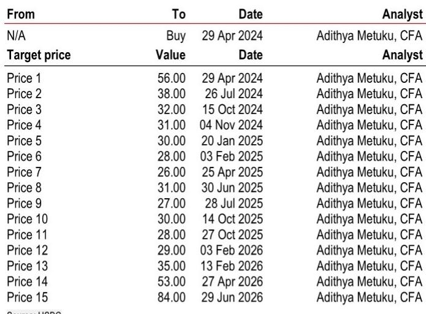
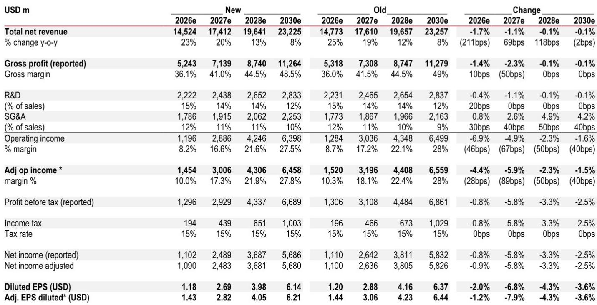
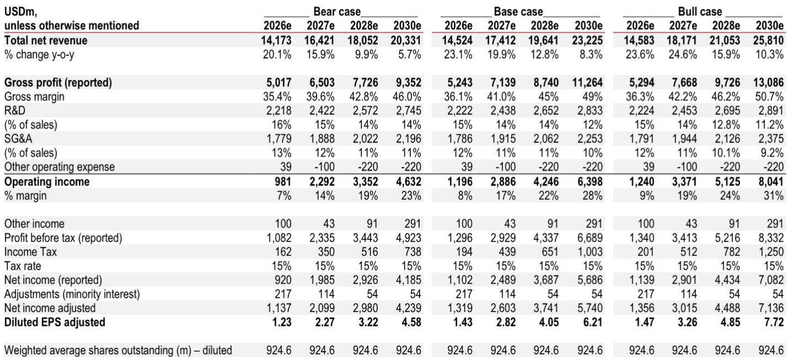

# HSBC：半导体行业数据与主题变化观察

意法半导体在2026年第二季度交出了一份喜忧参半的成绩单。营收指引低于市场预期，但管理层在会议上透露的四个关键信号——整体订单出货比“接近2”、分销库存已低于公司目标水平、持续涨价、以及净资本支出指引上调至20-22亿美元区间上沿——共同指向一个判断：需求复苏的节奏比预期更慢，但复苏本身并未脱轨。

这份HSBC研报的核心主张是，市场不应将三季度指引的变化解读为需求逆转，而应视为复苏形态的重新校准。报告将2026/2027年调整后营业利润预期分别下调4.4%和5.9%，但维持对2028/2030年每股收益4.1美元和6.2美元的预测，较2025/2026年的0.5美元和1.4美元仍有数倍增长空间。

## 1. 订单出货比接近2，分销库存已低于目标水平

二季度意法半导体的订单出货比“接近2”，所有终端市场均高于1，通信设备和电脑外设板块更是“显著高于2”，主要由光互连（含硅光子）需求驱动。管理层表示，多个产品类别已出现供应趋紧信号，且订单可见度正在改善。

分销库存继一季度下降后继续走低，目前已低于公司设定的目标水平。这一信号在半导体周期中通常意味着下游客户正在消化库存后重新补货，而非终端需求疲软。

> **KC评论：** 订单出货比接近2意味着每出货1美元产品就收到近2美元新订单。结合分销库存低于目标，这两个指标叠加说明渠道去库存已基本完成，需求端的真实强度可能比营收数据所反映的更积极。

## 2. 三季度指引低于预期，但各板块增速路径已明确

三季度营收指引低于HSBC及市场预期，是本次报告下调盈利预测的直接原因。但管理层同时给出了各板块下半年的增长路径：通信设备与电脑外设板块三季度增速与二季度持平（约60%），四季度将加速至约90%；工业板块三季度和四季度逐步改善，四季度达到40%同比增长；汽车板块维持低两位数增长；个人电子产品全年低至中个位数增长。

毛利率方面，三季度指引为37%加减2个百分点，其中包含约70个基点的闲置产能费用影响。管理层确认四季度毛利率将环比改善，但未承诺具体幅度，原因是缺乏汇率利好以及卸货费用的持续影响。

## 3. 人工智能数据中心收入指引上调，硅光子不再受产能限制

管理层将2026年人工智能数据中心收入指引上调至“超过10亿美元”，2027年进一步上调至“远超过20亿美元”，光缆连接成为2027年的主要增长驱动力。值得注意的是，管理层确认，随着Crolles工厂产能扩张，意法半导体在硅光子集成电路领域已不再受产能瓶颈限制，可以充分捕捉收入增长机会。

碳化硅业务二季度恢复低两位数同比增长，订单出货比远高于1，管理层预计2026年全年实现两位数增长。这一业务的复苏对意法半导体的产品组合升级和长期毛利率目标具有支撑作用。

## 4. 毛利率目标仍依赖制造转型，2028年营收目标维持不变

管理层重申了其商业模式目标：在季度营收达到40亿美元时实现超过40%的毛利率。但这一目标的前提是制造重塑计划按时完成——硅基从200毫米转向300毫米，碳化硅从150毫米转向200毫米，预计在2027年底前完成。

2028年营收目标维持在180亿美元不变，但45%的毛利率目标同样取决于制造转型的按时完成。HSBC报告指出，这一转型进度将是未来两年利润率能否如期修复的核心变量。报告预计2028/2029年营业利润率分别为21.9%和25.3%，较2025年的4.7%有显著提升。

意法半导体当前报价为46.76欧元，估值方法不变——基于2030年预期市盈率18倍，以9.67%的加权平均资本成本折现。报告认为，即使复苏路径与预期不同，未来几年利润率的大幅修复仍可期待。

For informational purposes only. Portions may be generated,translated,summarized,or edited with AI assistance based on source materials and may contain omissions or errors. Please verify independently. This is not investment,legal,tax,accounting,or other professional advice.

For informational purposes only. Portions may be generated,translated,summarized,or edited with AI assistance based on source materials and may contain omissions or errors. Please verify independently. This is not investment,legal,tax,accounting,or other professional advice.

