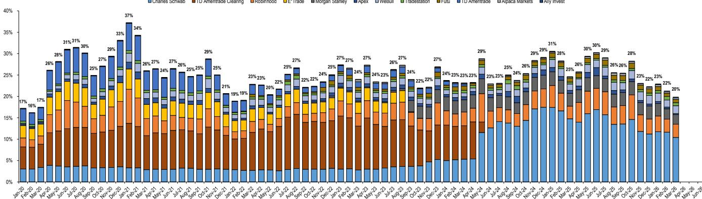
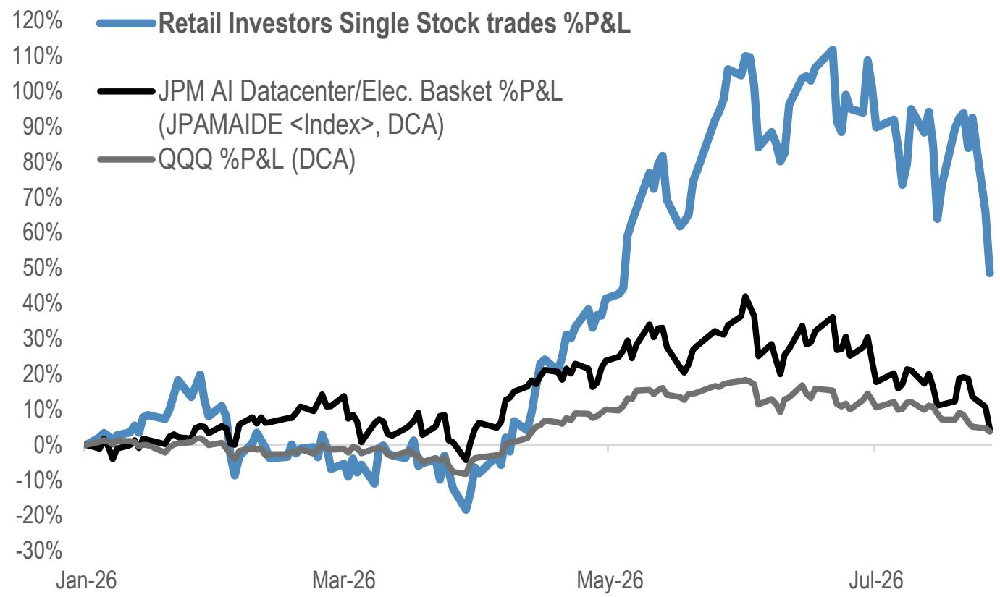
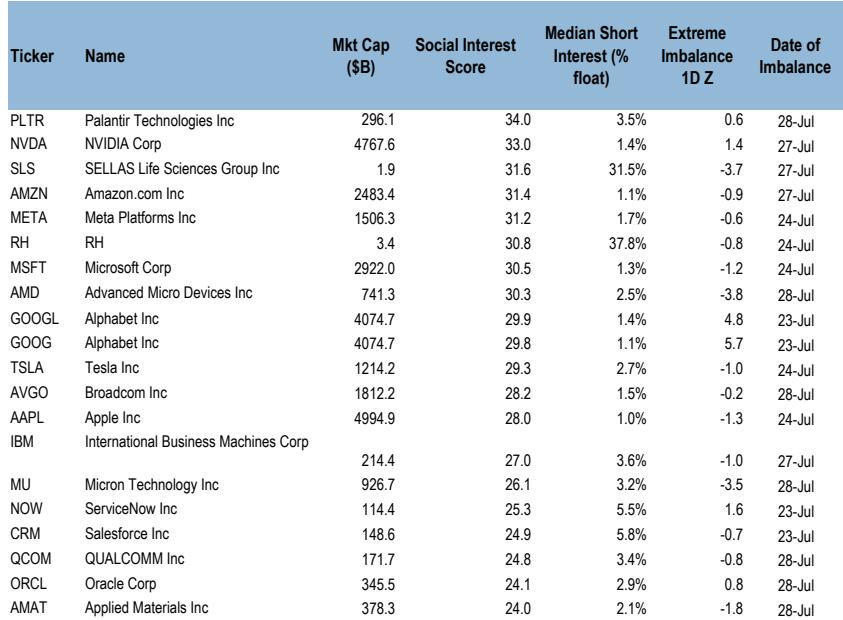

# JPM：零售观察7月29日-动量反转与科技股减仓

截至7月29日当周，JPM零售交易数据显示，散户资金流降至过去一年历史百分位的0.8%，为年内最弱水平之一。与以往逢跌观点偏积极的模式不同，这次零售读者连续四天净观点偏谨慎公司，同时仅小幅观点偏积极ETF。科技硬件股遭遇有记录以来最大单周资金流出，半导体板块拥挤度从99百分位降至91.8百分位。这一轮减仓并非简单的避险，而是动量策略反转叠加持仓变化后的被动调整。

## 1. 科技ETF流出规模为历史第二，半导体杠杆产品领跌

当周科技ETF净流出规模仅次于6月10日当周，主要驱动力来自三倍做多半导体ETF（SOXL），其累计零售净买入额出现明显拐点。零售读者同时削减了加密货币ETF敞口，BITO流出幅度达到-4.9个标准差。ETF层面的资金行为表明，散户并非全面离场，而是集中清理此前拥挤度最高的方向。

> **KC评论：** SOXL作为散户参与半导体行情的典型工具，其资金流向变化往往比公司交易更能反映情绪拐点。当杠杆产品开始持续流出，意味着此前押注趋势延续的仓位正在被动调整，而非主动择时。

## 2. 公司观点偏谨慎集中在硬件与存储，内存股从最爱转为最卖

公司层面，科技硬件股单周观点偏谨慎规模创纪录。SanDisk（SNDK）以-3.2个标准差领跌，苹果（AAPL）紧随其后。更值得关注的是美光（MU）——就在几周前它还和SNDK一同位列散户最青睐名单，本周已进入最卖名单。JPM的拥挤度分析显示，半导体板块整体拥挤度从99百分位降至91.8百分位，而软件板块拥挤度仍维持在较高水平。这种分化说明零售读者的减仓并非针对整个科技板块，而是集中在前期涨幅最大、持仓最集中的半导体和硬件领域。

## 3. 零售读者年内盈亏出现变化是加速减仓的直接诱因

报告指出，零售读者公司持仓的年内累计盈亏在7月下旬出现明显变化。这一变化可能解释了为何散户在本轮动量反转中反应迅速——当持仓浮盈快速收窄甚至转为亏损，此前坚持持有或逢跌加仓的逻辑不再成立。与此同时，Mag 7整体仍获得正流入，NVDA、GOOGL、TSLA位列当周观点偏积极前五，说明零售读者在削减半导体敞口的同时，仍保留了对大型科技龙头的配置。

## 4. 动量因子与高不确定性因子的拥挤度尚未充分出清

尽管半导体板块拥挤度有所下降，但低质量因子拥挤度仍处于94.8百分位，投机性成长因子高达98百分位，价值因子也维持在88.7百分位。JPM策略团队指出，动量因子的Beta暴露仍然较高，且动量与Beta的相关性在本次反转中已从极端水平回落。隐含公司相关性从历史低位回升，这在不确定性模型框架下会推高隐含Beta和组合不确定性估计，导致系统化和量化组合因波动率约束而被动降低净敞口。结合月末动量再平衡，这些条件与本周动量因子和高不确定性因子中观察到的波动加剧是一致的。

> **KC评论：** 拥挤度从99百分位降至91.8百分位，听起来降幅不小，但仍在历史高位。这意味着半导体板块的仓位调整可能尚未结束，尤其是当量化策略和月末再平衡进一步施压时。零售读者的行为只是整个调整链条中的一环。

## 5. 财报季零售参与度有限，提前减仓反映情绪仍在调整

在当周主要科技公司财报发布前，零售读者普遍提前削减了相关持仓：META、MSFT和QCOM在财报公布前均出现净观点偏谨慎。MSFT云业务销售同比增长43%，资本支出同比增长70%至410亿美元，财报后报价上涨约3%；META将2026年资本支出指引区间收窄至1300-1450亿美元，但下一季度展望不及预期，盘后一度下跌约10%。零售读者在财报前减仓而非押注，进一步印证了当前情绪已从趋势追逐转向防御性操作。

---

For informational purposes only. Portions may be generated,translated,summarized,or edited with AI assistance based on source materials and may contain omissions or errors. Please verify independently. This is not investment,legal,tax,accounting,or other professional advice.

For informational purposes only. Portions may be generated,translated,summarized,or edited with AI assistance based on source materials and may contain omissions or errors. Please verify independently. This is not investment,legal,tax,accounting,or other professional advice.

