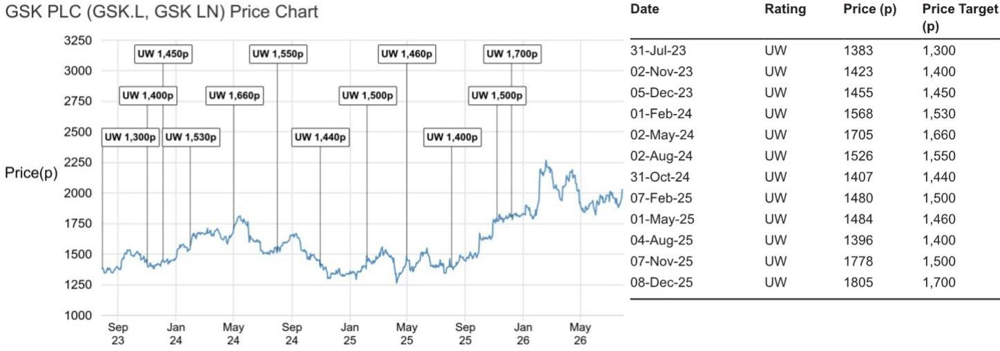

# JPM CAZENOVE

Europe Equity Research
29 July 2026

## GSK PLC

## Core EBIT margin target implies c. 1% upside to 2030 Consensus, pipeline opportunities highlighted encouraging, though still early with clinical data required to drive upgrades

Yesterday, we attended GSK's 2Q 2026 and “Accelerate Growth” event (see our first take here). We summarise our takeaways below. GSK reiterated their confidence in the >£40bn 2031 Sales target, which now includes the contribution from Nuvalent, and outlined their restructuring program expected to generate £1.9bn in annual savings by 2029, the majority of which is expected to be reinvested in R&D and business development. We estimate a potential c. £200m benefit to Core EBIT by 2029 from these savings, a c. 60bps Core EBIT margin benefit although note that Consensus already models a 40bps increase in Core EBIT margin from 2026-30, with an additional c. 20bps of margin upside from these cost savings adding c. 1% upside to 2030 Core EBIT. On the pipeline, key Phase III readouts are expected in the 2028-30 period, starting with ris-rez (B7H3 ADC) in extensive small cell lung cancer, efimosfermin in F2/F3 MASH and velzatinib in 2L+ GIST, all of which face significant competition c. 2-3 years ahead. On new launches, Blenrep was £1m ahead and Exdensur was £2m below Consensus in 2Q, both still steady. Overall, while we were encouraged by the self-financing of the acceleration in R&D and business development, we expect further clinical data across GSK's portfolio and evidence of launch execution will be required for upgrades to longer term forecasts given both Consensus and JPMe still remain below GSK's 2031 Sales target (JPMe 2031: £32bn pre Nuvalent).

- GSK reiterated their confidence in their >£40bn Sales 2031 target. GSK reiterated their confidence in the 2031 >£40bn Sales target, with this target now factoring in the contribution from the recent Nuvalent transaction (see our take here), which we infer at least offsets the loss of camlipixant within the >£40bn target following the recent failure of the program. The >£40bn target does not depend on new business development from today. GSK also outlined their ambition to accelerate sales growth from 2031+, which we infer is underpinned by a combination of organic contribution from the current pipeline, supplemented by business development.

- GSK also announced a restructuring program, with a “portion of cost savings” expected to support the Group margin through the dolutegravir LoE period. GSK now expects to maintain a flat to improving margin through the dolutegravir LoE. While this was communicated during the Nuvalent transaction conference call, this has now been formalised as a target from 2028-30 with a portion of the annualised cost savings of £1.9bn by 2029 expected to support this. We expect the cost savings to start contributing to the P&L in 2028 (JPMe: £50m) with the full P&L benefit expected in 2029, which we estimate could be a c. £200m P&L benefit or a c. 60bps benefit in 2030. In our view, Company Consensus broadly already reflects this with a c. 40bps increase in Core EBIT margin from 2026-30, with an additional 20bps of potential margin upside from these cost savings adding c. 1% upside to Consensus 2030 Core EBIT.

- FY26 narrowed to upper end of the range on Sales and Core EBIT, Core

## Underweight

GSK.L, GSK LN
Price (28 Jul 26):2,029p

European Pharmaceuticals & Biotechnology

Zain Ebrahim AC
(44-20) 3493-1163
zain.ebrahim@JPM.com
JPM Securities plc

Richard Vosser (44-20) 7742-6652 richard.vosser@JPM.com JPM Securities plc

Sophia Graeff Buhl Nielsen
(44-20) 7742-3918
sophia.graeffbuhlnielsen@JPM.com
JPM Securities plc

Dhitee Goel  
(44-20) 7742-2591  
dhitee.goel@JPM.com  
JPM Securities plc

Khushi Bihani
(91-22) 6157-4103
khushi.bihani@JPM.com
JPM India Private Limited

James D Wantling
(44-20) 3493-0019
james.wantling@JPM.com
JPM Securities plc

Specialist Sales contact details:

Marjan Daeipour - Specialist Sales - European Healthcare
(44 20) 7134-1329
marjan.daeipour@JPM.com

See page 5 for analyst certification and important disclosures, including non-US analyst disclosures.

EPS narrowed to lower end with growth significantly 4Q weighted. GSK highlighted that they expect Core EPS growth to be significantly 4Q weighted given the inclusion of Nuvalent costs from 3Q, with 4Q 2026 growth benefitting from the supply chain and SG&A charges taken in 4Q 2025.

- Key Phase III readouts expected in 2028. GSK highlighted that they expect regulatory submissions for velzatinib (IDRX-42) in 2L gastrointestinal stromal tumours (GIST) along with ris-rez (B7H3 ADC) in $2\mathrm{L}+$ extensive small cell lung cancer and efimosfermin in F2/F3 MASH in 2028.

## Oncology

- Blenrep delivered £36m sales in 2Q 2026. GSK noted that Blenrep sales of £36m in 2Q were in-line with their expectations and noted that in the US, their approach remains to “go slow” to ensure a positive experience for patients

B7H3 ADC Ris-rez data in extensive small cell lung cancer. GSK outlined the previously presented 2L+ SCLC ARTEMIS-001 China-only data for ris-rez in extensive small cell lung cancer, which has led to the start of the Phase III EMBOLD SCLC-301 trial. In the Phase I ARTEMIS-001 trial, ris-rez demonstrated a 60% confirmed ORR, with 6.3 months median PFS and a 14.9 month median OS. This compares with Amgen's\* Imdelltra's Phase III efficacy of 40% ORR and 13.6 month median OS, compared with 8.3 months median OS in the chemotherapy arm (HR: 0.60). The China-only Phase III for ris-rez recently reported a “clinically meaningful” Overall Survival benefit but we anticipate the full details of this study, potentially at ESMO 2026, will be needed to assess relative competitiveness vs. Imdelltra and whether this data can be reproduced in a global setting. We also note the Phase III EMBOLD SCLC-301 global trial includes patients previously treated with Imdelltra within the trial, which could dilute the ultimate Overall Survival result. Merck & Co’s I-Dxd\* (B7H3 ADC) has also shown a strong ORR in this setting of 48%, with a median PFS of 4.8 months with a PDUFA for accelerated approval on October 10, 2026 and while I-Dxd was previously on partial clinical hold for Grade 5+ ILD events, the partial hold was lifted in January 2026. Overall, we see the 2L+ ESCLC indication as a modest opportunity for ris-rez as we see the high bar set by Imdelltra as difficult to beat and therefore see a 50% chance of a £0.5bn peak sales opportunity in this setting.

- B7H4 ADC data in ovarian cancer and endometrial cancer highlighted. GSK highlighted the data presented earlier this year on the B7H4 ADC Mo-Rez in 2L+ endometrial cancer and platinum-resistant ovarian cancer (see our take here). While we see the initial data as encouraging, we expect the FRa ADCs to take the majority share in platinum-resistant ovarian cancer, for which we expect Phase III data for Genmab in 4Q 2026, followed by Lilly's sofetabart mipitecan in 2H 2027 and AZN's torvu-sam in 2028 ahead of likely data for Mo-Rez in 2029. We also expect further mature data in endometrial cancer (GSK n=33 across two doses, AZN n=65, Rina-S n=66 across two doses), will likely be needed to assess the strength of the efficacy data relative to competition as the 2.8mg/kg dose showed a 9% ORR compared with 67% ORR in the 4.8mg/kg dose and we also note Grade 3+ TEAEs were 63% for GSK's B7H4 ADC compared with 40% for AZN's puxi-sam, where the Phase III readout in 2L+ endometrial is expected in 2H 2027.

- Nuvalent update. GSK continue to expect to file a supplemental NDA for 1L ROS for Jideytro (zidesamtinib) in 2H 2026 following the initial approval in $2\mathrm{L}+$ ROS mutated lung cancer last week. The ALKAZAR 1L trial is recruiting well with $>35\%$ of patients enrolled thus far and GSK noted that recruitment interest has increased following the presentation of the 1L data in TKI naïve patients at ASCO 2026. We continue to expect the Phase III ALKAZAR readout in 2029-30 (primary completion: Dec 2029).

- Velzatinib data presented at ASCO highlighted. GSK highlighted the velzatinib data presented at ASCO (see our take here), where in 2L+ GIST, velzatinib showed a 38% ORR in 38 patients with a median PFS of 13.7 months, below the 16.5 month median PFS reported for bezuclastinib + sunitinib in the Phase III PEAK trial, although we note the control sunitinib arm showed a median PFS of 9.2 months in PEAK. We see a reasonable chance of success for the 2L+ GIST trial reading out in 2028 on the basis of this data, although expect the stronger efficacy for the combination approach, which could have a c. 2 year head-start over velzatinib, to lead to the combination strategy taking majority share. GSK highlighted the lower toxicity profile for velzatinib vs. bezuclastinib + sunitinib as offering another potential source of differentiation.

## HIV

- The Phase IIb CINERGY study of the VH-499 (capsid inhibitor) combination, a 2x-yearly HIV treatment, is expected to initiate in H2'26. The INNOVATE Phase IIb for VH184 is ongoing data expected in 2027. GSK expect to start the Phase III trial for the combination of IM VH499 + IM VH184 (separately administered) in 2028, with targeted approval in the latter part of 2030. We note the primary endpoint for the Phase III trial is likely to be at 48 weeks, with time likely required for recruitment of the study as well so depending on the exact timing of the Phase III start in 2028, we anticipate the readout could be in 2030 but approval could be in 2031, which could lead to a relatively limited contribution from the 6M regimen in 2031.

- The Phase III CUATRO study of the cabotegravir (INSTI) plus rilpivirine (NNRTI) combination, 3x yearly HIV treatment, was initiated in June 2026, with a primary endpoint of virologic suppression at month 11. GSK are guiding for expected approval in 2028 though we expect this is likely towards the end of 2028 and contingent on recruitment pace. GSK continue to expect the majority of 2M Cabenuva patients to switch to 4M.

- Weekly oral development started. GSK has started a Phase I trial for VH359, a capsid inhibitor, and have multiple potential weekly oral integrase inhibitors and capsid inhibitors in preclinical development. GSK expect weekly orals to take a portion of the market in 2031. We note competitors GILD and MRK are ahead here with the recent positive lenacapavir/islatravir weekly oral Phase III ISLEND-1 and 2 data likely to crystallise weekly oral competition for Dovato, in addition to potential 2 drug regimen competition from BIK/LEN and DOR/ISL in 2027, although we expect a potentially more significant impact from the weekly oral. From our survey work (here), we see strong interest from physicians in the potential for a weekly oral, expected to take $18\%$ market share longer term. GSK also outlined their expectation for the HIV treatment market to remain stable at c. £22bn in 2031 relative to 2025, with modest share expected to be taken by generic dolutegravir/Dovato orals, although we expect price pressure from the availability of generic Dovato and the use of generic Dovato will likely erode the value of the treatment market over time.

## Respiratory, Hepatology and Vaccines

- Exdensur sales of £18m in 2Q 2026 came in slightly below Consensus. GSK noted that the J-code for Exdensur went live on July 1, with GSK continuing to build access and coverage with more than $50\%$ of insured patients now covered. The majority of patient starts are from bio-naive $(56\%)$ , with $17\%$ switches from other classes and $27\%$ switches from IL-5. GSK expect bio-naive to remain the majority of new patient starts going forward given asthma biologics penetration rates of $30\%$ .

- GSK highlighted the recent Phase III start for efimosfermin in F4 MASH and alcoholic liver disease (data likely in 2030), supplementing the trials in F2-F3 MASH (readout in 2028). In MASH, the ZENITH-1 and ZENITH-2 trials in F2/F3 patients are actively recruiting, with primary completion in March 2028. GSK noted a potentially differentiated efficacy profile in F2/F3 MASH on the basis of a c. 24pp placebo-adjusted improvement in fibrosis improvement, compared with a 20pp improvement for Novo's efruxifermin, although we note on the composite primary endpoint of fibrosis improvement of at least 1 stage and MASH resolution (the primary endpoint of the upcoming Phase III trials), efimosfermin showed a 21% placebo-adjusted benefit compared with a 36% placebo-adjusted benefit from efruxifermin. Novo's Phase III efruxifermin HISTOLOGY data in F2/F3 MASH is expected towards the end of 2026. We already include efimosfermin at a 50% chance of a £2bn peak sales opportunity, which assumes 30% share of the FGF21 class. GSK has also recently initiated the NEBULA-1 and NEBULA-2 Phase III trials in F4 MASH, which enrolled their first patient last week. Additionally, the efirmosfermin development program has been extended into ALD, where the Phase III ALLSTAR trial is expected to start in H2'26. GSK reiterated efimosfermin's best-in-class profile for the treatment of MASH, highlighting data demonstrating the superiority of FGF21-class agents over non-FGF21 therapies in driving fibrosis improvement.

- GSK also highlighted Phase III trial starts for their respiratory portfolio including their ULA TSLP (2x year administration) and quarterly IL-33. GSK highlighted upcoming Phase III trial starts in 2H 2026 for the long-acting TSLP in COPD and nasal polyps and the long-acting IL-33 in 1H 2027, which we expect will likely readout in 2029/30 for the long-acting TSLP with the IL-33 data likely to follow in 2030/31. We see significant overlap in eosinophilic COPD between the TSLP (>150 cells per $\mu$ l) and Exdensur (>300 cells per $\mu$ l) for which we already model c. £4bn peak sales in both asthma and COPD, which we expect to be largely cannibalised by the long-acting TSLP depending on the strength of the data, where the Phase II data has not yet been presented.

Analyst Certification: The Research Analyst(s) denoted by an “AC” on the cover of this report certifies (or, where multiple Research Analysts are primarily responsible for this report, the Research Analyst denoted by an “AC” on the cover or within the document individually certifies, with respect to each security or issuer that the Research Analyst covers in this research) that: (1) all of the views expressed in this report accurately reflect the Research Analyst’s personal views about any and all of the subject securities or issuers; and (2) no part of any of the Research Analyst's compensation was, is, or will be directly or indirectly related to the specific recommendations or views expressed by the Research Analyst(s) in this report. For all Korea-based Research Analysts listed on the front cover, if applicable, they also certify, as per KOFIA requirements, that the Research Analyst’s analysis was made in good faith and that the views reflect the Research Analyst’s own opinion, without undue influence or intervention.

All authors named within this report are Research Analysts who produce independent research unless otherwise specified. In Europe, Sector Specialists (Sales and Trading) may be shown on this report as contacts but are not authors of the report or part of the Research Department.

## Important Disclosures

- Market Maker/ Liquidity Provider: JPM is a market maker and/or liquidity provider in the financial instruments of/related to GSK PLC or related entities.

- Client: JPM currently has, or had within the past 12 months, the following entity(ies) as clients: GSK PLC or related entities.

- Client/Investment Banking: JPM currently has, or had within the past 12 months, the following entity(ies) as investment banking clients: GSK PLC or related entities.

- Client/Non-Investment Banking, Securities-Related: JPM currently has, or had within the past 12 months, the following entity(ies) as clients, and the services provided were non-investment-banking, securities-related: GSK PLC or related entities.

- Client/Non-Securities-Related: JPM currently has, or had within the past 12 months, the following entity(ies) as clients, and the services provided were non-securities-related: GSK PLC or related entities.

- Investment Banking Compensation Received: JPM has received in the past 12 months compensation for investment banking services from GSK PLC or related entities.

- Potential Investment Banking Compensation: JPM expects to receive, or intends to seek, compensation for investment banking services in the next three months from GSK PLC or related entities.

• Non-Investment Banking Compensation Received: JPM has received compensation in the past 12 months for products or services other than investment banking from GSK PLC or related entities.

- Debt Position: JPM may hold a position in the debt securities of GSK PLC or related entities, if any.

Company-Specific Disclosures: JPM does and seeks to do business with companies covered in its research reports. As a result, investors should be aware that the firm may have a conflict of interest that could affect the objectivity of this report. Investors should consider this report as only a single factor in making their investment decision. Important disclosures, including price charts and credit opinion history tables (if applicable), are available for compendium reports and all JPM-covered companies, and certain non-covered companies, by visiting https://www.jpmm.com/research/disclosures, calling 1-800-477-0406, or e-mailing research.disclosure.inquiries@JPM.com with your request.

GSK PLC (GSK.L, GSK LN) Price Chart  
  
Source: Bloomberg Finance L.P. and JPM; price data adjusted for stock splits and dividends. Initiated coverage Jan 13, 2000. All share prices are as of market close on the previous business day.

<table><tr><td>Date</td><td>Rating</td><td>Price (p)</td><td>Price Target (p)</td></tr><tr><td>31-Jul-23</td><td>UW</td><td>1383</td><td>1,300</td></tr><tr><td>02-Nov-23</td><td>UW</td><td>1423</td><td>1,400</td></tr><tr><td>05-Dec-23</td><td>UW</td><td>1455</td><td>1,450</td></tr><tr><td>01-Feb-24</td><td>UW</td><td>1568</td><td>1,530</td></tr><tr><td>02-May-24</td><td>UW</td><td>1705</td><td>1,660</td></tr><tr><td>02-Aug-24</td><td>UW</td><td>1526</td><td>1,550</td></tr><tr><td>31-Oct-24</td><td>UW</td><td>1407</td><td>1,440</td></tr><tr><td>07-Feb-25</td><td>UW</td><td>1480</td><td>1,500</td></tr><tr><td>01-May-25</td><td>UW</td><td>1484</td><td>1,460</td></tr><tr><td>04-Aug-25</td><td>UW</td><td>1396</td><td>1,400</td></tr><tr><td>07-Nov-25</td><td>UW</td><td>1778</td><td>1,500</td></tr><tr><td>08-Dec-25</td><td>UW</td><td>1805</td><td>1,700</td></tr></table>

The chart(s) show JPM's continuing coverage of the stocks; the current analysts may or may not have covered it over the entire period. JPM ratings or designations: OW = Overweight, N = Neutral, UW = Underweight, NR = Not Rated

## Explanation of Equity Research Ratings, Designations and Analyst(s) Coverage Universe:

JPM uses the following rating system: Overweight (over the duration of the price target indicated in this report, we expect this stock will outperform the average total return of the stocks in the Research Analyst's, or the Research Analyst's team's, coverage universe); Neutral (over the duration of the price target indicated in this report, we expect this stock will perform in line with the average total return of the stocks in the Research Analyst's, or the Research Analyst's team's, coverage universe); and Underweight (over the duration of the price target indicated in this report, we expect this stock will underperform the average total return of the stocks in the Research Analyst's, or the Research Analyst's team's, coverage universe. NR is Not Rated. In this case, JPM has removed the rating and, if applicable, the price target, for this stock because of either a lack of a sufficient fundamental basis or for legal, regulatory or policy reasons. The previous rating and, if applicable, the price target, no longer should be relied upon. An NR designation is not a recommendation or a rating. Some stocks under coverage have a rating but no price target; in these cases, we expect the stock will outperform/perform in line/underperform the average total return of the stocks in the Research Analyst's, or the Research Analyst's team's, coverage universe of the relevant duration of the region. In our Asia (ex-Australia and ex-India) and U.K. small- and mid-cap Equity Research, each stock's expected total return is compared to the expected total return of a benchmark country market index, not to those Research Analysts' coverage universe. If it does not appear in the Important Disclosures section of this report, the certifying Research Analyst's coverage universe can be found on JPM's Research website, https://www.JPMmarkets.com.

Coverage Universe: Ebrahim, Zain : Bachem (BANB.S), EUROAPI (EAPI.PA), GSK PLC (GSK.L), Genmab A/S (GMAB.CO), Hikma Pharmaceuticals (HIK.L), Lonza Group AG (LONN.S), Oxford Biomedica (OXB.L), Oxford Nanopore (ONT.L)

## JPM Equity Research Ratings Distribution, as of July 04, 2026

<table><tr><td></td><td>Overweight (buy)</td><td>Neutral (hold)</td><td>Underweight (sell)</td></tr><tr><td>JPM Global Equity Research Coverage*</td><td>53%</td><td>36%</td><td>12%</td></tr><tr><td>IB clients**</td><td>83%</td><td>80%</td><td>73%</td></tr><tr><td>JPMS Equity Research Coverage*</td><td>51%</td><td>37%</td><td>12%</td></tr><tr><td>IB clients**</td><td>95%</td><td>92%</td><td>87%</td></tr></table>

\*Please note that the percentages may not add to 100% because of rounding.  
\*\*Percentage of subject companies within each of the "buy," "hold" and "sell" categories for which JPM has provided investment banking services within the previous 12 months.

For purposes of FINRA ratings distribution rules only, our Overweight rating falls into a buy rating category; our Neutral rating falls into a hold rating category; and our Underweight rating falls into a sell rating category. Please note that stocks with an NR designation are not included in the table above. This information is current as of the end of the most recent calendar quarter.

Equity Valuation and Risks: For valuation methodology and risks associated with covered companies or price targets for covered companies, please see the most recent company-specific research report at http://www.JPMmarkets.com, contact the primary analyst or your JPM representative, or email research.disclosure.inquiries@JPM.com. For material information about the proprietary models used, please see the Summary of Financials in company-specific research reports and the Company Tearsheets, which are available to download on the company pages of our client website, http://www.JPMmarkets.com. This report also sets out within it the material underlying assumptions used.

## History of Investment Recommendations:

A history of JPM investment recommendations disseminated during the preceding 12 months can be accessed on the Research & Commentary page of http://www.JPMmarkets.com where you can also search by analyst name, sector or financial instrument.

Analysts' Compensation: The research analysts responsible for the preparation of this report receive compensation based upon various factors, including the quality and accuracy of research, client feedback, competitive factors, and overall firm revenues.

Registration of non-US Analysts: Unless otherwise noted, the non-US analysts listed on the front of this report are employees of non-US affiliates of JPM Securities LLC, may not be registered as research analysts under FINRA rules, may not be associated persons of JPM Securities LLC, and may not be subject to FINRA Rule 2241 or 2242 restrictions on communications with covered companies, public appearances, and trading securities held by a research analyst account.

## Other Disclosures

JPM is a marketing name for investment banking businesses of JPM Chase & Co. and its subsidiaries and affiliates worldwide.

UK MIFID FICC research unbundling exemption: UK clients should refer to UK MIFID Research Unbundling exemption for details of JPM's implementation of the FICC research exemption and guidance on relevant FICC research categorisation.

All research material made available to clients are simultaneously available on our client website, JPM Markets, unless specifically permitted by relevant laws. Not all research content is redistributed, e-mailed or made available to third-party aggregators. For all research material available on a particular stock, please contact your sales representative.

Any long form nomenclature for references to China; Hong Kong; Taiwan; and Macau within this research material are Mainland China; Hong Kong SAR (China); Taiwan (China); and Macau SAR (China).

JPM may, from time to time, write on issuers or securities targeted by economic or financial sanctions imposed or administered by the governmental authorities of the U.S., EU, UK or other relevant jurisdictions (Sanctioned Securities). Nothing in this report is intended to be read or construed as encouraging, facilitating, promoting or otherwise approving investment or dealing in such Sanctioned Securities. Clients should be aware of their own legal and compliance obligations when making investment decisions.

Any digital or crypto assets discussed in this research report are subject to a rapidly changing regulatory landscape. For relevant regulatory advisories on crypto assets, including bitcoin and ether, please see https://www.JPM.com/disclosures/cryptoasset-disclosure.

The author(s) of this research report may not be licensed to carry on regulated activities in your jurisdiction and, if not licensed, do not hold themselves out as being able to do so.

Exchange-Traded Funds (ETFs): JPM Securities LLC (“JPMS”) acts as authorized participant for substantially all U.S.-listed ETFs. To the extent that any ETFs are mentioned in this report, JPMS may earn commissions and transaction-based compensation in connection with the distribution of those ETF shares and may earn fees for performing other trade-related services, such as securities lending to short sellers of the ETF shares. JPMS may also perform services for the ETFs themselves, including acting as a broker or dealer to the ETFs. In addition, affiliates of JPMS may perform services for the ETFs, including trust, custodial, administration, lending, index calculation and/or maintenance and other services.

Options and Futures related research: If the information contained herein regards options- or futures-related research, such information is available only to persons who have received the proper options or futures risk disclosure documents. Please contact your JPM Representative or visit https://www.theocc.com/components/docs/riskstoc.pdf for a copy of the Option Clearing Corporation's Characteristics and Risks of Standardized Options or

https://www.finra.org/sites/default/files/2020-08/Security\_Futures\_Risk\_Disclosure\_Statement\_2020.pdf for a copy of the Security Futures Risk Disclosure Statement.

Changes to Interbank Offered Rates (IBORs) and other benchmark rates: Certain interest rate benchmarks are, or may in the future become, subject to ongoing international, national and other regulatory guidance, reform and proposals for reform. For more information, please consult: https://www.JPM.com/global/disclosures/interbank\_offered\_rates

Private Bank Clients: Where you are receiving research as a client of the private banking businesses offered by JPM Chase & Co. and its subsidiaries (“JPM Private Bank”), research is provided to you by JPM Private Bank and not by any other division of JPM, including, but not limited to, the JPM Corporate and Investment Bank and its Global Research division.

Legal entity responsible for the production and distribution of research: The legal entity identified below the name of the Reg AC Research Analyst who authored this material is the legal entity responsible for the production of this research. Where multiple Reg AC Research Analysts authored this material with different legal entities identified below their names, these legal entities are jointly responsible for the production of this research. Where more than one legal entity is listed under an analyst's name, the first legal entity is responsible for the production unless stated otherwise. Research Analysts from various JPM affiliates may have contributed to the production of this material but may not be licensed to carry out regulated activities in your jurisdiction (and do not hold themselves out as being able to do so). Unless otherwise stated below in the legal entity disclosures, this material has been distributed by the legal entity responsible for production, or where more than one

legal entity is listed under the analyst's name, the first legal entity will be responsible for distribution. If you have any queries, please contact the relevant Research Analyst in your jurisdiction or the entity in your jurisdiction that has distributed this research material.

Legal Entities Disclosures and Country-/Region-Specific Disclosures:

Argentina: JPM Chase Bank N.A Sucursal Buenos Aires is regulated by Banco Central de la República Argentina ("BCRA"- Central Bank of Argentina) and Comisión Nacional de Valores ("CNV"- Argentinian Securities Commission - ALYC y AN Integral N°51).

Australia: JPM Securities Australia Limited ("JPMSAL") (ABN 61 003 245 234/AFS Licence No: 238066) is regulated by the Australian Securities and Investments Commission and is a Market Participant of ASX Limited, a Clearing and Settlement Participant of ASX Clear Pty Limited and a Clearing Participant of ASX Clear (Futures) Pty Limited. This material is issued and distributed in Australia by or on behalf of JPMSAL only to "wholesale clients" (as defined in section 761G of the Corporations Act 2001). A list of all financial products covered can be found by visiting https://www.jpmm.com/research/disclosures. JPM seeks to cover companies of relevance to the domestic and international investor base across all Global Industry Classification Standard (GICS) sectors, as well as across a range of market capitalisation sizes. If applicable, in the course of conducting public side due diligence on the subject company(ies), the Research Analyst team may at times perform such diligence through corporate engagements such as site visits, discussions with company representatives, management presentations, etc. Research issued by JPMSAL has been prepared in accordance with JPM Australia's Research Independence Policy which can be found at the following link: JPM Australia - Research Independence Policy.

Brazil: Banco JPM S.A. is regulated by the Comissao de Valores Mobiliarios (CVM) and by the Central Bank of Brazil. Ombudsman JPM: 0800-7700847 / 0800-7700810 (For Hearing Impaired) / ouvidoria.jp.morgan@jpmchase.com.

Canada: JPM Securities Canada Inc. is a registered investment dealer, regulated by the Canadian Investment Regulatory Organization and the Ontario Securities Commission and is the participating member on Canadian exchanges. This material is distributed in Canada by or on behalf of JPM Securities Canada Inc.

Chile: Inversiones JPM Limitada is an unregulated entity incorporated in Chile.

China: JPM Securities (China) Company Limited has been approved by CSRC to conduct the securities investment consultancy business.

Colombia: Banco JPM Colombia S.A. is supervised by the Superintendencia Financiera de Colombia (SFC). Any reference in this material to products or services offered abroad by entities other than the Bank in Colombia is included exclusively for descriptive purposes. Such references do not constitute, and should not be construed as, promotional activity or the provision of financial products or services within Colombian territory, as defined under applicable Colombian regulation.

Dubai International Financial Centre (DIFC): JPM Chase Bank, N.A., Dubai Branch is regulated by the Dubai Financial Services Authority (DFSA) and its registered address is Dubai International Financial Centre - The Gate, West Wing, Level 3 and 9 PO Box 506551, Dubai, UAE. This material has been distributed by JPM Chase Bank, N.A., Dubai Branch to persons regarded as professional clients or market counterparties as defined under the DFSA rules.

European Economic Area (EEA): Unless specified to the contrary, research is distributed in the EEA by JPM SE (“JPM SE”), which is authorised as a credit institution by the Federal Financial Supervisory Authority (Bundesanstalt für Finanzdienstleistungsaufsicht, BaFin) and jointly supervised by the BaFin, the German Central Bank (Deutsche Bundesbank) and the European Central Bank (ECB). JPM SE is a company headquartered in Frankfurt with registered address at TaunusTurm, Taunustor 1, Frankfurt am Main, 60310, Germany. The material has been distributed in the EEA to persons regarded as professional investors (or equivalent) pursuant to Art. 4 para. 1 no. 10 and Annex II of MiFID II and its respective implementation in their home jurisdictions (“EEA professional investors”). This material must not be acted on or relied on by persons who are not EEA professional investors. Any investment or investment activity to which this material relates is only available to EEA relevant persons and will be engaged in only with EEA relevant persons.

Hong Kong: JPM Securities (Asia Pacific) Limited (CE number AAJ321) is regulated by the Hong Kong Monetary Authority and the Securities and Futures Commission in Hong Kong, and JPM Broking (Hong Kong) Limited (CE number AAB027) is regulated by the Securities and Futures Commission in Hong Kong. JPM Chase Bank, N.A., Hong Kong Branch (CE Number AAL996) is regulated by the Hong Kong Monetary Authority and the Securities and Futures Commission, is organized under the laws of the United States with limited liability. Where the distribution of this material is a regulated activity in Hong Kong, the material is distributed in Hong Kong by or through JPM Securities (Asia Pacific) Limited and/or JPM Broking (Hong Kong) Limited.

India: JPM India Private Limited (Corporate Identity Number - U67120MH1992FTC068724), having its registered office at JPM Tower, Off. C.S
