## 流动性观察

**数据来源**: Lipper, ICI, Bloomberg Finance L.P. 及 JPM 流动性研究。

\* 美国长期历史资金流为月度平均值，已转换为周度数据以作比较。中国境内A股ETF已排除在外。

本材料无意向中国大陆读者分发，也不构成在中国大陆境内提供证券投资咨询服务。未经JPM书面同意，不得转载、出售或重新分发本材料或其任何部分。

## 资金流与流动性

## 去杠杆进程或已接近尾声

\- 我们发现，读者在科技和半导体领域（包括存储芯片股）的去杠杆进程，其推进速度超出了我们此前的预期。

\- 因此，我们现在认为，进一步去杠杆的空间已较为有限。

\- 参议院通过《清晰法案》几率的骤降，对加密市场构成了一个挫折。

## 跨资产基金资金流监测

当前水平显示周度资金流的最新百分位；最小值记为0，最大值记为1。数据截至2026年7月22日。

<table><tr><td>共同基金及ETF资金流</td><td>最小值</td><td>最大值</td><td>4周均值（十亿美元）</td><td>2025年均值（十亿美元）</td></tr><tr><td>全球权益类</td><td></td><td>◆</td><td>12.0</td><td>8.1</td></tr><tr><td>全球债券类</td><td></td><td>◆</td><td>17.8</td><td>11.3</td></tr><tr><td>美国权益类</td><td></td><td>◆</td><td>-2.1</td><td>3.5</td></tr><tr><td>美国债券类</td><td></td><td>◆</td><td>9.5</td><td>4.3</td></tr><tr><td>非美国权益类</td><td></td><td>◆</td><td>14.1</td><td>4.6</td></tr><tr><td>非美国债券类</td><td></td><td>◆</td><td>8.3</td><td>7.0</td></tr><tr><td>美国投资级债券</td><td></td><td>◆</td><td>11.8</td><td>3.4</td></tr><tr><td>美国高收益债券</td><td></td><td>◆</td><td>0.2</td><td>0.4</td></tr><tr><td>美国杠杆贷款 *</td><td></td><td>◆</td><td>0.3</td><td>0.0</td></tr><tr><td>美国货币市场基金</td><td></td><td>◆</td><td>0.5</td><td>4.0</td></tr><tr><td>新兴市场权益类</td><td></td><td>◆</td><td>2.5</td><td>0.9</td></tr><tr><td>新兴市场债券类</td><td></td><td>◆</td><td>0.93</td><td>0.50</td></tr><tr><td>日本权益类</td><td></td><td>◆</td><td>2.3</td><td>-0.1</td></tr><tr><td>中国权益类</td><td></td><td>◆</td><td>-0.99</td><td>-0.15</td></tr><tr><td colspan="5">欧洲</td></tr><tr><td>欧洲权益类</td><td></td><td>◆</td><td>0.2</td><td>0.9</td></tr><tr><td>欧洲债券类</td><td></td><td>◆</td><td>5.9</td><td>4.3</td></tr><tr><td>欧洲投资级债券</td><td></td><td>◆</td><td>0.6</td><td>0.9</td></tr><tr><td>欧洲高收益债券</td><td></td><td>◆</td><td>0.27</td><td>0.17</td></tr><tr><td>欧洲货币市场基金</td><td></td><td>◆</td><td>1.6</td><td>3.8</td></tr><tr><td>其他权益类</td><td></td><td>◆</td><td>9.18</td><td>3.00</td></tr></table>

## 全球市场策略研究

Nikolaos Panigirtzoglou AC
(44-20) 7134-7815
nikolaos.panigirtzoglou@JPM.com
JPM Securities plc

Mika Inkinen
(44-20) 7742 6565
mika.j.inkinen@JPM.com
JPM Securities plc

Mayur Yeole
(91 22) 6157 3872
mayur.yeole@jpmchase.com
JPM India Private Limited

## Krutik P Mehta

(91-22) 6157-5016
krutik.mehta@jpmchase.com
JPM India Private Limited

跨资产持仓监测 当前水平显示最新百分位，最小值记为0，最大值记为1。

<table><tr><td>截至2026年7月28日</td><td>最小值</td><td>最大值</td><td>当前百分位</td></tr><tr><td>权益类</td><td></td><td></td><td>0.59</td></tr><tr><td>政府债券</td><td></td><td></td><td>0.64</td></tr><tr><td>信用债</td><td></td><td></td><td>0.27</td></tr><tr><td>美元</td><td></td><td></td><td>0.81</td></tr><tr><td>大宗商品（除黄金）</td><td></td><td></td><td>0.64</td></tr><tr><td>黄金</td><td></td><td></td><td>0.54</td></tr><tr><td>比特币</td><td></td><td></td><td>0.55</td></tr><tr><td>新兴市场权益类</td><td></td><td></td><td>0.69</td></tr><tr><td>新兴市场债券/外汇</td><td></td><td></td><td>0.24</td></tr><tr><td>日本权益类</td><td></td><td></td><td>0.60</td></tr><tr><td>欧洲权益类</td><td></td><td></td><td>0.88</td></tr><tr><td colspan="4">美国权益板块：</td></tr><tr><td>能源</td><td></td><td></td><td>0.73</td></tr><tr><td>原材料</td><td></td><td></td><td>0.57</td></tr><tr><td>工业</td><td></td><td></td><td>0.65</td></tr><tr><td>可选消费</td><td></td><td></td><td>0.65</td></tr><tr><td>必需消费</td><td></td><td></td><td>0.27</td></tr><tr><td>医疗保健</td><td></td><td></td><td>0.48</td></tr><tr><td>金融</td><td></td><td></td><td>0.25</td></tr><tr><td>科技</td><td></td><td></td><td>0.56</td></tr><tr><td>通信服务</td><td></td><td></td><td>0.32</td></tr><tr><td>公用事业</td><td></td><td></td><td>0.54</td></tr></table>

## 来源: JPM 流动性研究。

跨资产持仓监测综合了附录中各项持仓指标，这些指标涵盖各类期货合约的持仓代理指标、作为趋势跟踪基金/CTA持仓代理的动量信号、作为共同基金经理持仓代理的共同基金贝塔值、风险平价基金持仓与杠杆代理指标、作为对冲基金经理持仓代理的对冲基金贝塔值、客户调查、全球私人非银行读者的资产配置估算、空头头寸指标等。

\- 两周前，我们曾指出，始于6月的去杠杆阶段似乎仍在进行中，并认为读者仍有进一步去杠杆的空间。两周后，我们发现这一去杠杆进程的推进速度快于我们的预期。因此，我们现在认为，进一步去杠杆的空间已较为有限。

## • 去杠杆在哪些方面取得了进展：

\- 1) 首先，在对冲基金方面，我们在两周前的报告中已注意到去杠杆的迹象，当时每日报告的权益多空基金与半导体类股的相关性减弱。通过更新每日报告的权益多空对冲基金相对于半导体（SOX）指数的杠杆代理指标，我们发现，权益类对冲基金在4月/5月期间增加的杠杆已基本被解除（图1）。

图1：基于每日报告的权益多空对冲基金相对于半导体（SOX）指数的波动率比率的杠杆代理指标  
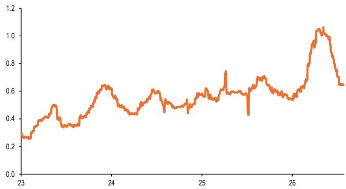  
来源：HFR, Bloomberg Finance L.P., JPM 流动性研究。

\- 2) 我们认为，个股科技股（图2）以及重要的半导体ETF（如SMH和DRAM，图3）上空头头寸的升高，表明对冲基金对科技股的风险敞口较低。

图2：半导体（除存储和超大规模企业）个股的空头头寸
空头头寸占流通股本的百分比。  
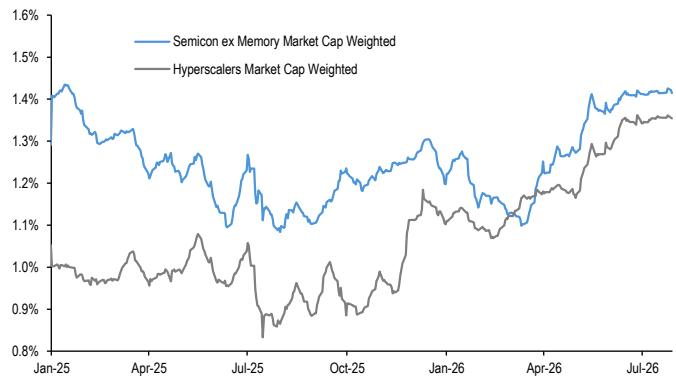  
来源：S3, JPM 流动性研究。

图3：SMH和DRAM美国权益ETF的空头头寸
空头头寸占流通股本的百分比。  
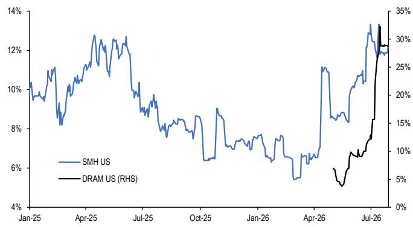  
来源：S3, JPM 流动性研究。

\- 3) 科技股权重较高的指数中动量信号的崩溃表明，动量交易者（如CTA）已基本解除了之前在纳斯达克、韩国KOSPI、台湾和日经指数上的多头头寸（图4和图5）。此外，图5显示，此前拥挤的做空中国互联网公司（HSCEI指数）同时做多韩国/台湾/日本权益类资产的相对交易已完全逆转。

## 图4：主要指数的动量信号

附录中表A3和A4所示的趋势跟踪策略框架中短期和长期动量信号的平均z-score。  
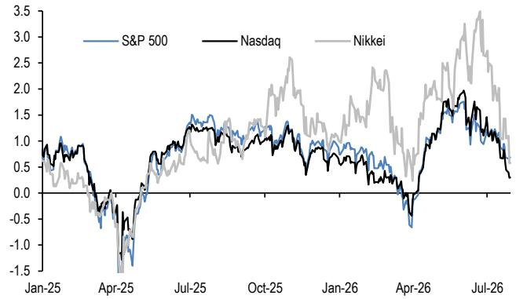  
来源：Bloomberg Finance L.P., JPM 流动性研究。  
图5：亚洲指数的动量信号  
附录中表A3和A4所示的趋势跟踪策略框架中短期和长期动量信号的平均z-score。

周。因此，杠杆权益ETF资产管理规模的缩减速度远快于我们此前的设想。事实上，在6月达到峰值后，杠杆权益ETF的资产管理规模与标的公司市值之比已基本恢复正常（涵盖所有杠杆权益ETF，包括指数和个股杠杆ETF），解除了此前4月/5月约85%的增长（图6中的蓝线）。对于半导体（除存储）类股也是如此（图6中的灰线）。对于存储类股，该比率已解除了4月/5月期间约55%的增长（图6中的黑线）。换言之，由杠杆ETF问题引发的去杠杆和过度波动，对整体权益市场而言应不再是一个重大问题，对个股存储类股而言，未来的影响也将小得多。

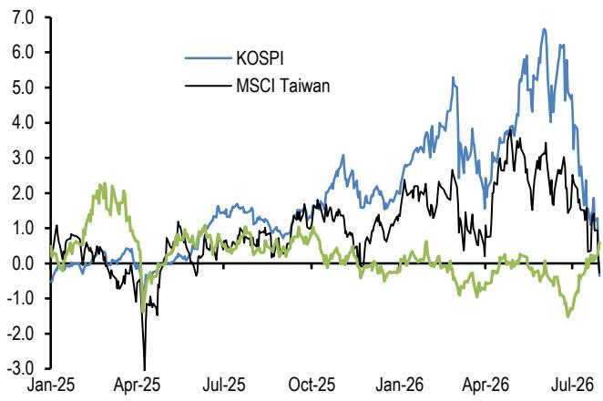  
来源：Bloomberg Finance L.P., JPM 流动性研究。

\- 4) 对于杠杆权益ETF，我们此前曾指出，由于凸性，震荡区间交易足以自然缩减其资产管理规模。例如，如果标的指数某日下跌10%，次日上涨11.1%回到前值，那么一个3倍杠杆ETF首日将下跌30%，次日上涨33.3%，最终较前值下跌7%。换言之，杠杆权益ETF的过度增长可以通过凸性自我修正：如果过度杠杆导致更频繁的VaR冲击，那么权益市场的震荡区间交易将随时间推移缩减其资产管理规模。而凸性导致的价格效应将主导这些杠杆ETF的持续资金流入。

\- 然而，过去两周市场并未呈现区间震荡，而是出现了半导体和存储类股的大幅价格下跌。

图6：杠杆权益ETF资产管理规模占标的公司市值的百分比  
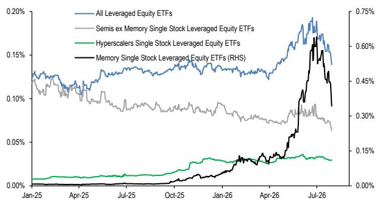  
来源：Bloomberg Finance L.P., JPM 流动性研究。

\- 5) 在风险平价基金领域，我们的杠杆代理指标已经正常化（如图7所示），因此风险平价基金的过度杠杆应不再对权益市场构成显著阻力。

图7：风险平价基金的隐含杠杆率
风险平价基金回报的3个月滚动波动率与我们的风险平价策略基准波动率之比。  
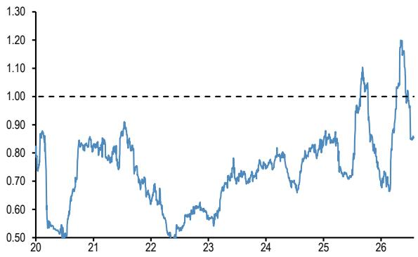  
来源：Bloomberg Finance L.P., JPM 流动性研究。

\- 6) 同样，在期权领域，此前散户读者极端的看涨期权买入行为似乎已回归历史均值（图8）。作为参考，我们基于OCC数据（合约数量少于10张的客户在交易所交易的看涨期权买入量）构建的散户读者期权买入代理指标，在6月5日达到峰值后已显著回落。6月5日接近1400万张合约的峰值，与2025年10月和2021年11月的前期峰值相当。

图8：个股期权中，合约数量少于10张的客户在开仓时买入看涨期权减去卖出看涨期权的数量
单位：百万张合约。最新数据为截至2026年7月24日当周。  
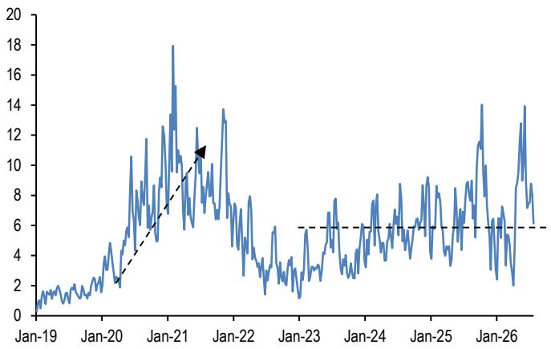  
来源：OCC, JPM 流动性研究。

\- 7) 如图9所示，6月份保证金账户的杠杆率处于非常高的水平，因此需要在7月份看到更显著的去杠杆，才能判断保证金账户杠杆不再对权益市场构成重大阻力。作为参考，对于保证金账户，我们使用纽交所净借方余额作为美国个人读者杠杆的代理指标。虽然原则上它同时包含散户和机构读者，但我们认为其中大部分可能来自散户读者。与可以通过期权和期货更轻松或更廉价地获得杠杆的对冲基金不同，个人读者更依赖于美联储的T条例。该条例规定了客户现金账户以及经纪公司和交易商可向客户提供的用于购买证券的信贷额度，规定借款上限为可融资买入证券购买价格的50%。纽交所净借方余额的计算方式为保证金借方余额减去总贷方余额（现金账户贷方 + 保证金账户贷方）的差额。这一杠杆代理指标表明，6月份美国个人读者通过保证金账户的杠杆率处于非常高的水平，我们怀疑7月份已出现显著下降。不幸的是，我们需要等待一个月才能确认7月份是否下降，因为7月份的观察数据将在8月底公布。

## 图9：纽交所保证金账户的净借方余额

纽交所保证金账户净借方余额等于保证金借方余额减去总贷方余额（现金账户贷方 + 保证金账户贷方）的差额。蓝线由净借方余额（十亿美元）除以标普500指数市值构建。最新月度数据为2026年6月。  
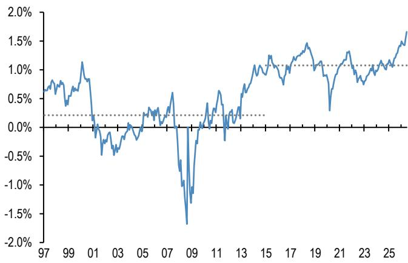  
来源：FINRA, JPM 流动性研究。

\- 总体而言，我们发现读者在科技和半导体领域（包括存储芯片股）的去杠杆进程，其推进速度快于我们此前的预期。因此，我们现在认为，进一步去杠杆的空间已较为有限。特别是对于韩国市场，我们推荐参考我们的同事Mixo Das于2026年7月29日发布的近期报告《韩国权益策略——韩国去杠杆进程更新（二）》，该报告得出了与我们相似的结论。

\- 最后，假设我们上述论点正确，且大部分读者去杠杆已接近尾声，我们认为权益市场可能会从以下发展中获得支撑：

\- a) 存储芯片价格仍在上涨，为近期去杠杆中心所在的存储芯片制造商提供了基本面支撑（图10）。

图10：inSpectrum Tech存储芯片价格  
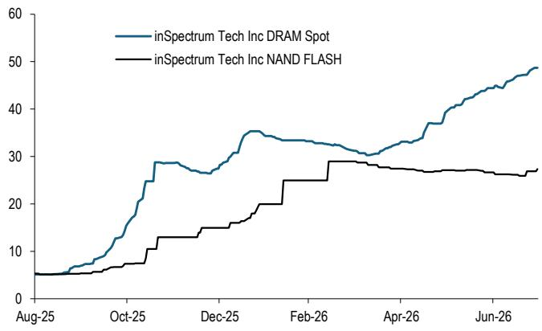  
来源：Bloomberg Finance L.P., JPM 流动性研究。

\- b) 分析师已大幅上调了超大规模企业2026年和2027年的资本支出预测（图11），分别从7月1日的7580亿美元和9250亿美元上调至7700亿美元和1万亿美元。

图11：彭博汇总的底层分析师一致预期中美国超大规模企业的资本支出预测

<table><tr><td>单位：十亿美元</td><td>23</td><td>24</td><td>25</td><td>26E</td><td>27E</td><td>28E</td><td>29E</td><td>30E</td></tr><tr><td>谷歌</td><td>32.3</td><td>52.5</td><td>91.4</td><td>197.0</td><td>290.2</td><td>312.7</td><td>305.4</td><td>315.5</td></tr><tr><td>亚马逊</td><td>52.7</td><td>83.0</td><td>131.8</td><td>200.1</td><td>238.7</td><td>250.7</td><td>252.0</td><td>256.1</td></tr><tr><td>Meta</td><td>27.3</td><td>37.3</td><td>69.7</td><td>135.6</td><td>175.0</td><td>194.8</td><td>192.0</td><td>196.0</td></tr><tr><td>微软</td><td>28.1</td><td>44.5</td><td>64.6</td><td>160.6</td><td>198.1</td><td>223.8</td><td>255.9</td><td>279.6</td></tr><tr><td>甲骨文</td><td>8.7</td><td>6.9</td><td>21.2</td><td>76.7</td><td>99.3</td><td>102.7</td><td>90.5</td><td>73.9</td></tr><tr><td>总计</td><td>149.0</td><td>224.1</td><td>378.7</td><td>770.1</td><td>1,001.4</td><td>1,084.7</td><td>1,095.8</td><td>1,121.2</td></tr><tr><td>同比增长</td><td>-4%</td><td>50%</td><td>69%</td><td>103%</td><td>30%</td><td>8%</td><td>1%</td><td>2%</td></tr></table>

来源：Bloomberg Finance L.P., JPM 流动性研究。

\- c) 如图12所示，以Hopper租赁价格为代表的AI算力价格保持稳定。AI算力价格对于超大规模企业实现其AI资本支出货币化的能力至关重要。算力价格越高，超大规模企业维持或提高其利润率的能力就越强。在2025年底算力定价持续面临下行压力之后，近几个月出现了一些改善迹象。此外，我们发现图12对部分读者做出的过度淘汰/折旧假设提出了质疑。

图12：Compute Desk的Hopper美国指数
汇总了美国Neocloud提供商提供的NVIDIA Hopper（H100和H200）GPU的按需和预留定价。该指数以每GPU每小时美元计价。  
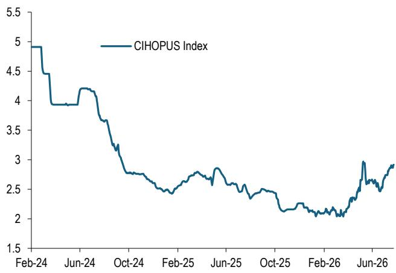  
来源：Bloomberg Finance L.P., JPM 流动性研究。

## 参议院通过《清晰法案》几率的骤降对加密市场构成挫折

\- 随着参议院在夏季休会前优先处理其他立法，预测市场对《清晰法案》在年底前通过的几率骤降至37%，为今年以来的最低隐含概率。

\- 道德问题已成为最大的障碍之一。民主党在州执法问题上划定了界限，而共和党与白宫则在仅限司法部执法的问题上划定了界限。谈判仍在继续，但尚不清楚这一僵局，以及其他关于收益、DeFi和非法金融活动等六个月来未有进展的僵局，将如何最终解决。

\- 我们此前曾指出（参见2026年2月26日的《资金流与流动性》报告），市场结构法案（即《清晰法案》）将成为加密市场的积极催化剂，原因如下：该立法为将加密代币分类为由CFTC监管的数字商品或由SEC监管的数字证券引入了清晰框架；该立法为新建项目提供了构建和去中心化的宽限期，允许在无需完全SEC注册的情况下每年筹集高达7500万美元的资金；该立法为最初作为证券发行的代币在二级市场一旦充分去中心化且发行人不再行使管理角色时，重新分类为数字商品提供了路径；该立法通过要求加密中介机构向CFTC或SEC注册，建立了全面的监管框架，结束了以执法代监管的模式；该立法促进了传统证券和现实世界资产的代币化，使其更容易上链；该立法允许矿工、验证者、钱包和协议开发者作为纯软件开发人员，只要不从事托管活动或充当传统金融中间人，即可免于“经纪人”/金融中介报告义务。

\- 如果该立法最终获得通过，上述因素将共同支持更机构级市场基础设施的发展，缓解当前围绕DeFi和稳定币发行人的限制，随着活动逐渐从离岸场所迁移至符合美国规定的市场，将增加在岸流动性和交易量，并降低资本充足的经纪商、交易所、做市商、托管人和银行关联平台进入加密市场的门槛。

\- 事实上，近期的活动表明，其中一些积极因素已在显现。Citadel Securities收购了Crypto.com价值4亿美元的股权。此外，CFTC于5月29日批准了首个美国监管的加密永续期货产品，这标志着一个重要里程碑，支持了永续期货流动性从离岸市场回流在岸的潜力。

\- 尽管如此，我们认为，当前草案中的某些方面可能会阻碍而非促进机构参与加密市场。一个例子是，如果DeFi能够在SEC或CFTC管辖范围之外交易代币化证券和代币化衍生品，而目前草案允许这样做。第二个例子是，如果加密实体在从事与银行和经纪交易商相同的活动时，几乎不需要进行任何反洗钱工作。

\- 总体而言，参议院通过《清晰法案》几率的骤降对加密市场构成了挫折。《清晰法案》获批的时间越是被推迟，代币化和区块链应用的增长最终被现有市场基础设施吸收而非归于公共加密网络的风险就越大（参见2026年7月8日的《资金流与流动性》报告）。

Mayur Yeole (91 22) 6157 3872  
mayur.yeole@jpmchase.com  
JPM India Private Limited  
Krutik P Mehta (91-22) 6157-5016  
krutik.mehta@jpmchase.com  
JPM India Private Limited

## 附录

## 图A1a：全球权益与债券基金资金流

年度净销售额（十亿美元），即全球共同基金和ETF的净新销售额加再投资股息，涵盖美国境内外注册的基金。资金流数据来自ICI（全球数据截至2026年第一季度）。此后数据为来自Lipper和彭博的月度与周度数据组合。

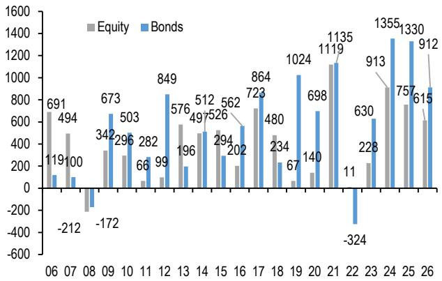  
来源：ICI, LSEG Lipper, Bloomberg Finance L.P., JPM 流动性研究。

图A1b：全球季度平衡型/混合基金及货币市场基金资金流 每季度净销售额（十亿美元），即全球共同基金和ETF的净新销售额加再投资股息，涵盖美国境内外注册的基金。数据来自ICI（全球数据），截至2026年第一季度。

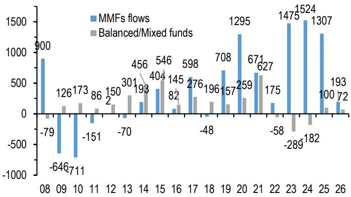

## 图A2：基金资金流指标

权益与债券基金资金流之差：每周十亿美元。权益与债券基金资金流之差（每周十亿美元）。资金流包括全球共同基金和ETF的资金流，即美国境内外注册的基金（来源：Lipper）。细蓝线显示权益与债券基金资金流之差的4周均值。虚线表示自2009年以来蓝线的±1个标准差。粗黑线显示同一序列的平滑版本。平滑处理使用Hodrick-Prescott滤波器，Lambda参数为100。中国境内A股ETF已排除在外。

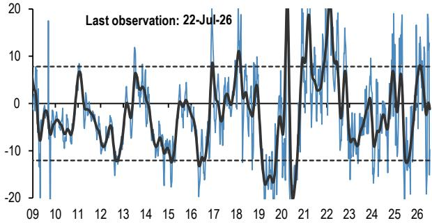

来源：LSEG Lipper, JPM 流动性研究。

## 表A2：交易量监测

交易量为月度数据，换手率为年化值（月度交易量年化后除以未偿金额）。美国国债现货为一级交易商在所有美国政府证券中的交易量。美国国债期货来自Bloomberg Finance L.P.。日本国债为所有日本政府证券的场外交易量。德国国债、黄金、石油和铜为期货。黄金包括黄金ETF。最小-最大图表基于换手率。对于德国国债和大宗商品，使用期货交易量，而未偿金额以未平仓合约量代理。菱形标记代表最新的换手率观察值。细蓝线标记自2005年1月以来完整时间序列的最小值与最大值之间的距离。同比变化为年初至今名义交易量较去年同期的变化。

<table><tr><td>截至2026年6月</td><td>最小值</td><td>最大值</td><td>换手率</td><td>交易量（万亿）</td><td>同比变化</td></tr><tr><td colspan="6">权益类</td></tr><tr><td>新兴市场权益</td><td></td><td></td><td>1.4</td><td>$2.1</td><td>135%</td></tr><tr><td>发达市场权益</td><td></td><td></td><td>1.4</td><td>$16.2</td><td>44%</td></tr><tr><td colspan="6">政府债券</td></tr><tr><td>美国国债现货</td><td></td><td></td><td>12.3</td><td>$17.7</td><td>5%</td></tr><tr><td>美国国债期货</td><td></td><td></td><td>0.8</td><td>$14.9</td><td>8%</td></tr><tr><td>日本国债</td><td></td><td></td><td>49.1</td><td>¥5,035</td><td>11%</td></tr><tr><td>德国国债期货</td><td></td><td></td><td>1.5</td><td>€10.1</td><td>18%</td></tr><tr><td colspan="6">信用债</td></tr><tr><td>美国投资级</td><td></td><td></td><td>1.1</td><td>$0.8</td><td>15%</td></tr><tr><td>美国高收益</td><td></td><td></td><td>0.5</td><td>$0.1</td><td>-1%</td></tr><tr><td>美国可转债</td><td></td><td></td><td>3.6</td><td>$0.04</td><td>15%</td></tr><tr><td colspan="6">大宗商品</td></tr><tr><td>黄金</td><td></td><td></td><td>52.4</td><td>$1.4</td><td>39%</td></tr><tr><td>石油</td><td></td><td></td><td>80.1</td><td>$2.3</td><td>0%</td></tr><tr><td>铜</td><td></td><td></td><td>1.9</td><td>$0.7</td><td>70%</td></tr><tr><td colspan="6">数字资产</td></tr><tr><td>CME比特币</td><td></td><td></td><td>115.0</td><td>$0.061</td><td>-34%</td></tr><tr><td>CME以太坊</td><td></td><td></td><td>134.8</td><td>$0.023</td><td>25%</td></tr></table>

\* 数据滞后一个月  
来源：Bloomberg Finance L.P., 美联储, Trace, 日本证券业协会, WFE, JPM 流动性研究。

图A6a：权益板块与区域ETF资金流  
ETF资金流监测（截至7月29日）  
图A3：全球跨资产ETF资金流
ETF累计资金流占资产管理规模的百分比  
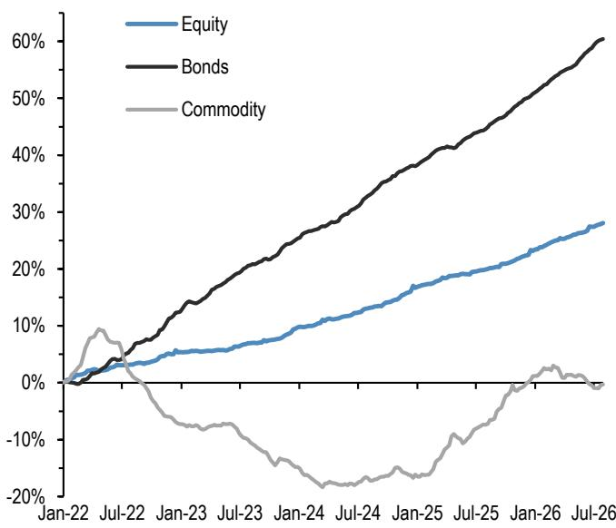  
来源：Bloomberg Finance L.P., JPM 流动性研究。中国境内A股ETF已排除在外。

图A4：债券ETF资金流
债券ETF累计资金流占资产管理规模的百分比  
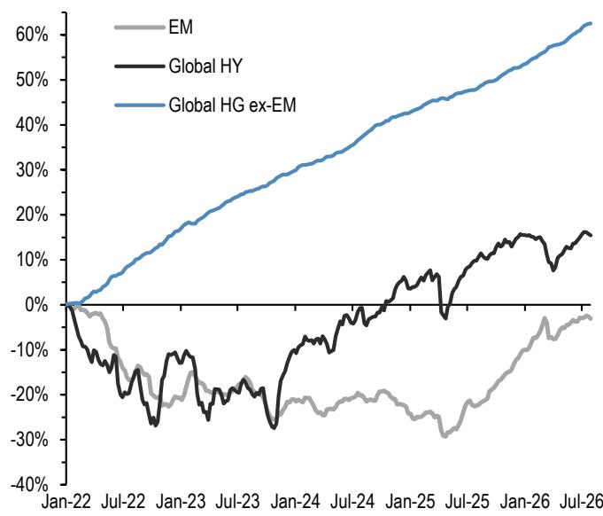  
来源：Bloomberg Finance L.P., JPM 流动性研究。  
全球权益ETF累计资金流占资产管理规模的百分比

图A5：全球权益ETF资金流

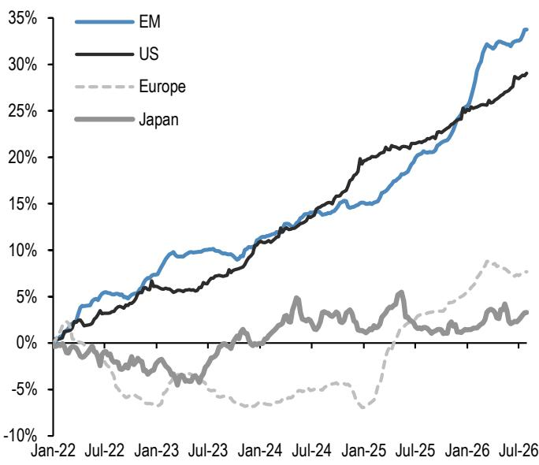  
滚动3个月和12个月累计资金流占资产管理规模百分比的变化。均按12个月变化排序。

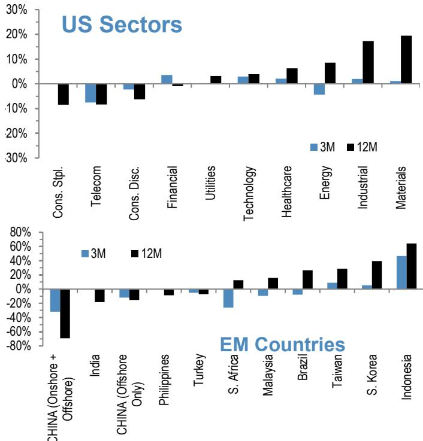  
来源：Bloomberg Finance L.P., JPM 流动性研究。

Nikolaos Panigirtzoglou AC (44-20) 7134-7815
nikolaos.panigirtzoglou@JPM.com
JPM Securities plc
Mika Inkinen (44-20) 7742 6565
mika.j.inkinen@JPM.com
JPM Securities plc

Mayur Yeole (91 22) 6157 3872
mayur.yeole@jpmchase.com
JPM India Private Limited
Krutik P Mehta (91-22) 6157-5016
krutik.mehta@jpmchase.com
JPM India Private Limited

图A6b：ETF隐含的区域权益配置（百分比）。

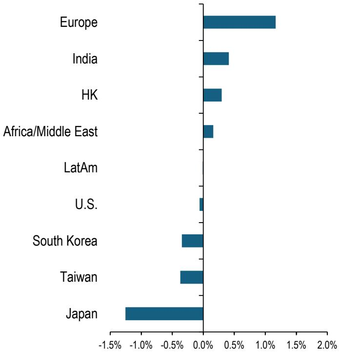  
来源：Bloomberg Finance L.P., MSCI 和 JPM 流动性研究。
注：我们的ETF隐含区域权益配置监测基于比较各区域在权益ETF空间中的份额与其在全球权益指数中的相应份额。

2026年7月29日

Mayur Yeole (91 22) 6157 3872
mayur.yeole@jpmchase.com
JPM India Private Limited
Krutik P Mehta (91-22) 6157-5016
krutik.mehta@jpmchase.com
JPM India Private Limited

## 空头头寸监测

图A7：EEM和EMB美国ETF的空头头寸
空头头寸占流通股本的百分比。  
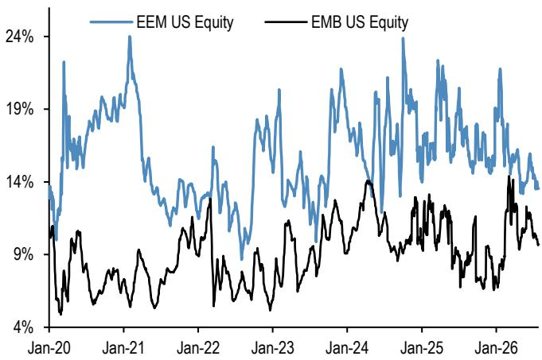  
来源：S3, JPM 流动性研究。

图A8：LQD和HYG美国ETF的空头头寸
空头头寸占流通股本的百分比。  
图A9：SPY和QQQ美国ETF的空头头寸
空头头寸占流通股本的百分比。最新数据为2026年7月3日。  
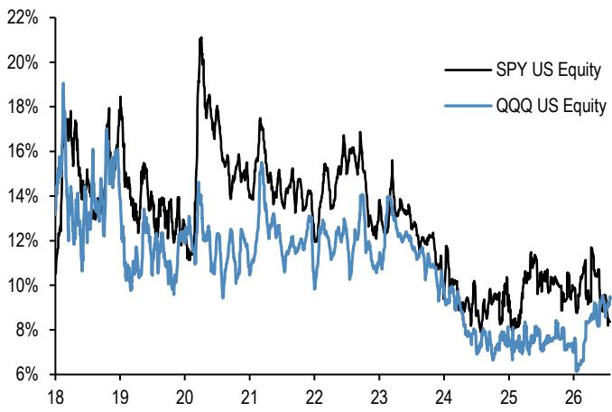  
来源：S3, JPM 流动性研究。

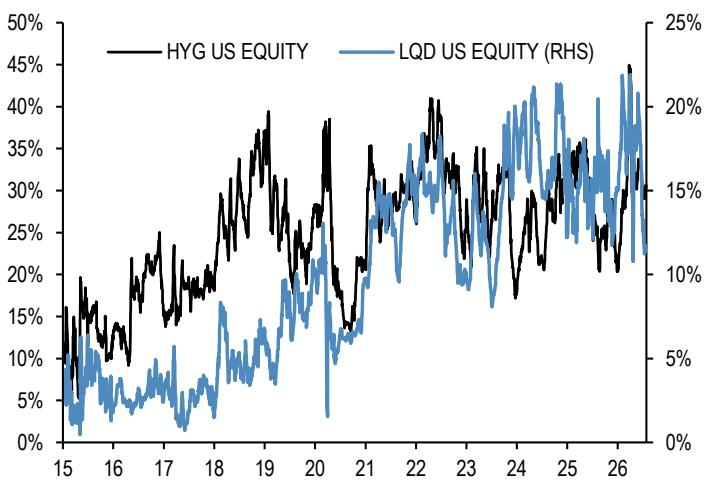  
来源：S3, JPM 流动性研究。  
图A10：标普500板块空头头寸
基于z-score的空头头寸占流通股本的百分比。一种超配标普500板块中空头头寸z-score最高（占流通股本百分比）的板块，同时低配空头头寸z-score最低的板块的策略，其信息比率为0.7，成功率为56%（详见2013年6月28日的《资金流与流动性》报告）。

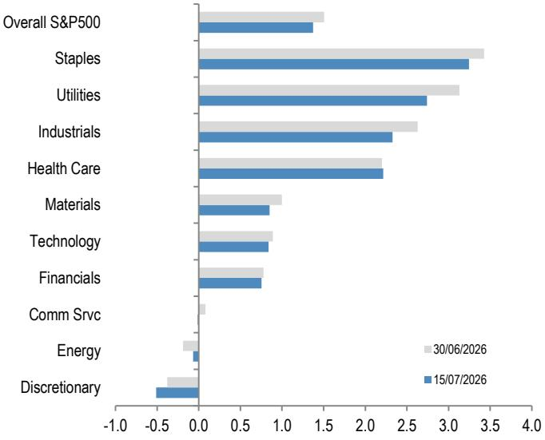  
来源：纽交所, Bloomberg Finance L.P., JPM 流动性研究。

## 图A11a：跨资产波动率监测 3个月平值隐含波动率（1年历史），截至2026年7月27日

此表显示当前三个月隐含波动率水平（红点）相对于其一年历史范围（细蓝条）的贵贱程度，以及与当前已实现波动率的比率。隐含波动率超出其25%/75%百分位范围（粗蓝条）的资产已高亮显示。隐含与已实现波动率比率使用各资产的3个月隐含波动率和1个月（约21个交易日）已实现波动率。

<table><tr><td>资产</td><td>当前</td><td>低点</td><td>低点日期</td><td>高点</td><td>高点日期</td><td></td><td>上行空间</td><td>下行空间</td><td>隐含/已实现波动率</td></tr><tr><td>标普500</td><td>16%</td><td>13%</td><td>2025-08-
