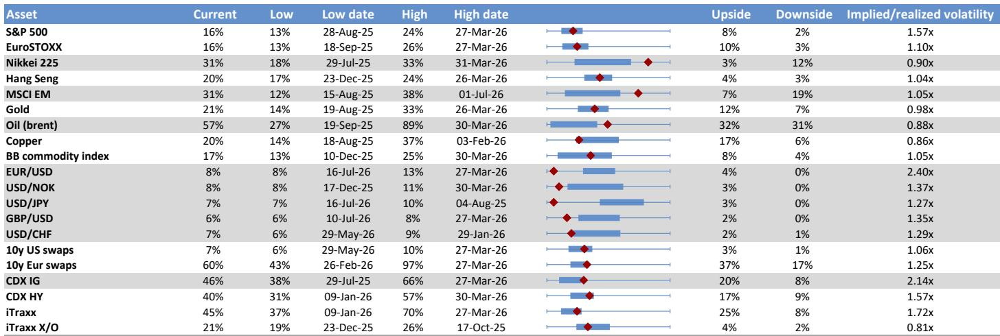
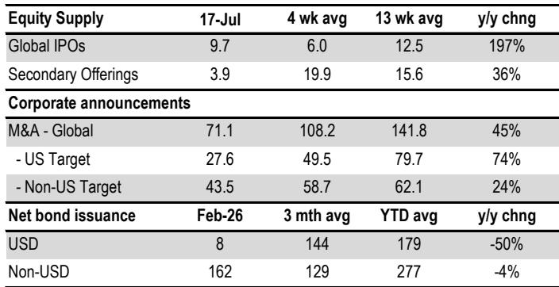

# JPM：资金结构与相关数据观察

过去两个月，全球科技与半导体板块经历了一轮快速且集中的去杠杆。JPM在7月29日发布的跨资产资金流与仓位监测报告中指出，这一轮去杠杆的推进速度比其团队此前预期的更快，目前进一步去杠杆的空间已经相当有限。报告的核心判断是：读者在科技和半导体领域（包括存储芯片）的杠杆压缩已基本完成，市场可能正在接近一个阶段性的底部区域。

报告通过七个维度的数据交叉验证了这一判断。对冲产品方面，以半导体指数（SOX）为参照的杠杆代理指标显示，4月至5月期间积累的杠杆头寸已基本被解除。公司层面，科技股和半导体ETF的空头比例处于高位，SMH和DRAM等关键ETF的空头占比显著，这反映出对冲产品对该板块的净敞口已降至较低水平。动量信号方面，纳斯达克、韩国KOSPI、台湾加权指数和日经指数的趋势跟踪信号已经明显波动，CTA等动量交易者此前建立的多头仓位基本被清空。值得注意的是，此前流行的“观点偏谨慎中国互联网、观点偏积极韩国/台湾/日本公司”的相对交易策略也已完全逆转。

> **KC评论：** 报告中最容易被忽略的一点是杠杆ETF的“凸性自修正”机制。JPM此前曾指出，杠杆ETF的规模会因市场波动而自然缩减——如果指数先跌10%再涨11.1%，一只3倍杠杆ETF会净亏7%。过去几周半导体和存储芯片的急跌加速了这一过程，目前杠杆ETF的AUM相对于标的市值的比率已经恢复了85%的此前涨幅，存储芯片相关ETF也恢复了约55%。这意味着杠杆ETF作为波动源头的不确定性正在消退。

不确定性平价产品的杠杆指标已经正常化，期权市场上散户此前极端的看涨期权观点偏积极行为也已回落至历史均值附近。相对少见尚未确认的数据是保证金账户杠杆——6月份纽约标的交易所的净借方余额仍处于极高水平，7月数据要到8月底才能公布，但报告推测7月已出现显著下降。

报告进一步指出，如果去杠杆确实接近尾声，市场可能从三个基本面因素中获得支撑。存储芯片价格仍在上涨，这为处于去杠杆风暴中心的存储厂商提供了基本面支持。美国超大规模云服务商的资本开支预期被分析师进一步上调：2026年预期从7580亿美元升至7700亿美元，2027年预期从9250亿美元升至1万亿美元。AI算力价格方面，以英伟达Hopper GPU租赁价格为代理指标的价格近期出现企稳迹象，这削弱了部分读者对算力资产快速折旧的担忧。

报告还单独讨论了加密资产市场。由于美国参议院在夏季休会前优先处理其他立法，Clarity Act在年底前通过的概率已降至37%，为年内最低。两党在州级执法权和司法部执法权上的分歧仍未解决，其他关键议题如收益、DeFi和非法资金也已僵持六个月。JPM此前认为该法案是加密市场的积极催化剂，其受阻意味着市场短期内可能失去一个重要的制度性支撑。

For informational purposes only. Portions may be generated,translated,summarized,or edited with AI assistance based on source materials and may contain omissions or errors. Please verify independently. This is not investment,legal,tax,accounting,or other professional advice.

