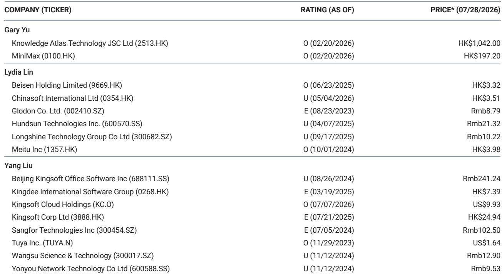
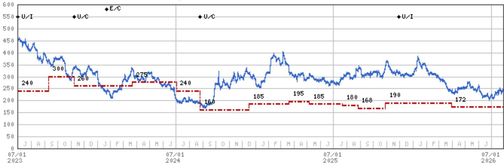
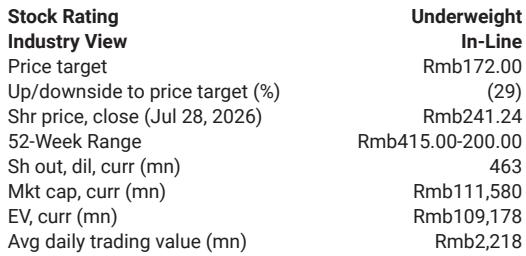

# MS：金山办公与AI及季度数据观察

金山办公（688111.SS）在2026年第二季度交出了一份收入增长强劲的业绩预告。MS在最新发布的AlphaSignals报告中指出，公司1H26收入预计同比增长21-28%，其中2Q26单季收入增速落在18-33%区间，对应约16至18亿元人民币。这份业绩预告的发布时间是7月28日，正值市场对AI办公工具可能冲击传统软件格局的讨论升温之际。

报告认为，这一收入增长主要来自WPS个人订阅产品（2C）和企业协作产品WPS 365的持续放量。两个产品线同时发力，说明金山办公在个人和机构两端都找到了增长支点。个人端，订阅模式带来的经常性收入正在积累；企业端，WPS 365作为协作平台，正在从传统办公软件向组织协同工具延伸。

> **KC评论：** 市场此前对AI办公的担忧，更多集中在“大模型是否会替代WPS这类传统办公软件”。但这份业绩预告显示，至少短期内，金山办公的营收增长并未受到AI冲击的明显影响。真正需要关注的是，这种增长是来自存量用户的付费转化，还是来自新场景的拓展——后者对长期发展的影响更大。

## 1. 调整后利润增速区间较宽，利润率稳定性成关键

报告同时披露了2Q26的调整后利润数据。剔除回报表现、股权激励及相关税务影响后，调整后利润同比增长3-45%，对应4.2亿至5.94亿元人民币。这个区间跨度较大，反映出业绩存在一定不确定性。

但报告也指出，该区间的中位数对应约24%的同比增长，与收入增速基本持平。这意味着，如果最终落在中位数附近，公司的利润率在季度间保持了相对稳定。对于一家处于成长期的软件公司而言，收入增长的同时能维持利润率，是运营效率的重要信号。

## 2. 当前估值仍处于高位，市场定价包含较高增长预期

尽管业绩表现强劲，MS对金山办公的评级仍为“低配”，较当前241元左右的报价有约29%的节奏变化空间。报告给出的估值数据显示，公司当前对应2026年和2027年的市盈率分别为63倍和46倍。

这一估值水平在相关市场软件板块中属于较高区间。市场显然已经为金山办公的AI转型和增长潜力支付了溢价。但报告也提醒，如果AI渗透速度慢于预期，或者在线协作领域的竞争因边界模糊而加剧，估值可能面临回调不确定性。

## 3. 政府软件国产化预算约束是潜在节奏变化不确定性

报告在观察提示中特别提到了“政府预算约束对软件国产化的影响”。这是金山办公作为国产办公软件龙头必须面对的现实：信创市场的需求节奏并不完全由产品力决定，更多取决于财政周期和政策推进速度。

如果地方政府在软件采购上的预算持续收紧，金山办公的企业业务增速可能会受到抑制。这一不确定性在当前宏观环境下尤其值得关注——它并非公司自身能控制的因素，但会直接影响收入结构的稳定性。

## 4. 一个可复用的观察框架：从收入增速与利润增速的匹配度判断成长质量

对于关注软件公司的读者而言，金山办公这份业绩预告提供了一个有用的分析框架：将收入增速与调整后利润增速的中位数进行对比。如果两者基本匹配，说明公司处于“有质量的增长”阶段；如果利润增速显著低于收入增速，则可能意味着获客成本上升或定价能力下降；如果利润增速显著高于收入增速，则需要警惕是否来自一次性收益或费用压缩。

金山办公2Q26的情况属于第一种——收入与利润增速大致同步。这在一定程度上缓解了市场对AI冲击的担忧，但并未完全消除。后续需要持续观察的是，这种增长能否在AI工具快速迭代的环境中持续。

For informational purposes only. Portions may be generated,translated,summarized,or edited with AI assistance based on source materials and may contain omissions or errors. Please verify independently. This is not investment,legal,tax,accounting,or other professional advice.

For informational purposes only. Portions may be generated,translated,summarized,or edited with AI assistance based on source materials and may contain omissions or errors. Please verify independently. This is not investment,legal,tax,accounting,or other professional advice.

