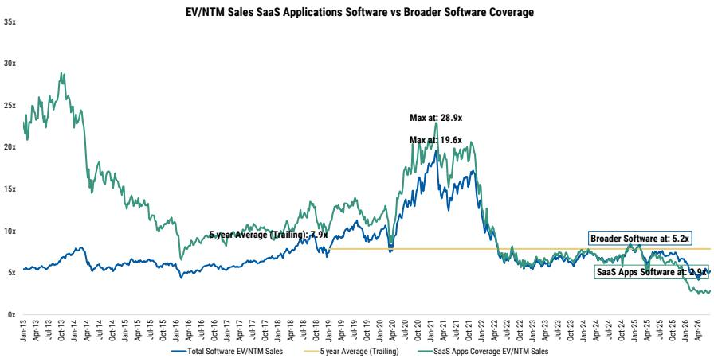
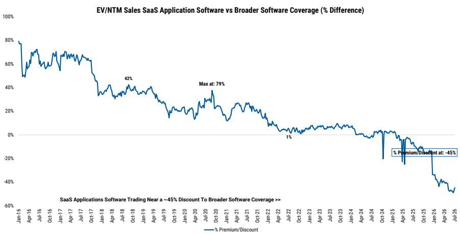
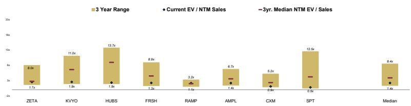
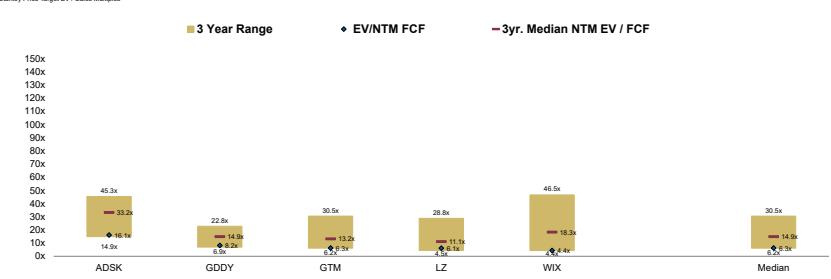

July 28, 2026 04:01 AM GMT

Software | North America

# 2Q26 SaaS Preview – Steady, But Not Re-Rating

Channel checks & CIO survey continue to indicate stable demand, but we expect management teams to maintain a measured outlook as AI monetization remains early & macro uncertainty persists, limiting the catalyst for broader-based upward revisions. Prefer names with flight to safety skew - KVYO & GDDY.

## Key Takeaways

Channel checks & CIO survey point to solid fundamentals, though nascent AI monetization & macro uncertainty likely drive conservatism in outlooks...

\- .... which mutes broad-based positive revisions in Q2 needed to catalyze a re-rating in application SaaS

\- Prefer companies with flight to safety skew in FCF support and undemanding multiple (GDDY)...

\- ... and reduced buyside expectations and upside optionality in new products (KVYO).

We remain selective on what can work in Q2, anticipating 2H results to serve as the more material catalyst. Into the prints, we favor stocks with constructive channel feedback, conservative numbers setups and attractive valuations – we tactically prefer GoDaddy on durable FCF support, improving webtrends data (see GoDaddy Inc (GDDY)) and bookings recovery after Q1 promotional activity; and Klaviyo on reduced expectations coupled with upside optionality in new products and less seat-based pricing risk. See company specific write ups across our coverage below.

## Company Specific Views Into the Quarter:

\- GoDaddy: Given: 1) Airo AI builder reached \$10M+ in annualized bookings within weeks of beta; 2) the upgraded W+M experience is showing encouraging early signals, though pricing remains on hold until the AI-native product reaches parity on key customer metrics; and 3) ANS is strategically compelling but lacks clear revenue contribution today, investors continue to assess when these initiatives begin to inflect estimates / growth higher. In the meantime, profitability remains the cleanest part of the story as GoDaddy continues to benefit from AI-driven productivity in Customer Care and development despite incremental AI investment. For 2Q, we'd expect a strong recovery in bookings growth (\~6% YoY) following promotional activity weighing on 1Q. On revenue, investors likely look for \~7% growth YoY, reflecting \~50 bps upside to Street estimates (largely inline with recent ex-Aftermarket driven beats), and a pass-through to FY26 guidance (ticking up \~10 bps to 5.9% YoY). With shares trading at \~8x FCF/\~0.9x growth-adjusted, relative to Smid Software at \~13x / \~0.7x growth-adjusted, we continue to view shares as fairly valued given limited visibility into a clear catalyst path to infect growth higher but see a tactically favorable set up into the print. See GoDaddy Inc (GDDY)

\- Figma: 2Q represents an important print as the first full quarter of direct AI-credit monetization, providing an initial read on the durability of consumption revenue and the stickiness of Figma Make within core design workflows. The Q1 print established a high bar, with revenue exceeding consensus by \~550 bps (versus \~350–400 bps in prior quarters), supported by seat expansion, enterprise adoption, new-user growth, retention, pricing, and broader AI usage. Given shares trade at \~7x EV/Sales versus Smid-cap Software peers at \~4x, investors will likely require another meaningful beat as evidence that credits can become a durable revenue contributor and that AI is broadening engagement across the platform. While Q1 disclosure that >75% of Organization and Enterprise users continued consuming credits after reaching free limits provides a constructive initial signal, greater visibility into overage activity and credit consumption will be needed for investors to underwrite AI as a long-term growth driver. We see buyside expecting \~450 bps upside to the 2Q guide, implying \~46% YoY growth (stable vs 1Q), alongside a FY26 guidance increase to \~37%–38% from \~35% previously. Additionally, gross margin risk appears more contained than it did heading into the Q1 print, as estimates now better reflect the drag from broadening Make usage, as well as new products launched at Config that remain unmonetized in beta (namely its design agent). While strong results likely support shares on the print, a structural re-rating likely requires both material revenue upside and improved disclosure on the quality and durability of consumption revenue, particularly ahead of the incremental post-earnings lock-up expiration. Thus, we remain EW. See Figma Inc (FIG)

\- HubSpot: Our 2Q HUBS checks were somewhat mixed, with all three partners coming in slightly shy of plan in the quarter, though this was largely a function of Partners increasingly serving larger, more complex/sophisticated customers. Partners were not attributing the softer performance to prioritization of hardware / AI investment crowding out Software spend. Rather, deal timing, deeper deal security and enterprise approval cycles, and isolated macro disruption were cited. Importantly, pipelines remain strong, projects were generally pushed into the 2H rather than lost, and as such, partners reiterated their full-year outlooks despite the softer quarter. Constructively, HubSpot's core business remains stable, with healthy customer budgets, larger deal sizes, rising multi-hub adoption and durable consolidation and displacement activity continuing to drive share gain against legacy vendors (Salesforce, Dynamics, Marketo). On AI, while we continue to view HubSpot's shift toward free trials and outcome-based AI pricing as the correct strategic move, our checks continue to indicate AI adoption is increasing at a moderate pace (\~20%–25% of partner customer bases engaging with agents, similar to comments from last quarter) with credits a low-single-digit revenue contributor, suggesting Partners are not yet indicating a step-function inflection in outlooks from AI. Accordingly, we would expect the print to deliver 18% CC growth in 2Q (stable vs 1Q), 16-17% CC guidance for 3Q and a reiteration of FY26 guidance at 17% CC. We would continue to characterize the 2H prints as the more likely window for material revisions and potential acceleration as AI adoption compounds but see shares trading at \~2x Sales / \~0.13x growth-adjusted, relative to Smid Software at \~4x / \~0.3x, as an attractive entry point, keeping us fundamentally OW. See HubSpot (HUBS)

\- Klaviyo: Given: 1) Klaviyo's business / pricing model maps well to usage (rather than seats); and 2) the current FY26 outlook bakes in minimal impact from new products (no agentic revenue assumed, minimal service suite revenue assumed), investors continue to assess upside to current estimates to gauge success of broader platform expansion / adoption and thus, Klaviyo's degree of benefit from AI tailwinds. While durability of core strategic initiatives (Enterprise, International, Multi-product) likely support revenue upside in 2Q (see buyside expecting \~27% YoY vs Street / guide at \~23%), we see this set-up reflecting stabilization in growth sequentially (28% reported in Q1), rather than a notable inflection. In addition, as Klaviyo continues to absorb carrier costs instead of passing through to customers, gross margins likely remain pressured YoY in Q2. As such, we remain positive on the trajectory of fundamentals, believing shares trading at <4x EV/ Gross Profit underprices an asset delivering durable 20%+ growth (expecting FY26 guidance to improve to \~24% vs \~23% prior) and margin expansion (expect \~100 bps expansion YoY to \~15%), keeping us OW. See Klaviyo (KVYO)

\- Zeta Global: In order for ZETA to substantiate its recent messaging that the business should be increasingly viewed as (and the stock trade similarly to) an underlying infrastructure play for marketing / advertising, investors would likely need to see proof points of meaningfully deeper platform usage driving a notable organic growth inflection. Thus, with the company putting up \~29% organic growth in 1Q, we'd expect the bar for shares to push higher on results to sit around \~29-30% organic growth in 2Q (with organic FY26 guidance raised to \~24%, from \~22% prior), which does not appear particularly undemanding against a tougher year ago organic growth compare. We continue to assess the ability for recent innovation (Athena, Palantir partnership) to accelerate the broader use of the Zeta platform, and thus, the company's topline, to get more constructive as we view shares currently trading at \~4.5x EV/CY27 gross profit (slight premium to Smid Software average of \~4.2x) pricing in a healthy amount of estimate upside, driving our EW view. See Zeta Global Holdings Corp (ZETA)

\- Wix: We recently downgraded WIX to Equal-weight as our prior constructive thesis, the prospect for durable growth and improving expense discipline expanding margins and delivering compounding FCF generation, had become difficult to underwrite. While Wix has already absorbed meaningful compute costs and accelerated S&M spend in order to socialize the Base44 brand, we expect investment intensity to remain elevated as the company works to sustain hyper-growth in Base44, as well as re-vamp the Studio product on the back of decelerating growth in Partners. Importantly, the recent reduction to FY26 bookings / revenue guidance (partially on incremental Partners softness) raises a more structural concern on the health of Wix's core business as AI is rapidly changing the landscape. While Base44 and Wix Harmony cohorts are showing promising early greenshoots which could offset headwinds in Partners, we have limited visibility into the degree of potential forward deterioration in the core. Specifically, on the quarter, revenue growth is likely to decelerate sequentially (we model \~13%, down from \~14% in 1Q), with bookings lagging materially (we model \~10% YoY, vs \~14% YoY in 1Q, and below current Street estimates at \~12.6%). As such, while valuation remains depressed (shares trading at just \~3x FCF), multiple consistent quarters of improved execution are likely needed to re-build confidence in Wix's AI positioning. See Wix.com Ltd (WIX)

\- Amplitude: We remain constructive on the outlook for AMPL as positive KPI momentum and greater visibility into the Statsig integration should support shares trading at a deep discount to digital enablement and data infrastructure peers, with AMPL at 0.09x EV/S/G versus peers at 0.28x. Core momentum remains encouraging, with NDR improving 1 point QoQ to 106%, multi-product ARR increasing 3 points QoQ to 77%, 5+ product ARR increasing 4 points QoQ to 24%, and new pricing / packaging reaching 25% of Q1 contracted ARR. On the quarter, we expect Q2 revenue growth of \~20%, reflecting \~170 bps upside to Street at \$98.2M (consistent with AMPL's trailing four-quarter average beat cadence). While a more material FY26 revision may not come until 2H as management gains better visibility into Statsig integration, retention, renewals, and cross-sell, we believe Q2 should support the foundation for a re-rating in coming quarters as Statsig flows through to more durable revenue acceleration, supporting our Overweight view. See Amplitude, Inc (AMPL)

\- LegalZoom.com: We remain cautious on LZ as stronger execution across higher-value subscriptions and partner-led customer acquisition has yet to translate into broader unit growth. Core momentum remains mixed: while Concierge, Virtual Mail, better compliance retention, and partner-sourced demand continue to support ARPU, this momentum has yet to drive meaningful subscription unit growth. Further, LegalZoom unique visitors declined -9% YoY in June despite U.S. new business applications increasing +16% YoY, though management has increasingly emphasized higher-quality customers and partner channels over direct exposure to formations volume. On the quarter, we expect Q2 revenue growth of \~10.5%, reflecting \~370 bps upside to Street at \$205.5M, consistent with trailing 4Q average beat cadence. While continued progress across human-in-the-loop offerings and partnerships could support another near-term beat, we expect any FY26 revenue raise to largely reflect Q2 beat flow-through rather than a meaningful improvement in the underlying growth outlook, limiting the potential to drive durable investor interest. With shares trading at 0.22x EV/S/G, above the customer enablement peer median at 0.16x, valuation does not account for exposure in a transactional business model. Remain UW. See LegalZoom.com Inc (LZ)

\- monday.com: Q1 was a clean beat, with revenue growth of 24% YoY, its strongest rev beat in 10 qtrs, w/ better retention, durable cRPO growth, upmarket & multi-product momentum, AI ARR lift & margin upside. FY26 revenue and operating income guides were raised; AI efficiency + AI product/ platform/consumption pricing add optionality. More recently, management lifted its non-GAAP operating-margin outlook to approximately 15% (from 13% prior) following a 20% workforce reduction (2026 revenue growth and FCF margins unchanged). Because the restructuring began after quarter-end, it should not affect Q2 results, where guidance implies 18%–19% revenue growth and a 13%–14% operating margin. With that in mind, we are looking for \~\$5MM revenue beat, yielding \~21% YoY growth and a typical 2-3% beat to operating margins. Flowing through Q2 upside to FY26 checks the box given low investor expectations. Demonstrating durable growth in Q2, stable upmarket momentum, and a credible path to the new margin target (and beyond) could help shares. For skeptics, the risk is that restructuring masks softer demand; for bulls, sustained growth alongside faster margin conversion would help rebuild the beat-and-raise cadence and support a re-rating. See Monday.com Ltd (MNDY)

Exhibit 1: Overall Software Multiples and SaaS Applications Group Both Trading Below 5-Year Trailing Average  
  
Source: FactSet, Visible Alpha, Company data, MS

Exhibit 2: SaaS Applications Software Group EV/S Multiples Trading at a 45% Discount to Broader Software  
  
Source: FactSet, Company data, MS estimates

Exhibit 3: EV/S Multiples Reflect Near Trough Valuations on Our Revenue Forecasts for Many Stocks Under Coverage...  
  
Source: Company data, FactSet, MS

Exhibit 4: ... With a Similar Outlook on EV/FCF Multiples  
  
Source: Company data, FactSet, MS

Exhibit 5: CY25/CY26/CY27 Consensus Growth + Margin Expectations for SaaS Software

<table><tr><td rowspan="2">Ticker</td><td rowspan="2">Company</td><td rowspan="2">Tick Company</td><td colspan="101">Key Tag Index</td><td></td><td></td><td></td><td></td><td></td><td></td><td></td><td></td><td></td><td></td><td></td><td></td><td></td><td></td><td></td><td></td><td></td><td></td><td></td><td></td><td></td><td></td><td></td><td></td><td></td><td></td><td></td><td></td><td></td><td></td><td></td><td></td><td></td><td></td><td></td><td></td><td></td><td></td><td></td><td></td><td></td><td></td><td></td><td></td><td></td><td></td><td></td><td></td><td></td><td></td><td></td><td></td><td></td><td></td><td></td><td></td><td></td><td></td><td></td><td></td><td></td><td></td><td></td><td></td><td></td><td></td><td></td><td></td><td></td><td></td><td></td><td></td><td></td><td></td><td></td><td></td><td></td><td></td><td></td><td></td><td></td><td></td><td></td><td></td><td></td><td></td><td></td><td></td><td></td><td></td><td></td><td></td><td></td><td></td><td></td><td></td><td></td><td></td><td></td><td></td><td></td><td></td><td></td><td></td><td></td><td></td><td></td><td></td><td></td><td></td><td></td><td></td><td></td><td></td><td></td><td></td><td></td><td></td><td></td><td></td><td></td><td></td><td></td><td></td><td></td><td></td><td></td><td></td><td></td><td></td><td></td><td></td><td></td><td></td><td></td><td></td><td></td><td></td><td></td><td></td><td></td><td></td><td></td><td></td><td></td><td></td><td></td><td></td><td></td><td></td><td></td><td></td><td></td><td></td><td></td><td></td><td></td><td></td><td></td><td></td><td></td><td></td><td></td><td></td><td></td><td></td><td></td><td></td><td></td><td></td><td></td><td></td><td></td><td></td><td></td><td></td><td></td><td></td><td></td><td></td><td></td><td></td><td></td><td></td><td></td><td></td><td></td><td></td><td></td><td></td><td></td><td></td><td></td><td></td><td></td><td></td><td></td><td></td><td></td><td></td><td></td><td></td><td></td><td></td><td></td><td></td><td></td><td></td><td></td><td></td><td></td><td></td><td></td><td></td><td></td><td></td><td></td><td></td><td></td><td></td><td></td><td></td><td></td><td></td><td></td><td></td><td></td><td></td><td></td><td></td><td></td><td></td><td></td><td></td><td></td><td></td><td></td><td></td><td></td><td></td><td></td><td></td><td></td><td></td><td></td><td></td><td></td><td></td><td></td><td></td><td></td><td></td><td></td><td></td><td></td><td></td><td></td><td></td><td></td><td></td><td></td><td></td><td></td><td></td><td></td><td></td><td></td><td></td><td></td><td></td><td></td><td></td><td></td><td></td><td></td><td></td><td></td><td></td><td></td><td></td><td></td><td></td><td></td><td></td><td></td><td></td><td></td><td></td><td></td><td></td><td></td><td></td><td></td><td></td><td></td><td></td><td></td><td></td><td></td><td></td><td></td><td></td><td></td><td></td><td></td><td></td><td></td><td></td><td></td><td></td><td></td><td></td><td></td><td></td><td></td><td></td><td></td><td></td><td></td><td></td><td></td><td></td><td></td><td></td><td></td><td></td><td></td><td></td><td></td><td></td><td></td><td></td><td></td><td></td><td></td><td></td><td></td><td></td><td></td><td></td><td></td><td></td><td></td><td></td><td></td><td></td><td></td><td></td><td></td><td></td><td></td><td></td><td></td><td></td><td></td><td></td><td></td><td></td><td></td><td></td><td></td><td></td><td></td><td></td><td></td><td></td><td></td><td></td><td></td><td></td><td></td><td></td><td></td><td></td><td></td><td></td><td></td><td></td><td></td><td></td><td></td><td></td><td></td><td></td><td></td><td></td><td></td><td></td><td></td><td></td><td></td><td></td><td></td><td></td><td></td><td></td><td></td><td></td><td></td><td></td><td></td><td></td><td></td><td></td><td></td><td></td><td></td><td></td><td></td><td></td><td></td><td></td><td></td><td></td><td></td><td></td><td></td><td></td><td></td><td></td><td></td><td></td><td></td><td></td><td></td><td></td><td></td><td></td><td></td><td></td><td></td><td></td><td></td><td></td><td></td><td></td><td></td><td></td><td></td><td></td><td></td><td></td><td></td><td></td><td></td><td></td><td></td><td></td><td></td><td></td><td></td><td></td><td></td><td></td><td></td><td></td><td></td><td></td><td></td><td></td><td></td><td></td><td></td><td></td><td></td><td></td><td></td><td></td><td></td><td></td><td></td><td></td><td></td><td></td><td></td><td></td><td></td><td></td><td></td><td></td><td></td><td></td><td></td><td></td><td></td><td></td><td></td><td></td><td></td><td></td><td></td><td></td><td></td><td></td><td></td><td></td><td></td><td></td><td></td><td></td><td></td><td></td><td></td><td></td><td></td><td></td><td></td><td></td><td></td><td></td><td></td><td></td><td></td><td></td><td></td><td></td><td></td><td></td><td></td><td></td><td></td><td></td><td></td><td></td><td></td><td></td><td></td><td></td><td></td><td></td><td></td><td></td><td></td><td></td><td></td><td></td><td></td><td></td><td></td><td></td><td></td><td></td><td></td><td></td><td></td><td></td><td></td><td></td><td></td><td></td><td></td><td></td><td></td><td></td><td></td><td></td><td></td><td></td><td></td><td></td><td></td><td></td><td></td><td></td><td></td><td></td><td></td><td></td><td></td><td></td><td></td><td></td><td></td><td></td><td></td><td></td><td></td><td></td><td></td><td></td><td></td><td></td><td></td><td></td><td></td><td></td><td></td><td></td><td></td><td></td><td></td><td></td><td></td><td></td><td></td><td></td><td></td><td></td><td></td><td></td><td></td><td></td><td></td><td></td><td></td><td></td><td></td><td></td><td></td><td></td><td></td><td></td><td></td><td></td><td></td><td></td><td></td><td></td><td></td><td></td><td></td><td></td><td></td><td></td><td></td><td></td><td></td><td></td><td></td><td></td><td></td><td></td><td></td><td></td><td></td><td></td><td></td><td></td><td></td><td></td><td></td><td></td><td></td><td></td><td></td><td></td><td></td><td></td><td></td><td></td><td></td><td></td><td></td><td></td><td></td><td></td><td></td><td></td><td></td><td></td><td></td><td></td><td></td><td></td><td></td><td></td><td></td><td></td><td></td><td></td><td></td><td></td><td></td><td></td><td></td><td></td><td></td><td></td><td></td><td></td><td></td><td></td><td></td><td></td><td></td><td></td><td></td><td></td><td></td><td></td><td></td><td></td><td></td><td></td><td></td><td></td><td></td><td></td><td></td><td></td><td></td><td></td><td></td><td></td><td></td><td></td><td></td><td></td><td></td><td></td><td></td><td></td><td></td><td></td><td></td><td></td><td></td><td></td><td></td><td></td><td></td><td></td><td></td><td></td><td></td><td></td><td></td><td></td><td></td><td></td><td></td><td></td><td></td><td></td><td></td><td></td><td></td><td></td><td></td><td></td><td></td><td></td><td></td><td></td><td></td><td></td><td></td><td></td><td></td><td></td><td></td><td></td><td></td><td></td><td></td><td></td><td></td><td></td><td></td><td></td><td></td><td></td><td></td><td></td><td></td><td></td><td></td><td></td><td></td><td></td><td></td><td></td><td></td><td></td><td></td><td></td><td></td><td></td><td></td><td></td><td></td><td></td><td></td><td></td><td></td><td></td><td></td><td></td><td></td><td></td><td></td><td></td><td></td><td></td><td></td><td></td><td></td><td></td><td></td><td></td><td></td><td></td><td></td><td></td><td></td><td></td><td></td><td></td><td></td><td></td><td></td><td></td><td></td><td></td><td></td><td></td><td></td><td></td><td></td><td></td><td></td><td></td><td></td><td></td><td></td><td></td><td></td><td></td><td></td><td></td><td></td><td></td><td></td><td></td><td></td><td></td><td></td><td></td><td></td><td></td><td></td><td></td><td></td><td></td><td></td><td></td><td></td><td></td><td></td><td></td><td></td><td></td><td></td><td></td><td></td><td></td><td></td><td></td><td></td><td></td><td></td><td></td><td></td><td></td><td></td><td></td><td></td><td></td><td></td><td></td><td></td><td></td><td></td><td></td><td></td><td></td><td></td><td></td><td></td><td></td><td></td><td></td><td></td><td></td><td></td><td></td><td></td><td></td><td></td><td></td><td></td><td></td><td></td><td></td><td></td><td></td><td></td><td></td><td></td><td></td><td></td><td></td><td></td><td></td><td></td><td></td><td></td><td></td><td></td><td></td><td></td><td></td><td></td><td></td><td></td><td></td><td></td><td></td><td></td><td></td><td></td><td></td><td></td><td></td><td></td><td></td><td></td><td></td><td></td><td></td><td></td><td></td><td></td><td></td><td></td><td></td><td></td><td></td><td></td><td></td><td></td><td></td><td></td><td></td><td></td><td></td><td></td><td></td><td></td><td></td><td></td><td></td><td></td><td></td><td></td><td></td><td></td><td></td><td></td><td></td><td></td><td></td><td></td><td></td><td></td><td></td><td></td><td></td><td></td><td></td><td></td><td></td><td></td><td></td><td></td><td></td><td></td><td></td><td></td><td></td><td></td><td></td><td></td><td></td><td></td><td></td><td></td><td></td><td></td><td></td><td></td><td></td><td></td><td></td><td></td><td></td><td></td><td></td><td></td><td></td><td></td><td></td><td></td><td></td><td></td><td></td><td></td><td></td><td></td><td></td><td></td><td></td><td></td><td></td><td></td><td></td><td></td><td></td><td></td><td></td><td></td><td></td><td></td><td></td><td></td><td></td><td></td><td></td><td></td><td></td><td></td><td></td><td></td><td></td><td></td><td></td><td></td><td></td><td></td><td></td><td></td><td></td><td></td><td></td><td></td><td></td><td></td><td></td><td></td><td></td><td></td><td></td><td></td><td></td><td></td><td></td><td></td><td></td><td></td><td></td><td></td><td></td><td></td><td></td><td></td><td></td><td></td><td></td><td></td><td></td><td></td><td></td><td></td><td></td><td></td><td></td><td></td><td></td><td></td><td></td><td></td><td></td><td></td><td></td><td></td><td></td><td></td><td></td><td></td><td></td><td></td><td></td><td></td><td></td><td></td><td></td><td></td><td></td><td></td><td></td><td></td><td></td><td></td><td></td><td></td><td></td><td></td><td></td><td></td><td></td><td></td><td></td><td></td><td></td><td></td><td></td><td></td><td></td><td></td><td></td><td></td><td></td><td></td><td></td><td></td><td></td><td></td><td></td><td></td><td></td><td></td><td></td><td></td><td></td><td></td><td></td><td></td><td></td><td></td><td></td><td></td><td></td><td></td><td></td><td></td><td></td><td></td><td></td><td></td><td></td><td></td><td></td><td></td><td></td><td></td><td></td><td></td><td></td><td></td><td></td><td></td><td></td><td></td><td></td><td></td><td></td><td></td><td></td><td></td><td></td><td></td><td></td><td></td><td></td><td></td><td></td><td></td><td></td><td></td><td></td><td></td><td></td><td></td><td></td><td></td><td></td><td></td><td></td><td></td><td></td><td></td><td></td><td></td><td></td><td></td><td></td><td></td><td></td><td></td><td></td><td></
