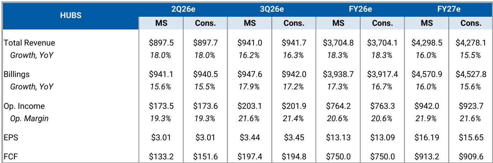
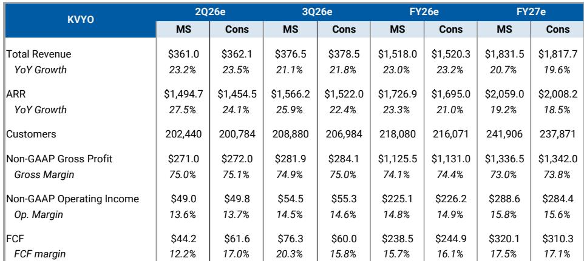
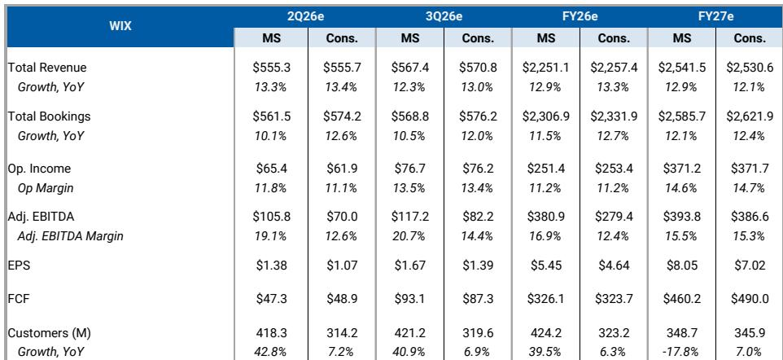

# MS：SaaS与软件行业技术应用观察

应用软件行业正在进入一个微妙的财报季。MS在最新发布的 2Q26 SaaS 预览报告中，基于渠道调研和CIO调查得出一个核心判断：需求基本面依然稳固，但AI货币化仍处于早期阶段，宏观不确定性持续，管理层大概率维持谨慎展望。这意味着，广泛的上调修正——即推动整个应用SaaS板块重估的必要条件——在Q2出现的可能性有限。

报告覆盖了十余家SaaS公司的季度前瞻，但贯穿全文的主线并非哪家公司会超预期，而是整个板块为何在基本面稳健的情况下，估值仍难以系统性回升。MS认为，当前SaaS应用组的EV/S倍数已低于五年均值，且相对更广泛的软件板块折价约45%，接近历史低位。但低估值本身并不构成观点偏积极理由，除非有明确的催化剂证明增长正在加速或利润率正在结构性改善。

## 1. AI货币化仍处于早期，尚未成为收入加速的驱动力

报告对多家公司的AI产品进展做了具体描述，但整体结论是：AI对收入的贡献仍以“增量”而非“拐点”的形式出现。以Figma为例，Q1是首个完整包含AI信用额度直接货币化的季度，超过75%的组织和企业用户在免费额度用完后继续消费信用额度。这一信号是积极的，但读者需要更多关于超额使用活动和信用消耗的可见性，才能将AI视为长期增长驱动力。Figma目前EV/S约为7倍，而中小型软件同业约为4倍，市场已为AI故事支付了溢价，因此需要持续的证据来支撑这一估值。

HubSpot的情况类似。渠道调研显示，AI采用率正在以温和速度提升——约20%-25%的合作伙伴客户群正在使用AI代理，信用额度对收入的贡献仍为低个位数。合作伙伴并未将AI视为推动业务出现阶梯式变化的因素。报告认为，HubSpot向免费试用和基于结果的AI定价转型是战略上正确的选择，但收入加速更可能在2H出现，而非Q2。

> **KC评论：** 读者容易将“AI采用率上升”直接等同于“收入加速”，但这份报告提醒了一个关键区别：AI产品的使用深度和货币化路径之间仍有距离。Figma的信用消耗数据是正面的，但需要多个季度的数据才能确认其可持续性。对于估值已包含AI溢价的标的，市场对“证据”的要求会更高。

## 2. 现金流和估值成为防御性选择的核心筛选标准

在缺乏广泛上修催化剂的环境下，MS倾向于选择具有“避险”特征的标的。报告明确提出了两个筛选维度：自由现金流支撑和估值倍数不苛刻。GoDaddy和Klaviyo是这一框架下的代表。

GoDaddy的Airo AI构建器在beta阶段数周内就实现了超过1000万美元的年化预订量，但管理层在AI原生产品达到关键客户指标之前，仍暂停了定价调整。报告认为，盈利能力是GoDaddy当前最清晰的故事——尽管有增量AI研究，公司仍受益于AI驱动的客服和开发效率提升。Q2预订量预计将强劲恢复，同比增长约6%，收入增长约7%。以约8倍FCF和约0.9倍增长调整后的估值来看，报告认为报价合理，但缺乏明确的催化剂来推动增长加速。

Klaviyo的情况不同。其业务和定价模式更贴合使用量而非席位，当前FY26展望几乎未计入新产品的贡献（未假设代理收入，服务套件收入假设极小）。这意味着，一旦平台扩展成功，存在显著的上行期权。报告认为，市场对Klaviyo的预期已有所降低，这为超预期提供了空间。预计Q2收入同比增长约27%，高于市场预期的约23%，但这一增长更多体现的是增长率的稳定（Q1为28%），而非显著加速。

## 3. 结构性分化：核心业务健康度与AI叙事之间的张力

报告对Wix的讨论揭示了当前SaaS板块中一个更结构性的问题。MS近期将Wix下调至中性，原因是其此前看好的逻辑——可持续增长与费用纪律改善带来利润率扩张和自由现金流复合增长——已变得难以验证。Wix已吸收了可观的算力成本并加速了销售与营销支出以推广Base44品牌，但研究强度预计仍将维持高位。更重要的是，近期下调的FY26预订量和收入指引，部分源于合作伙伴业务的进一步变化，这引发了关于核心业务健康度的结构性讨论——AI正在快速改变行业格局，而Wix的核心业务可能正在承受不确定性。

报告预计Wix Q2收入增长将环比节奏变化至约13%，预订量增长约10%，低于市场预期的约12.6%。尽管估值已跌至约3倍FCF的低位，但报告认为，需要多个季度的持续执行改善才能重建市场对Wix AI定位的信心。

> **KC评论：** Wix的案例提供了一个值得关注的观察框架：当一家公司同时面临核心业务节奏变化和新业务研究加大的双重不确定性时，低估值本身并不构成安全边际。关键在于，新业务（如Base44）的增长能否在核心业务进一步出现变化之前形成足够的对冲。报告对此的表述是“可见性有限”，这本身就是一种谨慎信号。

## 4. 财报季的观察框架：关注2H而非Q2

报告多次提到一个时间维度：Q2财报本身可能不是最重要的催化剂，2H才是。对于HubSpot，报告认为2H的财报窗口更可能带来实质性的修正和潜在加速，因为AI采用率的复合效应需要时间体现。对于Amplitude，Statsig整合带来的更持久收入加速也需要到2H才能更清晰地显现。对于monday.com，Q1的强劲表现（收入同比增长24%，为10个季度以来较强）已提高了市场预期，Q2需要展示可持续增长和可信的利润率路径，才能支持重估。

这意味着，读者在Q2财报季应更多关注管理层的2H展望和FY26指引的调整方向，而非单季度的超预期幅度。报告认为，当前SaaS板块的估值已反映了大量谨慎预期，但广泛的重估需要看到增长加速的证据，而这一证据更可能在2H出现。

For informational purposes only. Portions may be generated,translated,summarized,or edited with AI assistance based on source materials and may contain omissions or errors. Please verify independently. This is not investment,legal,tax,accounting,or other professional advice.

For informational purposes only. Portions may be generated,translated,summarized,or edited with AI assistance based on source materials and may contain omissions or errors. Please verify independently. This is not investment,legal,tax,accounting,or other professional advice.

