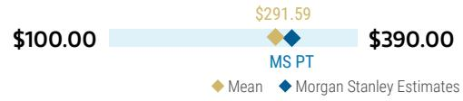
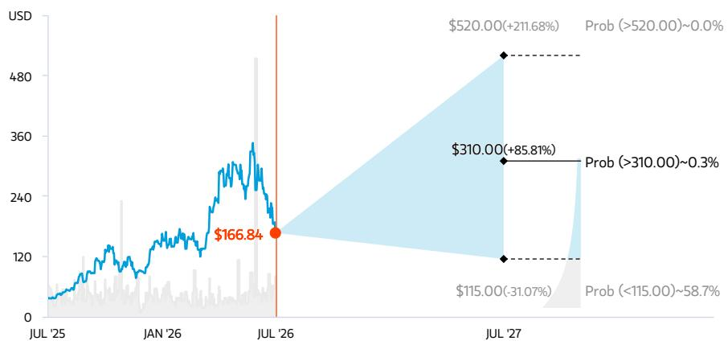
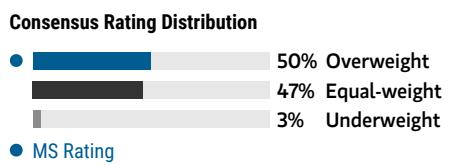

July 29, 2026 04:01 AM GMT

Bloom Energy Corp. | North America

# 业绩强劲缓解市场疑虑：财报超预期及意外上调全年指引

## AlphaSignals 财报解读

强化我们的研究观点
对研究观点的影响

↑ 显著正面
财务数据 vs 市场一致预期 ↑ 显著上调
未来12个月市场一致预期方向

来源：公司数据，MS

Bloom已连续两个季度上调2026全年指引，并就需求、定价、客户/项目多元化与保障措施以及钪供应等方面提供了积极更新。这增强了我们对公司增长前景及执行能力的信心。

我们对关键市场讨论的看法：对钪供应的持续信心——我们未听到新信息，但认为鉴于管理层对供应链不会成为增长限制因素的自信表态，这一担忧将逐渐减弱。关于项目延迟风险（例如新墨西哥州的Jupiter项目），指引上调应能降低对近期财务影响的担忧，公司也提供了多重保障（其他可部署燃料电池的项目组合、客户/融资方的合同义务、客户积压订单的多元化）。关于产能扩张，未如预期给出明确指引，但继续强调制造能力不会成为履行积压订单和实现增长目标的制约因素。我们认为整体上，这些信息将作为对上述问题的增量 reassurance 而被市场积极接纳。

**强劲的第二季度业绩超预期，意外上调2026年指引。** Bloom在第二季度首次实现单季营收超过10亿美元，并实现了高于预期的盈利能力（图表1），这得益于更高出货量带来的运营杠杆效应。全年来看，Bloom将全年营收目标中值上调约4.5亿美元（据我们估算，对应约100兆瓦的出货量），重申了利润率指引（图表2），并因此将利润指引上调1.75亿美元（增幅26%）。这是公司今年第二次实现业绩超预期并上调指引。

**回应多项市场关切。** 管理层重申未发现任何钪供应问题，并指出此前已披露公司现有供应链可支持25吉瓦的年产量。我们在此未听到新的披露信息，但对供应可得性的持续信心以及强调公司整体供应链并非增长制约因素。公司还指出，没有任何单一项目（如Jupiter项目）对其上调后的2026年指引构成风险。此外，在Jupiter项目可能延迟至2027年的情景下，我们认为ORCL可将其数据中心组合中的其他站点部署燃料电池，以履行接受任何规定数量的合同义务（Bloom与Oracle的关系已涵盖多个项目站点），从而使BE能够较好地抵御单个项目延迟的影响。更广泛地说，BE的融资合作伙伴有义务在订单签署后的一定期限内购买燃料电池，因此即使项目的其他组件出现延迟，BE仍可进行发货。

## 电话会议其他值得关注的要点：

- 积压订单增速快于营收，这意味着截至第二季度末，Bloom当前的设备积压订单至少约为80亿美元（我们认为很可能远高于此水平）。
- Bloom燃料电池现已获得所有主要超大规模云服务商以及超过十几家新型云服务商、AI实验室和托管数据中心运营商的验证。
- 价格趋势的潜在积极信号：管理层指出，鉴于其为数据中心项目提供的价值，预计客户会愿意接受Bloom“获取价值”。
- 随着Bloom扩大产能，公司正预留部分产能用于服务需要短期交付燃料电池的“下单即发货”客户，这凸显了其快速供电的优势。

我们已更新模型，并维持增持评级；目标价310美元（不变）。我们已调整模型以反映BE修订后指引的上限，纳入了下半年约100兆瓦的增量出货量。我们的模型略偏向第四季度，与管理层评论一致，并预计今年剩余时间将实现正向经营现金流和自由现金流。我们基本维持部署预测不变，从2027年的1.8吉瓦逐步提升至2028年的4.8吉瓦。我们等待大型数据中心客户的增量公告以及可能承诺通过新设施将制造能力扩展至5吉瓦以上的潜在催化剂，届时可能进一步上调预测。

图表1：BE 2026年第二季度业绩对比

|  | 2Q26 | 市场一致预期 | MSe | vs. 市场一致预期 | vs. MSe |
| :--- | :--- | :--- | :--- | :--- | :--- |
| **利润表（百万美元）** | | | | | |
| 营收 | $1,065 | $826 | $849 | 29% | 25% |
| 调整后毛利率 | 34.3% | 30.8% | 32.6% | +350 bps | +171 bps |
| 调整后营业利润 | $240 | $138 | $148 | 73% | 62% |
| 经营现金流 | $226 | ($42) | $102 | 637% | 121% |

来源：公司数据，Factset，MS估计

图表2：BE 2026年指引

|  | 低端 | 2026高端 | 中值 | 市场一致预期 | MSe | vs. 市场一致预期 | vs. MSe |
| :--- | :--- | :--- | :--- | :--- | :--- | :--- | :--- |
| **利润表（百万美元）** | | | | | | |
| 营收 | $3,900 | $4,200 | $4,050 | $3,729 | $3,746 | 9% | 8% |
| 调整后毛利率 | | | 34.0% | 32.0% | 34.1% | +198 bps | -12 bps |
| 调整后营业利润 | $800 | $900 | $850 | $715 | $699 | 19% | 22% |

来源：公司数据，Factset，MS估计

## 风险与回报 – Bloom Energy Corp. (BE.N)

快速供电限制推动采用；AI赋能者

## 目标价 $310.00

基于无杠杆自由现金流折现分析，折现率10.8%，基于4.0%无风险利率，1.75 Beta和4.29%股权风险溢价。

市场一致预期目标价分布

来源：Refinitiv，MS

## 风险回报图与期权隐含概率（12个月）

  
关键：— 历史股价表现 ● 当前股价 ◆ 目标价

来源：Refinitiv，MS，MS机构股票部门。我们的牛市、基准和熊市情景概率是根据截至2026年7月28日期权市场的隐含波动率数据估算的。所有数字均为股票在三个月或一年时间内达到情景价格以上的近似风险中性概率。在此查看期权概率方法说明

## 增持研究观点

我们认为BE是多个关键主题的主要受益者，包括：(i) 大负荷客户的快速供电需求，(ii) 分布式能源（即工商业客户的燃料电池）日益增长的“经济楔子”或价值主张，(iii) 电网稳定性挑战加剧，以及 (iv) 持续至2030年代的30%燃料电池税收抵免。短期内，我们看好其核心燃料电池业务的强劲增长前景，尤其是AI电力需求；长期来看，OBBB及其氢电解槽业务将提供额外推动力，支撑多年强劲的增长和利润率改善前景。

  
来源：Refinitiv，MS

## 风险回报主题

| 颠覆性： | 正面 |
| :--- | :--- |
| 长期增长： | 正面 |
| 可再生能源： | 正面 |

在此查看风险回报主题说明

## 牛市情景

## $520.00

## SOFC用于表后发电获得更广泛采用

考虑到较低的市场渗透率和全球电力市场日益增长的快速供电限制，预计至2030年营收复合年增长率为59%，2030-2050年营收年增长率为11%。在持续成本削减和稳健定价的推动下，毛利率至2030年扩大至45%。营业利润率至2030年达到38%（与基准情景相同）。

## 基准情景

## $310.00 熊市情景

## 快速供电限制加速采用

公用事业费用持续上涨和快速供电限制推动2025-2030年营收复合年增长率为53%，2030-2050年营收年增长率为11%。成本降低和运营费用杠杆推动营业利润率从2025年的10%扩大至2030年的35%。

## $115.00

## 增长和利润率低于预期

竞争以及未能实现成本下降目标限制了营收增长（至2030年复合年增长率为40%，基准情景为53%）和利润率扩张（至2030年EBIT利润率为33%，基准情景为35%）。

## 风险与回报 – Bloom Energy Corp. (BE.N)

## 关键盈利输入指标

| 驱动因素 | 2025年12月 | 2026年12月e | 2027年12月e | 2028年12月e |
| :--- | :--- | :--- | :--- | :--- |
| 出货量增长 (%) | 49.2 | 140.2 | 60.0 | 68.0 |
| 产品及安装总均价（美元/千瓦） | 3,221 | 3,197 | 3,085 | 3,008 |
| 总安装系统成本（美元/千瓦） | 2,043 | 1,910 | 1,815 | 1,724 |

## 研究驱动因素

- 现有客户渗透率提升和/或建立新的客户关系。
- 降低产品和安装成本的能力（改善产品经济性）。
- 对提供全天候电力的微电网解决方案需求增加。

## 全球营收分布

10-20% 亚太地区（不含日本、中国大陆和印度）

70-80% 北美

来源：MS估计

在此查看区域层级说明

## MS ALPHA 模型

| 5/5 最佳 | 24个月展望 | 2/5 最差 | 3个月展望 |
| :--- | :--- | :--- | :--- |

来源：Refinitiv，FactSet，MS；1为最受青睐的五分位，5为最不受青睐的五分位

## 目标价/评级风险

## 上行风险

- 鉴于当前较低的市场渗透率，至2035年实现更高营收增长
- 成本削减举措超预期
- 鉴于加州断电情况，客户采用率提升

## 下行风险

- 监管机构对使用分布式发电的工商业客户征收费用
- 更严格的排放法规
- 出现具有成本竞争力产品的新进入者/新技术
- 成本削减未能实现

## 持仓情况

| 机构读者，主动型占比 | 58.6% |  |  |
| :--- | :--- | :--- | :--- |
| 对冲基金行业多空比 | 1.4x |  |  |
| 对冲基金行业净敞口 | 8.8% |  |  |

Refinitiv；MSPB内容。包含部分在MSPB持有的对冲基金敞口。信息可能与更广泛的市场趋势不一致或未能反映。多空比 = 多头敞口 / 空头敞口。行业占净总敞口百分比 = （对于特定行业：多头敞口 - 空头敞口）/（所有行业：多头敞口 - 空头敞口）。

MS估计 vs. 市场一致预期

|  | 2027年12月e |
| :--- | :--- |
| 每股收益（美元） | 5.04 / 4.39 / 7.00 |
| 净利润（百万美元） | 726 / 1,411 / 1,706 / 2,290 |
| EBITDA（百万美元） | 1,099 / 1,637 / 1,738 / 2,334 |

◆ 均值 ◆ MS估计
来源：Refinitiv，MS

## 风险回报参考链接

1. 查看期权概率方法说明 - Options\_Probabilities\_Exhibit\_Link.pdf
2. 查看风险回报主题说明 - RR\_Themes\_Exhibit\_Link.pdf
3. 查看区域层级说明 - GEG\_Exhibit\_Link.pdf
4. 查看主题/敞口方法说明 - ESG\_Sustainable\_Solutions\_External\_Link.pdf
5. 查看HERS方法说明 - ESG\_HERS\_External\_Link.pdf

## 披露章节

MS中的信息和意见由MS & Co. LLC、MS C.T.V.M. S.A.、MS Mexico, Casa de Bolsa, S.A. de C.V.和/或MS Canada Limited编制。在本披露章节中，“MS”包括MS & Co. LLC、MS C.T.V.M. S.A.、MS Mexico, Casa de Bolsa, S.A. de C.V.、MS Canada Limited及其必要时的关联公司。

有关本报告涉及公司的重要披露、股价图表和股票评级历史，请访问MS披露网站 www.morganstanley.com/eqr/disclosures/webapp/generalresearch，或联系您的投资代表或MS，地址：1585 Broadway, (Attention: Research Management), New York, NY, 10036 USA。

有关本研究报告提及的任何推荐、评级或目标价的估值方法和风险，请联系客户支持团队：美国/加拿大 +1 800 303-2495；香港 +852 2848-5999；拉丁美洲 +1 718 754-5444（美国）；伦敦 +44 (0)20-7425-8169；新加坡 +65 6834-6860；悉尼 +61 (0)2-9770-1505；东京 +81 (0)3-6836-9000。或者，您也可以联系您的投资代表或MS，地址：1585 Broadway, (Attention: Research Management), New York, NY 10036 USA。

## 分析师认证

以下分析师特此证明，他们对本报告中讨论的公司及其证券的看法准确表达，并且他们未曾也不会因表达具体的推荐或看法而直接或间接获得补偿：David Arcaro, CFA。

## 全球研究冲突管理政策

MS已根据我们的冲突管理政策发布，该政策可在 www.morganstanley.com/institutional/research/conflictpolicies 获取。该政策的葡萄牙语版本可在 www.morganstanley.com.br 找到。

## 关于标的公司的重要监管披露

截至2026年6月30日，MS实益拥有MS所涵盖的以下公司一类普通股证券的1%或以上：Array Technologies Inc, Bloom Energy Corp., Enphase Energy Inc, EVgo Inc, First Solar Inc, Fluence Energy Inc, GE Vernova, Shoals Technologies Group, Solaredge Technologies Inc, Sunrun Inc。

在过去12个月内，MS管理或联合管理了Bloom Energy Corp., Fluence Energy Inc, GE Vernova, Innio N.V., Sunrun Inc, X-Energy Inc.的公开（或144A）证券发行。

在过去12个月内，MS已从Array Technologies Inc, Bloom Energy Corp., EVgo Inc, GE Vernova, Innio N.V., Sunrun Inc, X-Energy Inc.获得投资银行服务报酬。

在未来3个月内，MS预计将从或打算寻求从Array Technologies Inc, Bloom Energy Corp., EVgo Inc, First Solar Inc, Fluence Energy Inc, GE Vernova, Innio N.V., Plug Power Inc., Solaredge Technologies Inc, Sunrun Inc, X-Energy Inc.获得投资银行服务报酬。

在过去12个月内，MS已从Array Technologies Inc, Bloom Energy Corp., First Solar Inc, Fluence Energy Inc, GE Vernova, Innio N.V., Shoals Technologies Group, Sunrun Inc.获得投资银行服务以外的产品和服务报酬。

在过去12个月内，MS已向或正在向以下公司提供投资银行服务，或与以下公司存在投资银行客户关系：Array Technologies Inc, Bloom Energy Corp., EVgo Inc, First Solar Inc, Fluence Energy Inc, GE Vernova, Innio N.V., Plug Power Inc., Solaredge Technologies Inc, Sunrun Inc, X-Energy Inc.。

在过去12个月内，MS已向或正在向以下公司提供非投资银行、证券相关服务，和/或过去已签订协议提供服务或与以下公司存在客户关系：Array Technologies Inc, Bloom Energy Corp., First Solar Inc, Fluence Energy Inc, GE Vernova, Innio N.V., Plug Power Inc., Shoals Technologies Group, Sunrun Inc.

MS & Co. LLC 是 Array Technologies Inc, Shoals Technologies Group 证券的做市商。

主要负责编制MS的股票研究分析师或策略师的薪酬基于多种因素，包括研究质量、读者客户反馈、选股能力、竞争因素、公司收入和整体投资银行收入。股票研究分析师或策略师的薪酬不与MS进行的投资银行或资本市场交易或特定交易台的盈利能力或收入挂钩。

MS及其关联公司与MS所涵盖的公司/工具有业务往来，包括做市、提供流动性、基金管理、商业银行、信贷扩展、投资服务和投资银行。MS以主承销商身份向客户买卖MS所涵盖公司的证券/工具。MS可能持有本报告讨论的公司债务或工具的仓位。MS作为主承销商交易或可能交易作为债务研究报告主题的债务证券（或相关衍生品）。

上述某些披露也是为了遵守非美国司法管辖区的适用法规。

## 股票评级

MS使用相对评级体系，包括增持、等权重、未评级或减持（见下方定义）。MS不对我们覆盖的股票分配买入、持有或报告评级。增持、等权重、未评级和减持不等同于买入、持有和卖出。读者应仔细阅读MS中使用的所有评级的定义。此外，由于MS包含分析师观点的更完整信息，读者应仔细阅读MS全文，而不仅仅从评级推断内容。在任何情况下，评级（或研究）不应被用作或依赖为研究交流。读者买卖股票的决定应取决于个人情况（如读者现有持仓）和其他考虑因素。

## 全球股票评级分布

## （截至2026年6月30日）

下述股票评级适用于MS的基础股票研究，不适用于公司生产的债务研究。

仅为披露目的（根据FINRA要求），我们在增持、等权重、未评级和减持评级旁边包含买入、持有和卖出的类别标题。MS不对我们覆盖的股票分配买入、持有或报告评级。增持、等权重、未评级和减持不等同于买入、持有和卖出，而是代表建议的相对权重（见下方定义）。为满足监管要求，我们将增持（我们最正面的股票评级）对应买入推荐；我们将等权重和未评级对应持有，将减持对应卖出推荐。

| 股票评级类别 | 覆盖范围 |  | 投资银行客户 (IBC) |  | 其他重大投资服务客户 (MISC) |  |
| :--- | :--- | :--- | :--- | :--- | :--- | :--- |
|  | 数量 | 占总计% | 数量 | 占IBC总计% | 占评级类别% | 数量 | 占其他MISC总计% |
| 增持/买入 | 1544 | 42% | 453 | 49% | 29% | 757 | 44% |
| 等权重/持有 | 1577 | 43% | 390 | 42% | 25% | 769 | 44% |
| 未评级/持有 | 3 | 0% | 1 | 0% | 33% | 1 | 0% |
| 减持/卖出 | 544 | 15% | 89 | 10% | 16% | 204 | 12% |
| 总计 | 3,668 |  | 933 |  |  | 1731 |  |

数据包括当前已分配评级的普通股和ADR。投资银行客户是MS在过去12个月内收到投资银行报酬的公司。由于四舍五入，“占总计%”列中的百分比可能无法精确加总至100%。

## 分析师股票评级

增持 (O)。预计该股票的总回报在风险调整基础上，在未来12-18个月内将超过分析师行业（或行业团队）覆盖范围的平均总回报。

等权重 (E)。预计该股票的总回报在风险调整基础上，在未来12-18个月内将与分析师行业（或行业团队）覆盖范围的平均总回报保持一致。

未评级 (NR)。目前分析师对该股票的总回报相对于分析师行业（或行业团队）覆盖范围的平均总回报，在风险调整基础上没有足够的信心。

减持 (U)。预计该股票的总回报在风险调整基础上，在未来12-18个月内将低于分析师行业（或行业团队）覆盖范围的平均总回报。

除非另有说明，MS中包含的目标价时间范围为12至18个月。

## 分析师行业观点

有吸引力 (A)：分析师预计其行业覆盖范围在未来12-18个月内的表现相对于相关广泛市场基准具有吸引力，如下所示。

中性 (I)：分析师预计其行业覆盖范围在未来12-18个月内的表现将与相关广泛市场基准保持一致，如下所示。谨慎 (C)：分析师对其行业覆盖范围在未来12-18个月内的表现相对于相关广泛市场基准持谨慎态度，如下所示。各区域基准如下：北美 - 标普500；拉丁美洲 - 相关MSCI国家指数或MSCI拉丁美洲指数；欧洲 - MSCI欧洲；日本 - TOPIX；亚洲 - 相关MSCI国家指数或MSCI次区域指数或MSCI AC亚太（除日本）指数。

## 股价、目标价和评级历史（见评级定义）

行业：清洁技术

股票和行业评级（缩写如下）显示为 ♦ 股票评级/行业观点

Bloom Energy Corp. (BE.N) - 截至 2026年7月29日 GMT 以美元计  
  
股票评级历史：2021年7月1日：E/I；2022年1月13日：E/A；2023年1月9日：O/A；2023年4月3日：O/I；2023年10月17日：O/A；2024年11月15日：O/I

目标价历史：2021年4月20日：27；2021年7月20日：26；2021年8月19日：25；2021年10月26日：32；2022年1月13日：26；2022年4月4日：25；2022年6月13日：21；2022年8月18日：37；2023年1月9日：35；2023年4月3日：32；2023年5月16日：30；2023年8月31日：29；2023年10月17日：23；2023年12月6日：22；2024年10月15日：20；2024年11月18日：28；2025年3月20日：35；2025年5月1日：30；2025年7月21日：35；2025年8月1日：44；2025年9月16日：85；2025年10月29日：155；2026年2月6日：184；2026年4月29日：310

来源：MS 日期格式：MM/DD/YY 目标价 = 未分配目标价 (NA)

股票评级：增持 (O) 等权重 (E) 减持 (U) 未评级 (NR) 无可用评级 (NA)

行业观点：有吸引力 (A) 中性 (I) 谨慎 (C) 无评级 (NR)

自2014年1月13日起，MS亚太地区覆盖的股票将相对于分析师行业（或行业团队）覆盖范围进行评级。

自2014年1月13日起，MS亚太地区的行业观点基准如下：相关MSCI国家指数或MSCI次区域指数或MSCI AC亚太（除日本）指数。

## 对MS Smith Barney LLC客户的重要披露

关于可能合理预期会影响MS Smith Barney LLC选择第三方研究提供商或第三方研究报告标的公司的任何重大利益冲突的重要披露，可在MS财富管理披露网站 www.morganstanley.com/online/researchdisclosures 获取。有关MS的具体披露，您可以参考 https://www.morganstanley.com/eqr/disclosures/webapp/generalresearch。

每份MS报告均代表MS Smith Barney LLC进行审查和批准。此审查和批准由审查代表MS的研究报告的同一人进行。这可能会产生利益冲突。

## 其他重要披露

在研究完成之前已经或可能接触到该研究的一名研究团队成员持有Bloom Energy Corp.的证券（或相关衍生品）。此人不是研究分析师或研究分析师家庭成员。

MS政策是根据研究分析师和研究管理层认为适当的时机更新研究报告，基于发行人、行业或市场的发展，这些发展可能对研究报告中所述的观点或意见产生重大影响。此外，某些研究出版物旨在定期更新（每周/每月/每季度/每年），并且通常会按此频率更新，除非研究分析师和研究管理层根据当前情况确定不同的发布计划更合适。

MS不担任市政顾问，本文所含观点或意见无意也不构成《多德-弗兰克华尔街改革和消费者保护法》第975条含义内的建议。

MS制作一种称为“战术观点”的股票研究产品。关于特定股票的“战术观点”中包含的观点可能与同一股票研究中表达的建议或观点相反。这可能是由于不同的时间范围、方法、市场事件或其他因素造成的。如需获取特定股票的所有研究，请联系您的销售代表或访问Matrix网站 http://www.morganstanley.com/matrix。

MS通过我们专有的研究门户Matrix向客户提供，并由MS以电子方式分发给客户。某些（但非全部）MS产品也通过第三方供应商提供给客户，或通过替代电子方式重新分发给客户，以方便起见。如需访问所有可用的MS，请联系您的销售代表或访问Matrix网站 http://www.morganstanley.com/matrix。

任何对MS的访问和/或使用均受MS使用条款 (http://www.morganstanley.com/terms.html) 的约束。通过访问和/或使用MS，您表示您已阅读并同意受我们的使用条款 (http://www.morganstanley.com/terms.html) 的约束。此外，您同意MS根据我们的隐私政策和全球Cookie政策 (http://www.morganstanley.com/privacy\_pledge.html) 处理您的个人数据并使用Cookie，包括用于设置您的偏好和收集读者数据，以便我们为您提供更好、更个性化的服务和产品。要了解有关MS如何处理个人数据、我们如何使用Cookie以及如何拒绝Cookie的更多信息，请参阅我们的隐私政策和全球Cookie政策 (http://www.morganstanley.com/privacy\_pledge.html)。请使用提供的链接查看MS印度公司私人有限公司的条款和条件以及最重要的条款和条件 (https://www.morganstanley.com/assets/pdfs/about-us-global-offices/india/Terms\_and\_conditions.pdf)，以及以下链接查看审计报告 (https://ny.matrix.ms.com/eqr/research/webapp/researchdocs/MSICPL\_Morgan\_Stanley\_Research\_Audit\_Report.pdf)。

如果您不同意我们的使用条款和/或您不希望同意MS处理您的个人数据或使用Cookie，请不要访问我们的研究。MS不提供个性化的研究交流。MS的编制未考虑接收者的个人情况和目标。MS建议读者独立评估特定的投资和策略，并鼓励读者寻求财务顾问的建议。投资或策略的适当性将取决于读者的个人情况和目标。MS中讨论的证券、工具或策略可能不适合所有读者，某些读者可能没有资格购买或参与其中部分或全部。MS不是买入或卖出要约，也不是参与任何特定交易策略的要约邀请。您的研究价值和收入可能因利率、汇率、违约率、提前还款率、证券/工具价格、市场指数、公司的运营或财务状况或其他因素的变化而变动。期权或其他证券/工具交易的权利可能存在时间限制。过往表现不一定是未来表现的指引。对未来表现的估计基于可能无法实现的假设。如果提供，除非另有说明，封面上的收盘价是标的公司证券/工具主要交易所的价格。

主要负责编制MS的固定收益研究分析师、策略师或经济学家的薪酬基于多种因素，包括研究质量、准确性和价值、公司盈利能力或收入（包括固定收益交易和资本市场盈利能力或收入）、客户反馈和竞争因素。固定收益研究分析师、策略师或经济学家的薪酬不与MS进行的投资银行或资本市场交易或特定交易台的盈利能力或收入挂钩。

MS中的“关于标的公司的重要监管披露”部分列出了MS持有公司一类普通股证券1%或以上的所有提及公司。对于MS中提及的所有其他公司，MS可能持有少于1%的证券/工具或公司证券/工具衍生品，并且可能以与MS中讨论的方式不同的方式进行交易。未参与MS编制的MS员工可能持有提及公司的证券/工具或衍生品，并且可能以与MS中讨论的方式不同的方式进行交易。衍生品可能由MS或关联人士发行。

除有关MS的信息外，MS基于公开信息。MS尽一切努力使用可靠、全面的信息，但我们不保证其准确或完整。我们没有义务在MS中的意见或信息发生变化时通知您，除非我们打算停止对标的公司的股票研究覆盖。MS中提出的事实和观点未经MS其他业务领域（包括投资银行人员）的专业人士审查，可能不反映他们已知的信息。

MS人员可能参与公司活动，如实地考察，并且通常被禁止接受公司支付相关费用，除非获得研究管理层授权成员的预先批准。

MS可能做出与本报告中的建议或观点不一致的投资决策。

**致我们在台湾的读者或在台湾交易证券/工具的读者：** 在台湾交易的证券/工具信息由MS台湾有限公司（“MSTL”）分发。此类信息仅供您参考。读者应独立评估投资风险，并对其投资决策全权负责。未经MS明确书面同意，MS不得向公共媒体分发，或被公共媒体引用或使用。在台湾证券交易所推荐准则第7-1条范围内的任何非客户读者访问和/或接收MS，不得将MS提供给任何第三方（包括但不限于关联方、关联公司和任何其他第三方）或从事任何可能产生或看似产生利益冲突的与MS相关的活动。不在台湾交易的证券/工具信息仅供参考，不得解释为交易此类证券/工具的建议或要约邀请。MSTL不得为客户执行这些证券/工具的交易。

MS非根据中国法律成立，本报告相关研究在中国境外进行。MS不构成在中国出售任何证券的要约或要约邀请。中国读者应具有投资此类证券的相关资格，并应自行负责从相关政府机构获得所有必要的批准、许可、验证和/或注册。本报告或其任何部分均无意也不构成中国法律定义的证券投资咨询或顾问服务。此类信息仅供您参考。

MS在巴西由MS C.T.V.M. S.A.分发，地址为Av. Brigadeiro Faria Lima, 3600, 6th floor, São Paulo - SP, Brazil；受Comissão de Valores Mobiliários监管；在墨西哥由MS México, Casa de Bolsa, S.A. de C.V分发，受Comision Nacional Bancaria y de Valores监管，地址为Paseo de los Tamarindos 90, Torre 1, Col. Bosques de las Lomas Floor 29, 05120 Mexico City；在日本由MS MUFG Securities Co., Ltd.分发，对于商品相关研究报告，由MS Capital Group Japan Co., Ltd分发；在香港由MS Asia Limited（对其内容负责）和MS Bank Asia Limited分发；在新加坡由MS Asia (Singapore) Pte. (注册号 199206298Z) 和/或 MS Asia (Singapore) Securities Pte Ltd (注册号 200008434H) 分发，受新加坡金融管理局监管（对其内容承担法律责任，如有任何因MS引起或与之相关的事宜，应与其联系），以及由MS Bank Asia Limited, Singapore Branch (注册号 T14FC0118) 分发；在澳大利亚向《澳大利亚公司法》定义的“批发客户”由MS Australia Limited A.B.N. 67 003 734 576分发，持有澳大利亚金融服务许可证号233742，对其内容负责；在澳大利亚向《澳大利亚公司法》定义的“批发客户”和“零售客户”由MS Wealth Management Australia Pty Ltd (A.B.N. 19 009 145 555, 持有澳大利亚金融服务许可证号240813) 分发，对其内容负责；在韩国由MS & Co International plc, Seoul Branch分发；在印度由MS India Company Private Limited分发，公司识别号 (CIN) U22990MH1998PTC115305，受印度证券交易委员会（“SEBI”）监管，持有研究分析师（SEBI注册号 INH000001105）、股票经纪人（SEBI股票经纪人注册号 INZ000244438）、商人银行家（SEBI注册号 INM000011203）和与国家证券存管有限公司的存管参与者（SEBI注册号 IN-DP-NSDL-567-2021）的许可证，注册办公室位于Altimus, Level 39 & 40, Pandurang Budhkar Marg, Worli, Mumbai 400018, India；电话 +91-22-61181000；合规官详情：Mr. Tejarshi Hardas, 电话：+91-22-61181000 或 电子邮件：tejarshi.hardas@morganstanley.com；投诉官详情：Mr. Tejarshi Hardas, 电话：+91-22-61181000 或 电子邮件：msic-compliance@morganstanley.com。MS India Company Private Limited (MSICPL) 可能在使用AI工具提供研究服务。本文所含的所有推荐均由合格的研究分析师做出；在加拿大由MS Canada Limited分发；在德国和欧洲经济区（如需要）由MS Europe S.E.分发，受德国联邦金融监管局 (BaFin) 授权和监管，参考号149169；在美国由MS & Co. LLC分发，对其内容负责。MS & Co. International plc，由审慎监管局授权并由金融行为监管局和审慎监管局监管，在英国分发其已编制的研究以及其任何关联公司已编制的研究，仅面向 (i) 属于《2000年金融服务和市场法（金融促进）令2005》（经修订，“该令”）第19(5)条的投资专业人士，(ii) 属于该令第49(2)(a)至(d)条的高净值实体，或 (iii) 可以合法地以其他方式传达或导致传达从事投资活动（经修订的《2000年金融服务和市场法》第21条含义内）的邀请或诱导的人士。RMB MS Proprietary Limited 是 JSE Limited 和 A2X (Pty) Ltd 的成员。RMB MS Proprietary Limited 是由 MS International Holdings Inc. 和 RMB Investment Advisory (Proprietary) Limited（由 FirstRand Limited 全资拥有）平等拥有的合资企业。MS中的信息由MS Saudi Arabia分发，受沙特阿拉伯王国资本市场管理局监管，仅面向专业读者。

MS中的信息由MS & Co. International plc (DIFC Branch) 传达，受迪拜金融服务管理局 (DFSA) 监管，或由MS & Co. International plc (ADGM Branch) 传达，受阿布扎比金融服务监管局 (FSRA) 监管，仅面向DFSA或FSRA定义的合格客户。本研究所涉及的金融产品或金融服务将仅提供给我们确信符合合格客户监管标准的客户。MS不同研究评级或推荐的分布，按所覆盖每个行业的投资百分比计算，可向您的销售代表索取。

MS中的信息由MS & Co. International plc (QFC Branch) 传达，受卡塔尔金融中心监管局 (QFCRA) 监管，仅面向商业客户和市场交易对手，不适用于QFCRA定义的零售客户。

根据土耳其资本市场委员会的要求，此处提供的投资信息、评论和建议不属于投资咨询服务的范围。投资咨询服务仅由授权公司根据个人的风险和收益偏好提供。此处的评论和建议具有一般性质。这些意见可能不适合您的财务状况、风险和收益偏好。因此，仅依赖此处提供的信息做出投资决策可能不会产生符合您期望的结果。

MS中包含的商标和服务标志是其各自所有者的财产。第三方数据提供商不对其提供的数据的准确性、完整性或及时性做出任何保证或陈述，并且不对与此类数据相关的任何损害承担责任。全球行业分类标准 (GICS) 由MSCI和S&P开发，是其专有财产。

MS或其任何部分未经MS书面同意不得重印、出售或再分发。

MS中引用的指标和跟踪器不得用作或被视为欧盟条例2016/1011或任何其他类似框架下的基准。

某些固定收益研究报告中推荐或讨论的发行人和/或固定收益产品可能不会被持续跟踪。因此，读者应将此类固定收益研究报告视为提供独立分析，不应期望就此类发行人和/或个别固定收益产品获得持续分析或额外报告。MS可能不时持有研究报告主题公司的重要财务和商业利益。

SEBI授予的注册和印度证券市场监管机构 (NISM) 的认证绝不保证中介机构的业绩或向读者提供任何回报保证。证券市场投资存在市场风险。投资前请仔细阅读所有相关文件。

## 行业覆盖：清洁技术

| 公司（代码） | 评级（自） | 价格* (2026年7月28日) |
| :--- | :--- | :--- |
| **David Arcaro, CFA** | | |
| Array Technologies Inc (ARRY.O) | E (2023年10月17日) | $5.10 |
| Bloom Energy Corp. (BE.N) | O (2023年1月9日) | $166.84 |
| Enphase Energy Inc (ENPH.O) | U (2025年4月23日) | $36.32 |
| EVgo Inc (EV
