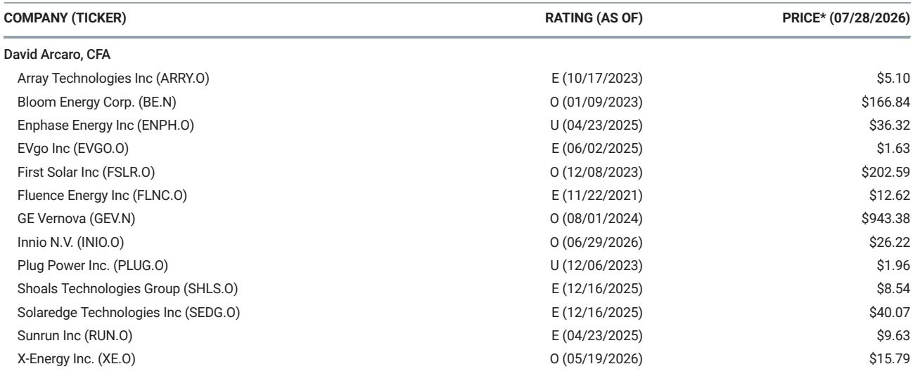
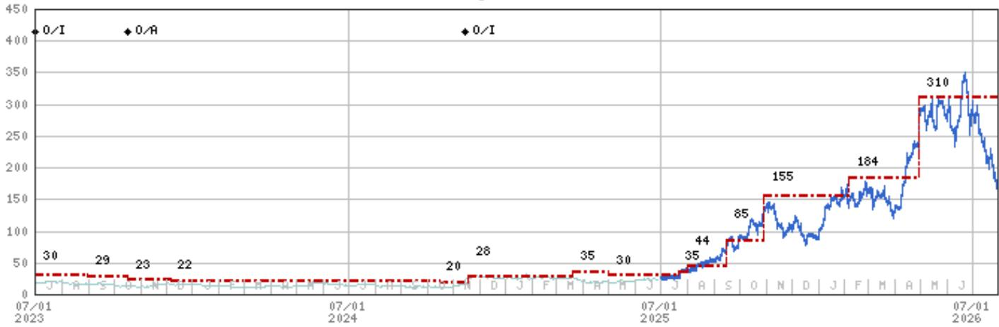
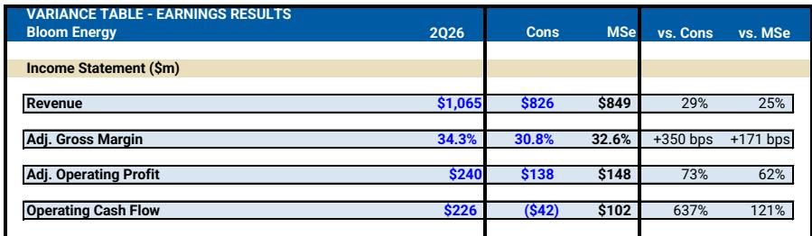

# MS：Bloom能源Corp.

Bloom Energy在2026年第二季度交出了一份超出市场预期的成绩单。公司首次实现单季营收超过10亿美元，达到10.65亿美元，较市场一致预期高出29%。更值得关注的是，公司连续第二个季度上调全年指引——全年营收目标中位数上调约4.5亿美元，利润指引上调1.75亿美元，增幅达26%。

这份MS研报的核心判断是：Bloom Energy正在用连续两个季度的超预期表现和主动上调指引，逐步化解市场对其供应链、项目延迟和产能瓶颈的担忧。报告认为，这些增量信息强化了公司增长前景的可信度。

> **KC评论：** 连续两个季度主动上调指引，在成长型公司中并不常见。这通常意味着管理层对订单可见度和交付节奏有较高信心，而非仅仅为了满足季度预期。

## 1. 营收与利润同步改善，运营杠杆开始显现

第二季度营收10.65亿美元，超出MS自身预期的8.49亿美元约25%。调整后毛利率34.3%，比市场预期高出350个基点。调整后运营利润2.4亿美元，较一致预期高出73%。

报告指出，利润改善的主要驱动力来自更高出货量带来的运营杠杆。公司当季经营活动现金流达到2.26亿美元，而市场此前预期为负值。这一现金流表现，对于一家仍处于高速扩张期的制造型企业而言，是一个值得关注的信号。

## 2. 供应链与项目不确定性：管理层给出增量安抚

市场对Bloom Energy的担忧主要集中在三个方面：钪（scandium）供应是否充足、单个大型项目（如新墨西哥州的Project Jupiter）延迟是否会影响整体业绩、以及产能扩张能否跟上订单增长。

研报显示，管理层在电话会上给出了较为明确的回应。关于钪供应，公司重申现有供应链可支撑每年25吉瓦的产出，并强调供应不会成为增长的限制因素。关于项目延迟不确定性，公司指出2026年上调后的指引并不依赖任何一个单一项目；即便Project Jupiter推迟到2027年，客户Oracle仍可将燃料电池部署到其他数据中心站点，Bloom Energy的出货不会因此中断。关于产能，公司未给出具体扩产时间表，但强调制造能力不会成为交付积压订单的瓶颈。

> **KC评论：** 研报没有披露新的钪供应协议或具体供应商信息，管理层更多是在重复既有披露。但连续两个季度上调指引本身，比任何口头承诺都更有说服力——如果供应链真的存在瓶颈，公司不太可能主动提高全年出货目标。

## 3. 客户验证与定价趋势：进入主要超大规模客户体系

报告披露了一个关键进展：Bloom Energy的燃料电池已获得所有主要超大规模云服务商的验证，同时覆盖超过12家中小型云服务商、AI实验室和托管数据中心运营商。

这意味着公司已基本完成从单一客户依赖向多元化客户结构的过渡。研报还提到，管理层在电话会上暗示客户对Bloom Energy“获取价值”持开放态度——这通常被解读为公司具备一定的定价能力，而非被迫降价竞争。

## 4. 积压订单持续增长，时间优势成为竞争壁垒

研报估算，截至第二季度末，Bloom Energy的设备积压订单至少达到80亿美元，且积压订单增速快于营收增速。这一指标通常被视为未来收入可见度的先行信号。

公司还在扩产过程中预留了部分产能，用于服务“book-and-ship”客户——即那些需要短期内交付燃料电池、无法等待漫长建设周期的客户。这种时间优势，在AI数据中心快速部署电力基础设施的背景下，正在成为Bloom Energy区别于传统发电设备供应商的核心竞争壁垒。

---

For informational purposes only. Portions may be generated,translated,summarized,or edited with AI assistance based on source materials and may contain omissions or errors. Please verify independently. This is not investment,legal,tax,accounting,or other professional advice.

