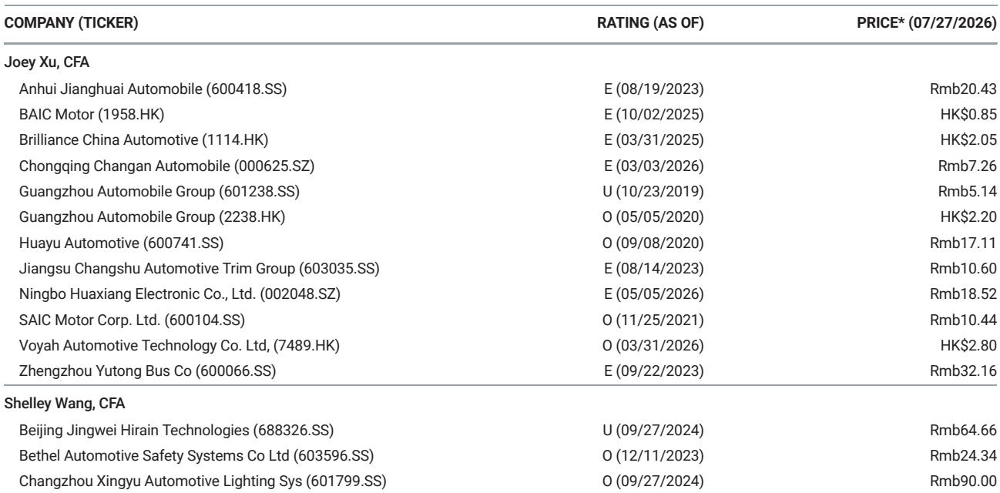

# MS：中国汽车-共享出行，新车发布效应消退，等待下一产品周期

7月第三周（20-26日），中国主要乘用车企业的订单数据出现明显分化。MS最新发布的渠道调研显示，多数车企的周度订单延续了此前几周的正常化趋势，环比和同比均有所回落。但小鹏和理想汽车成为例外，其近期新车型的发布效应仍在推动订单环比正增长。

这份报告的核心观察是：7月前几周由新车发布带来的订单脉冲正在消退，市场正进入一个等待下一轮产品周期的过渡阶段。对于行业观察者而言，理解不同车企在订单消化期的表现差异，比关注单周相对数字更有意义。

## 1. 多数车企周度订单环比回落，理想和小鹏逆势增长

在MS跟踪的11家主要车企中，9家出现了周度订单环比下降。比亚迪周订单降至7.05-7.1万辆，环比下降8%，同比下降7%。吉利银河、蔚来、零跑、极氪、小米等均录得环比下滑，降幅在3%至22%之间。

两个例外值得关注。理想汽车周订单9.2-9.4万辆，环比下降49%，但7月累计环比仍增长3%，同比增幅达18%。小鹏汽车周订单9.9-10.1万辆，环比下降76%，但7月累计环比增长43%，同比增长13%。这两家公司的月度环比数据仍为正，说明其近期新车型——理想的L6和小鹏的MONA L03——仍在为订单池提供增量。

> **KC评论：** 周度数据大幅波动在新车发布后属于正常现象。关键看月度环比趋势。理想和小鹏的7月累计环比仍为正，意味着它们的订单消化速度虽然从峰值回落，但相对水平仍高于6月。这与比亚迪、吉利等处于产品空窗期的车企形成对比。

## 2. 新车型效应周期缩短，下一轮催化剂集中在比亚迪和吉利

报告指出，当前市场的主要驱动力正在从7月的新车发布转向下一轮产品周期。MS认为，下一个关键变化将来自比亚迪的“大汉”、秦MAX以及吉利的Cruiser 700等车型。

这一判断隐含了一个行业趋势：新车型带来的订单脉冲窗口正在收窄。以理想L6为例，其L系列订单占比在发布后已从高位回落，说明消费者对新品的关注度衰减速度在加快。对于车企而言，这意味着需要更密集的产品投放节奏来维持订单热度。

## 3. 特斯拉中国和HIMA订单持续承压，竞争格局正在重塑

特斯拉中国周订单9.5-1万辆，环比下降14%，同比下降32%，是样本中同比降幅最大的品牌之一。HIMA（华为智选车）周订单8.6-8.8万辆，环比下降43%，其中Aito品牌环比下降41%。

这两家公司的订单表现反映出不同层面的不确定性。特斯拉面临的是产品周期老化与本土品牌竞争的双重因素。HIMA则可能受到Aito新车型发布后订单自然回落的影响，但43%的环比降幅仍值得关注。在整体市场增速节奏变化的背景下，头部品牌之间的份额争夺正在加剧。

对于产业决策者而言，这份报告提供了一个清晰的观察框架：在缺乏全行业性刺激政策的当下，订单数据的结构性分化比总量趋势更具参考价值。下一轮产品周期的表现，将决定哪些车企能在下半年维持市场份额。

For informational purposes only. Portions may be generated,translated,summarized,or edited with AI assistance based on source materials and may contain omissions or errors. Please verify independently. This is not investment,legal,tax,accounting,or other professional advice.

