# 2Q Preview: Edge AI Leadership and Platform Strength Driving Durable Momentum

Channel checks point to another solid quarter for Cloudflare, driven by durable CDN/AppSec and Developer Platform strength. Our recent Edge AI survey further reinforces NET's leadership in distributed AI inference and supports an even more constructive 2H26 outlook.

## Key Takeaways

- Channel checks again screened positive, with Cloudflare remaining one of the fastest-growing vendors across partner software practices.

■ Growth continues to be led by CDN/AppSec and Developer Services, while Cloudflare continues gaining share in Zero Trust.

- Expect another Q2 revenue beat and FY26 raise, with an even stronger setup into 2H supported by platform and AI momentum.

- Our recent Edge AI survey positions Cloudflare as the clear leader in distributed AI inference, reinforcing our long-term thesis.

■ Continued large-deal activity, expanding Pool of Funds consumption, and AI monetization likely support further consensus estimate revisions throughout FY26.

Best Athlete in Software Continues to Execute Across the Platform. Our latest channel checks suggest continued strong momentum for Cloudflare, with partners again coming in above expectations and reinforcing its position as one of the fastest-growing vendors across their software practices. From a demand perspective, growth continues to be driven by durable strength in the core platform, particularly around CDN / Application Security and Edge AI / developer-related offerings, where partners continue to see increasing utilization and consumption (namely Workers) alongside rising traffic volumes. These trends, combined with broader industry tailwinds tied to AI inference and edge computing, continue to position Cloudflare as a key beneficiary of the next phase of enterprise AI deployments. More broadly, partners highlighted healthy demand across API management, data security, and broader developer services, while continuing to note Cloudflare's strong developer ecosystem as a key competitive advantage, particularly as enterprise AI adoption accelerates. While Cloudflare One / SASE remains an increasingly important part of the broader platform story, our conversations suggest it is not the primary driver of growth, though partners continue to see Cloudflare competing in an increasing number of Zero Trust and network modernization opportunities, supporting our view that the company is steadily gaining share in the enterprise security market.

Similar to recent quarters, we also picked up signs of healthy large enterprise activity, with Cloudflare participating in an increasing number of strategic infra modernization and AI-related deployments. These trends also align with management's commentary around accelerating developer adoption, improving enterprise sales productivity, and record large-deal activity, which we believe continue to support durable platform demand. Bottom line, our latest checks reinforce sustained momentum across the platform, healthy pipeline visibility, and continued large-deal traction, supporting our view that Cloudflare remains one of the best-positioned vendors across software.

From a numbers perspective, expecting upside to Q2 consensus' ~29.8% YoY revenue growth, with a typical ~2-3% beat, driven by multiple product cycles, improving platform momentum, and increasing AI tailwinds, with the FY26 guide likely raised by the magnitude of the Q2 beat. Similarly, expecting current RPO (cRPO) YoY growth to beat consensus' expectations for ~31.8%. While Cloudflare has consistently put up better-than-expected results in the past several quarters, we believe the setup into 2H26 appears even more constructive, supported by continued Pool of Funds consumption, improving enterprise sales execution, accelerating large-deal activity, and increasing monetization across Developer Services, AI infrastructure, and the broader platform. Recall that Q1 revenue growth came in slightly below higher buy-side expectations, reflecting the lag inherent in ramping newer Pool of Funds deals and the broader revenue-recognition drag tied to the ramping usage-based model, both of which should modestly improve in Q2 (and in 2H and beyond). Similarly, RPO growth decelerated in Q1 against a difficult comp, as the prior-year period benefited from the initial signing of the company's largest-ever deal (~$130mn TCV). Taken together, we continue to lean positive ahead of Q2 results, expecting Cloudflare to deliver another quarter of 30%+ topline growth, with strong bookings momentum and an expanding mix of the higher-growth Acts likely supporting further upward consensus estimate revisions through the remainder of the year. In terms of the fairly mixed survey results for Cloudflare (see Security Reseller Survey Results), we flag that our live channel conversations (several with partners with >$50mn in annual Cloudflare sales) were incrementally bullish across the entire Cloudflare platform, while most of the resellers from our below VAR survey results were smaller and largely security-focused. In our view, these security resellers likely have smaller non-security practices and may not accurately reflect the strength of Cloudflare's broader portfolio.

## Our Recent Edge AI Survey Further Reinforces Our Thesis on Cloudflare.

While enterprise Edge AI adoption remains in the early innings, our inaugural Edge AI survey (see As Inference Expands Beyond the Hyperscalers, New Leaders Begin to Emerge (16 Jul 2026)) suggests Cloudflare has already established itself as the clear leader in distributed AI inference, with 55% of partners identifying the company as gaining the most share in edge inference over the past three months (Exhibit 9) and 63% selecting Cloudflare as the preferred platform for edge AI compute (Exhibit 8), well ahead of other edge infrastructure vendors. We were also encouraged by continued momentum across the Developer Platform, where Workers AI screened as Cloudflare's fastest-growing developer product, while partners consistently cited AI inference at the edge, edge compute, and agentic AI workloads as the primary drivers of adoption. Importantly, although the majority of partners expect meaningful enterprise Edge AI deployments to occur in 2027, current demand trends suggest Cloudflare is already benefiting from increasing developer adoption and early inference workloads, positioning the company well ahead of what we believe will be a multi-year deployment cycle. Overall, our Edge AI survey results closely align with our latest channel conversations and further strengthen our conviction that Cloudflare's differentiated edge architecture, developer ecosystem, and multi-product platform position the company as one of the best ways to play the next phase of enterprise AI infrastructure spending across software.

Exhibit 1: While AWS, Azure, and Cloudflare dominate current AI inference share...  
Amongst your customer base, which vendors/platforms has the largest share for executing AI inference currently?  
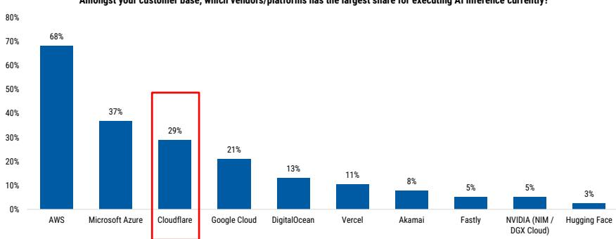  
Source: MS estimates, n=38

Exhibit 2: ... Cloudflare and other challengers have been gaining share from AWS in inference over the past three months  
Amongst your customer base, which of the following vendors/platforms has seen the largest share gains in the AI inferencing market over the past 3 months?  
  
Source: MS estimates, n=38

Exhibit 3: NET: MSe vs. Consensus

<table><tr><td rowspan="2">NET</td><td colspan="2">2Q26e</td><td colspan="2">3Q26e</td><td colspan="2">FY26e</td><td colspan="2">FY27e</td></tr><tr><td>MS</td><td>Cons.</td><td>MS</td><td>Cons.</td><td>MS</td><td>Cons.</td><td>MS</td><td>Cons.</td></tr><tr><td>Total Revenue</td><td>$665.0</td><td>$664.8</td><td>$722.2</td><td>$721.6</td><td>$2,809.6</td><td>$2,810.9</td><td>$3,574.4</td><td>$3,590.3</td></tr><tr><td>YoY Growth</td><td>29.8%</td><td>29.8%</td><td>28.5%</td><td>28.4%</td><td>29.6%</td><td>29.7%</td><td>27.2%</td><td>27.7%</td></tr><tr><td>QoQ Growth</td><td>3.9%</td><td>3.9%</td><td>8.6%</td><td>8.5%</td><td></td><td></td><td></td><td></td></tr><tr><td>cRPO</td><td>$1,735.1</td><td>$1,718.9</td><td>$1,803.4</td><td>$1,814.2</td><td>$2,072.9</td><td>$2,046.8</td><td>$2,705.1</td><td>$2,619.4</td></tr><tr><td>YoY Growth</td><td>33.0%</td><td>31.8%</td><td>31.5%</td><td>32.3%</td><td>31.0%</td><td>30.2%</td><td>30.5%</td><td>28.0%</td></tr><tr><td>QoQ Growth</td><td>5.8%</td><td>5.6%</td><td>3.9%</td><td>5.5%</td><td></td><td></td><td></td><td></td></tr><tr><td>Op. Income</td><td>$90.5</td><td>$90.6</td><td>$125.2</td><td>$117.9</td><td>$419.5</td><td>$419.9</td><td>$534.4</td><td>$624.5</td></tr><tr><td>Op. Margin</td><td>13.6%</td><td>13.6%</td><td>17.3%</td><td>16.3%</td><td>14.9%</td><td>14.9%</td><td>15.0%</td><td>17.4%</td></tr><tr><td>EPS</td><td>$0.27</td><td>$0.27</td><td>$0.33</td><td>$0.32</td><td>$1.20</td><td>$1.20</td><td>$1.41</td><td>$1.60</td></tr><tr><td>FCF</td><td>$100.0</td><td>$54.0</td><td>$101.6</td><td>$92.2</td><td>$365.2</td><td>$370.9</td><td>$500.4</td><td>$552.0</td></tr></table>

Source: Company data, MS estimates, Visible Alpha

Exhibit 4: NET: Beat vs. Consensus

<table><tr><td colspan="17">% Beat vs. Consensus</td></tr><tr><td></td><td>NET</td><td>4Q22</td><td>1Q23</td><td>2Q23</td><td>3Q23</td><td>4Q23</td><td>1Q24</td><td>2Q24</td><td>3Q24</td><td>4Q24</td><td>1Q25</td><td>2Q25</td><td>3Q25</td><td>4Q25</td><td>1Q26</td><td>4 Qtr. Avg.</td></tr><tr><td>Total Revenue Beat</td><td></td><td>0.2%</td><td>-0.2%</td><td>1.0%</td><td>1.6%</td><td>2.7%</td><td>1.4%</td><td>1.7%</td><td>1.5%</td><td>1.8%</td><td>2.1%</td><td>2.3%</td><td>3.2%</td><td>4.1%</td><td>3.0%</td><td>3.1%</td></tr><tr><td>Non-GAAP Op. Margin Beat</td><td></td><td>139.5bps</td><td>254.5bps</td><td>180.4bps</td><td>642.9bps</td><td>275.7bps</td><td>193.8bps</td><td>518.0bps</td><td>271.4bps</td><td>205.5bps</td><td>4.9bps</td><td>145.3bps</td><td>134.8bps</td><td>37.2bps</td><td>1.5bps</td><td>79.0bps</td></tr><tr><td>Non-GAAP EPS Beat</td><td></td><td>$0.02</td><td>$0.05</td><td>$0.03</td><td>$0.06</td><td>$0.03</td><td>$0.03</td><td>$0.06</td><td>$0.02</td><td>$0.01</td><td>-$0.01</td><td>$0.03</td><td>$0.04</td><td>$0.01</td><td>$0.02</td><td>$0.02</td></tr><tr><td>#RPO Beat</td><td></td><td>-3.5%</td><td>-1.0%</td><td>-2.4%</td><td>-3.9%</td><td>1.1%</td><td>0.3%</td><td>-1.7%</td><td>2.4%</td><td>-0.2%</td><td>0.4%</td><td>0.1%</td><td>0.1%</td><td>3.2%</td><td>-1.2%</td><td>0.5%</td></tr><tr><td>Total RPO Beat</td><td></td><td>0.7%</td><td>0.8%</td><td>-0.9%</td><td>-2.9%</td><td>4.9%</td><td>5.3%</td><td>1.6%</td><td>2.1%</td><td>0.6%</td><td>6.0%</td><td>3.3%</td><td>3.3%</td><td>6.1%</td><td>-2.1%</td><td>2.6%</td></tr><tr><td>FCF Beat</td><td></td><td>49%</td><td>NM</td><td>NM</td><td>65%</td><td>8%</td><td>71%</td><td>5%</td><td>17%</td><td>6%</td><td>40%</td><td>-33%</td><td>-33%</td><td>0%</td><td>8%</td><td>-14.4%</td></tr></table>

Source: Company data, MS, Refinitiv, Visible Alpha

Preview to earnings

<table><tr><td>Focus KPI</td><td>Focus KPI Surprise</td><td>Likely impact to consensus EPS*</td></tr><tr><td colspan="3">Cloudflare Inc NET.N</td></tr><tr><td>Total Revenue</td><td>↑Very likely upside surprise</td><td>↑Modest revision higher</td></tr></table>

\*Likely impact to consensus EPS is for the next 12 months

Source: Company data, MS

## Risk Reward – Cloudflare Inc (NET.N)

A Multi-Product Platform Expansion Story Warrants Premium Multiple

## PRICE TARGET $322.00

We project FCF through CY2034, apply a 51X EV/FCF multiple and discount back at an 11% weighted average cost of capital, resulting in our base case price target of $322. 51X is a premium to peers, reflecting Cloudflare's higher growth and improving margin profile.

Consensus Price Target Distribution

Source: Refinitiv, MS

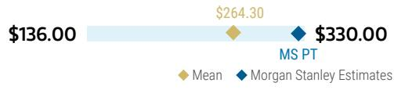

## RISK REWARD CHART

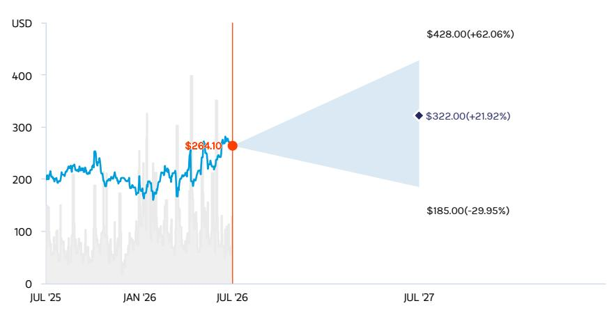  
Key: — Historical Stock Performance ● Current Stock Price ◆ Price Target  
Source: Refinitiv, MS

## BULL CASE

$428.00

55X 2034e FCF ~$6.4B (Implies ~44X EV/27e Sales)

Competitive Security Positioning for Enterprise Use Cases and Monetization of Edge AI Drive Durable Long-term Revenue Growth. With a better enterprise revenue mix, rev growth sustains at ~27% CAGR thru 2034. Operating margins scale to ~30% in CY34 to generate ~$6.4B of FCF on ~$18.6B rev. We apply a 55X EV/FCF multiple (1.7x EV/FCF/G).

BASE CASE

$322.00

51X 2034e FCF ~$5.1B (Implies ~35X EV/27e Sales)

Further Progress Upmarket and Go-to-Market Execution Drive Growth and Margin Expansion. Rev growth slows from ~52% in CY21 to ~20% in 2034. Operating Margins scale from (1%) in 2021 to ~26% in 2034 to generate ~$5.1B FCF on ~$15.6B rev. We apply a 51X EV/FCF multiple in CY34 (1.6x EV/FCF/G).

## OVERWEIGHT THESIS

■ Cloudflare's purpose-built cloud solutions address the complex security and website performance needs of a broad customer base. Penetration into attractive $116B+ TAM by 2028e depends on the strength of security and a swiftly expanding solution portfolio, including AI-related solutions like Workers/R2 for the emerging edge computing opportunity and Access/Cloudflare for Teams for remote access.

We see a long runway of durable 20%+ growth as Cloudflare becomes a key Edge AI enabler for AI inference workloads. This should sustain a premium multiple vs peers, in our view.

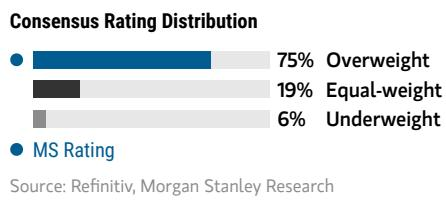  
Source: Refinitiv, MS

## Risk Reward Themes

Disruption: Secular Growth:

View descriptions of Risk Rewards Themes here

## BEAR CASE

$185.00

44X 2034e FCF ~$3.4B (Implies ~51X EV/27e Sales)

Competitive Environment Limits Upmarket Expansion and Conversion From Free to Paid is Not As Seamless. Revenue growth slows to ~15% in CY34. Operating Margins reach ~22% in CY34 to generate ~$3.4B in FCF on ~$12.0B in revenue. We apply a 44X EV/FCF multiple (2.0x EV/FCF/Growth).

\- Mean
- MS Estimates
Source: Refinitiv, MS

## Risk Reward – Cloudflare Inc (NET.N)

## KEY EARNINGS INPUTS

<table><tr><td>Drivers</td><td>Dec 2025</td><td>Dec 2026e</td><td>Dec 2027e</td><td>Dec 2028e</td></tr><tr><td>Total Revenue Growth (%)</td><td>29.8</td><td>29.6</td><td>27.2</td><td>26.0</td></tr><tr><td>Total Billings Growth (%)</td><td>32.6</td><td>29.6</td><td>27.4</td><td>0.0</td></tr><tr><td>Total Customer Count Growth (%)</td><td>39.9</td><td>34.9</td><td>34.9</td><td>0.0</td></tr><tr><td>Dollar-based Net Retention Rate (%)</td><td>116.0</td><td>118.0</td><td>118.0</td><td>0.0</td></tr><tr><td>Operating Margin (%)</td><td>14.0</td><td>14.9</td><td>15.0</td><td>15.0</td></tr></table>

## INVESTMENT DRIVERS

\- Net retention rate

\- Growth in customers >$100K in Annualized Revenue

\- New paid customer additions/conversions

## GLOBAL REVENUE EXPOSURE

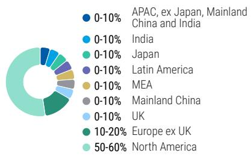  
Source: MS Estimate View explanation of regional hierarchies here

## MS ALPHA MODELS

<table><tr><td>5/5BEST</td><td>24 MonthHorizon</td><td>4/5MOST</td><td>3 MonthHorizon</td></tr></table>

Source: Refinitiv, FactSet, MS; 1 is the highest favored Quintile and 5 is the least favored Quintile

## RISKS TO PT/RATING

## RISKS TO UPSIDE

\- Developer products like Cloudflare Workers AI and R2 are monetized into a large installed base

\- Traction in large enterprise under new sales leadership

## RISKS TO DOWNSIDE

\- Competition from pure play security vendors, public cloud providers, and larger vendors

• Difficulty moving upmarket - Long-term margin expansion more difficult than initially perceived

## OWNERSHIP POSITIONING

<table><tr><td>Inst. Owners, % Active</td><td>66.7%</td><td></td><td></td><td></td></tr><tr><td>HF Sector Long/Short Ratio</td><td>2.1x</td><td></td><td></td><td></td></tr><tr><td>HF Sector Net Exposure</td><td>29.5%</td><td></td><td></td><td></td></tr></table>

Refinitiv; MSPB Content. Includes certain hedge fund exposures held with MSPB. Information may be inconsistent with or may not reflect broader market trends. Long/Short Ratio = Long Exposure / Short exposure. Sector % of Total Net Exposure = (For a particular sector: Long Exposure - Short Exposure) / (Across all sectors: Long Exposure – Short Exposure).

MS ESTIMATES VS. CONSENSUS  
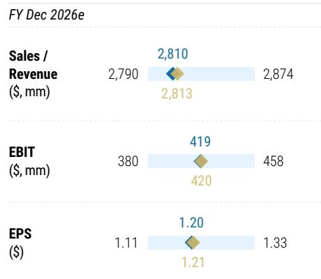

## Security Reseller Survey Results

Exhibit 5: Our June Survey Shows 84% of Resellers In line or Above Target, Slightly Below Last Quarter

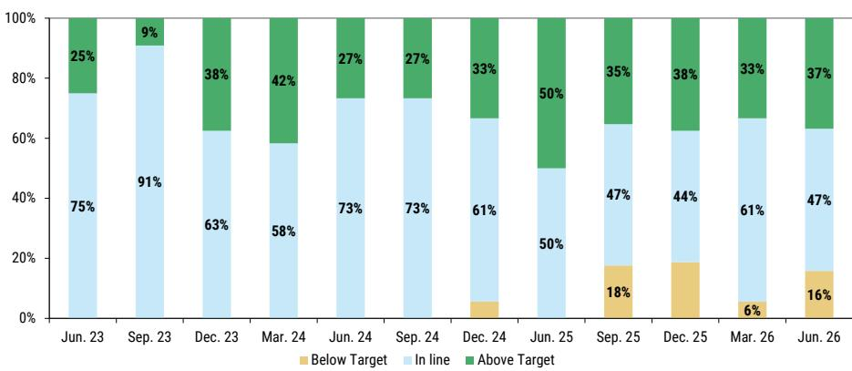  
Source: MS, n=19 \* Excluded March 2025 Survey Results due to n<5 \*

Exhibit 6: Our Latest Survey Suggests That Cloudflare's Penetration in SASE Remains Fairly Early Days Overall  
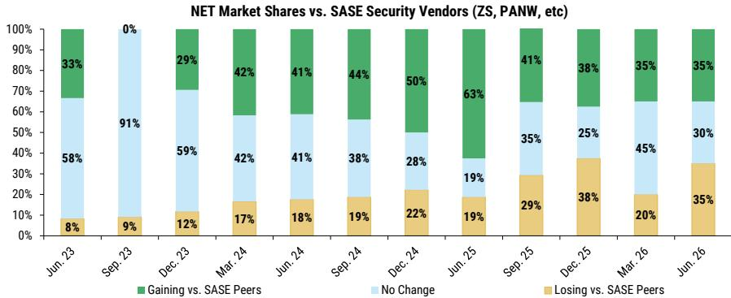  
Source: MS, n=19 \* Excluded March 2025 Survey Results due to n<5 \*

Exhibit 7: NET Job Postings  
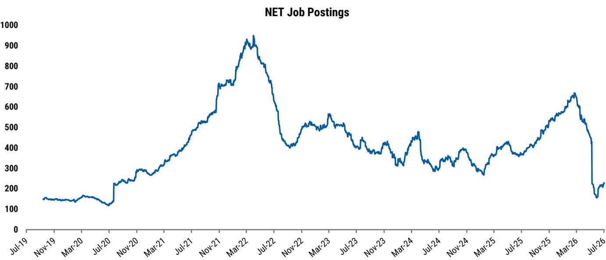  
Source: MS, Company Data

## Edge AI Reseller Survey Results

See Edge AI Survey: As Inference Expands Beyond the Hyperscalers, New Leaders Begin to Emerge (16 Jul 2026) for additional color.

Exhibit 8: In Edge Computing, Cloudflare Has Dominant Market Share...

Amongst your customer base, which of the following vendors/platforms has the largest share for executing edge compute / edge inference?

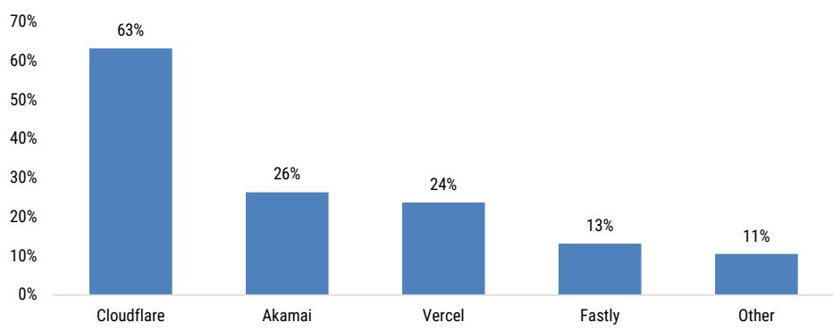  
Source: MS estimates, n=38  
Amongst your customer base, which of the following vendors/platforms has seen the largest share gains in edge compute / edge inference market over the past 3 months?

Exhibit 9: ... While Also Gaining the Most Share, Followed by Akamai and Vercel

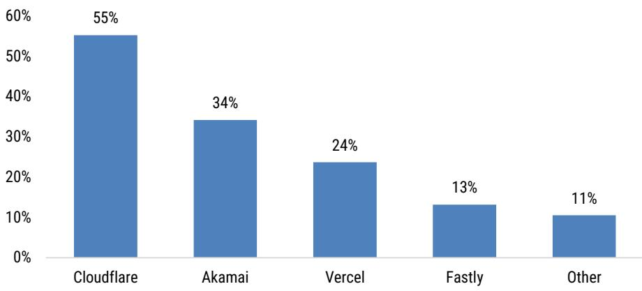  
Source: MS estimates, n=38

Exhibit 10: 74% of Partners Cite AI/ML-Specific Budgets as the Primary Source of Cloudflare Developer Platform Spending

Where is budget for Cloudflare developer platform spending primarily coming from?

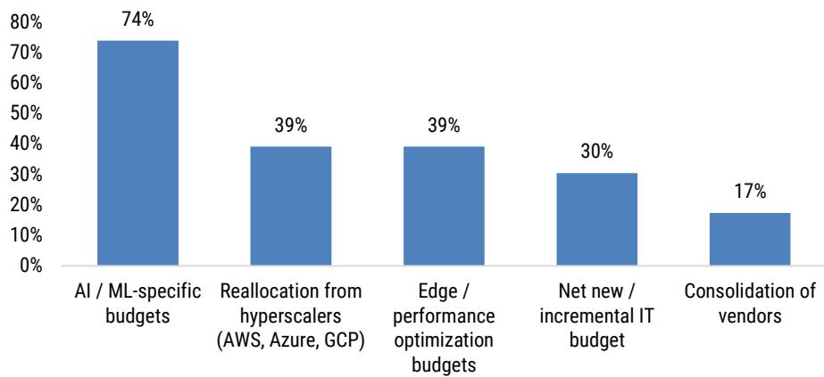  
Source: MS estimates, n=23  
What percentage of your Cloudflare-related revenue is derived from developer platform products (Workers, R2, Workers AI, etc.)?

Exhibit 11: 65% of Partners Derive Less Than 20% of Total Cloudflare Revenue From Developer Platform Products, Underscoring Early Innings of the Growth Opportunity

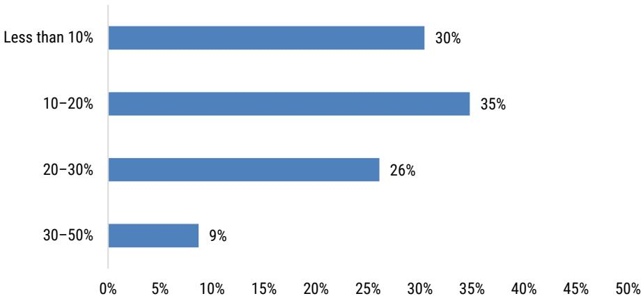  
Source: MS estimates, n=23

Exhibit 12: 65% of Partners Noted Workers AI as Cloudflare's Fastest-Growing Developer Product, Followed by Workers at 43%

Which Cloudflare developer products are currently growing the fastest in your experience?

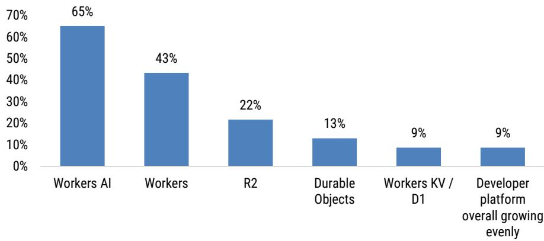  
Source: MS estimates, n=23  
What are the primary use cases driving adoption of Cloudflare developer products?

Exhibit 13: 65% of Partners Cite AI Inference at the Edge as the Leading Use Case Driving Cloudflare Developer Product Adoption

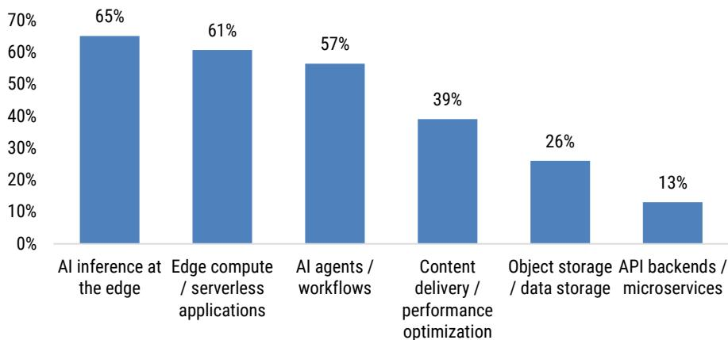  
Source: MS estimates, n=23

Exhibit 14: Workers AI Posts the Highest Above-Expectations Rate (52%) of Any Cloudflare Developer Platform Product, While 100% of Partners Were Above/Inline with Plan for their Cloudflare Developer Platform Practices Overall  
How was product-level performance for Cloudflare developer platform products over the last 3 months?  
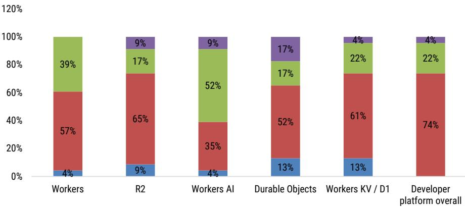  
Below expectations In line with expectations Above expectations Not applicable / Cannot discuss  
Source: MS estimates, n=23

Exhibit 15: 33% of Partners Indicate Their Organization Has Only Deployed Cloudflare's Workers AI in Limited Production Use Cases, Coupled with 19% Still in the Evaluation Phase, Suggesting a Long Runway Ahead

What is your organization's current level of adoption of Cloudflare Workers AI?

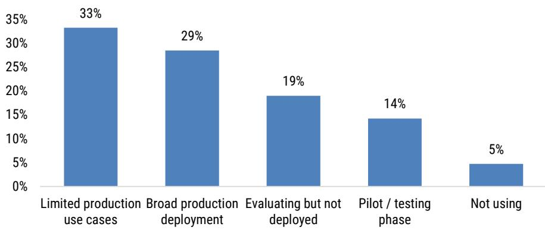  
Source: MS estimates, n=23

Exhibit 16: 60% of Partners Cite Real-Time Edge Inference and Agentic Workflows as the Leading Workers AI Use Cases

What are the primary use cases for Workers AI?

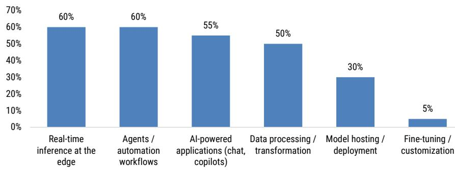  
Source: MS estimates, n=23  
Exhibit 17: 48% of Partners Report Recent Cloudflare AI/Model Initiatives Have Directly Driven Increased Adoption  
What impact have recent Cloudflare AI/model platform initiatives (e.g., new model releases, inference optimizations) had on your sales (if any)?

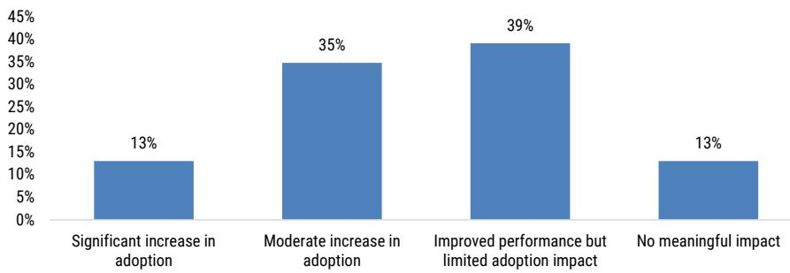  
Source: MS estimates, n=23

Exhibit 18: Only 31% of Partners Expect Enterprise Edge AI Inference to Scale in 2026 or Sooner, With 52% Pointing to 2027

When do you expect enterprise adoption of AI inference at the edge (e.g., Workers AI) to meaningfully scale?

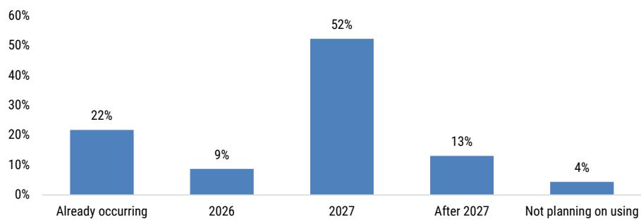  
Source: MS estimates, n=23

Exhibit 19: 74% of Partners Cite Performance/Latency as the Primary Reason Cloudflare Wins Developer Platform Deals, With Developer Experience, Price/Cost Advantages, and Platform Offering as the Next Leading Drivers

What are the primary reasons Cloudflare wins developer platform deals?

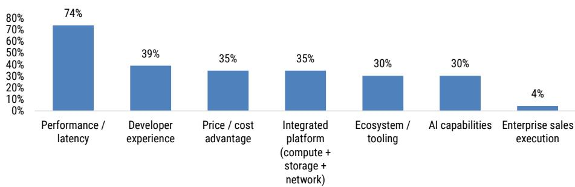  
Source: MS estimates, n=23  
What percentage of your Cloudflare developer platform sales represent workloads migrated from hyperscalers (AWS, GCP, Azure)?

Exhibit 20: On Average,18% of Cloudflare Developer Platform Sales Represent Workloads Migrated from Hyperscalers

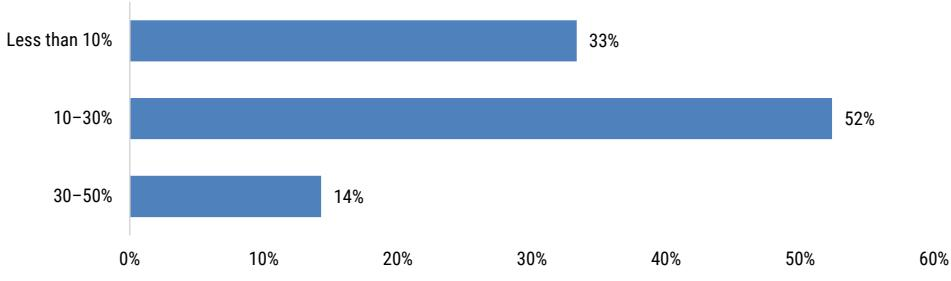  
Source: MS estimates, n=23  
What are the primary reasons Cloudflare loses developer platform deals?

Exhibit 21: 43% of Partners Cite Enterprise Sales Execution as the Leading Reason Cloudflare Loses Developer Platform Deals

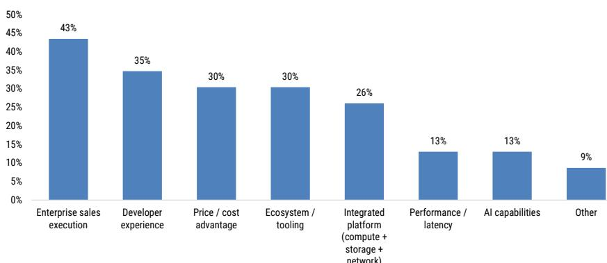  
Source: MS estimates, n=23

Exhibit 22: Hyperscalers Capture 66% of Displaced Cloudflare Workers Deals, With Akamai the Leading Non-Hyperscaler Alternative at 18%

When Cloudflare Workers loses a prospective deal or is displaced in an existing workload, which platforms are most commonly selected instead?

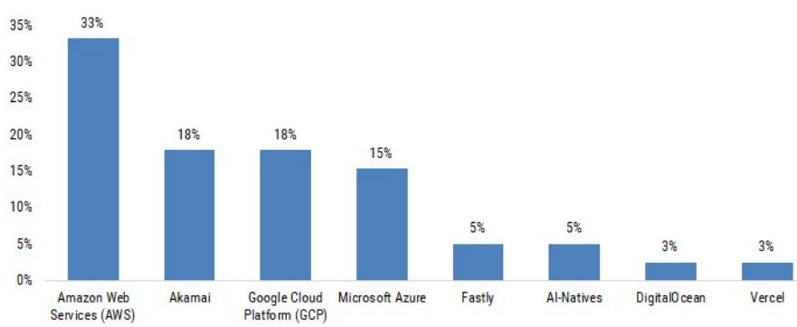  
Source: MS estimates, n=23  
What percentage of Cloudflare deals (in the last twelve months) included developer platform products?

Exhibit 23: 77% of Cloudflare Deals in the LTM Included Developer Platform Products, Though Mostly Below 30% of Deal Value

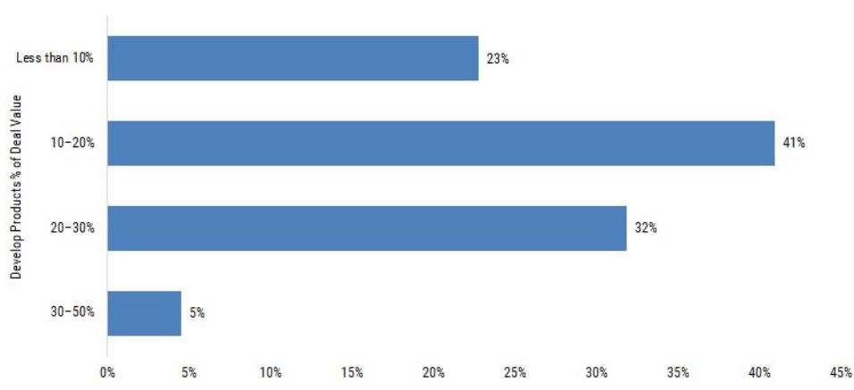  
Source: MS estimates, n=23

Exhibit 24: 74% of Cloudflare Developer Platform Products Are Sold Bundled With CDN/Application Services

How are Cloudflare developer platform products typically sold?

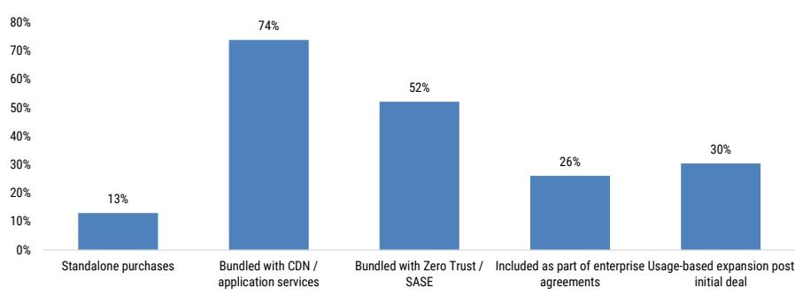  
Source: MS estimates, n=23  
What are the most important drivers of growth for Cloudflare's developer platform over the next 12-24 months?

Exhibit 25: 57% of Partners Cite AI/Inference at the Edge as the Most Important Growth Driver for Cloudflare's Developer Platform Over the Next 12–24 Months

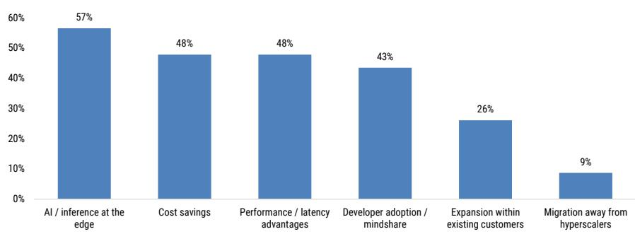  
Source: MS estimates, n=23

## Risk Reward Reference links

1. View explanation of Options Probabilities methodology -

Options\_Probabilities\_Exhibit\_Link.pdf

2. View descriptions of Risk Rewards Themes - RR\_Themes\_Exhibit\_Link.pdf

3. View explanation of regional hierarchies - GEG\_Exhibit\_Link.pdf

4. View explanation of Theme/Exposure methodology -

ESG\_Sustainable\_Solutions\_External\_Link.pdf

5. View explanation of HERS methodology - ESG\_HERS\_External\_Link.pdf

## Disclosure Section

The information and opinions in MS were prepared by MS & Co. LLC, and/or MS C.T.V.M. S.A., and/or MS Mexico, Casa de Bolsa, S.A. de C.V., and/or MS Canada Limited. As used in this disclosure section, "MS" includes MS & Co. LLC, MS C.T.V.M. S.A., MS Mexico, Casa de Bolsa, S.A. de C.V., MS Canada Limited and their affiliates as necessary.

For important disclosures, stock price charts and equity rating histories regarding companies that are the subject of this report, please see the MS Disclosure Website at www.morganstanley.com/eqr/disclosures/webapp/generalresearch, or contact your investment representative or MS at 1585 Broadway, (Attention: Research Management), New York, NY, 10036 USA.

For valuation methodology and risks associated with any recommendation, rating or price target referenced in this research report, please contact the Client Support Team as follows: US/Canada +1 800 303-2495; Hong Kong +852 2848-5999; Latin America +1 718 754-5444 (U.S.); London +44 (0)20-7425-8169; Singapore +65 6834-6860; Sydney +61 (0)2-9770-1505; Tokyo +81 (0)3-6836-9000. Alternatively you may contact your investment representative or MS at 1585 Broadway, (Attention: Research Management), New York, NY 10036 USA.

## Analyst Certification

The following analysts hereby certify that their views about the companies and their securities discussed in this report are accurately expressed and that they have not received and will not receive direct or indirect compensation in exchange for expressing specific recommendations or views in this report: Sanjit K Singh; Adam Wood.

## Global Research Conflict Management Policy

MS has been published in accordance with our conflict management policy, which is available at www.morganstanley.com/institutional/research/conflictpolicies. A Portuguese version of the policy can be found at www.morganstanley.com.br

## Important Regulatory Disclosures on Subject Companies

The analyst or strategist (or a household member) identified below owns the following securities (or related derivatives): Jonathan Eisenson - Adobe Inc.(common or preferred stock), Sprout Social Inc(common or preferred stock).

As of June 30, 2026, MS beneficially owned 1% or more of a class of common equity securities of the following companies covered in MS: Adobe Inc., Akamai Technologies, Inc., Amplitude Inc., Appian Corp, Asana Inc, Atlassian Corporation PLC, Autodesk, BILL Holdings Inc, Blackline Inc, Box Inc, C3.ai, CCC Intelligent Solutions Holdings Inc, Check Point Software Technologies Ltd., Cloudflare Inc, CoreWeave, CrowdStrike Holdings Inc, Datadog, Inc., Descartes Systems Group Inc, DocuSign Inc, Elastic NV, Figma Inc, Five9 Inc, Fortinet Inc., Freshworks Inc, Gen Digital Inc., GitLab Inc, GoDaddy Inc, HubSpot, Inc., Intuit, Klaviyo, Inc, LegalZoom.com Inc, Lightspeed Commerce Inc., Liveramp Holdings Inc, Manhattan Associates Inc., Microsoft, monday.com Ltd, MongoDB Inc, Nebius Group NV, NICE Ltd., Okta, Inc., Oracle Corporation, PagerD
