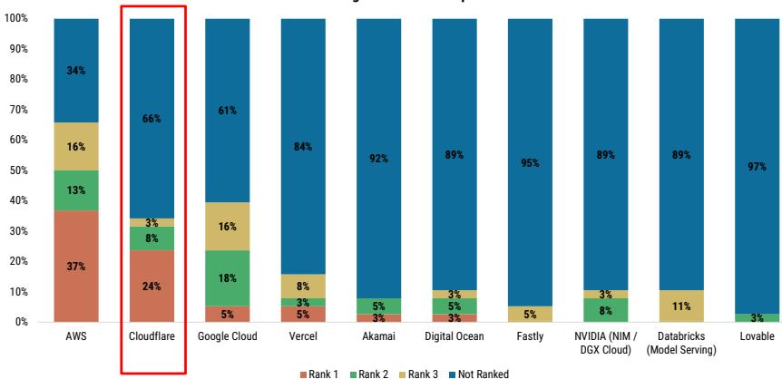

# MS：AI技术与行业应用观察

这份MS在2026年7月发布的研究报告，核心判断是Cloudflare正在从一家CDN和安全公司，演变为边缘AI推理基础设施的关键参与者。报告基于最新渠道调研和首次边缘AI调查，认为公司在分布式AI推理领域已建立明确的领先地位，这一结构性变化将支撑其下半年及之后的增长动能。

报告特别指出，虽然市场对Cloudflare的认知仍集中在安全与内容分发，但开发者平台和边缘AI相关产品正在成为新的增长引擎。渠道反馈显示，合作伙伴将Cloudflare列为过去三个月边缘推理市场份额增长最快的厂商，这一信号在AI部署从训练转向推理的背景下值得关注。

## 1. 渠道调研显示核心平台需求持续强劲

报告引用的最新渠道调研显示，Cloudflare仍是合作伙伴软件业务中增长最快的供应商之一。增长主要由CDN/应用安全和开发者服务驱动，同时公司在零信任安全领域持续获得份额。值得注意的是，虽然Cloudflare One/SASE是平台故事的重要组成部分，但调研表明它并非当前增长的主要驱动力。

大型企业活动保持健康，Cloudflare参与了更多战略性基础设施现代化和AI相关部署。这些趋势与管理层关于开发者采用加速、企业销售效率提升以及大型交易创纪录的表述一致。报告认为，这些信号支持了平台需求持续稳固的判断。

> **KC评论：** 渠道调研的样本结构值得注意。报告提到，与年销售额超过5000万美元的大型合作伙伴的对话，比小型安全转售商的调查结果更为积极。这意味着，如果只看安全渠道的调查数据，可能会低估Cloudflare整个平台的实际动能。

## 2. 边缘AI调查确认分布式推理领先地位

报告首次发布的边缘AI调查覆盖了38家合作伙伴，结果指向一个清晰的格局：Cloudflare在分布式AI推理领域已建立领先地位。55%的合作伙伴认为该公司在过去三个月中边缘推理市场份额增长最快，63%将其选为边缘AI计算的首选平台。

Workers AI被识别为Cloudflare开发者平台中增长最快的产品。合作伙伴一致将边缘AI推理、边缘计算和智能体AI工作负载列为主要采用驱动因素。虽然多数合作伙伴预计企业级边缘AI大规模部署将在2027年发生，但当前的需求趋势表明，Cloudflare已经受益于开发者采用和早期推理工作负载。

这一调查结果与渠道对话高度一致，强化了报告的核心论点：Cloudflare的差异化边缘架构、开发者生态系统和多产品平台，使其成为企业AI基础设施支出下一阶段的受益者。

## 3. 财务展望：营收超预期与全年指引上调

从财务角度看，报告预计第二季度营收将超过市场共识预期的约29.8%同比增长，典型的超预期幅度在2-3%之间。当前剩余履约义务（cRPO）的同比增长预计也将超过市场预期的约31.8%。

报告特别指出，虽然Cloudflare在过去几个季度持续交出超预期业绩，但下半年的基础更为有利。支撑因素包括：Pool of Funds消费模式的持续、企业销售执行的改善、大型交易活动的加速，以及开发者服务、AI基础设施和更广泛平台货币化的提升。

一个值得注意的细节是，第一季度营收增长略低于买方更高的预期，这反映了新Pool of Funds交易的爬坡滞后，以及基于使用量的收入确认模式带来的影响。报告认为，这两个因素在第二季度及下半年应会逐步改善。

## 4. 长期增长框架：平台扩张与市场定位

报告提供了一个可复用的观察框架来理解Cloudflare的长期增长逻辑。核心驱动因素包括：净留存率、年化收入超过10万美元的客户增长、以及新增付费客户的转化。这些指标共同反映了平台粘性和向上销售能力。

从竞争格局看，报告认为Cloudflare面临来自纯安全厂商、公有云提供商和大型供应商的竞争。但边缘AI的崛起正在重塑竞争态势。报告中的调查数据显示，虽然AWS、Azure和Cloudflare目前主导AI推理份额，但Cloudflare和其他挑战者正在从AWS手中获取份额。

报告的不确定性回报框架显示，在基础情景下，公司营收增速将从2021年的约52%逐步节奏变化至2034年的约20%，运营利润率从2021年的负值扩张至约26%，对应约51倍EV/FCF估值倍数。这一框架的核心假设是，向上市场拓展和销售执行将驱动增长与利润率扩张。

For informational purposes only. Portions may be generated,translated,summarized,or edited with AI assistance based on source materials and may contain omissions or errors. Please verify independently. This is not investment,legal,tax,accounting,or other professional advice.

For informational purposes only. Portions may be generated,translated,summarized,or edited with AI assistance based on source materials and may contain omissions or errors. Please verify independently. This is not investment,legal,tax,accounting,or other professional advice.

