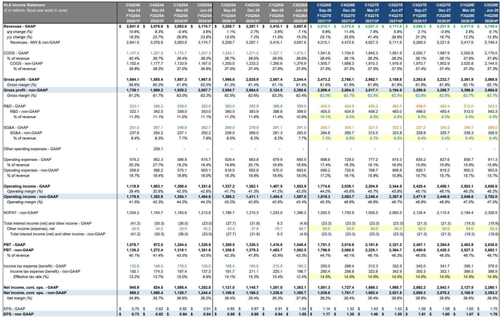
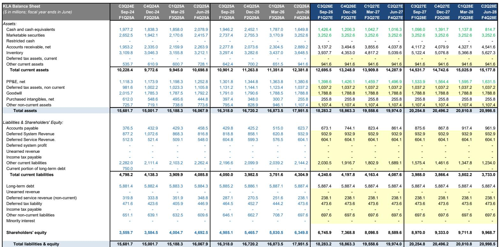
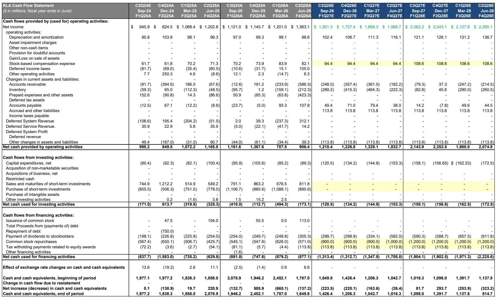

# KLA的2027年叙事持续强化，尽管2026年执行层面存在波动——这种分化创造了战略观察窗口

KLA公司六月季度业绩及九月季度指引略低于内部预期，延续了上一季度的模式：短期数据表现温和，而长期叙事获得结构性支撑。公司九月季度营收中值40亿美元，略低于市场预期的39.3亿美元；每股收益中值1.16美元，略高于预期的1.14美元——这一混合结果对近期盈利轨迹影响有限。但本次报告真正的信号不在季度本身，而在于KLA管理层对2027年的展望：上调晶圆厂设备预测，大幅提高先进封装收入目标，以及125亿美元的剩余履约义务积压，为多年增长周期提供了信心锚点。

2026年偏弱与2027年强劲之间的张力并非矛盾，而是过程控制强度在半导体投资周期中结构性变化的体现。KLA在2026年成为份额让渡者，是因为支出结构向N-2和N-1节点倾斜，这些节点的过程控制密度较低。但公司正为2027年超越WFE增长500个基点做准备——营收增长36%对比WFE增长31%——驱动力来自台积电的领先逻辑节点拐点、英特尔、Rapidus和TeraFab对先进逻辑支出的扩大，以及DRAM强度在整体DRAM WFE增长放缓背景下的持续。对于愿意放眼当前季度失望表现的观察者而言，这份报告提供了比KLA近期任何报告都更清晰的下一轮上升周期路线图。

报告将2026年WFE加先进封装预测从1400亿美元以上上调至1500亿美元低区间，代表超过25%的增长。2026年先进封装收入从10亿美元上调至11亿美元，同比增长70%，以两倍于市场的速度增长。这些并非渐进式调整，而是反映了这样一种信念：过程控制强度——每片晶圆启动的检测和计量设备金额——正在结构性增加而非周期性波动，而KLA的安装基础和技术路线图使其成为主要受益者。

关于KLA的谨慎观点始终基于短期执行风险和组合逆风。乐观观点则基于多年过程控制超级周期。本季度两者均得到确认，但也明确了拐点。以下部分将分解故事两面的机制，并解释为何证据平衡现在倾向于更长远视角。

## 短期数据确认KLA在2026年是份额让渡者，但机制是组合而非市场份额流失

KLA九月季度指引略低于分析师预期，且公司未能相对于自身季度内评论实现超预期并上调。这标志着KLA连续第二个季度交出“混合结果”——为乐观和谨慎观点都提供弹药，但未解决争论。谨慎解读很直接：KLA表现逊于其刻蚀和沉积同行，后者近期持续显示显著上行空间。这种分化真实存在且值得理解，但并非竞争弱势的信号。

根本原因是产品组合。KLA的交货周期超过12个月，因此任何给定季度的收入状况主要由一年前下达的订单决定。这些订单的构成已转向过程控制强度较低的节点和应用。当行业大量投资于N-2和N-1节点——仍占产量大部分的上一代技术——每片晶圆的检测和计量设备金额显著低于领先节点。KLA在2026年的收入反映了这种组合逆风。它并未在核心市场失去份额；只是短期内服务于要求较低的客户群。

这一动态因KLA的刻蚀和沉积同行受益于不同组合动态而得到强化。他们的设备更直接地与新建晶圆厂产能相关，这些产能集中在需要高沉积和刻蚀强度的逻辑和存储节点，无论节点代际如何。相比之下，过程控制对特定运行节点尤为敏感。3nm晶圆需要的检测次数远多于5nm或7nm晶圆。当领先节点放缓时，过程控制强度下降速度快于整体WFE。这正是2026年发生的情况。

通过这一视角审视，认为KLA结构性失去相关性的谨慎观点并不成立。公司在过程控制领域的市场份额保持稳定，其在掩模检测、电子束和光学检测方面的技术地位未受任何单一竞争对手威胁。短期弱势是时机和组合的函数，而非竞争侵蚀。

## 125亿美元积压订单和上调的WFE预测为过程控制强度将在2027年拐点提供有力论据

本报告最重要的数字不是季度营收或每股收益，而是125亿美元的剩余履约义务，高于2025财年末的78.6亿美元。这一积压代表已下达但尚未确认为收入的订单，提供了半导体设备行业罕见的多年可见性。公司对2027年超越WFE增长的信心锚定于这一积压，而非投机性需求预测。

积压订单构建的机制很简单。领先逻辑客户——主要是台积电，也包括英特尔、Rapidus和TeraFab联盟——正在提前为1nm和1.4nm节点设备下单，远早于量产爬坡。这些节点需要过程控制强度的阶跃式提升，因为如此小几何尺寸下的缺陷密度和良率挑战显著大于3nm或5nm。更大的芯片尺寸和越来越多的设计启动都导致基准良率降低，进而需要每片晶圆更多的检测和计量次数。KLA对台积电各节点过程控制强度的内部分析，以及行业DRAM晶圆数据，支持了台积电领先逻辑收入应在2027年加速的观点。

DRAM故事同样重要。虽然整体DRAM WFE增长率预计在2027年放缓，但KLA的DRAM收入增长率应能维持，因为高带宽存储的复杂性增加以及向更先进DRAM节点的转变。每一代新DRAM都需要更高密度的检测步骤，而KLA的工具集深深嵌入DRAM制造流程。加速的逻辑强度与持续的DRAM强度相结合，创造了独立于整体WFE增长率的收入顺风。

KLA 2026年先进封装收入预测为11亿美元，以两倍于市场的速度增长，增加了另一层信心。逻辑和系统级芯片架构中的混合键合正在推动检测需求的新浪潮，这在以往周期中并不存在。KLA在这一细分领域正在获取份额，因为其缺陷检测能力独特地适用于键合晶圆堆叠和三维集成的挑战。先进封装机会并非附属品；它正成为整体过程控制强度的有意义的贡献者。

## KLA将在2027年超越WFE增长500个基点，由节点拐点和客户群扩大驱动

报告的核心预测是KLA将在2027日历年度实现36%的营收增长，对比WFE增长31%。这一500个基点的超额表现并非传统意义上的市场份额获取，而是当领先节点拐点出现时，过程控制强度上升速度快于整体设备支出的函数。逻辑很简单：当晶圆厂为成熟节点建设产能时，每片晶圆需要一定量的沉积和刻蚀设备，但比例上需要较少的检测设备。当它们为领先节点建设产能时，比例反转。过程控制成为总工具支出中更大份额，因为1nm缺陷的成本比7nm高出数个数量级。

客户群的扩大放大了这一效应。在以往周期中，台积电是领先过程控制需求的主要驱动力。到2027年，英特尔的代工雄心、Rapidus在日本的2nm项目以及美国的TeraFab联盟都将贡献于更多元化的支出基础。这些客户中的每一个都在从零开始建设晶圆厂或将现有产能转换为先进节点，且每个都需要KLA全套检测和计量工具。历史上曾拖累KLA估值的集中风险已显著降低。

报告的估计修正反映了这种信心。2027日历年度营收预测从202亿美元上调至204亿美元，每股收益估计从6.12美元上调至6.23美元，由系统增长从34.7%边际提升至35.7%驱动。2028日历年度234亿美元营收和7.22美元每股收益的预测基本保持不变。这些并非戏剧性的上调，但与一个正在获得而非失去动力的论点方向一致。

## 围绕2026-2027年拐点定位的三因素决策框架

对于在当前价格190.80美元——约为2028日历年度每股收益估计7.22美元的35倍——评估KLA的观察者而言，关键问题不是公司是否会增长，而是能否以足够精度识别拐点时机，以证明持有度过短期噪音的合理性。报告提供了三个因素，共同构成一个决策框架。

第一，监控积压订单的组合。125亿美元的RPO已严重偏向领先节点，但未来两到三个季度构成将随着1nm和1.4nm订单加速而转变。如果领先节点RPO份额继续上升，2027年收入超预期的概率增加。第二，追踪先进封装收入的步伐。公司2026年11亿美元的指引意味着到财年末运行率将接近13亿美元。如果这一轨迹保持或加速，表明混合键合和SoIC采用进展快于预期。第三，关注竞争对手财报电话会议，看过程控制强度是否被讨论为结构性主题而非周期性顺风。如果刻蚀和沉积同行开始将检测和计量作为其自身设备销售的制约因素，将确认行业正接近过程控制拐点。

这一框架的风险在于拐点被推迟一年。如果领先逻辑爬坡滑入2028年，KLA的2027年表现将更像2026年——相对于同行温和，令买入长期论点的读者失望。报告通过维持一个谨慎情景隐含地承认了这种可能性，该情景假设领先逻辑和DRAM投资放缓，KLA在掩模检测中的市场份额收缩，估值倍数压缩至25倍收益。

但基准情景——2028日历年度36倍收益，假设更大的市场份额获取和DRAM中快于预期的过程控制强度——得出目标价325美元。风险回报状况的不对称性对具有12至18个月视野的观察者有利，前提是他们愿意容忍伴随与同行不同步股票而来的短期波动。

*仅供参考。部分内容可能基于源材料通过AI辅助生成、翻译、总结或编辑，可能包含遗漏或错误。请独立核实。这不构成专业建议。*

仅供参考。部分内容可能基于源材料通过AI辅助生成、翻译、总结或编辑，可能包含遗漏或错误。请独立核实。这不构成专业建议。

