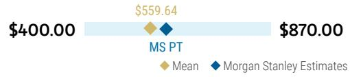
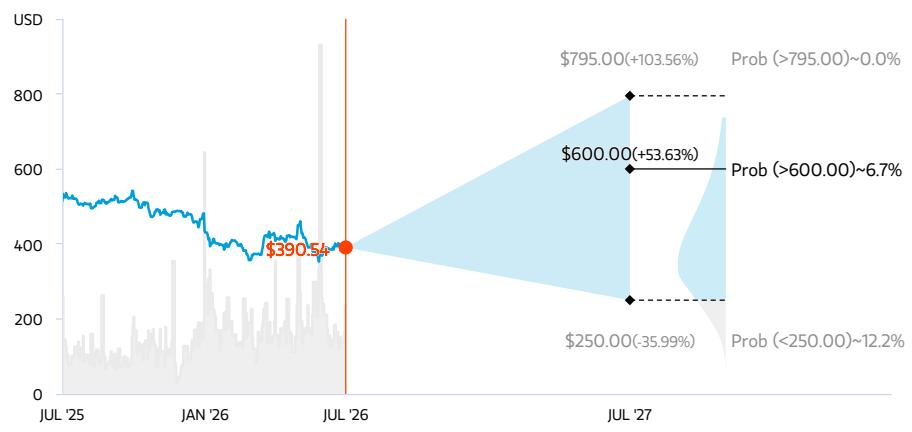
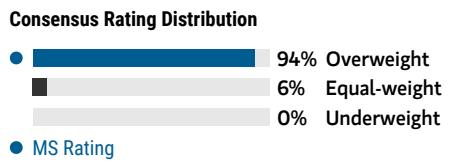
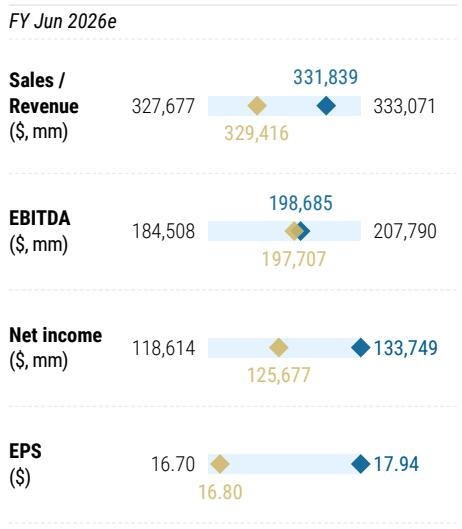

July 30, 2026 07:09 AM GMT

Microsoft | North America

# 4Q26 Results – Growth Thesis Taking Shape

AlphaSignals Earnings Reaction

Strengthens our thesis
Impact to our thesis

↑ Meaningful upside
Financial results versus consensus ↑ Modest revision higher
Direction of next 12-month consensus EPS

Source: Company data, MS

Azure accelerated well beyond the investor hurdle, Copilot net seat adds more than doubled, and operating leverage sustained year-over-year margin expansion and $>20\%$ EPS growth. We see our OW thesis playing out at MSFT. At 17.7x FY28 GAAP EPS, we remain OW.

## Key Takeaways

Microsoft's 4Q26 results delivered broad-based upside, with \$90.0B revenue (+18% YoY) and operating income of \$40.60B beating consensus by 4.2%.

Azure growth accelerated four points sequentially to 43% (cc), beating the 39–40% guide, with management citing CPU/GPU efficiency and faster build times.

Azure's outlook strengthened, with guidance for $\sim 45\%$ constant-currency growth in 1Q27 and a reiteration that F1H27 growth should accelerate vs F2H26.

M365 Copilot reached over 30MM paid seats, up from over 20MM last quarter, as \~10MM net adds beat expectations closer to \~6MM by a wide margin.

■ Margins held up despite AI build: gross margin 67.2%, operating margin 45.1%; FY27 calls for double-digit EBIT growth and margins down less than one point.

F4Q26 Delivered the First Proof Point Across Our Azure, Copilot and Margin Thesis. Microsoft's F4Q26 results move the key elements of our investment thesis from expectation to evidence (see Battle of the AI Stack: Infrastructure to Knowledge Workers – Azure and Copilot Are Set to Inflect (21 Jul 2026)). Revenue of \$90.0B was 2.6% above consensus, with upside across all three segments driving a 4.2% operating-income beat, while Azure growth accelerated 4pts sequentially to 43% in cc and guidance for approximately 45% growth in F1Q27 supports our view that incremental supply, improving fleet efficiency and faster capacity deployment can sustain stronger growth for longer. At the same time, M365 Copilot moved from product-cycle momentum to scaled enterprise adoption, surpassing 30MM paid seats as net seat additions more than doubled QoQ, while early E7 demand and the expansion of consumption pricing across Copilot, GitHub and Dynamics reinforce our three-pronged ARPU thesis: more Copilot seats, migration into higher-value suites and incremental usage-based monetization. Importantly, these growth inflections are emerging without the margin degradation Bears have feared: operating margin reached 45.1%, approximately 70bps above consensus, and

<table><tr><td colspan="2">MS &amp; CO. LLC</td></tr><tr><td colspan="2">Adam Wood</td></tr><tr><td colspan="2">Equity Analyst</td></tr><tr><td>Adam.Wood@morganstanley.com</td><td>+1 212 761-3656</td></tr><tr><td colspan="2">Josh Baer, CFA</td></tr><tr><td colspan="2">Equity Analyst</td></tr><tr><td>Josh.Baer@morganstanley.com</td><td>+1 212 761-4223</td></tr><tr><td colspan="2">Jonathan Eisenson</td></tr><tr><td colspan="2">Research Associate</td></tr><tr><td>Jonathan.Eisenson@morganstanley.com</td><td>+1 212 761-2808</td></tr></table>

## Microsoft (MSFT.O, MSFT US)

## Software | United States of America

<table><tr><td>Stock Rating</td><td>Overweight</td></tr><tr><td>Industry View</td><td>Attractive</td></tr><tr><td>Price target</td><td>$600.00</td></tr><tr><td>Shr price, close (Jul 29, 2026)</td><td>$390.54</td></tr><tr><td>Mkt cap, curr (mm)</td><td>$2,907,570</td></tr><tr><td>52-Week Range</td><td>$555.45-349.20</td></tr></table>

<table><tr><td>Fiscal Year Ending</td><td>06/25</td><td>06/26e</td><td>06/27e</td><td>06/28e</td></tr><tr><td>EPS ($)**</td><td>13.64</td><td>17.94</td><td>19.67</td><td>24.07</td></tr><tr><td>Prior EPS ($)**</td><td>-</td><td>17.35</td><td>19.62</td><td>23.86</td></tr><tr><td>P/E</td><td>36.5</td><td>20.8</td><td>19.9</td><td>16.2</td></tr><tr><td>EPS ($)§</td><td>-</td><td>16.80</td><td>19.40</td><td>22.77</td></tr><tr><td>Div yld (%)</td><td>0.7</td><td>1.0</td><td>1.0</td><td>1.1</td></tr></table>

Unless otherwise noted, all metrics are based on MS ModelWare framework

§ = Consensus data is provided by Refinitiv Estimates

e = MS estimates

## QUARTERLY EPS (\$)

<table><tr><td>Quarter</td><td>2025</td><td>2026e Prior</td><td>2026e Current</td><td>2027e Prior</td><td>2027e Current</td></tr><tr><td>Q1</td><td>3.30</td><td>-</td><td>3.72a</td><td>4.71</td><td>4.77</td></tr><tr><td>Q2</td><td>3.23</td><td>-</td><td>5.16a</td><td>4.86</td><td>4.93</td></tr><tr><td>Q3</td><td>3.46</td><td>-</td><td>4.27a</td><td>4.92</td><td>4.89</td></tr><tr><td>Q4</td><td>3.65</td><td>4.21</td><td>4.81</td><td>5.13</td><td>5.09</td></tr></table>

e = MS estimates, a = Actual Company reported data

Microsoft expects FY27 operating margin to decline by less than one point despite continued AI investment and Cloud gross-margin pressure. With F4Q capex in line with our estimate and no material increase in the underlying CY26 investment plan, investors can increasingly focus on the revenue and earnings generated by the build rather than the spending alone. We continue to see a path to sustainable high-teens revenue growth and greater than 20% earnings growth, making 17.7x FY28 GAAP EPS too inexpensive; applying a conservative 1.2x PEG and 25x P/E supports our \$600 price target and approximately 40% upside. Our key takeaways from the quarter include:

1) Beats across the Board in 4Q26: Broad-based revenue upside drove a meaningful operating income beat. 4Q revenue of \$90.0 billion, up 18% year-over-year and 17% in constant currency, was \$2.3 billion, or 2.6%, above both our \$87.7 billion estimate and consensus, and \$2.2 billion above the high-end of Microsoft's \$86.7–\$87.8 billion guidance. Within the segments, Productivity and Business Processes revenue of \$37.85 billion was 1.7% above our estimate, 1.5% above consensus and \$0.55 billion above the high end of guidance; Intelligent Cloud revenue of \$39.31 billion was 2.7% above us, 2.8% above consensus and \$1.06 billion above the high end; and More Personal Computing revenue of \$12.85 billion was approximately 5.5% above both us and consensus and \$0.60 billion above the high end. The stronger revenue and gross-margin execution drove operating income of \$40.60 billion, up 18%, which was 4.7% above our \$38.79 billion estimate, 4.2% above consensus at \$38.98 billion and approximately \$2.2 billion, or 5.8%, above the midpoint implied by company guidance. Finally, capex of \$41.0 billion was essentially in line with our \$41.1 billion forecast and 3.2% below consensus at \$42.4 billion.

2) Azure Acceleration Moves from Thesis to Numbers: Azure revenue growth accelerated 4pts sequentially to $43\%$ in constant currency, three points above the high-end of management's $39 - 40\%$ guide and 1-2pts above the $41 - 42\%+$ buyside expectation. This came against a prior-year comparison that itself included accelerating growth. More importantly, the strength was not solely a function of newly built capacity. Management attributed the upside to efficiency gains across both the CPU and GPU fleets, as well as process improvements that reduced the time required to bring new infrastructure online. With customer demand continuing to exceed available supply, those incremental efficiency gains and the earlier delivery of new capacity were monetized within the quarter and are locked in for the N12M.

The forward outlook strengthened further. Microsoft guided Azure to \~45% constant-currency growth in 1Q27 and reiterated that growth in F1H27 should accelerate from F2H26, despite exiting FY26 at a significantly higher 43% growth rate than previously expected. This supports our thesis that Azure can sustain stronger topline growth for longer. Better efficiency and capex turning into capacity is stage one – but we see a multi year cycle where MSFT can move from monetising inline with a neocloud on GPUaaS metrics to one where it is able to sell a wider variety of platform and app software.

3) The M365 Copilot Product Cycle Moves from Stride to Scale: Microsoft exited the quarter with over 30 million paid M365 Copilot seats, up from over 20 million last quarter. The resulting approximately 10 million sequential net additions were

well ahead of our expectation for approximately 6 million. The supporting adoption metrics suggest this was more than a single-quarter licensing event. Customer satisfaction scores have doubled over the past three quarters, latency declined 25% during Q4, conversations per user nearly doubled year-over-year, and the time required for a deployment to reach high usage has fallen from months to days. The number of customers with more than 50,000 Copilot seats increased more than sevenfold year-over-year, while the number of enterprise customers deploying Copilot to the majority of their information workers increased nearly 75% sequentially.

Monetization is also broadening beyond the standalone Copilot seat. Hundreds of enterprise customers have already purchased millions of E7 seats only two months after launch, and Microsoft is extending usage-based pricing across Cowork, Dynamics and GitHub Copilot. GitHub Copilot revenue accelerated more than 60% sequentially after the new usage-based model took effect, while Dynamics customer-service credit consumption increased fourfold sequentially. This reinforces the three-part ARPU framework outlined in our assumption note: Direct M365 Copilot seat adoption; Migration toward higher-value E7 subscriptions; and Consumption-based monetization tied to agents, orchestration and workflow automation.

Management's new expectation that M365 Commercial Cloud revenue growth will accelerate through FY27 is more important than the initial 1Q guide, in our view. It indicates that premium SKU momentum, Copilot adoption, commercial pricing and usage-based monetization should collectively outweigh the lower ARPU associated with incremental frontline-worker and SMB seats.

4) Gross-Margin Headwinds, Operating-Margin and Earnings Tailwinds: The quarter also provided another proof point that Microsoft can manage through the gross-margin pressure associated with the AI infrastructure build. Total company gross margin of 67.2% exceeded consensus by approximately 50 basis points despite the greater mix of Azure, Azure AI and increasingly compute-intensive Copilot usage. Microsoft Cloud gross margin was also better than expected at 65%.

Operating expenses were also well managed with the operating margin reaching 45.1%, approximately 70 basis points above consensus and modestly higher year-over-year. Total headcount declined 2% year-over-year when adjusted for Microsoft's Frontier Lab investments, underscoring the continuing focus on organizational productivity.

For FY27, Microsoft expects double-digit revenue and operating-income growth, mid- to high-single-digit opex growth and operating margins down less than one point. The operating-margin commentary was in line with our preview, where we expected initial guidance for margins to be “down slightly” or “down 1%.” We continue to see an upside path to a better actual outcome—and potentially margin expansion—as Azure utilization, model efficiency, usage-based pricing and opex discipline compound through the year.

5) Threading the capex needle: A major concern we had going into 4Q26 was that revenue upside could be offset by another major capex increase. In the event, despite some capex complexity (of which more below), we can keep our underlying

FY27 capex broadly unchanged – enabling investors to focus on the topline improvements.

## What We Liked:

\- Azure Accelerated to 43%, and F1Q27 Guidance Calls for Further Acceleration to 45% in cc. Azure and other cloud services grew 43% in F4Q26, four points faster than F3Q26 and three points above the high end of Microsoft's 39%-40% guidance. Management guided Azure to approximately 45% growth in cc in F1Q27 and reiterated that Azure growth should accelerate during 1HFY27 despite the stronger F4Q26 exit rate. The FQ4 upside was driven in part by CPU and GPU fleet efficiencies and process improvements that brought capacity online earlier than expected, with the incremental capacity quickly monetized. This reinforces that current Azure growth remains principally supply- rather than demand-constrained.

\- M365 Commercial Cloud Growth Is Expected to Accelerate Through FY27. F4Q26 M365 Commercial Cloud revenue grew 14% on the reported comparison and 16% after adjusting for a two-point prior-year in-period revenue-recognition benefit. For F1Q27, Microsoft guided to approximately 16% growth in cc on an adjusted basis after normalizing for a one-point prior-year recognition benefit, equivalent to approximately 15% reported. Management expects growth to accelerate through FY27 as Copilot, E5, E7 and usage-based billing increasingly contribute to monetization. M365 Commercial seat growth remained 6%, implying that ARPU and product mix continue to account for most of the revenue-growth premium over seats.

\- Microsoft 365 Copilot Paid Seats Exceeded 30MM, with Net Paid Seat Adds More Than Doubling QoQ. Microsoft disclosed that paid Microsoft 365 Copilot seats surpassed 30MM and that sequential net paid seat additions more than doubled from the prior quarter and came in well ahead of the \~6MM+ bar. Premium offerings including Copilot, E5 and early E7 traction continued to support ARPU growth, while Microsoft is expanding the monetization model from primarily per-seat licensing toward a combination of per-seat and usage-based consumption.

\- Commercial Bookings and RPO Improved and Broadened. Commercial bookings grew 18% on a normalized basis (11% reported in cc), rebounding materially from the prior quarter's 6% decline in cc. Commercial RPO reached \$678B, up 84% YoY and \$51B, or approximately 8%, sequentially. Approximately 30% of RPO is expected to be recognized during the next 12 months, with that current portion up 37% YoY.

\- The F4Q26 Beat Was Broad-Based Across Revenue, Gross Margin and Operating Margin. Revenue of \$90.0B exceeded consensus by approximately \$2.3B, or 2.6%, with revenue beats across all three segments. Gross margin of approximately 67.2% was around 50 bps above consensus, while operating margin of approximately 45.1% was around 70 bps above.

\- No Big Capex Surprise. Capex in the Q was inline with our \$41bn and the company maintained its guidance for capex to be \$190bn (\$175bn after incorporating for the lease changes) in CY26 and guided to overall capex growth YoY in FY27. We had been nervous about MSFT's ability to "thread the needle" on this – but given no dramatic increase, investors can focus on the topline strength.

## Areas to Monitor:

\- More Capex Complexity. Given the raging debate on capex, more complexity here is not welcome, even if we understand it's not 100% by MSFT's choice. The extension of useful lives around DCs means more operating leases and fewer finance leases going forward. This translates into lower overall capex – but the cash costs flow through to COGS, which comes under some incremental pressure – albeit partly offset by longer depreciation cycles. Bottom line, the capex commitment hasn't changed and optically falls to \$175bn in CY26 from \$190bn – but those costs mainly reappear in COGS. So, this dollar change reflects the accounting classification—not lower economic investment. Microsoft said its underlying calendar 2026 investment expectations are unchanged, but the lease-classification change adjusts the reported capex expectation to approximately \$175B. The figure therefore should not be characterized as a reduction in Microsoft's economic infrastructure investment - same demand signals, same capacity coming online.

\- F1Q27 MPC Guidance Is Materially Below Consensus, with a Difficult Windows Setup for FY27. MPC guidance of \$12.2B-\$12.7B came in \~\$700MM, or >5%, below consensus at the midpoint, and the entire guidance range is below the Street. Microsoft expects Windows OEM and Devices revenue to decline in the low 20s in F1Q27 and in the high teens for FY27, reflecting lower PC demand, higher component costs, device pricing, elevated channel inventory and a difficult comparison against the Windows 10 end-of-support benefit. Search advertising excluding TAC is expected to grow in the mid-single digits, while Xbox content and services is expected to decline in the mid-single digits.

\- 4FQ Opex Was Above Guidance and Expectations. F4Q26 opex of approximately \$19.88B was around \$500MM above consensus. Microsoft still exceeded operating-margin expectations, but higher expenses vs. guidance were somewhat of an anomaly for Microsoft - something to monitor.

\- FY27 Gross-Margin Pressure. Azure and AI mix, higher depreciation, infrastructure scaling and increased Copilot usage remain headwinds, even as utilization, pricing and software efficiency improve.

\- Expect Continued RPO Bookings Volatility. The anniversary of a large prior year commitment will create volatility in this year's bookings and RPO growth.

\- Discrete EPS Items. The reported non-GAAP EPS beat included a \$0.27 benefit from discrete items relative to prior guidance. The underlying result was still ahead, but the full \$0.48 consensus beat should not be treated as operational.

## Risk Reward – Microsoft (MSFT.O)

Durability of Earnings Growth & AI Leadership Not Priced-In

## PRICE TARGET \$600.00

25x Base Case FY28e EPS of \$24.07. 25x PE is a slight premium to large cap software peers, 1.2x PEG is a discount to MSFT historical PEG and large-cap software peers.

Consensus Price Target Distribution

Source: Refinitiv, MS

## RISK REWARD CHART AND OPTIONS IMPLIED PROBABILITIES (12M)

  
Key: — Historical Stock Performance ● Current Stock Price ◆ Price Target

## OVERWEIGHT THESIS

\- Greater than expected capacity-driven Azure growth inflection and Copilot monetization supports high-teens rev growth.
- Meaningful gross margin % headwinds are offset by operating leverage, yielding 20%+ EBIT growth and >20% EPS growth
- Shares trading at <18x FY28 GAAP EPS too cheap. Overweight

  
Source: Refinitiv, MS

## Risk Reward Themes

<table><tr><td>New Data Era:</td><td>Positive</td></tr><tr><td>Pricing Power:</td><td>Positive</td></tr><tr><td>Secular Growth:</td><td>Positive</td></tr></table>

View descriptions of Risk Rewards Themes here

Source: Refinitiv, MS, MS Institutional Equities Division. The probabilities of our Bull, Base, and Bear case scenarios playing out were estimated with implied volatility data from the options market as of 29 Jul 2026. All figures are approximate risk-neutral probabilities of the stock reaching beyond the scenario price in either three-months' or one-years' time. View explanation of Options Probabilities methodology here

## BULL CASE

\$795.00

## \~29x Bull Case FY28e EPS: \$27.65

Azure, O365 & Robust Contribution from AI Drive Top-Line Growth. Acceleration in Azure growth, adoption of higher priced M365 Commercial SKUs and continued seat growth, and robust adoption of Azure AI services and Microsoft AI Copilots across business lines drive low-20s revenue CAGR in the coming years. Operating margins expand to \~49.0% by FY28 and FY28e EPS is \$27.65. \~29x PE represents a premium to large cap software peers, but below MSFT historical avg PEG at \~1.2x given >20% EPS CAGR.

## BASE CASE

## \~25x Base Case FY28e EPS of \$24.07

## \$600.00 BEAR CASE

Azure, M365 & Ramping Contribution from AI Drive Top-Line Growth. Durability of Azure growth, adoption of higher priced M365 Commercial SKUs and continued seat growth, and ramping adoption of Azure AI services & Microsoft AI Copilots across business lines drive high-teens rev CAGR ahead. Operating margins expand beyond \~46.7% by FY28 and FY28e EPS is \$24.07. 25x PE is a premium to large cap software peers, given strong positioning and execution. 1.2x PEG is a discount to MSFT historical PEG.

\$250.00

## \~11x Bear Case FY28e EPS: \$21.85

Macro, Scale & Limited AI Adoption Drives Top-Line Growth Deceleration. Azure growth continues deceleration given scale, while M365 reaches penetration and adoption of Azure AI services & Microsoft AI Copilots across business lines remains limited. This drives mid-teens rev CAGR. Operating margins only expand to \~45.0% by FY28 from gross margin pressure and FY28 EPS is \$21.85. \~12x PE is a discount to large cap software peers and a discount on a PEG.

## Risk Reward – Microsoft (MSFT.O)

## KEY EARNINGS INPUTS

<table><tr><td>Drivers</td><td>Jun 2025</td><td>Jun 2026e</td><td>Jun 2027e</td><td>Jun 2028e</td></tr><tr><td>Azure and Other Cloud Services Growth (%)</td><td>34.4</td><td>40.7</td><td>45.1</td><td>43.2</td></tr><tr><td>M365 Commercial Cloud Growth (%)</td><td>15.3</td><td>16.4</td><td>16.6</td><td>17.6</td></tr><tr><td>Gross Margins (%)</td><td>68.8</td><td>67.9</td><td>65.7</td><td>64.4</td></tr><tr><td>Operating Margins (%)</td><td>45.6</td><td>46.8</td><td>46.5</td><td>46.7</td></tr><tr><td>GAAP EPS Growth (%)</td><td>15.6</td><td>31.5</td><td>9.6</td><td>22.4</td></tr></table>

## INVESTMENT DRIVERS

\- Sustainability of commercial cloud growth, Copilot growth

\- Improving Azure growth, cloud momentum, improving cloud margins

## GLOBAL REVENUE EXPOSURE

<table><tr><td rowspan="9"></td><td>0-10%</td><td>APAC, ex Japan, Mainland China and India</td></tr><tr><td>0-10%</td><td>India</td></tr><tr><td>0-10%</td><td>Japan</td></tr><tr><td>0-10%</td><td>Latin America</td></tr><tr><td>0-10%</td><td>MEA</td></tr><tr><td>0-10%</td><td>Mainland China</td></tr><tr><td>0-10%</td><td>UK</td></tr><tr><td>10-20%</td><td>Europe ex UK</td></tr><tr><td>50-60%</td><td>North America</td></tr></table>

Source: MS Estimate View explanation of regional hierarchies here

## MS ALPHA MODELS

<table><tr><td>3/5BEST</td><td>24 MonthHorizon</td><td>1/5MOST</td><td>3 MonthHorizon</td></tr></table>

Source: Refinitiv, FactSet, MS; 1 is the highest favored Quintile and 5 is the least favored Quintile

## RISKS TO PT/RATING

## RISKS TO UPSIDE

\- Cloud adoption accelerates, with Azure as convincing winner

\- AI leadership results in substantial revenue contribution over-time

\- Operational efficiencies leading to greater than anticipated economies of scale and margin expansion

## RISKS TO DOWNSIDE

\- Weak macro impacting IT spending

\- On-premises cannibalization by Cloud

\- Increased investments hurt margin expansion

• AI adoption proves limited

## OWNERSHIP POSITIONING

<table><tr><td>Inst. Owners, % Active</td><td>52.5%</td><td></td><td></td><td></td></tr><tr><td>HF Sector Long/Short Ratio</td><td>2.1x</td><td></td><td></td><td></td></tr><tr><td>HF Sector Net Exposure</td><td>29.5%</td><td></td><td></td><td></td></tr></table>

Refinitiv; MSPB Content. Includes certain hedge fund exposures held with MSPB. Information may be inconsistent with or may not reflect broader market trends. Long/Short Ratio = Long Exposure / Short exposure. Sector % of Total Net Exposure = (For a particular sector: Long Exposure - Short Exposure) / (Across all sectors: Long Exposure – Short Exposure).

MS ESTIMATES VS. CONSENSUS  
  
Source: Refinitiv, MS

## Analysis

Exhibit 1: Model Changes

<table><tr><td></td><td>FQ1:26</td><td>FQ2:26</td><td>FQ3:26e</td><td>FQ4:26e</td><td>FY26e</td><td>FY27e</td><td>FY28e</td><td>FY29e</td></tr><tr><td></td><td colspan="4"></td><td></td><td></td><td></td><td></td></tr><tr><td>Productivity and Business Processes</td><td>$33.02B</td><td>$34.12B</td><td>$35.01B</td><td>$37.85B</td><td>$140.00B</td><td>$157.84B</td><td>$179.74B</td><td>$204.50B</td></tr><tr><td>YoY Change</td><td>17%</td><td>16%</td><td>17%</td><td>14%</td><td>16%</td><td>13%</td><td>14%</td><td>14%</td></tr><tr><td>Old Productivity and Business Processes</td><td>$33.02B</td><td>$34.12B</td><td>$35.01B</td><td>$37.23B</td><td>$139.38B</td><td>$155.82B</td><td>$175.47B</td><td>$197.17B</td></tr><tr><td>% Change</td><td>0.0%</td><td>0.0%</td><td>0.0%</td><td>1.7%</td><td>0.4%</td><td>1.3%</td><td>2.4%</td><td>3.7%</td></tr><tr><td>Intelligent Cloud</td><td>$30.90B</td><td>$32.91B</td><td>$34.68B</td><td>$39.31B</td><td>$137.79B</td><td>$184.67B</td><td>$250.26B</td><td>$340.24B</td></tr><tr><td>YoY Change</td><td>28%</td><td>29%</td><td>30%</td><td>32%</td><td>30%</td><td>34%</td><td>36%</td><td>36%</td></tr><tr><td>Old Intelligent Cloud</td><td>$30.90B</td><td>$32.91B</td><td>$34.68B</td><td>$38.28B</td><td>$136.77B</td><td>$180.47B</td><td>$244.17B</td><td>$334.32B</td></tr><tr><td>% Change</td><td>0.0%</td><td>0.0%</td><td>0.0%</td><td>2.7%</td><td>0.7%</td><td>2.3%</td><td>2.5%</td><td>1.8%</td></tr><tr><td>More Personal Computing</td><td>$13.76B</td><td>$14.25B</td><td>$13.19B</td><td>$12.85B</td><td>$54.05B</td><td>$51.26B</td><td>$53.53B</td><td>$54.65B</td></tr><tr><td>YoY Change</td><td>4%</td><td>-3%</td><td>-1%</td><td>-4%</td><td>-1%</td><td>-5%</td><td>4%</td><td>2%</td></tr><tr><td>Old More Personal Computing</td><td>$13.76B</td><td>$14.25B</td><td>$13.19B</td><td>$12.19B</td><td>$53.39B</td><td>$53.02B</td><td>$54.43B</td><td>$56.02B</td></tr><tr><td>% Change</td><td>0.0%</td><td>0.0%</td><td>0.0%</td><td>5.5%</td><td>1.2%</td><td>-3.3%</td><td>-1.7%</td><td>-2.4%</td></tr><tr><td></td><td colspan="4"></td><td></td><td></td><td></td><td></td></tr><tr><td>Total Revenue</td><td>$77.67B</td><td>$81.27B</td><td>$82.89B</td><td>$90.01B</td><td>$331.84B</td><td>$393.77B</td><td>$483.53B</td><td>$599.39B</td></tr><tr><td>YoY Change</td><td>18.4%</td><td>16.7%</td><td>18.3%</td><td>17.7%</td><td>17.8%</td><td>18.7%</td><td>22.8%</td><td>24.0%</td></tr><tr><td>Old Total Revenue</td><td>$77.67B</td><td>$81.27B</td><td>$82.89B</td><td>$87.70B</td><td>$329.53B</td><td>$389.31B</td><td>$474.07B</td><td>$587.51B</td></tr><tr><td>% Change</td><td>0.0%</td><td>0.0%</td><td>0.0%</td><td>2.6%</td><td>0.7%</td><td>1.1%</td><td>2.0%</td><td>2.0%</td></tr><tr><td></td><td colspan="4"></td><td></td><td></td><td></td><td></td></tr><tr><td>Total Gross Margin</td><td>69.0%</td><td>68.0%</td><td>67.6%</td><td>67.2%</td><td>67.9%</td><td>65.7%</td><td>64.4%</td><td>63.4%</td></tr><tr><td>Old Gross Margin</td><td>69.0%</td><td>68.0%</td><td>67.6%</td><td>66.3%</td><td>67.7%</td><td>65.7%</td><td>64.4%</td><td>63.4%</td></tr><tr><td>New vs. Old</td><td>0.0%</td><td>0.0%</td><td>0.0%</td><td>0.9%</td><td>0.2%</td><td>0.0%</td><td>0.0%</td><td>0.0%</td></tr><tr><td>Operating Expense</td><td>$15.67B</td><td>$17.02B</td><td>$17.66B</td><td>$19.88B</td><td>$70.23B</td><td>$75.54B</td><td>$85.88B</td><td>$97.19B</td></tr><tr><td>YoY Change</td><td>4.9%</td><td>5.2%</td><td>9.4%</td><td>9.8%</td><td>7.4%</td><td>7.6%</td><td>13.7%</td><td>13.2%</td></tr><tr><td>Old Operating Expense</td><td>$15.67B</td><td>$17.02B</td><td>$17.66B</td><td>$19.37B</td><td>$69.72B</td><td>$74.60B</td><td>$84.11B</td><td>$95.16B</td></tr><tr><td>% Change</td><td>0.0%</td><td>0.0%</td><td>0.0%</td><td>2.6%</td><td>0.7%</td><td>1.3%</td><td>2.1%</td><td>2.1%</td
