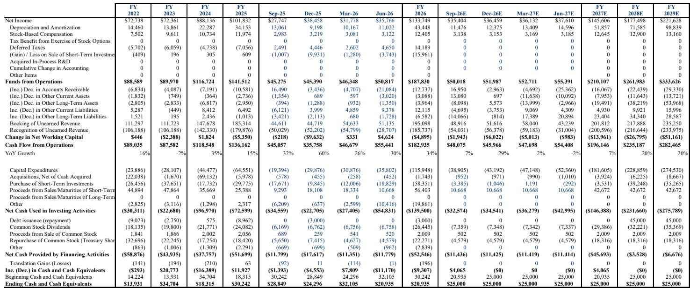
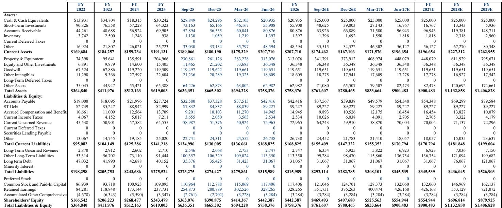
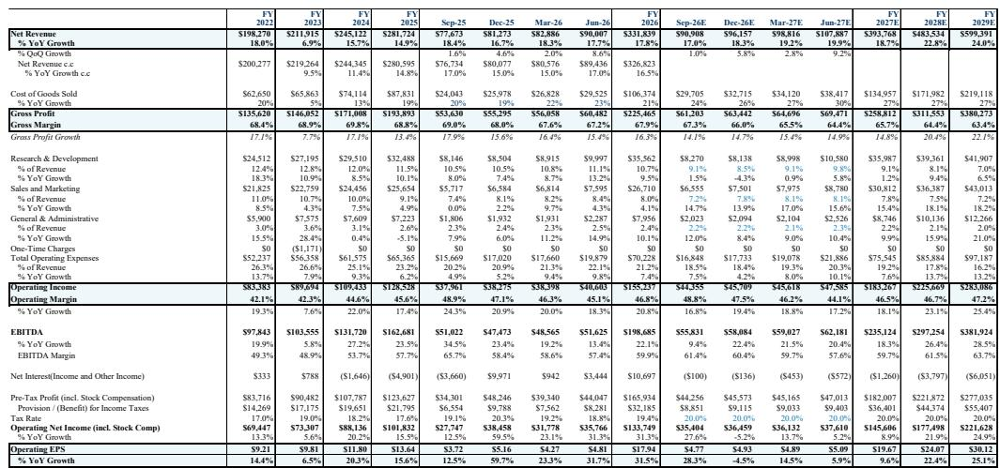

# MS：微软北美业务与季度数据观察

微软F4Q26财报提供了三个关键验证点：Azure增速连续加速、M365 Copilot付费席位突破3000万、运营利润率在AI投入期仍同比扩张。这份财报的意义不在于单季超预期幅度，而在于将市场对微软AI变现的讨论从“能否发生”推进到“能持续多久”。

Azure在F4Q26实现43%的固定汇率增长，较上季加速4个百分点，超出管理层39-40%的指引区间上限3个百分点。更重要的是，管理层将F1Q27 Azure增速指引设定在约45%，并重申F1H27增速将高于F2H26。这意味着Azure当前的增长瓶颈主要在供给端而非需求端——新增容量和效率提升几乎立即被市场消化。

> **KC评论：** 报告特别指出Azure超预期并非单纯依赖新建产能，CPU和GPU集群效率提升、基础设施上线周期缩短同样贡献了增量。对于跟踪云厂商的读者，区分“供给驱动”和“效率驱动”的增长质量，是判断持续性差异的关键。

M365 Copilot付费席位从F3Q26的2000万净增至3000万以上，单季净增约1000万，远超市场约600万的预期。报告提到几个容易被忽略的采用质量指标：客户满意度在过去三个季度弹性较高、延迟降低25%、每位用户对话次数同比接近弹性较高、部署达到高使用率所需时间从数月缩短至数天。超过5万席位的客户数量同比增长7倍以上，将Copilot部署给多数信息工作者的企业客户环比增长近75%。

## 1. 变现模式从单一座位许可向三引擎ARPU框架迁移

报告将微软的ARPU增长拆解为三个层次：直接M365 Copilot席位采纳、向更高价值E7订阅迁移、以及基于使用量的消费型变现。E7上线仅两个月已有数百家企业客户采购数百万席位；GitHub Copilot在切换至使用量计费模式后收入环比加速超过60%；Dynamics客服信用消耗环比增长4倍。

管理层预期M365商业云收入增速将在整个FY27期间持续加速，这一表述比单季指引更重要。它意味着高级SKU、Copilot、商业定价和使用量变现的合力，足以抵消增量一线员工和SMB客户带来的较低ARPU稀释。

## 2. 运营利润率在AI投入期保持扩张，资本支出未超预期

总毛利率67.2%超出市场预期约50个基点，运营利润率45.1%超出约70个基点。尽管Azure、Azure AI和计算密集型Copilot使用量占比提升，微软仍实现了同比利润率改善。经Frontier Lab研究调整后的总员工数同比下降2%。

FY27指引要求双位数收入与运营利润增长、中高个位数运营费用增长、运营利润率下降不超过1个百分点。报告认为实际结果有上行空间——随着Azure利用率、模型效率、使用量定价和费用纪律在年内复合作用，利润率甚至可能扩张。

资本支出方面，F4Q26的410亿美元基本符合预期。管理层维持CY26约1900亿美元的资本支出计划，但因数据中心使用寿命延长导致的租赁分类调整，使报告口径降至约1750亿美元。报告强调这一变化反映会计分类而非宏观环境研究减少。

## 3. 需要持续关注的几个结构性因素

MPC部门F1Q27指引中值约122-127亿美元，低于市场预期超过5%，主要反映Windows OEM和设备收入在F1Q27预计下降20%以上、FY27下降高双位数，受PC需求走弱、组件成本上升、渠道库存偏高以及Windows 10停止支持带来的高基数影响。

F4Q26运营费用约198.8亿美元，超出市场预期约5亿美元。虽然运营利润率仍超预期，但费用超指引对微软而言属于异常情况，值得后续季度观察。

Azure和AI收入占比提升、折旧增加、基础设施规模扩张以及Copilot使用量增长，仍对毛利率构成不确定性。报告认为这些不确定性可被利用率提升、定价优化和软件效率改善部分对冲。

商业RPO达到6780亿美元，同比增长84%，环比增长约8%。其中约30%预计在未来12个月内确认收入，该部分同比增长37%。但报告提醒，去年大额合同的周年效应将在未来几个季度造成预订和RPO增长的波动。

非GAAP每股收益超预期部分包含约0.27美元的一次性项目收益，不应将全部0.48美元的超预期视为运营性改善。

对于关注云基础设施回报表现的读者，这份财报提供了一个可复用的观察框架：区分供给约束解除带来的收入加速、效率提升带来的利润率保护、以及变现模式从许可向使用量迁移带来的ARPU结构变化。三者同时发生且相互强化，是判断AI研究周期是否进入正向循环的核心信号。

For informational purposes only. Portions may be generated,translated,summarized,or edited with AI assistance based on source materials and may contain omissions or errors. Please verify independently. This is not investment,legal,tax,accounting,or other professional advice.

For informational purposes only. Portions may be generated,translated,summarized,or edited with AI assistance based on source materials and may contain omissions or errors. Please verify independently. This is not investment,legal,tax,accounting,or other professional advice.

