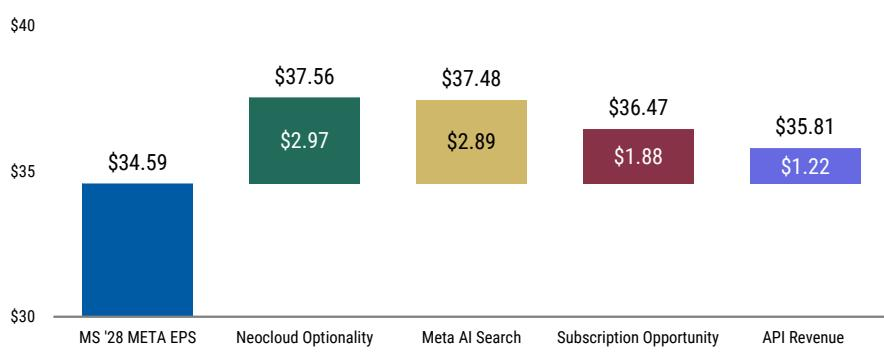
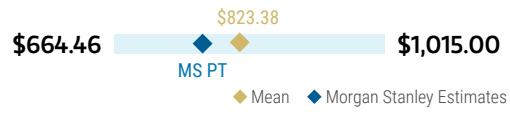
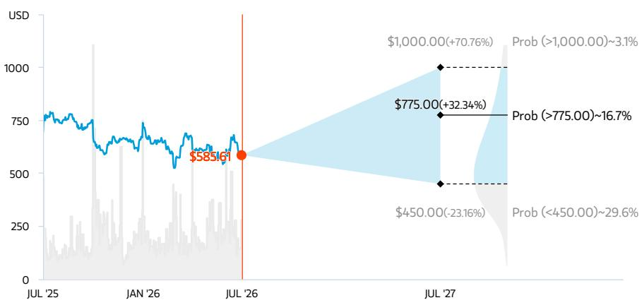
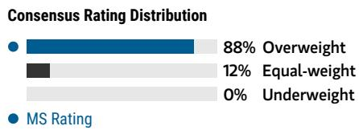

July 30, 2026 04:42 AM GMT

Meta Platforms Inc | North America

# 核心业务稳健；更多产品进展“即将到来”

META的核心覆盖与互动持续扩大……这构成了其护城河以及更多产品推出的基础。META还详细介绍了新产品，我们预计这些产品将为'28年的每股收益增加9美元以上。随着预期小幅上调，META仍是首选；关注下半年产品的进一步规模化。

META的核心社交市场表现稳健，并在持续改善，长期前景向好。META的核心领先社交平台正变得更强，其应用家族日活跃用户达36亿，Instagram日活跃用户达20亿。互动趋势以及META提供更相关自然与付费内容的能力正在提升。第三季度收入指引上限640亿美元，按固定汇率计算同比增长26%，在两年累计基础上呈现加速（第三季度51%对比第二季度48%）……这好于我们的预期。随着META以更多分析方法（现包括大语言模型）分析其数据，这种覆盖、互动与变现的护城河也在加深。这是META的多代际护城河，我们认为它将驱动现金流用于投入，同时使其能够随时间推移规模化新产品。

……新产品与“即将到来”的进展：META的第二季度业绩与管理层评论强化了其核心业务（更好的互动与变现）以及我们在《Meta Platforms Inc：让Meta重回“AI赢家”的4款产品》（2026年6月2日）中梳理的面向消费者、企业、中小商家和开发者的新产品的广泛潜力。如下所示，总体而言，我们估计这些潜力可能为我们的新基准每股收益35美元增加多达9美元（约25%）。虽然我们未获得这些产品何时能显著规模化或展示的具体时间表：1）管理层在电话会议中12次提到“即将”作为产品更新/改进和学习的预期时间；2）Meta Connect开发者大会定于9月23/24日举行。“即将”可能就在未来56天内……我们认为部分产品（如WhatsApp/Instagram上的订阅和消息产品）应在2026年下半年继续规模化。

<table><tr><td colspan="2">MS & CO. LLC</td></tr><tr><td colspan="2">Brian Nowak, CFA</td></tr><tr><td colspan="2">股票研究分析师</td></tr><tr><td>Brian.Nowak@morganstanley.com</td><td>+1 212 761-3365</td></tr><tr><td colspan="2">Gregory Gao</td></tr><tr><td colspan="2">研究助理</td></tr><tr><td>Greg.Gao@morganstanley.com</td><td>+1 212 296-3125</td></tr><tr><td colspan="2">Nikhil Javeri</td></tr><tr><td colspan="2">研究助理</td></tr><tr><td>Nikhil.Javeri1@morganstanley.com</td><td>+1 212 761-3742</td></tr><tr><td colspan="2">Matthew Cost</td></tr><tr><td colspan="2">股票研究分析师</td></tr><tr><td>Matthew.Cost@morganstanley.com</td><td>+1 212 761-7252</td></tr><tr><td colspan="2">Julian Herrera</td></tr><tr><td colspan="2">研究助理</td></tr><tr><td>Julian.Herrera@morganstanley.com</td><td>+1 212 761-1784</td></tr><tr><td colspan="2">Kavya A Narayanan</td></tr><tr><td colspan="2">研究助理</td></tr><tr><td>Kavya.Narayanan@morganstanley.com</td><td>+1 212 761-4183</td></tr></table>

## Meta Platforms Inc (META.O, META US) 首选

<table><tr><td>公司评级</td><td>增持</td></tr><tr><td>行业观点</td><td>有吸引力</td></tr><tr><td>目标价</td><td>$775.00</td></tr><tr><td>收盘价 (2026年7月29日)</td><td>$585.61</td></tr><tr><td>当前市值 (百万)</td><td>$1,831,140</td></tr><tr><td>52周范围</td><td>$796.25-520.26</td></tr></table>

图表1：我们看到4个可能的增长节点，可为'28年META每股收益约35美元增加多达约9美元（约25%），包括新云服务、API收入和订阅机会  
  
来源：公司数据，MS估计

维持增持，META可能以'28年每股收益的14倍交易：我们维持增持，META作为首选，目前以'28年每股收益的16倍交易。我们的775美元目标价意味着以'28年每股收益的23倍支付，而META的长期平均倍数为20倍预期市盈率。如果META能实现上述潜力的一半（约每股收益5美元），该名称目前交易在'28年每股收益的约14倍。实际上，META似乎已将所有支出/资本支出/运营支出计入价格，而未计入任何未来产品的潜力……我们希望这些潜力能很快展现。此外，在一个修正和愿景重要的世界里，我们的预期正在上调，随着我们考虑更强劲的核心业务，'27/'28年每股收益分别上升2%/4%。我们期待进一步的修正和产品发布（实现的愿景）能推动更优表现。我们维持增持，META作为首选，目前以'28年每股收益的16倍交易。我们的775美元目标价意味着以'28年每股收益的23倍支付，而META的长期平均倍数为20倍预期市盈率。

图表2：我们的775美元目标价意味着以我们平均'27/'28年每股收益34美元/35美元的23倍支付，代表40%的潜在空间

<table><tr><td colspan="4">META估值</td></tr><tr><td></td><td>保守情景</td><td>基准情景</td><td>乐观情景</td></tr><tr><td>'27/'28年平均每股收益</td><td>$30.88</td><td>$34.17</td><td>$35.58</td></tr><tr><td>(X) 市盈率</td><td>15X</td><td>23X</td><td>28X</td></tr><tr><td>(=) 每股价格</td><td>$450</td><td>$775</td><td>$1,000</td></tr><tr><td>% 潜在空间/(下行空间)</td><td>(17%)</td><td>43%</td><td>84%</td></tr><tr><td>'26年每股收益隐含市盈率</td><td>14X</td><td>24X</td><td>31X</td></tr><tr><td>'27年每股收益隐含市盈率</td><td>13X</td><td>23X</td><td>30X</td></tr></table>

来源：公司数据，MS估计

## 图表

图表3：META先前与当前对比

<table><tr><td></td><td>2026 先前</td><td>2027 先前</td><td>2028 先前</td></tr><tr><td>总收入</td><td>254,652.9</td><td>309,659.1</td><td>371,363.2</td></tr><tr><td>广告收入</td><td>248,206.2</td><td>301,357.7</td><td>361,031.8</td></tr><tr><td>支付/其他收入</td><td>6,446.7</td><td>8,301.4</td><td>10,331.4</td></tr><tr><td>移动端占广告总收入百分比</td><td>98.3%</td><td>98.5%</td><td>98.6%</td></tr><tr><td>移动端广告收入</td><td>243,913.4</td><td>296,749.5</td><td>355,962.4</td></tr><tr><td>同比变化百分比</td><td></td><td></td><td></td></tr><tr><td>收入成本 (不含SBC)</td><td>66,212.4</td><td>94,088.4</td><td>124,720.6</td></tr><tr><td>毛利润</td><td>188,440.4</td><td>215,570.6</td><td>246,642.7</td></tr><tr><td>毛利率</td><td>74.0%</td><td>69.6%</td><td>66.4%</td></tr><tr><td>总运营费用 (GAAP)</td><td>96,224.7</td><td>113,822.4</td><td>141,802.1</td></tr><tr><td>销售与市场 (不含SBC)</td><td>10,218.5</td><td>10,524.2</td><td>12,621.3</td></tr><tr><td>研发 (不含SBC)</td><td>52,211.5</td><td>66,680.5</td><td>87,394.8</td></tr><tr><td>一般与行政 (不含SBC)</td><td>10,058.6</td><td>11,264.7</td><td>13,509.3</td></tr><tr><td>股权激励</td><td>23,736.1</td><td>25,353.1</td><td>28,276.7</td></tr><tr><td>非经常性项目</td><td>0.0</td><td>0.0</td><td>0.0</td></tr><tr><td>折旧与摊销 (包含在费用项目中)</td><td>32,082.3</td><td>60,689.6</td><td>103,819.2</td></tr><tr><td>总运营费用占收入百分比</td><td></td><td></td><td></td></tr><tr><td>销售与市场 (不含SBC)</td><td>4.0%</td><td>3.4%</td><td>3.4%</td></tr><tr><td>研发 (不含SBC)</td><td>20.5%</td><td>21.5%</td><td>23.5%</td></tr><tr><td>一般与行政 (不含SBC)</td><td>3.9%</td><td>3.6%</td><td>3.6%</td></tr><tr><td>股权激励</td><td>9.3%</td><td>8.2%</td><td>7.6%</td></tr><tr><td>非经常性项目</td><td>0.0%</td><td>0.0%</td><td>0.0%</td></tr><tr><td>折旧与摊销 (包含在费用项目中)</td><td>12.6%</td><td>19.6%</td><td>28.0%</td></tr><tr><td>总成本与运营费用 (GAAP) 同比变化百分比</td><td>38.0%</td><td>28.0%</td><td>28.2%</td></tr><tr><td>总成本与运营费用 (非GAAP)</td><td>42.6%</td><td>31.7%</td><td>30.5%</td></tr><tr><td>GAAP运营利润</td><td>92,215.7</td><td>101,748.3</td><td>104,840.6</td></tr><tr><td>利润率</td><td>36%</td><td>33%</td><td>28%</td></tr><tr><td>EBITDA (调整后)</td><td>148,034.1</td><td>187,790.9</td><td>236,936.5</td></tr><tr><td>EBITDA利润率 (调整后)</td><td>58.1%</td><td>60.6%</td><td>63.8%</td></tr><tr><td>增量EBITDA利润率</td><td>47.9%</td><td>72.3%</td><td>79.6%</td></tr><tr><td>每股收益 (GAAP)</td><td>$32.49</td><td>$32.99</td><td>$33.41</td></tr><tr><td>平均基本股数</td><td>2,574.0</td><td>2,610.4</td><td>2,637.6</td></tr><tr><td>平均稀释股数</td><td>2,604.4</td><td>2,641.3</td><td>2,668.9</td></tr><tr><td>资本支出</td><td>144,988.0</td><td>225,488.0</td><td>250,488.0</td></tr><tr><td>自由现金流</td><td>11,922.4</td><td>(29,762.2)</td><td>(2,686.0)</td></tr><tr><td>每股自由现金流</td><td>$4.58</td><td>-$11.27</td><td>-$1.01</td></tr></table>

来源：公司数据，MS估计

<table><tr><td>2026当前</td><td>2027当前</td><td>2028当前</td></tr><tr><td>255,888.3</td><td>312,245.8</td><td>375,533.7</td></tr><tr><td>249,308.7</td><td>303,168.3</td><td>363,528.7</td></tr><tr><td>6,579.7</td><td>9,077.5</td><td>12,005.0</td></tr><tr><td>98.3%</td><td>98.5%</td><td>98.6%</td></tr><tr><td>244,997.1</td><td>298,531.8</td><td>358,423.5</td></tr><tr><td>49,372.3</td><td>74,846.5</td><td>99,516.4</td></tr><tr><td>206,516.1</td><td>237,399.4</td><td>276,017.3</td></tr><tr><td>80.7%</td><td>76.0%</td><td>73.5%</td></tr><tr><td>117,383.3</td><td>133,975.6</td><td>164,807.6</td></tr><tr><td>10,659.5</td><td>10,612.1</td><td>12,763.1</td></tr><tr><td>68,375.0</td><td>85,997.1</td><td>109,843.6</td></tr><tr><td>12,618.5</td><td>11,358.2</td><td>13,660.3</td></tr><tr><td>25,730.2</td><td>26,008.2</td><td>28,540.6</td></tr><tr><td>0.0</td><td>0.0</td><td>0.0</td></tr><tr><td>31,490.7</td><td>58,977.1</td><td>98,679.4</td></tr><tr><td>4.2%</td><td>3.4%</td><td>3.4%</td></tr><tr><td>26.7%</td><td>27.5%</td><td>29.3%</td></tr><tr><td>4.9%</td><td>3.6%</td><td>3.6%</td></tr><tr><td>10.1%</td><td>8.3%</td><td>7.6%</td></tr><tr><td>0.0%</td><td>0.0%</td><td>0.0%</td></tr><tr><td>12.3%</td><td>18.9%</td><td>26.3%</td></tr><tr><td>41.7%</td><td>25.2%</td><td>26.6%</td></tr><tr><td>44.2%</td><td>30.4%</td><td>29.0%</td></tr><tr><td>89,132.8</td><td>103,423.7</td><td>111,209.7</td></tr><tr><td>35%</td><td>33%</td><td>30%</td></tr><tr><td>146,353.8</td><td>188,409.1</td><td>238,429.7</td></tr><tr><td>57.2%</td><td>60.3%</td><td>63.5%</td></tr><tr><td>43.8%</td><td>74.6%</td><td>79.0%</td></tr><tr><td>$31.80</td><td>$33.74</td><td>$34.59</td></tr><tr><td>2,565.0</td><td>2,611.6</td><td>2,639.0</td></tr><tr><td>2,589.9</td><td>2,635.2</td><td>2,662.8</td></tr><tr><td>144,654.0</td><td>225,154.0</td><td>250,154.0</td></tr><tr><td>2,930.1</td><td>(26,206.2)</td><td>(5,846.8)</td></tr><tr><td>$1.13</td><td>-$9.94</td><td>-$2.20</td></tr></table>

<table><tr><td>2026修正</td><td>2027修正</td><td>2028修正</td></tr><tr><td>0.5%</td><td>0.8%</td><td>1.1%</td></tr><tr><td>0.4%</td><td>0.6%</td><td>0.7%</td></tr><tr><td>2.1%</td><td>9.3%</td><td>16.2%</td></tr><tr><td>0 bp</td><td>(0) bp</td><td>(0) bp</td></tr><tr><td>0.4%</td><td>0.6%</td><td>0.7%</td></tr><tr><td>--</td><td>--</td><td>--</td></tr><tr><td>-25.4%</td><td>-20.5%</td><td>-20.2%</td></tr><tr><td>9.6%</td><td>10.1%</td><td>11.9%</td></tr><tr><td>671 bp</td><td>641 bp</td><td>708 bp</td></tr><tr><td>22%</td><td>18%</td><td>16%</td></tr><tr><td>4%</td><td>1%</td><td>1%</td></tr><tr><td>31%</td><td>29%</td><td>26%</td></tr><tr><td>25%</td><td>1%</td><td>1%</td></tr><tr><td>8%</td><td>3%</td><td>1%</td></tr><tr><td>NA</td><td>NA</td><td>NA</td></tr><tr><td>-2%</td><td>-3%</td><td>-5%</td></tr><tr><td>15bp</td><td>0bp</td><td>0bp</td></tr><tr><td>622bp</td><td>601bp</td><td>572bp</td></tr><tr><td>98bp</td><td>0bp</td><td>0bp</td></tr><tr><td>73bp</td><td>14bp</td><td>-1bp</td></tr><tr><td>0bp</td><td>0bp</td><td>0bp</td></tr><tr><td>-29bp</td><td>-71bp</td><td>-168bp</td></tr><tr><td>367 bp</td><td>(277) bp</td><td>(161) bp</td></tr><tr><td>153 bp</td><td>(132) bp</td><td>(153) bp</td></tr><tr><td>-3.3%</td><td>1.6%</td><td>6.1%</td></tr><tr><td>-1.1%</td><td>0.3%</td><td>0.6%</td></tr><tr><td>(94) bp</td><td>(30) bp</td><td>(31) bp</td></tr><tr><td>(414) bp</td><td>235 bp</td><td>(61) bp</td></tr><tr><td>-2.1%</td><td>2.3%</td><td>3.5%</td></tr><tr><td>0%</td><td>0%</td><td>0%</td></tr><tr><td>-1%</td><td>0%</td><td>0%</td></tr><tr><td>0%</td><td>0%</td><td>0%</td></tr><tr><td>-75%</td><td>-12%</td><td>118%</td></tr><tr><td>-75%</td><td>-12%</td><td>118%</td></tr></table>

图表4：META实际值与估计值对比

<table><tr><td rowspan="2"></td><td colspan="2">2026年第二季度</td><td colspan="2">差异</td></tr><tr><td>实际值</td><td>估计值</td><td>相对值</td><td>%/bp</td></tr><tr><td>总收入</td><td>60,801.0</td><td>60,419.9</td><td>381.1</td><td>0.6%</td></tr><tr><td>广告收入</td><td>59,363.0</td><td>59,098.9</td><td>264.1</td><td>0.4%</td></tr><tr><td>北美广告收入</td><td>26,337.0</td><td>24,576.8</td><td>1,760.2</td><td>7.2%</td></tr><tr><td>欧洲广告收入</td><td>14,085.0</td><td>14,204.2</td><td>(119.2)</td><td>-0.8%</td></tr><tr><td>亚洲广告收入</td><td>10,847.0</td><td>11,774.6</td><td>(927.6)</td><td>-7.9%</td></tr><tr><td>世界其他地区广告收入</td><td>8,094.0</td><td>8,543.2</td><td>(449.2)</td><td>-5.3%</td></tr><tr><td>支付/其他收入</td><td>1,438.0</td><td>1,321.0</td><td>117.0</td><td>8.9%</td></tr><tr><td>收入成本 (不含SBC)</td><td>10,966.0</td><td>16,313.4</td><td>(5,347.4)</td><td>-32.8%</td></tr><tr><td>毛利润</td><td>49,835.0</td><td>44,106.5</td><td>5,728.5</td><td>13.0%</td></tr><tr><td>毛利率</td><td>82.0%</td><td>73.0%</td><td>896.4</td><td>—</td></tr><tr><td>总运营费用 (GAAP)</td><td>31,060.0</td><td>23,668.9</td><td>7,391.1</td><td>31.2%</td></tr><tr><td>销售与市场 (不含SBC)</td><td>2,885.9</td><td>2,577.2</td><td>308.7</td><td>12.0%</td></tr><tr><td>研发 (不含SBC)</td><td>15,422.1</td><td>12,684.0</td><td>2,738.1</td><td>21.6%</td></tr><tr><td>一般与行政 (不含SBC)</td><td>5,094.1</td><td>2,667.8</td><td>2,426.2</td><td>90.9%</td></tr><tr><td>股权激励</td><td>7,658.0</td><td>5,739.9</td><td>1,918.1</td><td>33.4%</td></tr><tr><td>非经常性项目</td><td>0.0</td><td>0.0</td><td>0.0</td><td>NA</td></tr><tr><td>折旧与摊销 (包含在费用项目中)</td><td>6,356.0</td><td>7,201.4</td><td>(845.4)</td><td>-11.7%</td></tr><tr><td>EBITDA (调整后)</td><td>32,789.0</td><td>33,378.9</td><td>(589.9)</td><td>-1.8%</td></tr><tr><td>EBITDA利润率 (调整后)</td><td>53.9%</td><td>55.2%</td><td>(131.6)</td><td>—</td></tr><tr><td>增量EBITDA利润率</td><td>23.9%</td><td>29.2%</td><td>(527.7)</td><td>—</td></tr><tr><td>EBITDA</td><td>25,131.0</td><td>27,639.0</td><td>(2,508.0)</td><td>-9.1%</td></tr><tr><td>EBITDA利润率</td><td>41.3%</td><td>45.7%</td><td>(441) bp</td><td>—</td></tr><tr><td>增量EBITDA利润率</td><td>2.6%</td><td>22.1%</td><td>(1951) bp</td><td>—</td></tr><tr><td>总运营利润 (GAAP)</td><td>18,775.0</td><td>20,437.6</td><td>(1,662.6)</td><td>-8.1%</td></tr><tr><td>运营利润率 (GAAP)</td><td>30.9%</td><td>33.8%</td><td>(295) bp</td><td>—</td></tr><tr><td>其他收入/(费用), 净额 (调整后)</td><td>(19.0)</td><td>(1,030.4)</td><td>1,011.4</td><td>NA</td></tr><tr><td>税前利润 (GAAP)</td><td>18,756.0</td><td>19,407.2</td><td>(651.2)</td><td>-3.4%</td></tr><tr><td>税率 (GAAP)</td><td>15.5%</td><td>13.0%</td><td>250 bp</td><td>—</td></tr><tr><td>税率 (调整后)</td><td>16.0%</td><td>16.0%</td><td>0.0</td><td>—</td></tr><tr><td>净利润 (GAAP)</td><td>15,848.0</td><td>16,884.3</td><td>(1,036.3)</td><td>-6.1%</td></tr><tr><td>每股收益 (调整后)</td><td>$8.65</td><td>$8.10</td><td>0.6</td><td>6.8%</td></tr><tr><td>每股收益 (GAAP)</td><td>$6.18</td><td>$6.47</td><td>-$0.29</td><td>-4.5%</td></tr><tr><td>平均基本股数</td><td>2,543.0</td><td>2,579.2</td><td>(36.2)</td><td>-1.4%</td></tr><tr><td>平均稀释股数</td><td>2,566.0</td><td>2,609.7</td><td>(43.7)</td><td>-1.7%</td></tr></table>

来源：公司数据，MS估计

## 风险回报 – Meta Platforms Inc (META.O) 首选

效率时代

## 目标价 $775.00

我们的775美元目标价基于将约23倍市盈率应用于我们'27/'28年平均每股收益34美元/35美元。

共识目标价分布

来源：Refinitiv，MS

## 风险回报图与期权隐含概率 (12个月)

  
关键：— 历史表现 ● 当前价格 ◆ 目标价

来源：Refinitiv，MS，MS机构股权部门。我们乐观、基准和保守情景的概率是根据截至2026年7月29日期权市场的隐含波动率数据估算的。所有数字均为股票在三个月或一年时间内达到情景价格以上的近似风险中性概率。在此查看期权概率方法说明

## 增持论点

■ 结构性转向聚焦多年效率、生产力和更精益运营……我们认为META的“效率之年”不仅仅是365天的变化……而是运营更精益、更关注读者回报的结构性和文化性转变……即使在投入期间也是如此。

■ 重要的是，META平台上的收入和互动趋势也在改善……我们的行业和公司交流显示，在推动Reels增量互动和变现方面取得进展……以及在后IDFA世界中广告衡量/归因方面的改善。

■ 3个被低估的“潜在增长点”，包括1) 进一步的AI驱动增长，2) 订阅采用，以及3) 点击发送消息。

  
来源：Refinitiv，MS

## 风险回报主题

<table><tr><td>新数据时代：</td><td>正面</td></tr><tr><td>自我改善：</td><td>正面</td></tr><tr><td>技术扩散：</td><td>正面</td></tr></table>

在此查看风险回报主题说明

## 乐观情景

## $1,000.00

## 隐含约28倍混合'27/'28市盈率

AI投入推动互动增加并带来新产品/服务，支持超预期的广告变现和收入增长。新产品的执行（如点击发送消息、订阅和Meta Business AI）也可能贡献高于预期的增长。META还可能进一步实现效率提升，并在缩小Reels变现差距方面更加成功。

## 基准情景

## $775.00

## 隐含约23倍基准混合'27/'28市盈率

广告收入在'26年增长约27%，因META的AI投入推动Reels增量互动/变现，并支持应用家族中广告表现和衡量/归因的改善。我们还看到META继续专注于效率，并探索利用其广泛数据中心容量的新方式。

## 保守情景

$450.00

## 隐含约15倍混合'27/'28市盈率

互动下降和/或Reels变现速度慢于预期的迹象可能导致增长放缓和更大不确定性。我们还关注任何宏观不确定性、限制META广告定向能力的监管、数据中心建设执行失误导致资本密集度提高且投资回报率极低。任何额外的运营支出和资本支出都可能影响运营利润增长和自由现金流。

## 风险回报 – Meta Platforms Inc (META.O)

## 关键盈利输入

<table><tr><td>驱动因素</td><td>2025年12月</td><td>2026年12月e</td><td>2027年12月e</td><td>2028年12月e</td></tr><tr><td>固定汇率增长率 (%)</td><td>22.5</td><td>26.6</td><td>22.2</td><td>19.9</td></tr><tr><td>运营利润 (GAAP) ($, 百万)</td><td>83,276</td><td>89,133</td><td>103,424</td><td>111,210</td></tr><tr><td>合并总日活跃用户 (百万)</td><td>2,239.9</td><td>2,294.5</td><td>2,344.5</td><td>2,389.2</td></tr></table>

## 投资驱动因素

\- 我们对META结构性转向效率以及收入、互动和Reels的改善持积极看法。我们持续关注META在潜在增长点（AI、订阅、点击发送消息）以及AI/数据中心进一步投入方面的进展。

全球收入分布

<table><tr><td></td><td>0-10%</td><td>0-10%</td><td>0-10%</td><td>日本</td><td>0-10%</td><td>拉丁美洲</td><td>0-10%</td><td>英国</td><td>20-30%</td><td>欧洲除英国</td><td>40-50%</td><td>北美</td></tr></table>

来源：MS估计 在此查看区域层级说明

## MS ALPHA模型

<table><tr><td>3
